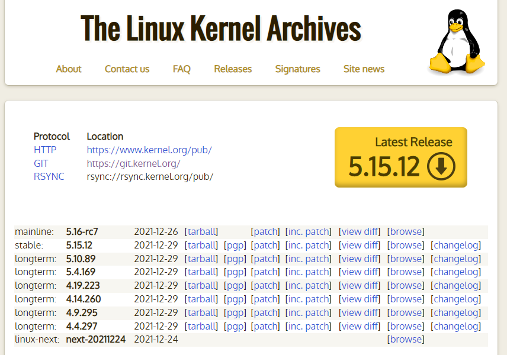
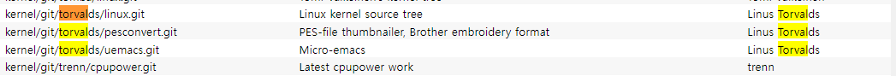

# Linux Kernel

## Kernel 

#### 커널은 어디에 ?

* 현재 커널

```
$ uname -r
5.11.0-43-generic
```

* ##### /boot 디렉토리에... vmlinuz

```
jhyunlee@ubuntu20:/boot$ ls -l
합계 157300
lrwxrwxrwx 1 root root       25 12월 17 09:50 vmlinuz -> vmlinuz-5.11.0-43-generic
-rw------- 1 root root 11744992 11월 10 18:58 vmlinuz-5.11.0-41-generic
-rw------- 1 root root 11744992 12월 13 19:49 vmlinuz-5.11.0-43-generic
lrwxrwxrwx 1 root root       28 12월 17 09:50 initrd.img -> initrd.img-5.11.0-43-generic
-rw-r--r-- 1 root root 62376714 12월 18 23:38 initrd.img-5.11.0-41-generic
-rw-r--r-- 1 root root 62376486 12월 18 23:39 initrd.img-5.11.0-43-generic
-rw------- 1 root root  5864035 11월 10 18:56 System.map-5.11.0-41-generic
-rw------- 1 root root  5864035 12월 13 19:45 System.map-5.11.0-43-generic
-rw-r--r-- 1 root root   254083 11월 10 18:56 config-5.11.0-41-generic
-rw-r--r-- 1 root root   254083 12월 13 19:45 config-5.11.0-43-generic
```

`$ cat /etc/default/grub`

##### /lib/modules

```
$ ls -l /lib/modules
합계 16
drwxr-xr-x 3 root root 4096 12월 18 08:32 5.11.0-27-generic
drwxr-xr-x 6 root root 4096 12월 16 23:20 5.11.0-41-generic
drwxr-xr-x 6 root root 4096 12월 17 20:35 5.11.0-43-generic
drwxr-xr-x 3 root root 4096 12월 23 23:00 5.4.0
```

##### lsmod

```
$ lsmod 
Module                  Size  Used by
btrfs                1327104  0
blake2b_generic        20480  0
xor                    24576  1 btrfs
raid6_pq              114688  1 btrfs
ufs                    81920  0
qnx4                   16384  0
hfsplus               110592  0
hfs                    61440  0
...
```


### Kernel 소스는 어디에?

#### Linux Kernel Archives




##### git  https://git.kernel.org



##### git  clone 

```
Clone
git://git.kernel.org/pub/scm/linux/kernel/git/torvalds/linux.git
https://git.kernel.org/pub/scm/linux/kernel/git/torvalds/linux.git
https://kernel.googlesource.com/pub/scm/linux/kernel/git/torvalds/linux.git
```

##### git checkout 

```
$ git clone https://git.kernel.org/pub/scm/linux/kernel/git/torvalds/linux.git
'linux'에 복제합니다...
remote: Enumerating objects: 58, done.
remote: Counting objects: 100% (58/58), done.
remote: Compressing objects: 100% (8/8), done.
^C브젝트를 받는 중:   0% (18253/8481076), 9.79 MiB | 508.00 KiB/s

$ git tag
$ git checkout tags/v5.5
파일을 갱신합니다: 100% (11780/11780), 완료.
이전 HEAD 위치는 219d54332a09 Linux 5.4
HEAD의 현재 위치는 d5226fa6dbae Linux 5.5
```


## kernel Compile

1. Grab the latest kernel from kernel.org
2. Verify kernel
3. Untar the kernel tarball
4. Copy existing Linux kernel config file
5. Compile and build Linux kernel 5.6.9
6. Install Linux kernel and modules (drivers)
7. Update Grub configuration
8. Reboot the system


### How to compile and install Linux kernel

#### 1. Get  Linux kernel code

https://www.kernel.org/

```
$ git clone  
jhyunlee@ubuntu20:~/code/linux$ git remote -v
origin	https://kernel.googlesource.com/pub/scm/linux/kernel/git/torvalds/linux.git (fetch)
origin	https://kernel.googlesource.com/pub/scm/linux/kernel/git/torvalds/linux.git (push)
```

#### 2. configure

```
$ cd linux
$ cp -v /boot/config-$(uname -r) .config
```


#### 3.  compilers,  tools

```
# sudo apt-get install build-essential libncurses-dev bison flex libssl-dev libelf-dev
```

#### 4. compile

```
$ make menuconfig
$ cat .config
$ make -j 4
## get thread or cpu core count using nproc command ##
$ make -j $(nproc)
```

```
$ sudo make modules_install
```

```
$ sudo make install
```

/boot 디렉토리에 다음 파일 복사

1. initramfs-5.6.9.img
2. System.map-5.6.9
3. vmlinuz-5.6.9

```
make[1]: *** 'certs/x509_certificate_list'에서 필요한 'debian/canonical-certs.pem' 타겟을 만들 규칙이 없습니다. 
```

* 해결 방법

```
CONFIG_SYSTEM_TRUSTED_KEYS="debian/canonical-certs.pem"
Change it to this:
CONFIG_SYSTEM_TRUSTED_KEYS=""
Depending on your source structure you might be able to do it via command line. Examples:

scripts/config --disable SYSTEM_TRUSTED_KEYS
or
scripts/config --set-str SYSTEM_TRUSTED_KEYS ""
```


```
BTF: .tmp_vmlinux.btf: pahole (pahole) is not available
Failed to generate BTF for vmlinux
Try to disable CONFIG_DEBUG_INFO_BTF
make: *** [Makefile:1106: vmlinux] Error 1
```

* 해결방법

```
$ sudo apt install dwarves
```


#### 5. update grub config

```
$ sudo update-initramfs -c -k 5.6.9
$ sudo update-grub
```

```
# reboot -h now
```

```
GRUB Configuration 만약 재부팅후 커널 버전이 바뀌지 않거나, 버전을 선택하는 GRUB이 나타나지 않는다면

$ vi /etc/default/grub   를 사용해 GRUB config를 수정한다.
GRUB_TIMEOUT_STYLE=hidden
GRUB_TIMEOUOT=0
위와 같은부분을 앞에 #을 추가하여 무시하도록 설정한다.
모두 수정한 후 GRUB update를 한다.

$ update-grub
```


```
error: /boot/vmlinuz- has invalid signature.
error: you need to load the kernel first.
```

* disable secure boot

https://www.itadminguide.com/disable-secure-boot-in-ubuntu/

```
$ sudo mokutil --sb-state
$ sudo apt install mokutil
$ sudo mokutil --disable-validation
12345678
12345678
$ sudo reboot -r
```

