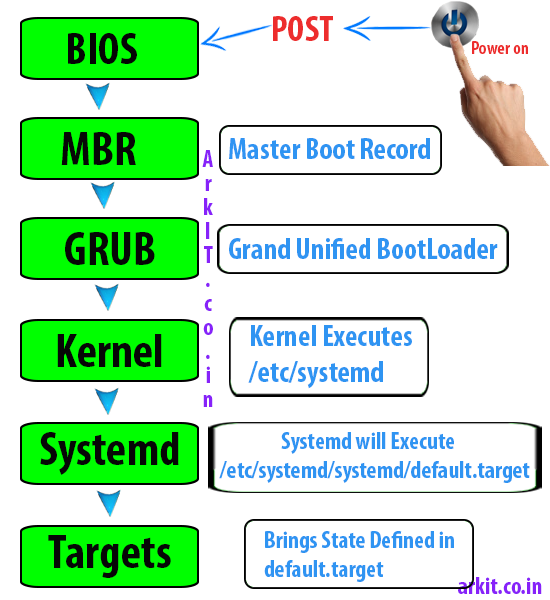
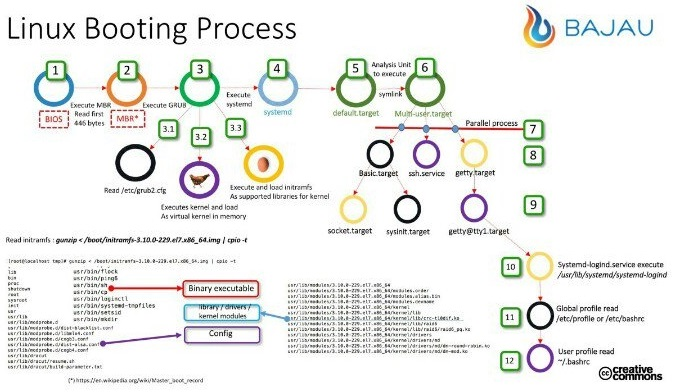
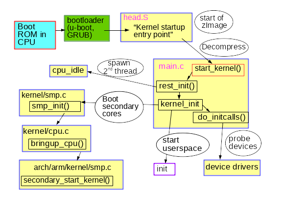
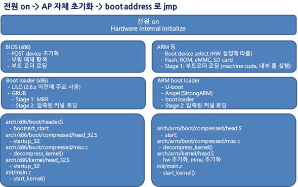

# Linux Kernel

## Kernel 

#### 커널은 어디에 ?

* 현재 커널

```
$ uname -r
5.11.0-43-generic
```

* ##### /boot 디렉토리에... vmlinuz

```
jhyunlee@ubuntu20:/boot$ ls -l
합계 157300
lrwxrwxrwx 1 root root       25 12월 17 09:50 vmlinuz -> vmlinuz-5.11.0-43-generic
-rw------- 1 root root 11744992 11월 10 18:58 vmlinuz-5.11.0-41-generic
-rw------- 1 root root 11744992 12월 13 19:49 vmlinuz-5.11.0-43-generic
lrwxrwxrwx 1 root root       28 12월 17 09:50 initrd.img -> initrd.img-5.11.0-43-generic
-rw-r--r-- 1 root root 62376714 12월 18 23:38 initrd.img-5.11.0-41-generic
-rw-r--r-- 1 root root 62376486 12월 18 23:39 initrd.img-5.11.0-43-generic
-rw------- 1 root root  5864035 11월 10 18:56 System.map-5.11.0-41-generic
-rw------- 1 root root  5864035 12월 13 19:45 System.map-5.11.0-43-generic
-rw-r--r-- 1 root root   254083 11월 10 18:56 config-5.11.0-41-generic
-rw-r--r-- 1 root root   254083 12월 13 19:45 config-5.11.0-43-generic
```

`$ cat /etc/default/grub`

##### /lib/modules

```
$ ls -l /lib/modules
합계 16
drwxr-xr-x 3 root root 4096 12월 18 08:32 5.11.0-27-generic
drwxr-xr-x 6 root root 4096 12월 16 23:20 5.11.0-41-generic
drwxr-xr-x 6 root root 4096 12월 17 20:35 5.11.0-43-generic
drwxr-xr-x 3 root root 4096 12월 23 23:00 5.4.0
```

##### lsmod

```
$ lsmod 
Module                  Size  Used by
btrfs                1327104  0
blake2b_generic        20480  0
xor                    24576  1 btrfs
raid6_pq              114688  1 btrfs
ufs                    81920  0
qnx4                   16384  0
hfsplus               110592  0
hfs                    61440  0
...
```


### Kernel 소스는 어디에?

#### Linux Kernel Archives


##### git  https://git.kernel.org


##### git  clone 

```
Clone
git://git.kernel.org/pub/scm/linux/kernel/git/torvalds/linux.git
https://git.kernel.org/pub/scm/linux/kernel/git/torvalds/linux.git
https://kernel.googlesource.com/pub/scm/linux/kernel/git/torvalds/linux.git
```

##### git checkout 

```
$ git clone https://git.kernel.org/pub/scm/linux/kernel/git/torvalds/linux.git
'linux'에 복제합니다...
remote: Enumerating objects: 58, done.
remote: Counting objects: 100% (58/58), done.
remote: Compressing objects: 100% (8/8), done.
^C브젝트를 받는 중:   0% (18253/8481076), 9.79 MiB | 508.00 KiB/s

$ git tag
$ git checkout tags/v5.5
파일을 갱신합니다: 100% (11780/11780), 완료.
이전 HEAD 위치는 219d54332a09 Linux 5.4
HEAD의 현재 위치는 d5226fa6dbae Linux 5.5
```


## kernel Compile

1. Grab the latest kernel from kernel.org
2. Verify kernel
3. Untar the kernel tarball
4. Copy existing Linux kernel config file
5. Compile and build Linux kernel 5.6.9
6. Install Linux kernel and modules (drivers)
7. Update Grub configuration
8. Reboot the system


### How to compile and install Linux kernel

#### 1. Get  Linux kernel code

https://www.kernel.org/

```
$ git clone  
jhyunlee@ubuntu20:~/code/linux$ git remote -v
origin	https://kernel.googlesource.com/pub/scm/linux/kernel/git/torvalds/linux.git (fetch)
origin	https://kernel.googlesource.com/pub/scm/linux/kernel/git/torvalds/linux.git (push)
```

#### 2. configure

```
$ cd linux
$ cp -v /boot/config-$(uname -r) .config
```


#### 3.  compilers,  tools

```
# sudo apt-get install build-essential libncurses-dev bison flex libssl-dev libelf-dev
```

#### 4. compile

```
$ make menuconfig
$ cat .config
$ make -j 4
## get thread or cpu core count using nproc command ##
$ make -j $(nproc)
```

```
$ sudo make modules_install
```

```
$ sudo make install
```

/boot 디렉토리에 다음 파일 복사

1. initramfs-5.6.9.img
2. System.map-5.6.9
3. vmlinuz-5.6.9

```
make[1]: *** 'certs/x509_certificate_list'에서 필요한 'debian/canonical-certs.pem' 타겟을 만들 규칙이 없습니다. 
```

* 해결 방법

```
CONFIG_SYSTEM_TRUSTED_KEYS="debian/canonical-certs.pem"
Change it to this:
CONFIG_SYSTEM_TRUSTED_KEYS=""
Depending on your source structure you might be able to do it via command line. Examples:

scripts/config --disable SYSTEM_TRUSTED_KEYS
or
scripts/config --set-str SYSTEM_TRUSTED_KEYS ""
```


```
BTF: .tmp_vmlinux.btf: pahole (pahole) is not available
Failed to generate BTF for vmlinux
Try to disable CONFIG_DEBUG_INFO_BTF
make: *** [Makefile:1106: vmlinux] Error 1
```

* 해결방법

```
$ sudo apt install dwarves
```


#### 5. update grub config

```
$ sudo update-initramfs -c -k 5.6.9
$ sudo update-grub
```

```
# reboot -h now
```

```
GRUB Configuration 만약 재부팅후 커널 버전이 바뀌지 않거나, 버전을 선택하는 GRUB이 나타나지 않는다면

$ vi /etc/default/grub   를 사용해 GRUB config를 수정한다.
GRUB_TIMEOUT_STYLE=hidden
GRUB_TIMEOUOT=0
위와 같은부분을 앞에 #을 추가하여 무시하도록 설정한다.
모두 수정한 후 GRUB update를 한다.

$ update-grub
```


```
error: /boot/vmlinuz- has invalid signature.
error: you need to load the kernel first.
```

* disable secure boot

https://www.itadminguide.com/disable-secure-boot-in-ubuntu/

```
$ sudo mokutil --sb-state
$ sudo apt install mokutil
$ sudo mokutil --disable-validation
12345678
12345678
$ sudo reboot -r
```


## vim 환경 설정


### ctags + cscope 설치

#### vim  plugin 다운로드

https://www.vim.org/scripts/script_search_results.php

* Source Expolorer
* NERD tree
* Tag List


##### Source Explorer

wget https://vim.sourceforge.io/scripts/download_script.php?src_id=20807

##### NERD

wget https://vim.sourceforge.io/scripts/download_script.php?src_id=23731

##### TagList

wget https://www.vim.org/scripts/download_script.php?src_id=19574 


```
mdkr -p .vim/plugin
cd  .vim

wget https://www.vim.org/scripts/download_script.php?src_id=26062 # srcexpl
wget https://www.vim.org/scripts/download_script.php?src_id=23731 # nerd
wget https://www.vim.org/scripts/download_script.php?src_id=19574 # taglist

mv srcexpl.vim  plugin
unzip nerd_tree.zip
unzip taglist_46.zip
```


#### .vimrc 설정

```sh

jhyunlee@ubuntu20:~/code/linux$ cat ~/.vimrc
set nu
set ai
set ts=4
set bg=dark
set tags=~/code/linux/tags
set csprg=/usr/bin/cscope
set csto=0
set cst
set nocsverb
cs add ~/code/linux/cscope.out 
set csverb
filetype on
nmap <F7> :TlistToggle<CR>
let Tlist_Ctags_Cmd="/usr/bin/ctags"
let Tlist_Inc_Windwidth = 0
let Tlist_Exit_OnlyWindow = 0
let Tlist_Auto_Open =0
let Tlist_Use_Right_Window=1
nmap <F8> :SrcExplToggle<CR>
nmap <C-H> <C-W>h
nmap <C-J> <C-W>j
nmap <C-K> <C-W>k
nmap <C-L> <C-W>l
let g:SrcExpl_winHeight=8
let g:SrcExpl_refreshTime =100
let g:SrcExpl_jumKey="<ENTER>"
let g:SrcExpl_gobackKey="<SPACE>"
let g:SrcExpl_isUpdateTags=0
let NERDTreeWinPos="left"
nmap <F9> :NERDTreeToggle<CR>

syntax on
set autoindent
set laststatus=2
set tabstop=4
set expandtab
set smartindent
set expandtab
set shiftwidth=4
set number
```


#### ctag 설정

```
# make ARCH=x86_64 cscope tags
```


#### ctag 사용법 

* ctl+]  또는  :tj    stack push, goto symbol
* ctl+t  또는 : po : stack pop, 이전 상태
* :sts [태그] or :stj [태그]  :  [태그]가 정의된 위치를 나열하고 선택한 위치로 창을 수평 분할해 새로 생성된 창에 표시


#### cscope 사용법


```
ex) :cs find s start_kernel
cscope 의 질의 종류

0 or s - > Find this C symbol
1 or g - > Find this definition
2 or d - > Find functions called by this function
3 or c - > Find functions calling this function
4 or t - > Find assignments to
6 or e - > Find this egrep pattern
7 or f - > Find this File
```


## Code


### vsCode

1. curl을 설치

```
$ sudo apt-get install curl
```

2. 마이크로소프트 GPG 키를 다운로드하여 /etc/apt/trusted.gpg.d/ 경로에 복사

```
$ curl https://packages.microsoft.com/keys/microsoft.asc 
$ cat microsoft.asc | gpg --dearmor > /etc/apt/trusted.gpg.d/microsoft.gpg'
```

3. Visual Studio Code를 다운로드 받기 위한 저장소를 추가

```
$ sudo sh -c 'echo "deb [arch=amd64] https://packages.microsoft.com/repos/vscode stable main" > /etc/apt/sources.list.d/vscode.list'
```

4. 추가한 저장소로부터 패키지 목록을 가져옵니다.

```
$ sudo apt-get update
```

5. Visual Studio Code를 설치

```
$ sudo apt-get install code
```

6. 실행

```
$ code
```


## boot 

### boot process




#### 1. BIOS

- BIOS stands for Basic Input/Output System
- Performs some system integrity checks
- Searches, loads, and executes the boot loader program.
- It looks for boot loader in floppy, cd-rom, or hard drive. You can press a key (typically F12 of F2, but it depends on your system) during the BIOS startup to change the boot sequence.
- Once the boot loader program is detected and loaded into the memory, BIOS gives the control to it.
- So, in simple terms BIOS loads and executes the MBR boot loader.

#### 2. MBR : 512bytes

- MBR stands for Master Boot Record.
- It is located in the 1st sector of the bootable disk. Typically /dev/hda, or /dev/sda
- MBR is less than 512 bytes in size. This has three components 1) primary boot loader info in 1st 446 bytes 2) partition table info in next 64 bytes 3) mbr validation check in last 2 bytes.
- It contains information about GRUB (or LILO in old systems).
- So, in simple terms MBR loads and executes the GRUB boot loader.

#### 3. GRUB

- GRUB stands for Grand Unified Bootloader.
- If you have multiple kernel images installed on your system, you can choose which one to be executed.
- GRUB displays a splash screen, waits for few seconds, if you don’t enter anything, it loads the default kernel image as specified in the grub configuration file.
- GRUB has the knowledge of the filesystem (the older Linux loader LILO didn’t understand filesystem).
- Grub configuration file is /boot/grub/grub.conf
- As you notice from the above info, it contains kernel and initrd image.
- So, in simple terms GRUB just loads and executes Kernel and initrd images.

#### 4. Kernel

- Mounts the root file system as specified in the “root=” in grub.conf
- Kernel executes the /sbin/init program
- Since init was the 1st program to be executed by Linux Kernel, it has the process id (PID) of 1. Do a ‘ps -ef | grep init’ and check the pid.
- initrd stands for Initial RAM Disk.
- initrd is used by kernel as temporary root file system until kernel is booted and the real root file system is mounted. It also contains necessary drivers compiled inside, which helps it to access the hard drive partitions, and other hardware.





### grub 설정

#### 설정파일

다음 2개의 파일을 이용하여 설정

* /etc/grub.d (폴더)
* /etc/default/grub (파일)

2개의 파일에 설정 내용을 이용하여 `update-grub` 통해서  `/boot/grub/grub.cfg` 파일을 자동으로 생성한다. 생각해보면 grub.cfg를 수작업으로 수정하다가 뻑 나면 부팅 조차 안되는 일이 얼마나 많이 발생했으면 이렇게 했을까 하는 생각이 자연 스럽게 든다.

#### /boot/grub/grub.cfg 

```
$ sudo update-grub 
```

* 당연한 것이지만 이 파일을 열어보면 자동으로 생성된 것이라서 ... 좀 그렇다. 


#### 부팅 순서 변경

```
$ sudo nano /etc/default/grub

# If you change this file, run 'update-grub' afterwards to update
# /boot/grub/grub.cfg.
# For full documentation of the options in this file, see:
#   info -f grub -n 'Simple configuration'

GRUB_DEFAULT=0    <<<===== 이것을 지정하면 된다. 
GRUB_TIMEOUT_STYLE=hidden
GRUB_TIMEOUT=0
GRUB_DISTRIBUTOR=`lsb_release -i -s 2> /dev/null || echo Debian`
GRUB_CMDLINE_LINUX_DEFAULT="quiet splash"
GRUB_CMDLINE_LINUX="
```


### Kernel loading

* 커널이 로딩되는 것은 길고 빅뱅이후 우주 탄생같은 과정을 거치게 된다. 
* 뭔가 우주의 질서가 만들어져서 균형이 잡히는 것이라고 해야 할까나....
* 전기가 있고 하드웨어가 있어도 이것을 규칙과 질서에 따라서 움직이게 하는 뭔가  그런 것이 생성되는 과정이라고 생각해야 하나?






#### start_kernel 함수

```c
asmlinkage __visible void __init start_kernel(void)
{
        char *command_line;
        char *after_dashes;

        set_task_stack_end_magic(&init_task);
        smp_setup_processor_id();
        debug_objects_early_init();
        boot_init_stack_canary();
        cgroup_init_early();
        local_irq_disable();
        early_boot_irqs_disabled = true;
        boot_cpu_init();
        page_address_init();
        pr_notice("%s", linux_banner);
        setup_arch(&command_line);
        mm_init_cpumask(&init_mm);
        setup_command_line(command_line);
        setup_nr_cpu_ids();
        setup_per_cpu_areas();
        boot_cpu_state_init();
        smp_prepare_boot_cpu(); /* arch-specific boot-cpu hooks */
        build_all_zonelists(NULL, NULL);
        page_alloc_init();
        pr_notice("Kernel command line: %s\n", boot_command_line);
        parse_early_param();
        after_dashes = parse_args("Booting kernel",
        setup_log_buf(0);
        pidhash_init();
        vfs_caches_init_early();
        sort_main_extable();
        trap_init();
        mm_init();
        sched_init();
        preempt_disable();
        idr_init_cache();
        rcu_init();
        trace_init();
        context_tracking_init();
        radix_tree_init();
        early_irq_init();
        init_IRQ();
        tick_init();
        rcu_init_nohz();
        init_timers();
        hrtimers_init();
        softirq_init();
        timekeeping_init();
        time_init();
        sched_clock_postinit();
        printk_nmi_init();
        perf_event_init();
        profile_init();
        call_function_init();
        WARN(!irqs_disabled(), "Interrupts were enabled early\n");
        early_boot_irqs_disabled = false;
        local_irq_enable();
        kmem_cache_init_late();
        console_init();
        lockdep_info();
        locking_selftest();
        page_ext_init();
        debug_objects_mem_init();
        kmemleak_init();
        setup_per_cpu_pageset();
        numa_policy_init();
        sched_clock_init();
        calibrate_delay();
        pidmap_init();
        anon_vma_init();
        acpi_early_init();
        thread_stack_cache_init();
        cred_init();
        fork_init();
        proc_caches_init();
        buffer_init();
        key_init();
        security_init();
        dbg_late_init();
        vfs_caches_init();
        signals_init();
        page_writeback_init();
        proc_root_init();
        nsfs_init();
        cpuset_init();
        cgroup_init();
        taskstats_init_early();
        delayacct_init();
        check_bugs();
        acpi_subsystem_init();
        sfi_init_late();
        ftrace_init();
        rest_init();
}

```


#### 함수 선언 매크로

| 매크로              | 매크로 내용 (__attribute__)                                  |
| ------------------- | :----------------------------------------------------------- |
| __init              | init.text 섹션에 해당 코드를 배치한다. 컴파일 되면 실행 프로그램은 code, data, stack  segment로 구성되는데 init 섹션에 해당 코드를 배치한다는 의미 |
| __cold              | 호출될 가능성이 희박한 함수를 뜻함.  속도보다 사이즈에 더 최적화를 수행한다.  unlikely()의 사용을 줄일 수 있게 된다.  unlikely() 함수들은 old compiler 호환성을 위해 그냥같이 사용한다.  text 섹션의 한 쪽에  __cold 펑션들을 모아두는 지역성(locality)도 있다. 당연히 이로 인한 cache 효율성도 좋아진다 |
| notrace             | 컴파일러에서 -finstrument-functions 컴파일 옵션을  사용할 때에도 해당 함수에 대한 profiling을 비활성한다. |
| __weak              | 해당 심볼을 weak symbol로 만든다.  링커가 링크를 수행 시 다른곳에 같은 이름으로 만든 strong  symbol이 존재하면 weak symbol 대신  strong symbol을 사용한다. |
| __attribute_const__ | 전달 받은 인수외에 global 변수에 접근할 수 없다.  side effect가 생기지 않는다. |
| __pure              | 전달 받은 인수외에 global 변수로의 access는 읽기만 가능한다.  side effect가 생기지 않는다. |
| __read_monstly      | 읽기 위주의 데이터들만을 위한 섹션으로 캐시 라인 바운싱을 회피하기 위한 솔루션  SMP 머신에서 cache  eviction이 최소화될 수 있는 데이터들끼리 모여있도록 함으로 성능향상을 목표로 하였다. |
| __used              | 해당 객체 또는 함수가 참조되지 않아도 사용하는 것처럼 컴파일러로 하여금 삭제되지 않도록 한다. |
| __visible           | LTO(Link Time Optimization) 기능을 사용하는  경우 caller(호출측)와 callee(피호출측)의 관계에서 링커가 callee가 한 번만 사용된다고 판단되는 경우 caller에 callee를 inline화 하여 집어 넣는다.  externally_visible 속성을 사용하는 경우 LTO 옵션을 사용하여 링크를 하는 경우에도 하나의 완전한 함수나 객체로 외부에 보여질 수 있도록 심볼화하여  해당 함수나 객체가 inline화 되지 않도록 막는다.  -flto 또는  -whole-program을 사용하여 LTO 기능을 동작시킨다. |
| asmlinkage          | 어셈블리 코드에서 C 함수를 호출할 때 함수 인자의 전달을 레지스터가  아닌 스택을 이용하도록 해주는 속성지정 매크로이다.  extern “C”로  정의되어 있다. |


#### volatile

volatile: [valetil] 휘발성의, 불안정한, 휘발하는

gcc compiler는 성능 향상(optimization)을 목적으로 경우에 따라 변수의 사용에 대해 무시하거나 사용 위치를 변경할 수 있는데 volatile을 사용하면 다음의 optimization을 하지 않고 코드를 만들어낸다 

*  Optimization case: 
  *  객체(변수)가 사용되지 않아도 된다고 판단할 때 무시한다.
  * 루프 문 내부에서 사용되는 객체(변수)가 input용도로만 사용되는 경우 루프문 바깥으로 이전한다.
* l 메모리, I/O 주소 등에 접근 시 생략될 가능성이 있거나 access 횟 수가 의도와 다르게 적게 호출될 가능성이 있는 경우 반드시 volatile을 사용하여 컴파일러로 하여금 관련 주소의 코드를 optimization 하지 않도록 해야 한다.

```c
void dscard1(){
int i;
int d1 = 1;
int sum = 0;
for (i = 0; i < 10; i++)  sum += d1;
}
void discard2(){
	int i;
	volatile int d2 = 1;
	int sum = 0;
	for (i = 0; i < 10; i++)
		sum += d2;
}
int main(){
	discard1();
	discard2();
}

[root@centos iamroot]# gcc -O2 volatile.c -o volatile
[root@centos iamroot]# objdump -d volatile
```

####  likely()&unlikely()

커널에서 사용되는 매크로..

- likely()는 true가 될 확률이 높은 조건문에서 사용하여 성능을 높이고자 사용한다.
- unlikely()는 false가 될 확률이 높은 조건문에서 사용하여 성능을 높이고자 사용한다.

```
#define likely(x)    __builtin_expect((x),1)
#define unlikely(x)   __builtin_expect((x),0)
```

