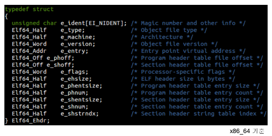

# readelf


## ELF

#### ELF 개념

ELF는 Executable and Linking Format의 약어입니다. UNIX / LINUX 기반에서 사용되는 실행 및 링킹 파일 포맷입니다.

* ELF는 하나의 ELF Header와 파일데이터로 구성되어 있습니다. 
* 파일의 가장 위에 ELF Header 정보가 들어있고, 
* 그 아래 program header table이 있습니다. 
* 그 이후 Segment 정보와 Section 관련 정보들 구성

| ELF 구조                      |
| ----------------------------- |
| ELF header                    |
| Program header table          |
| Segment1                      |
| Segemtn2                      |
| ....                          |
| Section header table optional |

- `Segment`: 동일한 메모리 속성(read-only, writable, ...)을 가진 하나 또는 그 이상의 섹션의 집합
- `Section`: 특정 정보(machine instructions, symbol table, ..)를 포함하고 있는 ELF file의 작은 조각
- Symbol: ELF file내에 저장된 함수 또는 변수의 디스크립션입니다. 간단한 함수 또는 변수의 정보를 포함하고 있습니다.
- Objec file: 컴퓨터에서 읽을 수 있는 소스파일 버전입니다. Object file은 소스파일의 전역, 정적 변수 이름같은 심볼 정보들이 아직 남아있는 파일입니다. 하지만 이 파일은 메모리에 어떻게 로드되어야 하는지 정보가 명시되어 있지 않기 때문에 직접 실행은 불가능합니다.
- Shared Library: 하나 또는 그 이상의 Object 파일의 심볼들로 구성된 파일입니다. 주소 공간 어디에든 로드 되어질 수 있습니다.
- Executables: Shared Library와 매우 유사하지만 메모리 내 특정 주소에 로드될 수 있는 파일입니다. 프로그램 시작을 위한 함수를 가지고 있습니다. 해당 함수에서 Executables 파일은 시작됩니다.
- Core Files: ELF 의 특별한 타입의 파일입니다. 실행된 프로세스에 의해 사용된 여러 메모리 세그먼트 들을 포함한 메모리 이미지 정보를 가지고 있습니다. 
- Linking: object 파일들로 부터 심볼 정도들을 가져와 특정 순서에 맞게 정렬을 해주는 과정입니다. 오브젝트의 각 섹션들을 공유 라이브러리나 실행파일 내에 각 세그먼트내에 정렬해 주는 과정입니다. 

#### Program header 



Program Header Table은 ELF내의 Segment들에 대한 정보와 그 Segment들을 메모리에 어떻게 로드해야 하는지에 대한 정보가 포함되어 있습니다.  Segment란  동일한 메모리 속성(read-only, writable, ...)을 가진 하나 또는 그 이상의 섹션의 집합입니다. 여러 개의 Segment들이 존재할테고 각 Segment들에 대한 정보가  명시된 곳이 Program Header입니다. readelf로 ELF Header를 확인

```sh
reallinux@ubuntu:~$ readelf -h a.out
ELF Header:
  Magic:   7f 45 4c 46 02 01 01 00 00 00 00 00 00 00 00 00
  Class:                             ELF64
  Data:                              2's complement, little endian
  Version:                           1 (current)
  OS/ABI:                            UNIX - System V
  ABI Version:                       0
  Type:                              DYN (Shared object file)
  Machine:                           Advanced Micro Devices X86-64
  Version:                           0x1
  Entry point address:               0x530
  Start of program headers:          64 (bytes into file)
  Start of section headers:          6448 (bytes into file)
  Flags:                             0x0
  Size of this header:               64 (bytes)
  Size of program headers:           56 (bytes)
  Number of program headers:         9
  Size of section headers:           64 (bytes)
  Number of section headers:         29
  Section header string table index: 28
```

* 9개의 header
* headr 구조는 type, offset, virtAddr, PhysAddr, FileSize, MemSiz,Flag,Align 

```sh
reallinux@ubuntu:~$ readelf -l  a.out

Elf file type is DYN (Shared object file)
Entry point 0x530
There are 9 program headers, starting at offset 64

Program Headers:
  Type           Offset             VirtAddr           PhysAddr
                 FileSiz            MemSiz              Flags  Align
  PHDR           0x0000000000000040 0x0000000000000040 0x0000000000000040
                 0x00000000000001f8 0x00000000000001f8  R      0x8
  INTERP         0x0000000000000238 0x0000000000000238 0x0000000000000238
                 0x000000000000001c 0x000000000000001c  R      0x1
      [Requesting program interpreter: /lib64/ld-linux-x86-64.so.2]
  LOAD           0x0000000000000000 0x0000000000000000 0x0000000000000000
                 0x0000000000000820 0x0000000000000820  R E    0x200000
  LOAD           0x0000000000000db8 0x0000000000200db8 0x0000000000200db8
                 0x0000000000000258 0x0000000000000260  RW     0x200000
  DYNAMIC        0x0000000000000dc8 0x0000000000200dc8 0x0000000000200dc8
                 0x00000000000001f0 0x00000000000001f0  RW     0x8
  NOTE           0x0000000000000254 0x0000000000000254 0x0000000000000254
                 0x0000000000000044 0x0000000000000044  R      0x4
  GNU_EH_FRAME   0x00000000000006dc 0x00000000000006dc 0x00000000000006dc
                 0x000000000000003c 0x000000000000003c  R      0x4
  GNU_STACK      0x0000000000000000 0x0000000000000000 0x0000000000000000
                 0x0000000000000000 0x0000000000000000  RW     0x10
  GNU_RELRO      0x0000000000000db8 0x0000000000200db8 0x0000000000200db8
                 0x0000000000000248 0x0000000000000248  R      0x1

 Section to Segment mapping:
  Segment Sections...
   00
   01     .interp
   02     .interp .note.ABI-tag .note.gnu.build-id .gnu.hash .dynsym .dynstr .gnu.version .gnu.version_r .rela.dyn .rela.plt .init .plt .plt.got .text .fini .rodata .eh_frame_hdr .eh_frame
   03     .init_array .fini_array .dynamic .got .data .bss
   04     .dynamic
   05     .note.ABI-tag .note.gnu.build-id
   06     .eh_frame_hdr
   07
   08     .init_array .fini_array .dynamic .got

```

* Section to Segment Mapping이라고 표기된 정보들이 있습니다. 섹션들이 세그먼트 내에 위치하는 내용
* GNU_EH_FRAME Segment에는 .note.ABI-tag, .note.gnu.build-id 란 섹션이 있다.


#### Program header

- PHDR : Programe Header 정보 자기 자신에 대한 Segment입니다. Offset과 Siz 등을 살펴보면 ELF Header정보에 들어있던 내용과 같음을 알 수 있습니다.

- LOAD : LOAD Segment는 로드할 수 있는 프로그램 Segment 입니다. 섹션을 다시 살펴보면 .intrp, .dynsym, .dynstr 등 다양한 섹션들이 존재하는데요. 메모리에 로드될 수 있는 섹션들이 모여있습니다. 그런데 왜 LOAD란 이름이 두개일까요? 2개의 Segment는 같은 이름을 가지고 있지만 다른 메모리 속성을 가지고 있습니다. Segment는 각각의 메모리 속성을 가진 Section들의 그룹이라고 앞 글에서 설명했던 것 기억나시나요? 자세히 Flags 정보를 보시면 RE와 RW로 속성이 다릅니다. 그 말은 읽고 실행할 수 있는 영역과 읽고 쓸수만 있는 영역이란 것을 의미합니다.
- NOTE :  Array 요소들은 보조적인 정보들의 위치와 크기가 저장되어 있습니다
- DYNAMIC : DYNAMIC Segment는 동적 링킹에 사용되는 세그먼트입니다. 자세한 내용은 나중에 다시 다루기로 하겠습니다. 지금은 말 그대로 프로그램 실행 중에 동적으로 링크되는 녀석들, 공유라이브러리 같은 놈들에 관련된(?) 것인가 추측만 하고 지나가셔도 됩니다.
- GNU_EH_FRAME / GNU_STACK / GNU_RELRO :  Vendor-specific한 정보들을 위한 매우 특별한 세그먼트들입니다.


