# virt-manager

#### 설치

```
$ sudo apt install virt-manager
```

#### ISO 이미지로 만들기

* brasero  설치
* dd 명령어 이용 방법, mkisofs, genisoimagae

##### mkisofs

```sh
iso 파일로 만들고자 하는 디렉토리를 확인후 
mkisofs -r -J -l -L -T -V <iso 이미지이름> -o <이미지이름.iso> < 디렉토리 또는 파일들>

예를들어 idc_ping 디렉토리를 iso파일로 만들고 싶다면 
mkisofs -r -J -l -L -T -V “idc_ping” -o idc_ping.iso /data1/idc_ping 
```

-r : Generate rationalized Rock Ridge directory information, 이미지에 사용자나 그룹권한이 필요없게 됩니다.
-J : iso9660 파일 이름에 Joliet 파일 이름이 추가되어서 윈도우즈 환경에서도 완벽히 호환됩니다.
-l -L : 윈도우의 파일 시스템과 호환 시켜기 위한 옵션입니다. 이렇게 하면 리눅스에서 “.”들어가 있는 파일명도 정상적으로 윈도우에서 보여집니다.
-T : 마찮가지로 호환성을 위해 추가하는 옵션입니다.
-V 이름 : 씨디 즉 iso 이미지의 이름을 지정합니다.
-o 파일명 : 만들어지는 iso파일의 이름입니다.

* mount 

```
# mount  -o loop -t iso9660 idc-ping.iso /mnt/cdrom
```


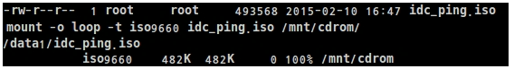


#### genisoimage

```
good@linux:~/code/iso$ mkdir fs
good@linux:~/code/iso$ mkdir xv6
good@linux:~/code/iso$ mv fs.img fs
good@linux:~/code/iso$ mv xv6.img xv6
good@linux:~/code/iso$ genisoimage -o xv6.iso xv6
I: -input-charset not specified, using utf-8 (detected in locale settings)
Total translation table size: 0
Total rockridge attributes bytes: 0
Total directory bytes: 0
Path table size(bytes): 10
Max brk space used 0
2674 extents written (5 MB)
good@linux:~/code/iso$ genisoimage -o fs.iso fs
I: -input-charset not specified, using utf-8 (detected in locale settings)
Total translation table size: 0
Total rockridge attributes bytes: 0
Total directory bytes: 0
Path table size(bytes): 10
Max brk space used 0
424 extents written (0 MB)
```


#### Linux virt-manager를  xv6 booting

* qemu option 참조하여 아래 설정

```
QEMUOPTS = -drive file=fs.img,index=1,media=disk,format=raw -drive file=xv6.img,index=0,media=disk,format=raw -smp $(CPUS) -m 512 $(QEMUEXTRA)
```

#### VM 생성

##### 1. 가상머신 관리자

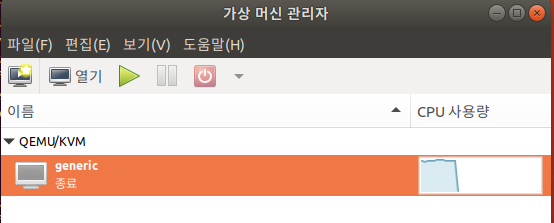

##### 2. 새 가상 머신

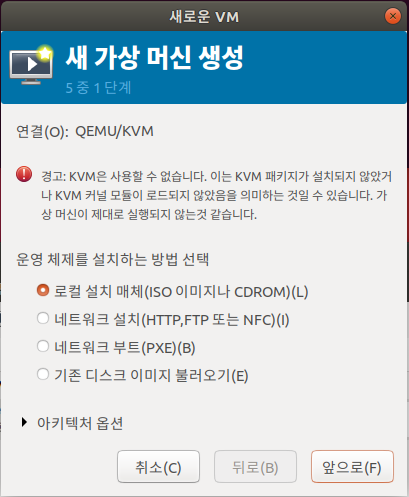

##### 3. 설치 경로

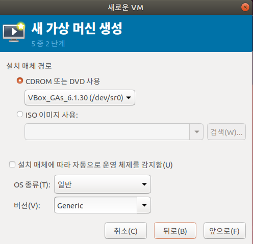

##### 4. 생성

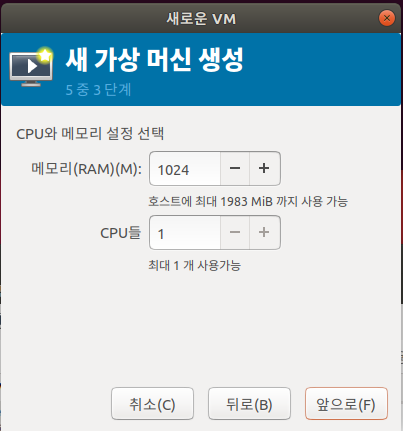

##### 5. 저장소 미선택

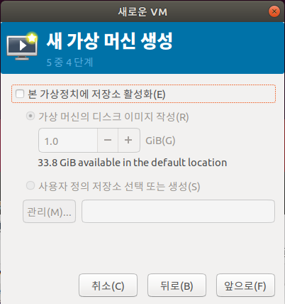

##### 6. 일단 강제 종료

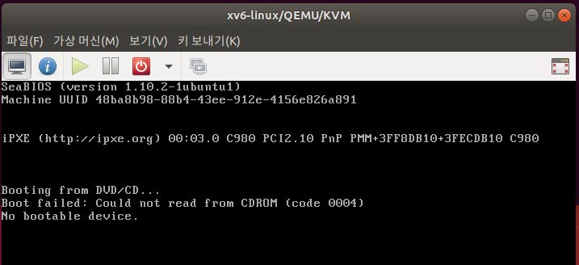

##### 7. IDE1 디스크 선택 : xv6.img

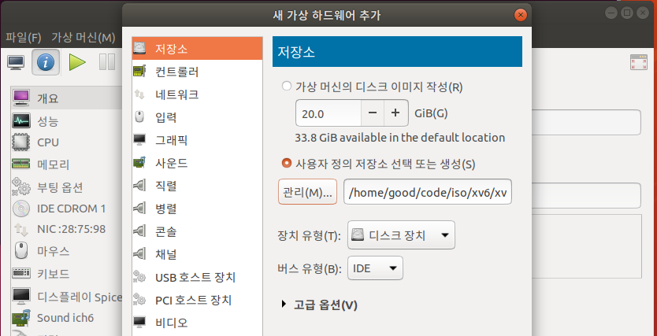

* /home/good/code/iso/xv6/xv6.img

##### 8. IDE2 디스크 선택: fs.img

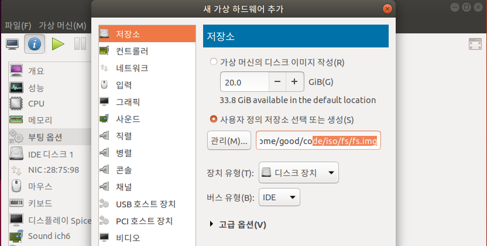

##### 9. 부팅 순서 정의

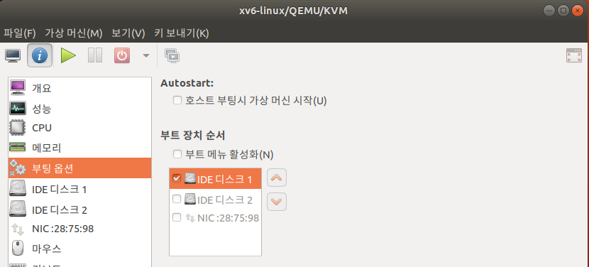


##### 실행된 QEMU 명령어

```
$ ps -ef | grep qemu
libvirt+ 10388     1 92 00:36 ?        00:00:39 
/usr/bin/qemu-system-x86_64 -name guest=xv6-linux,debug-threads=on -S -object secret,id=masterKey0,format=raw,file=/var/lib/libvirt/qemu/domain-9-xv6-linux/master-key.aes 
-machine pc-i440fx-bionic,accel=tcg,usb=off,vmport=off,dump-guest-core=off -m 1024 -realtime mlock=off -smp 1,sockets=1,cores=1,threads=1 -uuid 48ba8b98-88b4-43ee-912e-4156e826a891 -no-user-config -nodefaults -chardev socket,id=charmonitor,path=/var/lib/libvirt/qemu/domain-9-xv6-linux/monitor.sock,server,nowait -mon chardev=charmonitor,id=monitor,mode=control -rtc base=utc,driftfix=slew -global kvm-pit.lost_tick_policy=delay -no-hpet -no-shutdown -global PIIX4_PM.disable_s3=1 -global PIIX4_PM.disable_s4=1 -boot menu=off,strict=on -device ich9-usb-ehci1,id=usb,bus=pci.0,addr=0x5.0x7 -device ich9-usb-uhci1,masterbus=usb.0,firstport=0,bus=pci.0,multifunction=on,addr=0x5 -device ich9-usb-uhci2,masterbus=usb.0,firstport=2,bus=pci.0,addr=0x5.0x1 -device ich9-usb-uhci3,masterbus=usb.0,firstport=4,bus=pci.0,addr=0x5.0x2 -device virtio-serial-pci,id=virtio-serial0,bus=pci.0,addr=0x6 
-drive file=/home/good/code/iso/xv6.img,format=raw,if=none,id=drive-ide0-0-0 -device ide-hd,bus=ide.0,unit=0,drive=drive-ide0-0-0,id=ide0-0-0,bootindex=1 
-drive file=/home/good/code/iso/fs.img,format=raw,if=none,id=drive-ide0-0-1 -device ide-hd,bus=ide.0,unit=1,drive=drive-ide0-0-1,id=ide0-0-1 
-chardev pty,id=charserial0 -device isa-serial,chardev=charserial0,id=serial0 -chardev spicevmc,id=charchannel0,name=vdagent -device virtserialport,bus=virtio-serial0.0,nr=1,chardev=charchannel0,id=channel0,name=com.redhat.spice.0 
-spice port=5900,addr=127.0.0.1,disable-ticketing,image-compression=off,seamless-migration=on 
-device qxl-vga,id=video0,ram_size=67108864,vram_size=67108864,vram64_size_mb=0,vgamem_mb=16,max_outputs=1,bus=pci.0,addr=0x2 -device virtio-balloon-pci,id=balloon0,bus=pci.0,addr=0x7 -msg timestamp=on
```

* xv6에서는 단순하게....

```
QEMUOPTS = -drive file=fs.img,index=1,media=disk,format=raw -drive file=xv6.img,index=0,media=disk,format=raw -smp $(CPUS) -m 512 $(QEMUEXTRA)
```


##### 1. xv6.img 파일을 IDE 디스크 1번에 할당

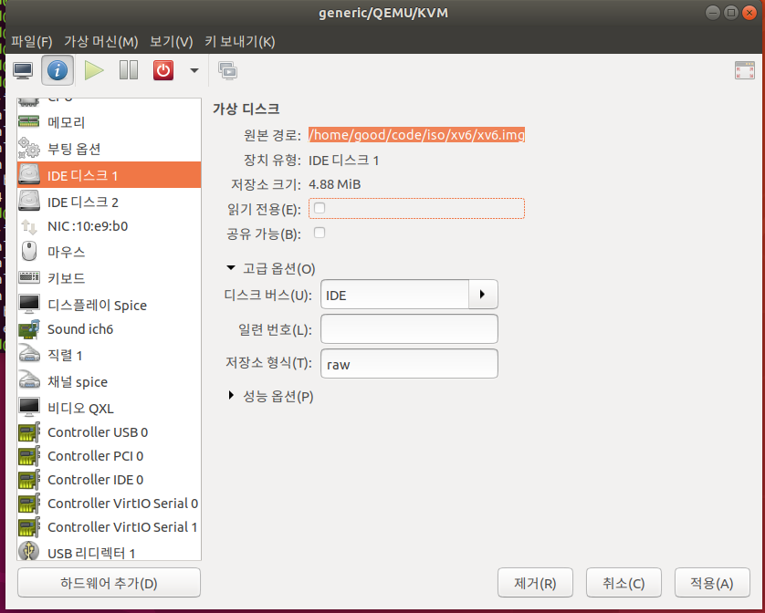


##### 2. fs.img 파일을 IDE disk2 에 할당

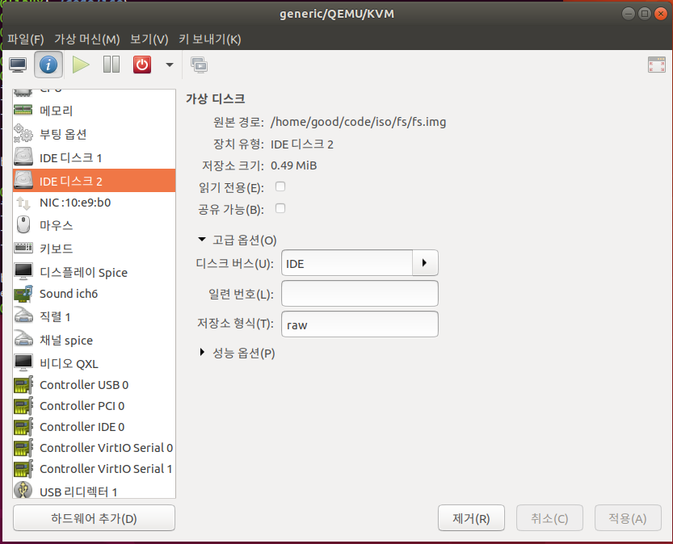


