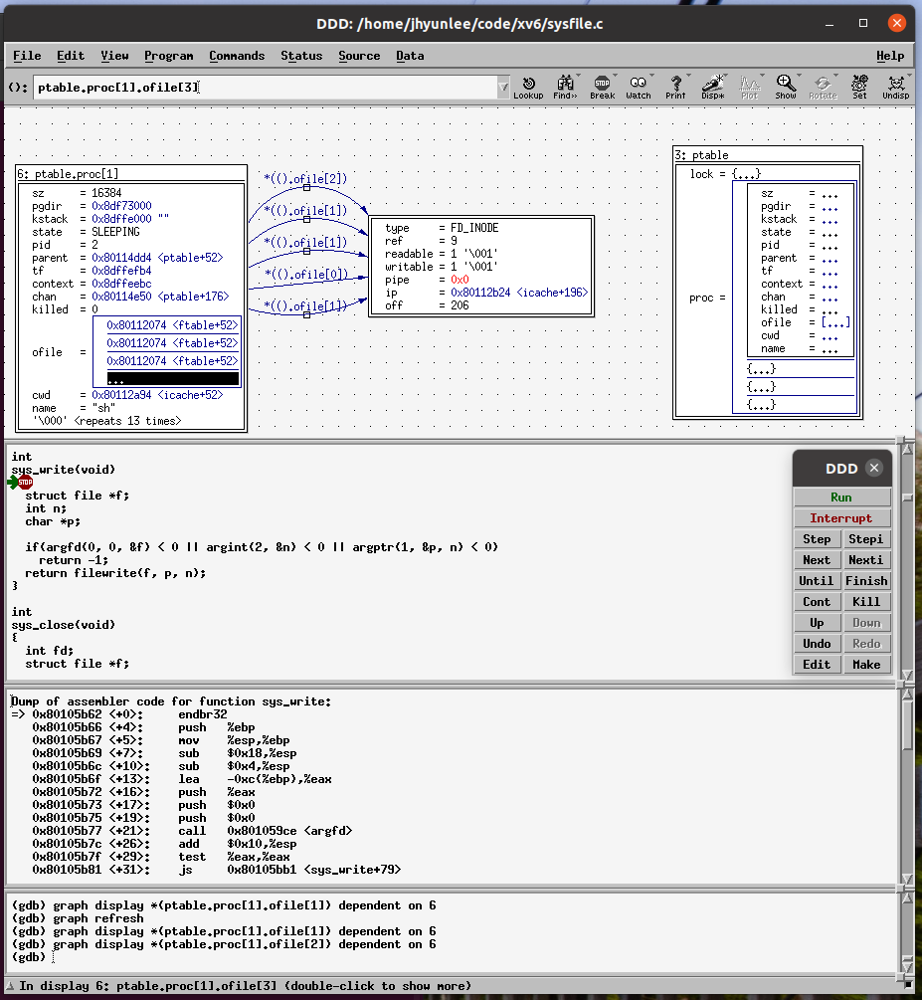

# DDD( Display Data Debugger)

https://www.gnu.org/software/ddd/manual/html_mono/ddd.html


```c
/* sample.c -- Sample C program to be debugged with DDD */
#include <stdio.h>
#include <stdlib.h>
static void shell_sort(int a[], int size)
{
	int i, j;
	int h = 1;
	do {
		h = h * 3 + 1;
	} while (h <= size);
	do {
		h /= 3;
		for (i = h; i < size; i++)
		{
			int v = a[i];
			for (j = i; j >= h && a[j - h] > v; j -= h)
				a[j] = a[j - h];
			if (i != j)
				a[j] = v;
		}
	} while (h != 1);
}

int main(int argc, char* argv[])
{
	int* a;
	int i;

	a = (int*)malloc((argc - 1) * sizeof(int));
	for (i = 0; i < argc - 1; i++)
		a[i] = atoi(argv[i + 1]);

	shell_sort(a, argc);

	for (i = 0; i < argc - 1; i++)
		printf("%d ", a[i]);
	printf("\n");

	free(a);
	return 0;
}
```


##### set print pretty on

```
(gdb) set print pretty on
(gdb) p ptable
$4 = {
  lock = {
    locked = 1,
    name = 0x80108bcc "ptable",
    cpu = 0x80114800 <cpus>,
    pcs = {2148551483, 2148547240, 2148547135, 0, 0, 0, 0, 0, 0, 0}
  },
  proc = {{
      sz = 12288,
      pgdir = 0x8dfbb000,
      kstack = 0x8dfff000 "",
      state = SLEEPING,
      pid = 1,
      parent = 0x0,
      tf = 0x8dffffb4,
      context = 0x8dfffebc,
      chan = 0x80114dd4 <ptable+52>,
      killed = 0,
      ofile = {0x80112074 <ftable+52>, 0x80112074 <ftable+52>, 0x80112074 <ftable+52>, 0x0 <repeats 13 times>},
      cwd = 0x80112a94 <icache+52>,
      name = "init\000\000de\000\000\000\000\000\000\000"
    }, {  pid = 2,
    }, {  pid = 0,
    }, {      
    } <repeats 61 times>}
}
```

##### print ptable.proc[1]

```
(gdb) p ptable.proc[1]
$9 = {
  sz = 16384,
  pgdir = 0x8df73000,
  kstack = 0x8dffe000 "",
  state = SLEEPING,
  pid = 2,
  parent = 0x80114dd4 <ptable+52>,
  tf = 0x8dffefb4,
  context = 0x8dffee3c,
  chan = 0x80112020 <input+128>,
  killed = 0,
  ofile = {0x80112074 <ftable+52>, 0x80112074 <ftable+52>, 0x80112074 <ftable+52>, 0x0 <repeats 13 times>},
  cwd = 0x80112a94 <icache+52>,
  name = "sh", '\000' <repeats 13 times>
}
```

##### print  *ptable.proc[1].cwd

```
(gdb) p ptable.proc[1]->cwd
$24 = (struct inode *) 0x80112a94 <icache+52>
(gdb) p *(ptable.proc[1].cwd)
$25 = {
  dev = 1,
  inum = 1,
  ref = 2,
  lock = {
    locked = 0,
    lk = {
      locked = 0,
      name = 0x80108d4b "sleep lock",
      cpu = 0x0,
      pcs = {0, 2148539564, 2148550989, 2148558757, 2148555154, 2148559995, 2148559459, 0, 0, 0}
    },
    name = 0x801089a0 "inode",
    pid = 0
  },
  valid = 1,
  type = 1,
  major = 0,
  minor = 0,
  nlink = 1,
  size = 512,
  addrs = {59, 0 <repeats 12 times>}
}
```


#### displaty ptable 

* display 창에서  선택 라인을 전체 선택하고 `rotate` 선택하면 pretty 형태로 내용을 확인 할 수 있다. 
* `(gdb) set print pretty on` : gdb 창에서는 컬럼 단위로 출력하기 위해서는 pretty on 하면 된다. 


#### graph display *ptable.proc[1].ofile

