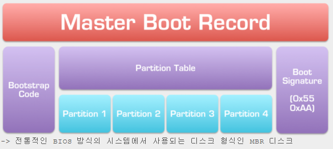
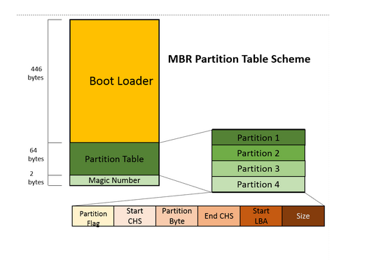
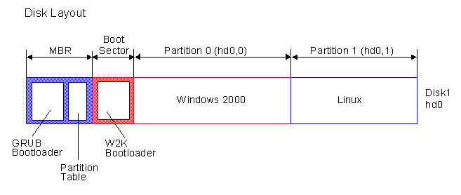
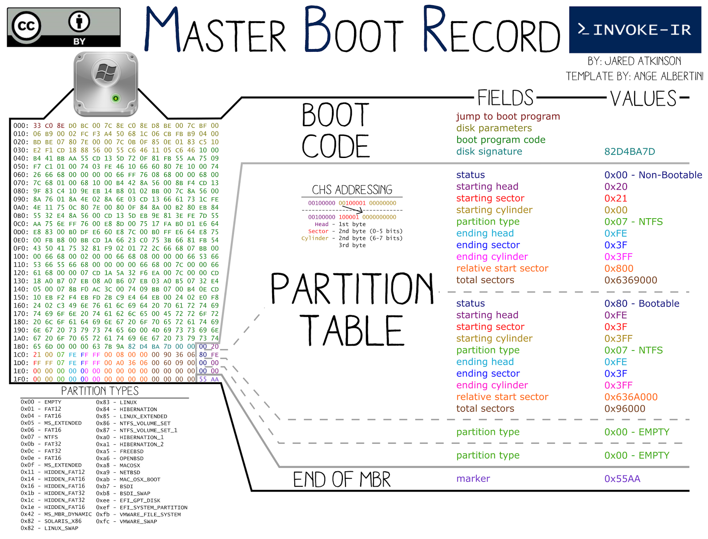
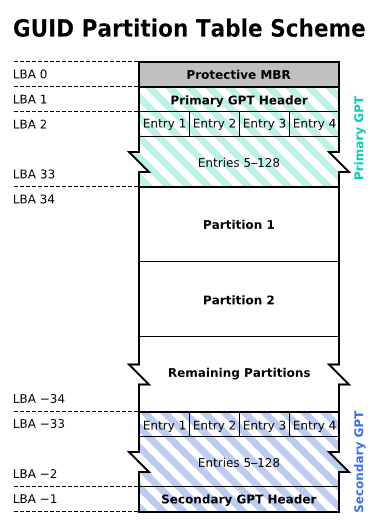
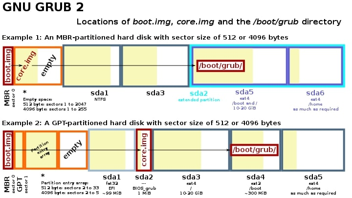
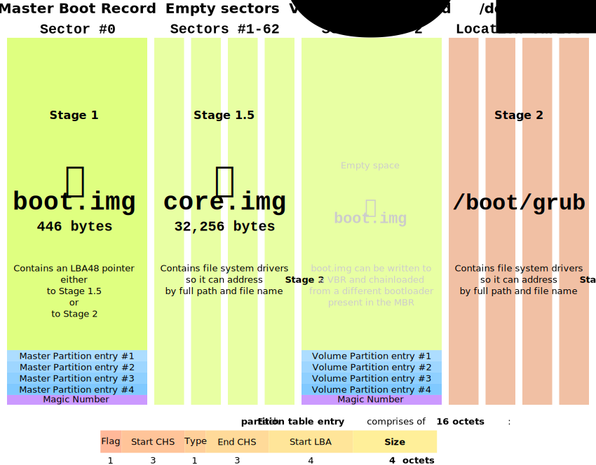
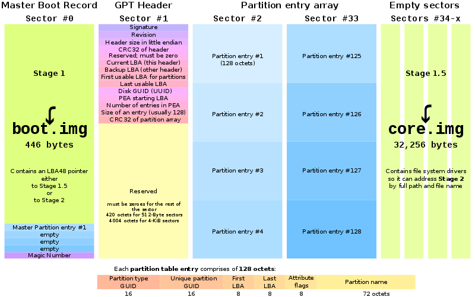

# 부팅 프로세스 


## boot 

### 리눅스 boot process


#### 1. BIOS

- BIOS stands for Basic Input/Output System
- Performs some system integrity checks
- Searches, loads, and executes the boot loader program.
- It looks for boot loader in floppy, cd-rom, or hard drive. You can press a key (typically F12 of F2, but it depends on your system) during the BIOS startup to change the boot sequence.
- Once the boot loader program is detected and loaded into the memory, BIOS gives the control to it.
- So, in simple terms BIOS loads and executes the MBR boot loader.

#### 2. MBR : 512bytes

- MBR stands for Master Boot Record.
- It is located in the 1st sector of the bootable disk. Typically /dev/hda, or /dev/sda
- MBR is less than 512 bytes in size. This has three components 
  - 1) primary boot loader info in 1st 446 bytes 
  - 2) partition table info in next 64 bytes 
  - 3) mbr validation check in last 2 bytes.
- It contains information about GRUB (or LILO in old systems).
- So, in simple terms MBR loads and executes the GRUB boot loader.

#### 3. GRUB

- GRUB stands for Grand Unified Bootloader.
- If you have multiple kernel images installed on your system, you can choose which one to be executed.
- GRUB displays a splash screen, waits for few seconds, if you don’t enter anything, it loads the default kernel image as specified in the grub configuration file.
- GRUB has the knowledge of the filesystem (the older Linux loader LILO didn’t understand filesystem).
- Grub configuration file is /boot/grub/grub.conf
- As you notice from the above info, it contains kernel and initrd image.
- So, in simple terms GRUB just loads and executes Kernel and initrd images.

#### 4. Kernel

- Mounts the root file system as specified in the “root=” in grub.conf
- Kernel executes the /sbin/init program
- Since init was the 1st program to be executed by Linux Kernel, it has the process id (PID) of 1. Do a ‘ps -ef | grep init’ and check the pid.
- initrd stands for Initial RAM Disk.
- initrd is used by kernel as temporary root file system until kernel is booted and the real root file system is mounted. It also contains necessary drivers compiled inside, which helps it to access the hard drive partitions, and other hardware.


### grub 설정

#### 설정파일

다음 2개의 파일을 이용하여 설정

* /etc/grub.d (폴더)
* /etc/default/grub (파일)

2개의 파일에 설정 내용을 이용하여 `update-grub` 통해서  `/boot/grub/grub.cfg` 파일을 자동으로 생성한다. 생각해보면 grub.cfg를 수작업으로 수정하다가 뻑 나면 부팅 조차 안되는 일이 얼마나 많이 발생했으면 이렇게 했을까 하는 생각이 자연 스럽게 든다.

#### /boot/grub/grub.cfg 

```
$ sudo update-grub 
```

* 당연한 것이지만 이 파일을 열어보면 자동으로 생성된 것이라서 ... 좀 그렇다. 


#### 부팅 순서 변경

```
$ sudo nano /etc/default/grub

# If you change this file, run 'update-grub' afterwards to update
# /boot/grub/grub.cfg.
# For full documentation of the options in this file, see:
#   info -f grub -n 'Simple configuration'

GRUB_DEFAULT=0    <<<===== 이것을 지정하면 된다. 
GRUB_TIMEOUT_STYLE=hidden
GRUB_TIMEOUT=0
GRUB_DISTRIBUTOR=`lsb_release -i -s 2> /dev/null || echo Debian`
GRUB_CMDLINE_LINUX_DEFAULT="quiet splash"
GRUB_CMDLINE_LINUX="
```


### Kernel loading

* 커널이 로딩되는 것은 길고 빅뱅이후 우주 탄생같은 과정을 거치게 된다. 
* 뭔가 우주의 질서가 만들어져서 균형이 잡히는 것이라고 해야 할까나....
* 전기가 있고 하드웨어가 있어도 이것을 규칙과 질서에 따라서 움직이게 하는 뭔가  그런 것이 생성되는 과정이라고 생각해야 하나?


#### start_kernel 함수

```c
asmlinkage __visible void __init start_kernel(void)
{
        char *command_line;
        char *after_dashes;

        set_task_stack_end_magic(&init_task);
        smp_setup_processor_id();
        debug_objects_early_init();
        boot_init_stack_canary();
        cgroup_init_early();
        local_irq_disable();
        early_boot_irqs_disabled = true;
        boot_cpu_init();
        page_address_init();
        pr_notice("%s", linux_banner);
        setup_arch(&command_line);
        mm_init_cpumask(&init_mm);
        setup_command_line(command_line);
        setup_nr_cpu_ids();
        setup_per_cpu_areas();
        boot_cpu_state_init();
        smp_prepare_boot_cpu(); /* arch-specific boot-cpu hooks */
        build_all_zonelists(NULL, NULL);
        page_alloc_init();
        pr_notice("Kernel command line: %s\n", boot_command_line);
        parse_early_param();
        after_dashes = parse_args("Booting kernel",
        setup_log_buf(0);
        pidhash_init();
        vfs_caches_init_early();
        sort_main_extable();
        trap_init();
        mm_init();
        sched_init();
        preempt_disable();
        idr_init_cache();
        rcu_init();
        trace_init();
        context_tracking_init();
        radix_tree_init();
        early_irq_init();
        init_IRQ();
        tick_init();
        rcu_init_nohz();
        init_timers();
        hrtimers_init();
        softirq_init();
        timekeeping_init();
        time_init();
        sched_clock_postinit();
        printk_nmi_init();
        perf_event_init();
        profile_init();
        call_function_init();
        WARN(!irqs_disabled(), "Interrupts were enabled early\n");
        early_boot_irqs_disabled = false;
        local_irq_enable();
        kmem_cache_init_late();
        console_init();
        lockdep_info();
        locking_selftest();
        page_ext_init();
        debug_objects_mem_init();
        kmemleak_init();
        setup_per_cpu_pageset();
        numa_policy_init();
        sched_clock_init();
        calibrate_delay();
        pidmap_init();
        anon_vma_init();
        acpi_early_init();
        thread_stack_cache_init();
        cred_init();
        fork_init();
        proc_caches_init();
        buffer_init();
        key_init();
        security_init();
        dbg_late_init();
        vfs_caches_init();
        signals_init();
        page_writeback_init();
        proc_root_init();
        nsfs_init();
        cpuset_init();
        cgroup_init();
        taskstats_init_early();
        delayacct_init();
        check_bugs();
        acpi_subsystem_init();
        sfi_init_late();
        ftrace_init();
        rest_init();
}

```


## MBR, GPT

### MBR

MBR이란?

MBR (Master Boot Record)은 1983 년 IBM PC DOS 2.0에서 처음 소개 된 오래된 디스크 유형입니다. MBR이라는 드라이브 (첫 번째 섹터)의 맨 처음에 위치한 부트 섹터의 이름을 따서 명명되었습니다. 다음은 MBR 디스크의 단순화 된 구조입니다.



#### MBR 

MBR 디스크와 GPT 디스크의 첫 번째 섹터는 MBR 섹터입니다.

* 512 바이트를 차지하며 마스터 부트 코드 (446 바이트), 
* 디스크 파티션 테이블 (DPT, 64 바이트) 
* MBR 섹터의 끝을 표시하는 부트 서명 (2 바이트)을 포함합니다




* MBR을 사용하던 시절에 이렇게 했다는 것...


#### 파티션

데이터 저장을 위해 디스크를 사용하려면 파티션이라는 청크로 분할해야합니다. 파티션은 MBR 디스크에서 기본 파티션과 확장 파티션으로 분류 할 수 있습니다. 

* 주 파티션은 컴퓨터를 부팅하기 위해 운영 체제를 설치하고 활성화 할 수있는 파티션입니다. 
* 주 파티션이 차지하는 공간을 제외하고 디스크에 남아있는 공간을 확장 파티션이라고합니다. 
* 주 파티션과 달리 확장 파티션은 드라이브 문자와 파일 시스템이있는 "구체적인"저장 장치입니다. 확장 파티션은 공간을 활용하기 위해 여러 논리 드라이브를 만드는 데만 사용할 수 있습니다.

#### 파티션 테이블 

디스크 파티션 테이블은 총 64 바이트이고 각 파티션의 정보는 16 바이트이므로 최대 4 개의 기본 파티션을 만들 수 있습니다. 디스크에서 4 개 이상의 파티션을 선호하는 경우 하나의 주 파티션을 확장 파티션으로 만들어 논리 파티션을 만들어야합니다. (확장 파티션 내에서 여러 논리 드라이브를 만들 수 있습니다.)

MBR 디스크의 가장 명백한 단점은 디스크에서 최대 2TiB (≈2.2TB) 크기로만 작동한다는 것입니다. 즉, MBR 파티션 스타일의 2TiB보다 큰 디스크가있는 경우 최대 2TiB 공간 만 사용할 수 있습니다.








### GPT

GPT, GUID 파티션 테이블은 UEFI 이니셔티브의 일부로 처음 도입 된 MBR에 비해 새로운 표준입니다. MBR 파티셔닝 체계에 비해 더 유연하고 최신 하드웨어와의 호환성이 더 좋습니다.

#### 보호 MBR

GPT 디스크의 첫 번째 섹터는 MBR 섹터이기도합니다. MBR 디스크의 보호 MBR과 달리 GPT 디스크의 보호 MBR은 MBR 디스크 만 지원하는 도구가 GPT 디스크를 잘못 인식하고 덮어 쓰는 것을 방지하는 기능을합니다.

#### 기본 GPT 헤더

GPT 디스크의 두 번째 섹터에는 기본 GUID 파티션 테이블 헤더가 저장됩니다. GPT 헤더의 무결성을 확인하는 데 사용되는 파티션 테이블과 CRC32 (Cyclic Redundancy Check) 체크섬으로 구성된 파티션 항목의 위치와 크기를 정의합니다. CRC가 데이터 손상을 감지하면 디스크 끝에 저장된 백업을 사용하여 데이터 복구를 시도합니다.

#### 파티션 항목

* 세 번째 섹터에서 34 번째 섹터 (총 32 개 섹터)까지 파티션 항목이 있습니다. 
* 이론적으로 GPT 디스크에 무제한 파티션을 만들 수 있습니다. 그러나 생성 할 수있는 파티션의 수는 운영 체제에 따라 제한됩니다. 예를 들어, Windows에서 각 파티션 항목은 128 바이트이므로 Windows에서 최대 128 (32 * 512 / 128 = 128) 파티션을 만들 수 있습니다. 이것이 GTP 디스크와 MBR 디스크가 현저하게 다른 점입니다.

#### 파티션

만들 수있는 주 파티션 수에 제한이 없기 때문에 GPT 디스크에는 확장 파티션이나 논리 파티션이 없습니다. 

#### 백업 파티션 항목 / 기본 GPT 헤더

GPT 디스크는 디스크의 마지막 섹터에서 기본 GPT 헤더와 파티션 항목을 자동으로 백업합니다. 이것이 GPT 디스크가 MBR 디스크보다 더 안전하고 신뢰할 수있는 이유입니다. GPT 헤더 또는 파티션 테이블이 손상되면 이러한 백업이 데이터를 복원하는 데 도움이됩니다.





### MBR과 GPT의 차이

 구조와 기술에 따라 MBR 디스크와 GPT 디스크는 지원되는 부팅 모드와 호환되는 운영 체제에서 주로 다릅니다.

#### 부트 모드

* 저수준 BIOS-MBR 방법 또는 UEFI-GPT 방법 중 하나를 사용하여 부팅
* MBR 디스크가 레거시 BIOS (Basic Input / Output System) 모드 및 GPT 디스크 UEFI (Unified Extensible Firmware Interface) 모드 만 지원함
* BIOS와 UEFI는 기본적으로 PC의 전원을 켤 때 시작되는 저수준 소프트웨어입니다. 

* BIOS는 더 전통적인 방식이고 UEFI는 더 새로운 방식입니다. 


#### BIOS-MBR에 비해 UEFI-GPT의 장점

BIOS-MBR 방법의 한계는 UEFI-GPT 방법의 출현을 촉진합니다. BIOS의 MBR 섹터 부팅 프로세스로 인해 최대 2TiB 크기의 드라이브에서만 부팅 할 수 있습니다. 게다가 BIOS를 사용하면 부팅 프로세스가 느려집니다. UEFI의 이점은 다음과 같습니다.

- 대용량 하드 드라이브와의 호환성 향상 (2TiB보다 큼)
- 4 개 이상의 기본 파티션 지원
- 더 빠른 부팅 시간
- 인터페이스에서 더 나은 그래픽 및 마우스 커서 지원


### GRUB

#### GNI GRUB2




#### GNU GRUB on MBR partitioned hard disk drives.svg





#### GNU grub on GPT partitioned hard disk 




## Linux System 

### MBR boot Only

#### xv6.img

* gdisk 

```
good@code:~/code/xv6-public$ sudo gdisk xv6.img
GPT fdisk (gdisk) version 1.0.5

Partition table scan:
  MBR: MBR only
  BSD: not present
  APM: not present
  GPT: not present


***************************************************************
Found invalid GPT and valid MBR; converting MBR to GPT format
in memory. THIS OPERATION IS POTENTIALLY DESTRUCTIVE! Exit by
typing 'q' if you don't want to convert your MBR partitions
to GPT format!
***************************************************************

Exact type match not found for type code C100; assigning type code for
'Linux filesystem'
Exact type match not found for type code CC00; assigning type code for
'Linux filesystem'
Warning! Main partition table overlaps the first partition by 34 blocks!
You will need to delete this partition or resize it in another utility.

Command (? for help): p
Disk xv6.img: 10000 sectors, 4.9 MiB
Sector size (logical): 512 bytes
Disk identifier (GUID): 15EF3770-AA81-4D8F-9FC4-0437241316C4
Partition table holds up to 128 entries
Main partition table begins at sector 2 and ends at sector 33
First usable sector is 34, last usable sector is 9966
Partitions will be aligned on 1-sector boundaries
Total free space is 9933 sectors (4.8 MiB)

Number  Start (sector)    End (sector)  Size       Code  Name
   1      3099666887               0   16.0 EiB    8300  Linux filesystem

Command (? for help):
```

* fdisk

```
good@code:~/code/xv6-public$ fdisk xv6.img

Welcome to fdisk (util-linux 2.34).
Changes will remain in memory only, until you decide to write them.
Be careful before using the write command.


Command (m for help): p
Disk xv6.img: 4.9 MiB, 5120000 bytes, 10000 sectors
Units: sectors of 1 * 512 = 512 bytes
Sector size (logical/physical): 512 bytes / 512 bytes
I/O size (minimum/optimal): 512 bytes / 512 bytes
Disklabel type: dos
Disk identifier: 0x8b144b8b

Device     Boot      Start        End Sectors Size Id Type
xv6.img1        3099666887 3099666887       0   0B c1 DRDOS/sec (FAT-12)
xv6.img2                 0          0       0   0B cc unknown
```


* xdd dump

`sudo xxd xv6.img`

```
00000000: fa31 c08e d88e c08e d0e4 64a8 0275 fab0  .1........d..u..
00000010: d1e6 64e4 64a8 0275 fab0 dfe6 600f 0116  ..d.d..u....`...
00000020: 787c 0f20 c066 83c8 010f 22c0 ea31 7c08  x|. .f...."..1|.
00000030: 0066 b810 008e d88e c08e d066 b800 008e  .f.........f....
00000040: e08e e8bc 007c 0000 e8fc 0000 0066 b800  .....|.......f..
00000050: 8a66 89c2 66ef 66b8 e08a 66ef ebfe 6690  .f..f.f...f...f.
00000060: 0000 0000 0000 0000 ffff 0000 009a cf00  ................
00000070: ffff 0000 0092 cf00 1700 607c 0000 f30f  ..........`|....
00000080: 1efb baf7 0100 00ec 83e0 c03c 4075 f8c3  ...........<@u..
00000090: f30f 1efb 5589 e557 538b 5d0c e8dd ffff  ....U..WS.].....
000000a0: ffb8 0100 0000 baf2 0100 00ee baf3 0100  ................
000000b0: 0089 d8ee 89d8 c1e8 08ba f401 0000 ee89  ................
000000c0: d8c1 e810 baf5 0100 00ee 89d8 c1e8 1883  ................
000000d0: c8e0 baf6 0100 00ee b820 0000 00ba f701  ......... ......
000000e0: 0000 eee8 96ff ffff 8b7d 08b9 8000 0000  .........}......
000000f0: baf0 0100 00fc f36d 5b5f 5dc3 f30f 1efb  .......m[_].....
00000100: 5589 e557 5653 83ec 0c8b 5d08 8b75 1089  U..WVS....]..u..
00000110: df03 7d0c 89f0 25ff 0100 0029 c3c1 ee09  ..}...%....)....
00000120: 83c6 0139 df76 1a83 ec08 5653 e85f ffff  ...9.v....VS._..
00000130: ff81 c300 0200 0083 c601 83c4 1039 df77  .............9.w
00000140: e68d 65f4 5b5e 5f5d c3f3 0f1e fb55 89e5  ..e.[^_].....U..
00000150: 5756 5383 ec10 6a00 6800 1000 0068 0000  WVS...j.h....h..
00000160: 0100 e895 ffff ff83 c410 813d 0000 0100  ...........=....
00000170: 7f45 4c46 7521 a11c 0001 008d 9800 0001  .ELFu!..........
00000180: 000f b735 2c00 0100 c1e6 0501 de39 f372  ...5,........9.r
00000190: 15ff 1518 0001 008d 65f4 5b5e 5f5d c383  ........e.[^_]..
000001a0: c320 39de 76eb 8b7b 0c83 ec04 ff73 04ff  . 9.v..{.....s..
000001b0: 7310 57e8 44ff ffff 8b4b 148b 4310 83c4  s.W.D....K..C...
000001c0: 1039 c176 da01 c729 c1b8 0000 0000 fcf3  .9.v...)........
000001d0: aaeb cc00 0000 0000 0000 0000 0000 0000  ................
000001e0: 0000 0000 0000 0000 0000 0000 0000 0000  ................
000001f0: 0000 0000 0000 0000 0000 0000 0000 55aa  ..............U.
```


### GPT boot

```
good@code:/boot$ lsblk
NAME   MAJ:MIN RM   SIZE RO TYPE MOUNTPOINT
sda      8:0    0 238.5G  0 disk 
├─sda1   8:1    0   512M  0 part /boot/efi
└─sda2   8:2    0   238G  0 part /
sr0     11:0    1  1024M  0 ro
```

#### fdisk 

* disk type : gpt

```
good@code:/boot$ sudo fdisk /dev/sda
Welcome to fdisk (util-linux 2.34).
Disk /dev/sda: 238.49 GiB, 256060514304 bytes, 500118192 sectors
Disk model: LITEON CV1-CC256
Units: sectors of 1 * 512 = 512 bytes
Sector size (logical/physical): 512 bytes / 512 bytes
I/O size (minimum/optimal): 512 bytes / 512 bytes
Disklabel type: gpt
Disk identifier: 0CF5530D-4FF2-49DB-BDC5-D95EFD0A43F4

Device       Start       End   Sectors  Size Type
/dev/sda1     2048   1050623   1048576  512M EFI System
/dev/sda2  1050624 500117503 499066880  238G Linux filesystem

```


#### gdisk

* GUID

```
good@code:/boot$ sudo gdisk /dev/sda
[sudo] good의 암호: 
GPT fdisk (gdisk) version 1.0.5

Partition table scan:
  MBR: protective
  BSD: not present
  APM: not present
  GPT: present

Found valid GPT with protective MBR; using GPT.

Command (? for help): p
Disk /dev/sda: 500118192 sectors, 238.5 GiB
Model: LITEON CV1-CC256
Sector size (logical/physical): 512/512 bytes
Disk identifier (GUID): 0CF5530D-4FF2-49DB-BDC5-D95EFD0A43F4
Partition table holds up to 128 entries
Main partition table begins at sector 2 and ends at sector 33
First usable sector is 34, last usable sector is 500118158
Partitions will be aligned on 2048-sector boundaries
Total free space is 2669 sectors (1.3 MiB)

Number  Start (sector)    End (sector)  Size       Code  Name
   1            2048         1050623   512.0 MiB   EF00  EFI System Partition
   2         1050624       500117503   238.0 GiB   8300  

Command (? for help):
```

* 근데 EFI  파티션 이것은 뭐지?


### EFI (Unified Extensible Firmware Interface)

**통일 확장 펌웨어 인터페이스** 또는 **통합 확장 펌웨어 인터페이스**( Unified Extensible Firmware Interface, UEFI)는 운영 체제와 플랫폼 펌웨어 사이의 소프트웨어 인터페이스를 정의하는 규격이다. IBM PC 호환기종에서 사용되는 바이오스 인터페이스를 대체할 목적으로 개발되었다. 인텔이 개발한 **EFI**(Extensible Firmware Interface) 규격에서 출발하였다. EFI의 관행과 데이터 포맷 중 일부는 마이크로소프트 윈도우의 것과 동일하게 사용된다.

원래 EFI가 개발된 동기는 1990년대 중반에 인텔과 HP가 초대 아이테니엄기의 개발 초기까지 거슬러 올라간다. 개인용 컴퓨터의 바이오스 제한(16비트 보호 모드, 1 메가바이트의 주소 공간, PC/AT 하드웨어에의 의존) 때문에 아이테니엄 대상으로 한 거대한 서버 플랫폼에는 채용할 수 없는 것이 판명되었다. 여기서 교훈을 얻은 첫 성과를 **인텔 부트 이니셔티브**(Intel Boot Initiative)로 부르는데 나중에 EFI와 이름을 바꾸는 것이었다.

#### EFI 시스템 파티션

종종 ESP로 줄여서 이르는 EFI 시스템 파티션은 UEFI 사양을 따르는 컴퓨터에 사용되는 데이터 스토리지 디바이스 파티션이다. 

* 컴퓨터의 전원이 켜질 때 UEFI 펌웨어에 의해 접근되는 이 파티션은 UEFI 응용 프로그램들 및 이러한 프로그램들의 실행에 필요한 파일들을 저장한다.

* 지원되는 파티션 테이블 스킴에는 `MBR` 및`GPT` 뿐 아니라 광 디스크 상의 엘 토리토 볼륨을 포함한다.
* ESP에 사용할 경우, UEFI는 FAT 파일 시스템에 특화된 버전을 정의하며, 이는 UEFI 사양의 일부로서, 오리지널 FAT 사양과는 별개로 유지보수되는데, 여기에는 ESP 상의 FAT32 파일 시스템류들과 이동식 미디어의 FAT16, FAT12 파일 시스템을 아우른다.
* ESP 또한 하위 바이오스 호환의 일부로서 부트 섹터를 위한 공간을 제공한다.

#### EFI 부팅 

##### UEFI 부팅

BIOS와 달리, UEFI는 부트 섹터에 의존하지 않으며, 대신 UEFI의 사양의 일부로서 부트 매니저를 정의한다.

##### CSM 부팅

하위 호환성을 보장하기 위해, PC 등급의 컴퓨터에서 대부분의 UEFI 펌웨어 구현들은 레거시 바이오스 모드에서의 MBR 파티션 디스크 부팅도 지원하며, 이는 레거시 바이오스 호환을 제공하는 호환성 지원 모듈(Compatibility Support Module , CSM)을 통해 처리된다.

##### Network boot

UEFI 사양은 사전 부팅 실행 환경(PXE)을 통해 네트워크를 경유한 부팅 지원을 포함한다.

##### Secure boot

UEFI 2.3.1 Errata C 사양 이상에서는 시큐어 부트(secure boot)라는 프로토콜을 정의하며, 적재 가능한 디지털 서명으로 서명되지 않은 드라이버나 장치 로더의 로드를 막음으로써 부팅 프로세스에 보안을 제공할 수 있다.


#### EFI system 파티션

UEFI 모드로 설치할 때는 반드시 독립된 EFI 파티션이 필요합니다. 이 파티션은 FAT32 포맷으로 구성하고 300MB ~ 500MB 정도의 공간만 할당하면 됩니다.

ESP라고도 불리는 EFI System Partition은 컴퓨터가 부팅될 때 UEFI 펌웨어가 운영체제와 유틸리지를 시작하기 위해 필요한 파일들을 저장하는 곳입니다. ESP에는 부트 로더나 커널 이미지, 디바이스 드라이버, 운영체제 전에 실행되는 시스템 유틸리티 프로그램 등이 들어있습니다.

참고로 BIOS 모드 설치 시에는 EFI 시스템 파티션 대신 `/boot` 디렉터리에 마운트된 ext4 형식의 파티션이 필요합니다.

#### linux /boot/efi 

```
root@code:/boot/efi# tree
.
└── EFI
    ├── BOOT
    │   ├── BOOTX64.EFI
    │   ├── fbx64.efi
    │   └── mmx64.efi
    └── ubuntu
        ├── BOOTX64.CSV
        ├── grub.cfg
        ├── grubx64.efi
        ├── mmx64.efi
        └── shimx64.efi

3 directories, 8 files
```

