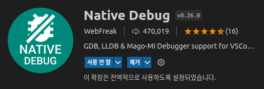

# gdb

### 연습

#### hello.c
```
#include <stdio.h>
int main (){
	printf("hello world\n");
	return 0;
}
$ gcc -g -pg -o hello hello.c 

$ gdb ./hello
(gdb) b main
Breakpoint 1 at 0x784: file hello.c, line 3.
(gdb) l
1	#include <stdio.h>
2	int main (){
3		printf("hello world\n");
4		return 0;
5	}
6		
(gdb) r
Starting program: /home/jhyunlee/code/c/hello 

```

#### 실행절차

```
#include <stdio.h>
int main(int argc, char *argv[]) {
  int  i,sum=0;
  for (i=0; i<5; i++){
        sum +=i;
        printf("[%d]\n",sum);
  }
  printf("[%d]\n",sum);
}
```
#### 디버그 모드 컴파일 

```
good@code:~/code/t$ gcc -g t.c  -o t
good@code:~/code/t$ gdb t
(gdb) list
1       #include <stdio.h>
2
3       int main(int argc, char *argv[]) {
4         int  i,sum=0;
5         for (i=0; i<5; i++){
6               sum +=i;
7               printf("[%d]\n",sum);
8               }
9         printf("[%d]\n",sum);
10      }
(gdb)
```
#### break/run

```
(gdb) b 4
Breakpoint 1 at 0x115c: file t.c, line 4.
(gdb) run
Starting program: /home/good/code/t/t

Breakpoint 1, main (argc=1, argv=0x7fffffffe4b8) at t.c:4
4         int  i,sum=0;
```
#### step, next

* step은 sub루팅이 있으면 그 안으로 들어간다. 
* next는 sub루틴을 호출하면서 다음으로 진행한다
```
(gdb) s
5         for (i=0; i<5; i++){
(gdb) s
6               sum +=i;
(gdb) s
7               printf("[%d]\n",sum);
(gdb) s
__printf (format=0x555555556004 "[%d]\n") at printf.c:28
28      printf.c: 그런 파일이나 디렉터리가 없습니다.
(gdb) list
23      in printf.c
(gdb) n
[1]
5         for (i=0; i<5; i++){
(gdb) n
6               sum +=i;
(gdb) n
7               printf("[%d]\n",sum);
(gdb) p sum
$6 = 3
(gdb) p i
$7 = 2
```
#### info

```
(gdb) info locals //local 변수들 
i = 2
sum = 3

(gdb) info stack  //stack 
#0  main (argc=1, argv=0x7fffffffe4b8) at t.c:5

(gdb) info registers
rax            0x4                 4
rbx            0x5555555551b0      93824992235952
rcx            0x0                 0
rdx            0x0                 0
rsi            0x5555555592a0      93824992252576
rdi            0x7ffff7faf4c0      140737353807040
rbp            0x7fffffffe3c0      0x7fffffffe3c0
rsp            0x7fffffffe3a0      0x7fffffffe3a0
r8             0x0                 0
r9             0x4                 4
r10            0x555555556007      93824992239623
r11            0x246               582
r12            0x555555555060      93824992235616
r13            0x7fffffffe4b0      140737488348336
r14            0x0                 0
r15            0x0                 0
rip            0x555555555188      0x555555555188 <main+63>
eflags         0x202               [ IF ]
cs             0x33                51
ss             0x2b                43
ds             0x0                 0
es             0x0                 0
fs             0x0                 0
gs             0x0                 0
```

* info proc

```
(gdb) i proc
process 23483
cmdline = '/home/jhyunlee/code/c/hello'
cwd = '/home/jhyunlee/code/c'
exe = '/home/jhyunlee/code/c/hello'
```


* info frame

```
(gdb) i proc
process 23483
cmdline = '/home/jhyunlee/code/c/hello'
cwd = '/home/jhyunlee/code/c'
exe = '/home/jhyunlee/code/c/hello'
```

* stack 정보

```
(gdb) x/10x 0x7fffffffde30
0x7fffffffde30:	0x00000008	0x00000002	0xffffdf18	0x00007fff
0x7fffffffde40:	0xf7fa8618	0x00000001	0x55555209	0x00005555
0x7fffffffde50:	0x55555260	0x00005555
```


## xv6에서 gdb 사용

 We provide a file called `.gdbinit` which automatically sets up GDB for use with QEMU.
- Must run GDB from the lab or xv6 directory
- Edit ~/.gdbinit to allow other gdbinits

Use make to start QEMU with or without GDB.
- With GDB: run make qemu[-nox]-gdb, then start GDB in a second shell
- Use make qemu[-nox] when you don’t need GDB
- to exit consol `ctl-a,x`

#### gdb command
Run help <command-name> if you’re not sure how to use a command.
- All commands may be abbreviated(축약) if unambiguous:
  * c = co = cont = continue
- Some additional abbreviations are defined, e.g.
  * s = step and si = stepi


#### stepping
* step runs one line of code at a time. When there is a function call, it steps into the called function.
* next does the same thing, except that it steps over function calls.
* stepi and nexti : do the same thing for assembly instructions rather than lines of code.

* All take a numerical argument to specify repetition.
* Pressing the enter key repeats the previous command.

#### run
* continue runs code until a breakpoint is encountered or you interrupt it with Control-C.
* finish runs code until the current function returns
* advance <location> runs code until the instruction  pointer gets to the specified location.


#### break points 

* break <location> sets a breakpoint at the specified location.
* Locations can be memory addresses (“*0x7c00”) or names (“mon backtrace”, “monitor.c:71”).
* Modify breakpoints using delete, disable, enable.

```sh
(gdb) info break
No breakpoints or watchpoints.
(gdb) b main
Breakpoint 4 at 0x801039da: file main.c, line 18.
(gdb) info break
Num     Type           Disp Enb Address    What
4       breakpoint     keep y   0x801039da in main at main.c:18
(gdb) delete 4
(gdb) info break
No breakpoints or watchpoints.
(gdb)
```


#### Conditional breakpoints 

* break <location> if <condition> sets a breakpoint at the specified location, but only breaks if the condition is satisfied.

* cond <number> <condition> adds a condition on an existing breakpoint.

#### watch points 

* Like breakpoints, but with more complicated conditions.
* watch <expression> will stop execution whenever the expression’s value changes.
* watch -l <address> will stop execution whenever  the contents of the specified memory address change.
* What’s the difference between wa var and wa -l &var?
* rwatch [-l] <expression> will stop execution whenever the value of the expression is read.

* `info registers`: prints the value of every register.
* `info frame` :  prints the current stack frame
* `list <location>` :  prints the source code of the function
at the specified location.


#### Examining 

* x prints the raw contents of memory in whatever format you specify (x/x for hexadecimal, x/i for assembly, etc).
* print evaluates a C expression and prints the result as its proper type. It is often more useful than x.
* The output from p *((struct elfhdr *) 0x10000) is much nicer than the output from x/13x 0x10000.
* backtrace might be useful as you work on lab 1!

#### Layout
* GDB has a text user interface that shows useful information like code listing, disassembly, and register
contents in a curses UI.
* layout <name> switches to the given layout.

#### Other tricks 
* You can use the set command to change the value of a variable during execution.
* You have to switch symbol files to get function and variable names for environments other than the kernel.
* For example, when debugging JOS:
  - symbol-file obj/user/<name>
  - symbol-file obj/kern/kernel


### homework solution

```
From bootasm.S:
# Set up the stack pointer and call into C.
movl $start, %esp
call bootmain

# Set up the stack pointer and call into C.
movl $start, %esp
call bootmain
Later, in bootmain():

// Call the entry point from the ELF header.
// Does not return!
entry = (void(*)(void))(elf->entry);
entry();

````

* call bootmain pushes a return address
* The prologue in bootmain() makes a stack frame

````
push %ebp
mov %esp,%ebp
push %edi
push %esi
push %ebx
sub $0x1c,%esp
````

call bootmain pushes a return address
The prologue in bootmain() makes a stack frame

```
push %ebp
mov %esp,%ebp
push %edi
push %esi
push %ebx
sub $0x1c,%esp
```

The call to entry() pushes a return address


## xv6 debug

* change compile option
* remove -O3 compile option

```
$gcc -g -O0  
```

### debug consol

````
gdb> print ptable

gdb> print *curproc
$14 = {sz = 12288
, pgdir = 0x8dfc6000
, kstack = 0x8dee3000 ""
, state = RUNNING
, pid = 5
, parent = 0x80113e50 <ptable+176>
, tf = 0x8dee3fb4
, context = 0x8dee3e10
, chan = 0x0
, killed = 0
, ofile = {0x80111074 <ftable+52>
2
, 0x80111074 <ftable+52>
, 0x0
 <repeats 13 times>}
, cwd = 0x80111a94 <icache+52>
, name = "date", '\000' <repeats 11 times>
}

gdb> print *curproc->tf
$17 = {edi = 0
, esi = 0
, ebp = 12248
, oesp = 2381201364
, ebx = 0
, edx = 49068
, ecx = 12264
, eax = 23
, gs = 0
, padding1 = 0
, fs = 0
, padding2 = 0
, es = 35
, padding3 = 0
, ds = 35
, padding4 = 0
, trapno = 64
, err = 0
, eip = 880
, cs = 27
, padding5 = 0
, eflags = 530
, esp = 12172
, ss = 35
, padding6 = 0
}
````

### command 정리

* help	List gdb command topics.
* help topic-classes	List gdb command within class.
* help command	Command description.
* info args
* i args	List program command line arguments
* info breakpoints	List breakpoints
* info break	List breakpoint numbers.
* info break breakpoint-number	List info about specific breakpoint.
* info watchpoints	List breakpoints
* info registers	List registers in use
* info threads	List threads in use
* info set	List set-able option
* list list source code
* list function
* list 10,20  
* stepi si
* nexti ni
* x 0xaddress    examine the contens of memory
* x/nfu Oxaddress n: number , f:format, u:unit
* x/4dw   var 
* x/100xw var  //100: number item, x:hex ,w:word

```
gdb> x 0x80113dd4
0x80113dd4 <ptable+52>:	0x00001000

gdb> x/10  0x80113dd4
0x80113dd4 <ptable+52>:	0x00001000	0x8dffe000	0x8dfff000	0x00000004
0x80113de4 <ptable+68>:	0x00000001	0x00000000	0x8dffffb4	0x8dfffe70
0x80113df4 <ptable+84>:	0x00000000	0x00000000
```

* print p
* p var-naem 
* p/x variable   hex
* p/d variable   signed integer
* p/u variable   un-signed integet
* p/c variable   print char
* p/a variable   print address
* x/w , x/4b

#### var & address

```
gdb> p *curproc
$2 = {sz = 4096
, pgdir = 0x8dffe000
, kstack = 0x8dfff000 ""
, state = RUNNING
, pid = 1
, parent = 0x0
, tf = 0x8dffffb4
, context = 0x8dfffd74
, chan = 0x0
, killed = 0
, ofile = {0x0
 <repeats 16 times>}
, cwd = 0x80111a94 <icache+52>
, name = "initcode\000\000\000\000\000\000\000"
}

gdb> x/20xw 0x80113dd4
0x80113dd4 <ptable+52>:	0x00001000	0x8dffe000	0x8dfff000	0x00000004
0x80113de4 <ptable+68>:	0x00000001	0x00000000	0x8dffffb4	0x8dfffd74
0x80113df4 <ptable+84>:	0x00000000	0x00000000	0x00000000	0x00000000
0x80113e04 <ptable+100>:	0x00000000	0x00000000	0x00000000	0x00000000
0x80113e14 <ptable+116>:	0x00000000	0x00000000	0x00000000	0x00000000
```

#### get ptable.proc

```
gdb> print  ptable.proc
$4 = {{sz = 4096
, pgdir = 0x8dffe000
, kstack = 0x8dfff000 ""
, state = RUNNING
, pid = 1
, parent = 0x0
, tf = 0x8dffffb4
, context = 0x8dfffd74
, chan = 0x0
, killed = 0
, ofile = {0x0
 <repeats 16 times>}
, cwd = 0x80111a94 <icache+52>
, name = "initcode\000\000\000\000\000\000\000"
}
```

#### ptable.proc[0].tf 

```
gdb> p  *ptable.proc[0].tf
$8 = {edi = 0
, esi = 0
, ebp = 0
, oesp = 2382364628
, ebx = 0
, edx = 0
, ecx = 0
, eax = 7
, gs = 0
, padding1 = 0
, fs = 0
, padding2 = 0
, es = 35
, padding3 = 0
, ds = 35
, padding4 = 0
, trapno = 64
, err = 0
, eip = 19
, cs = 27
, padding5 = 0
, eflags = 514
, esp = 4084
, ss = 35
, padding6 = 0
}
```


## gdb tutorials

http://www.yolinux.com/TUTORIALS/GDB-Commands.html

#### Start gdb

- `gdb *name-of-executable*`

- `gdb -e *name-of-executable* -c *name-of-core-file*`

- gdb *name-of-executable* --pid=*process-id*

  `$ ps -auxw`

  `$ ps ef -o pid,ppid,vsz,rss`

  ```
  [prompt]$ ps -auxw | grep myapp
  user1     2812  0.7  2.0 1009328 164768 ?      Sl   Jun07   1:18 /opt/bin/myapp
  [prompt]$ gdb /opt/bin/myapp 2812
  OR
  [prompt]$ gdb /opt/bin/myapp --pid=2812
  ```

#### Command line options

| Option                                            | Description                                                  |
| :------------------------------------------------ | :----------------------------------------------------------- |
| --help -h                                         | List command line arguments                                  |
| --exec=*file-name* -e *file-name*                 | Identify executable associated with core file.               |
| --core=*name-of-core-file* -c *name-of-core-file* | Specify core file.                                           |
| --command=*command-file* -x *command-file*        | File listing GDB commands to perform. Good for automating set-up. |
| --directory=*directory* -d *directory*            | Add directory to the path to search for source files.        |
| --cd=*directory*                                  | Run GDB using specified directory as the current working directory. |
| --nx -n                                           | Do not execute commands from `~/.gdbinit` initialization file. Default is to look at this file and execute the list of commands. |
| --batch -x *command-file*                         | Run in batch (not interactive) mode. Execute commands from file. Requires `-x` option. |
| --symbols=*file-name* -s *file-name*              | Read symbol table from file file.                            |
| --se=*file-name*                                  | Use FILE as symbol file and executable file.                 |
| --write                                           | Enable writing into executable and core files.               |
| --quiet -q                                        | Do not print the introductory and copyright messages.        |
| --tty=*device*                                    | Specify *device* for running program's standard input and output. |
| --tui                                             | Use a terminal user interface. Console curses based GUI interface for GDB. Generates a source and debug console area. |
| --pid=*process-id* -p *process-id*                | Specify process ID number to attach to.                      |
| --version                                         | Print version information and then exit.                     |


#### gdb command within gdb

| Command                        | Description                                                  |
| :----------------------------- | :----------------------------------------------------------- |
| help                           | List gdb command topics.                                     |
| help *topic-classes*           | List gdb command within class.                               |
| help *command*                 | Command description. eg `help show` to list the show commands |
| apropos *search-word*          | Search for commands and command topics containing *search-word*. |
| info args i args               | List program command line arguments                          |
| info breakpoints               | List breakpoints                                             |
| info break                     | List breakpoint numbers.                                     |
| info break *breakpoint-number* | List info about specific breakpoint.                         |
| info watchpoints               | List breakpoints                                             |
| info registers                 | List registers in use                                        |
| info threads                   | List threads in use                                          |
| info set                       | List set-able option                                         |

####  break and watch 

| Break and Watch                                              |                                                              |
| :----------------------------------------------------------- | :----------------------------------------------------------- |
| break *funtion-name* break *line-number* `break *ClassName::functionName*` | Suspend program at specified function of line number.        |
| break +*offset* break -*offset*                              | Set a breakpoint specified number of lines forward or back from the position at which execution stopped. |
| break *filename:function*                                    | Don't specify path, just the file name and function name.    |
| break *filename:line-number*                                 | Don't specify path, just the file name and line number. `break *Directory/Path/filename*.cpp:62` |
| break **address*                                             | Suspend processing at an instruction address. Used when you do not have source. |
| break *line-number* if *condition*                           | Where condition is an expression. i.e. `x > 5` Suspend when boolean expression is true. |
| break *line* thread *thread-number*                          | Break in thread at specified line number. Use `info threads` to display thread numbers. |
| tbreak                                                       | Temporary break. Break once only. Break is then removed. See "break" above for options. |
| watch *condition*                                            | Suspend processing when condition is met. i.e. `x > 5`       |
| clear clear *function* clear *line-number*                   | Delete breakpoints as identified by command option. Delete all breakpoints in *function* Delete breakpoints at a given line |
| delete d                                                     | Delete all breakpoints, watchpoints, or catchpoints.         |
| delete *breakpoint-number* delete *range*                    | Delete the breakpoints, watchpoints, or catchpoints of the breakpoint ranges specified as arguments. |
| disable *breakpoint-number-or-range* enable *breakpoint-number-or-range* | Does not delete breakpoints. Just enables/disables them. Example: Show breakpoints: `info break` Disable: `disable 2-9` |
| enable *breakpoint-number* once                              | Enables once                                                 |
| continue c                                                   | Continue executing until next break point/watchpoint.        |
| continue *number*                                            | Continue but ignore current breakpoint *number* times. Usefull for breakpoints within a loop. |
| finish                                                       | Continue to end of function.                                 |

#### line execution

| Line Execution                                         |                                                              |
| :----------------------------------------------------- | :----------------------------------------------------------- |
| step s step *number-of-steps-to-perform*               | Step to next line of code. Will step into a function.        |
| next n next *number*                                   | Execute next line of code. Will not enter functions.         |
| until until *line-number*                              | Continue processing until you reach a specified line number. Also: function name, address, filename:function or filename:line-number. |
| info signals info handle handle *SIGNAL-NAME* *option* | Perform the following option when signal recieved: nostop, stop, print, noprint, pass/noignore or nopass/ignore |
| where                                                  | Shows current line number and which function you are in.     |

#### stack

| Stack                                                        |                                                              |
| :----------------------------------------------------------- | :----------------------------------------------------------- |
| backtrace bt bt *inner-function-nesting-depth* bt -*outer-function-nesting-depth* | Show trace of where you are currently. Which functions you are in. Prints stack backtrace. |
| backtrace full                                               | Print values of local variables.                             |
| frame frame *number* f *number*                              | Show current stack frame (function where you are stopped) Select frame number. (can also user up/down to navigate frames) |
| up down up *number* down *number*                            | Move up a single frame (element in the call stack) Move down a single frame Move up/down the specified number of frames in the stack. |
| info frame                                                   | List address, language, address of arguments/local variables and which registers were saved in frame. |
| info args <br />info locals<br />info catch                  | Info arguments of selected frame, local variables and exception handlers. |

#### source code

| Source Code                                                  |                                                       |
| :----------------------------------------------------------- | :---------------------------------------------------- |
| list l list *line-number* list *function* list - list *start#,end#* list *filename:function* | List source code.                                     |
| set listsize *count* show listsize                           | Number of lines listed when `list command given.`     |
| directory *directory-name* dir *directory-name* show directories | Add specified directory to front of source code path. |
| directory                                                    | Clear sourcepath when nothing specified.              |

#### Machine language

| Machine Language                |                                                              |
| :------------------------------ | :----------------------------------------------------------- |
| info line info line *number*    | Displays the start and end position in object code for the current line in source. Display position in object code for a specified line in source. |
| disassemble *0xstart 0xend*     | Displays machine code for positions in object code specified (can use start and end hex memory values given by the `info line` command. |
| stepi si nexti ni               | step/next assembly/processor instruction.                    |
| x *0xaddress* x/nfu *0xaddress* | Examine the contents of memory. Examine the contents of memory and specify formatting.n: number of display items to printf: specify the format for the outputu: specify the size of the data unit (eg. byte, word, ...)Example: `x/4dw var` |

#### Examine variables

| Examine Variables                                            |                                                              |
| :----------------------------------------------------------- | :----------------------------------------------------------- |
| print *variable-name* p *variable-name* p *file-name::variable-name* p '*file-name*'::*variable-name* | Print value stored in variable.                              |
| p **array-variable*@*length*                                 | Print first # values of array specified by *length*. Good for pointers to dynamicaly allocated memory. |
| p/x *variable*                                               | Print as integer variable in hex.                            |
| p/d *variable*                                               | Print variable as a signed integer.                          |
| p/u *variable*                                               | Print variable as a un-signed integer.                       |
| p/o *variable*                                               | Print variable as a octal.                                   |
| p/t *variable* x/b *address* x/b &*variable*                 | Print as integer value in binary. (1 byte/8bits)             |
| p/c *variable*                                               | Print integer as character.                                  |
| p/f *variable*                                               | Print variable as floating point number.                     |
| p/a *variable*                                               | Print as a hex address.                                      |
| x/w *address* x/4b &*variable*                               | Print binary representation of 4 bytes (1 32 bit word) of memory pointed to by address. |
| ptype *variable* ptype *data-type*                           | Prints type definition of the variable or declared variable type. Helpful for viewing class or struct definitions while debugging. |

#### gdb mode

| GDB Modes                                                    |                                                              |
| :----------------------------------------------------------- | :----------------------------------------------------------- |
| set *gdb-option* *value*                                     | Set a GDB option                                             |
| set logging on set logging off show logging set logging file *log-file* | Turn on/off logging. Default name of file is `gdb.txt`       |
| set print array on set print array off show print array      | Default is off. Convient readable format for arrays turned on/off. |
| set print array-indexes on set print array-indexes off show print array-indexes | Default off. Print index of array elements.                  |
| set print pretty on set print pretty off show print pretty   | Format printing of C structures.                             |
| set print union on set print union off show print union      | Default is on. Print C unions.                               |
| set print demangle on set print demangle off show print demangle | Default on. Controls printing of C++ names.                  |

#### start and stop

| Start and Stop                                               |                                                              |
| :----------------------------------------------------------- | :----------------------------------------------------------- |
| run r run *command-line-arguments* run < *infile* > *outfile* | Start program execution from the beginning of the program. The command `break main` will get you started. Also allows basic I/O redirection. |
| continue c                                                   | Continue execution to next break point.                      |
| kill                                                         | Stop program execution.                                      |
| quit q                                                       | Exit GDB debugger.                                           |


## gdb 연습


#### hello.c

```c
$ cat hello.c
#include<stdio.h>
#include<malloc.h>
int a;
int main(){
    int i=0;
    char *str;
    for (i=0; i<10; ++i){
        str = (char *) malloc(sizeof(char)*10+1);
        printf("hello worldi[%d]\n",i);
    }
    return 0;
}
```

* break point 
* 소스 list

```
$ gdb ./hello
(gdb) b main
Breakpoint 1 at 0x1209: file hello.c, line 4.
(gdb) l
1	#include<stdio.h>
2	#include<malloc.h>
3	int a;
4	int main(){
5	    int i=0;
6	    char *str;
7	    for (i=0; i<10; ++i){
8	        str = (char *) malloc(sizeof(char)*10+1);
9	        printf("hello worldi[%d]\n",i);
10	    }
(gdb) r
Starting program: /home/jhyunlee/code/c/hello 

```

* break

```c
(gdb) i locals
i = 0
str = 0x5555555599b0 ""
(gdb) bt
#0  main () at hello.c:7
(gdb) bt full
#0  main () at hello.c:7
        i = 0
        str = 0x5555555599b0 ""
(gdb)
```

* info all

```c
(gdb) set print pretty on
(gdb) i all
rax            0x10                16
rbx            0x555555555260      93824992236128
rcx            0x0                 0
rdx            0x0                 0
rsi            0x5555555599d0      93824992254416
rdi            0x7ffff7fae4c0      140737353802944
rbp            0x7fffffffde20      0x7fffffffde20
rsp            0x7fffffffde10      0x7fffffffde10
r8             0x0                 0
r9             0x10                16
r10            0x555555556013      93824992239635
r11            0x246               582
r12            0x5555555550c0      93824992235712
r13            0x7fffffffdf10      140737488346896
r14            0x0                 0
r15            0x0                 0
rip            0x55555555524f      0x55555555524f <main+70>
eflags         0x202               [ IF ]
cs             0x33                51
ss             0x2b                43
ds             0x0                 0
es             0x0                 0
fs             0x0                 0
gs             0x0                 0
st0            0                   (raw 0x00000000000000000000)
st1            0                   (raw 0x00000000000000000000)
st2            0                   (raw 0x00000000000000000000)
st3            0                   (raw 0x00000000000000000000)
st4            0                   (raw 0x00000000000000000000)
st5            0                   (raw 0x00000000000000000000)
st6            0                   (raw 0x00000000000000000000)
st7            0                   (raw 0x00000000000000000000)
fctrl          0x37f               895
fstat          0x0                 0
ftag           0xffff              65535
fiseg          0x0                 0
fioff          0x0                 0
foseg          0x0                 0
fooff          0x0                 0
fop            0x0                 0
mxcsr          0x1fa0              [ PE IM DM ZM OM UM PM ]
(gdb)
```

* info frame : 중단점에서 정보 상세하기 

```c
(gdb) info frame
Stack level 0, frame at 0x7fffffffde30:
 rip = 0x55555555524f in main (hello.c:7); saved rip = 0x7ffff7de70b3
 source language c.
 Arglist at 0x7fffffffde08, args: 
 Locals at 0x7fffffffde08, Previous frame's sp is 0x7fffffffde30
 Saved registers:
  rbp at 0x7fffffffde20, rip at 0x7fffffffde28

```

x/o : octal

x/x : hex

x/d : decimal

x/u : unsigned decimal

x/t : binary

x/ f : float

x/a : address

x/i : instruction

x/c : char

x/s : string

x/z : hex, zero padded on the left

```
(gdb) x/10 0x55555555524f
0x55555555524f <main+70>:	32785795	167017859	12112510	-922746880
0x55555555525f <main+86>:	504361923	1280786938	724254093	1447100416
0x55555555526f <__libc_csu_init+15>:	1104578889	-175552171
(gdb) x/8x 0x55555555524f
0x55555555524f <main+70>:	0x01f44583	0x09f47d83	0x00b8d27e	0xc9000000
0x55555555525f <main+86>:	0x1e0ff3c3	0x4c5741fa	0x2b2b3d8d	0x56410000
(gdb) x/8x  0x7fffffffde30
0x7fffffffde30:	0x00000008	0x00000002	0xffffdf18	0x00007fff
0x7fffffffde40:	0xf7fa8618	0x00000001	0x55555209	0x00005555
```


* info files

```
(gdb) i proc
process 23483
cmdline = '/home/jhyunlee/code/c/hello'
cwd = '/home/jhyunlee/code/c'
exe = '/home/jhyunlee/code/c/hello'


(gdb) info frame
Stack level 0, frame at 0x7fffffffde30:
 rip = 0x55555555524f in main (hello.c:7); saved rip = 0x7ffff7de70b3
 source language c.
 Arglist at 0x7fffffffde08, args: 
 Locals at 0x7fffffffde08, Previous frame's sp is 0x7fffffffde30
 Saved registers:
  rbp at 0x7fffffffde20, rip at 0x7fffffffde28
  
  
(gdb) x/10x 0x7fffffffde30
0x7fffffffde30:	0x00000008	0x00000002	0xffffdf18	0x00007fff
0x7fffffffde40:	0xf7fa8618	0x00000001	0x55555209	0x00005555
0x7fffffffde50:	0x55555260	0x00005555


(gdb) i files
Symbols from "/home/jhyunlee/code/c/hello".
Native process:
	Using the running image of child process 23483.
	While running this, GDB does not access memory from...
Local exec file:
	`/home/jhyunlee/code/c/hello', file type elf64-x86-64.
	Entry point: 0x5555555550c0
	0x0000555555554318 - 0x0000555555554334 is .interp
	0x0000555555554338 - 0x0000555555554358 is .note.gnu.property
	0x0000555555554358 - 0x000055555555437c is .note.gnu.build-id
	0x000055555555437c - 0x000055555555439c is .note.ABI-tag
	0x00005555555543a0 - 0x00005555555543c4 is .gnu.hash
	0x00005555555543c8 - 0x00005555555544d0 is .dynsym
	0x00005555555544d0 - 0x0000555555554577 is .dynstr
	0x0000555555554578 - 0x000055555555458e is .gnu.version
	0x0000555555554590 - 0x00005555555545b0 is .gnu.version_r
	0x00005555555545b0 - 0x0000555555554688 is .rela.dyn
	0x0000555555554688 - 0x00005555555546e8 is .rela.plt
	0x0000555555555000 - 0x000055555555501b is .init
	0x0000555555555020 - 0x0000555555555070 is .plt
	0x0000555555555070 - 0x0000555555555080 is .plt.got
	0x0000555555555080 - 0x00005555555550c0 is .plt.sec
	0x00005555555550c0 - 0x00005555555552f2 is .text
	0x00005555555552f4 - 0x0000555555555301 is .fini
	0x0000555555556000 - 0x0000555555556016 is .rodata
	0x0000555555556018 - 0x0000555555556074 is .eh_frame_hdr
	0x0000555555556078 - 0x00005555555561c0 is .eh_frame
	0x0000555555557d98 - 0x0000555555557da0 is .init_array
	0x0000555555557da0 - 0x0000555555557da8 is .fini_array
	0x0000555555557da8 - 0x0000555555557f98 is .dynamic
	0x0000555555557f98 - 0x0000555555558000 is .got
	0x0000555555558000 - 0x0000555555558010 is .data
	0x0000555555558010 - 0x0000555555558020 is .bss
	0x00007ffff7fcf2a8 - 0x00007ffff7fcf2c8 is .note.gnu.property in /lib64/ld-linux-x86
	0x00007ffff7fcf2c8 - 0x00007ffff7fcf2ec is .note.gnu.build-id in /lib64/ld-linux-x86
	0x00007ffff7fcf2f0 - 0x00007ffff7fcf3c4 is .hash in /lib64/ld-linux-x86-64.so.2
	0x00007ffff7fcf3c8 - 0x00007ffff7fcf4c0 is .gnu.hash in /lib64/ld-linux-x86-64.so.2
	0x00007ffff7fcf4c0 - 0x00007ffff7fcf7f0 is .dynsym in /lib64/ld-linux-x86-64.so.2
	0x00007ffff7fcf7f0 - 0x00007ffff7fcfa14 is .dynstr in /lib64/ld-linux-x86-64.so.2
	0x00007ffff7fcfa14 - 0x00007ffff7fcfa58 is .gnu.version in /lib64/ld-linux-x86
    0x00007ffff7fcfa58 - 0x00007ffff7fcfafc is .gnu.version_d in /lib64/ld-linux-x86
	0x00007ffff7fcfb00 - 0x00007ffff7fcff20 is .rela.dyn in /lib64/ld-linux-x86-64.so.2
	0x00007ffff7fcff20 - 0x00007ffff7fcffc8 is .rela.plt in /lib64/ld-linux-x86-64.so.2
	0x00007ffff7fd0000 - 0x00007ffff7fd0080 is .plt in /lib64/ld-linux-x86-64.so.2
	0x00007ffff7fd0080 - 0x00007ffff7fd0090 is .plt.got in /lib64/ld-linux-x86-64.so.2
	0x00007ffff7fd0090 - 0x00007ffff7fd0100 is .plt.sec in /lib64/ld-linux-x86-64.so.2
	0x00007ffff7fd0100 - 0x00007ffff7ff2674 is .text in /lib64/ld-linux-x86-64.so.2
	0x00007ffff7ff3000 - 0x00007ffff7ff7dbb is .rodata in /lib64/ld-linux-x86-64.so.2
	0x00007ffff7ff7dbb - 0x00007ffff7ff7dbc is .stapsdt.base in /lib64/ld-linux-x8
	0x00007ffff7ff7dbc - 0x00007ffff7ff84e0 is .eh_frame_hdr in /lib64/ld-linux-x86
```


```
cat /proc/23483/maps
$ cat maps
555555554000-555555555000 r--p 00000000 08:05 1061550  /home/jhyunlee/code/c/hello
555555555000-555555556000 r-xp 00001000 08:05 1061550  /home/jhyunlee/code/c/hello
555555556000-555555557000 r--p 00002000 08:05 1061550  /home/jhyunlee/code/c/hello
555555557000-555555558000 r--p 00002000 08:05 1061550  /home/jhyunlee/code/c/hello
555555558000-555555559000 rw-p 00003000 08:05 1061550  /home/jhyunlee/code/c/hello
555555559000-55555557a000 rw-p 00000000 00:00 0        [heap]
7ffff7dc0000-7ffff7de5000 r--p 00000000 08:05 1320199  /usr/lib/x86_64-linux-gnu/libc
7ffff7de5000-7ffff7f5d000 r-xp 00025000 08:05 1320199  /usr/lib/x86_64-linux-gnu/libc
7ffff7f5d000-7ffff7fa7000 r--p 0019d000 08:05 1320199  /usr/lib/x86_64-linux-gnu/libc
7ffff7fa7000-7ffff7fa8000 ---p 001e7000 08:05 1320199  /usr/lib/x86_64-linux-gnu/libc
7ffff7fa8000-7ffff7fab000 r--p 001e7000 08:05 1320199  /usr/lib/x86_64-linux-gnu/libc
7ffff7fab000-7ffff7fae000 rw-p 001ea000 08:05 1320199  /usr/lib/x86_64-linux-gnu/libc
7ffff7fae000-7ffff7fb4000 rw-p 00000000 00:00 0 
7ffff7fc9000-7ffff7fcd000 r--p 00000000 00:00 0        [vvar]
7ffff7fcd000-7ffff7fcf000 r-xp 00000000 00:00 0        [vdso]
7ffff7fcf000-7ffff7fd0000 r--p 00000000 08:05 1319981  /usr/lib/x86_64-linux-gnu/ld
7ffff7fd0000-7ffff7ff3000 r-xp 00001000 08:05 1319981  /usr/lib/x86_64-linux-gnu/ld
7ffff7ff3000-7ffff7ffb000 r--p 00024000 08:05 1319981  /usr/lib/x86_64-linux-gnu/ld
7ffff7ffc000-7ffff7ffd000 r--p 0002c000 08:05 1319981  /usr/lib/x86_64-linux-gnu/ld
7ffff7ffd000-7ffff7ffe000 rw-p 0002d000 08:05 1319981  /usr/lib/x86_64-linux-gnu/ld
7ffff7ffe000-7ffff7fff000 rw-p 00000000 00:00 0 
7ffffffde000-7ffffffff000 rw-p 00000000 00:00 0                          [stack]
ffffffffff600000-ffffffffff601000 --xp 00000000 00:00 0                  [vsyscall]

```


* disas main

```asm
(gdb) disas main
Dump of assembler code for function main:
   0x0000000000000a69 <+0>:	push   %rbp
   0x0000000000000a6a <+1>:	mov    %rsp,%rbp
   0x0000000000000a6d <+4>:	sub    $0x10,%rsp
   0x0000000000000a71 <+8>:	callq  *0x201571(%rip)        # 0x201fe8
   0x0000000000000a77 <+14>:	lea    0x2015b2(%rip),%rdx        # 0x202030 <k>
   0x0000000000000a7e <+21>:	lea    0x201597(%rip),%rsi        # 0x20201c <n>
   0x0000000000000a85 <+28>:	lea    0x11c(%rip),%rdi        # 0xba8
   0x0000000000000a8c <+35>:	mov    $0x0,%eax
   0x0000000000000a91 <+40>:	callq  0x730 <__isoc99_scanf@plt>
   0x0000000000000a96 <+45>:	movl   $0x1,-0x8(%rbp)
   0x0000000000000a9d <+52>:	jmp    0xaad <main+68>
   0x0000000000000a9f <+54>:	mov    -0x8(%rbp),%eax
   0x0000000000000aa2 <+57>:	mov    %eax,%edi
   0x0000000000000aa4 <+59>:	callq  0x8ba <add>
   0x0000000000000aa9 <+64>:	addl   $0x1,-0x8(%rbp)
   0x0000000000000aad <+68>:	mov    0x201569(%rip),%eax        # 0x20201c <n>
   0x0000000000000ab3 <+74>:	cmp    %eax,-0x8(%rbp)
   0x0000000000000ab6 <+77>:	jle    0xa9f <main+54>
   0x0000000000000ab8 <+79>:	mov    $0x3c,%edi
   0x0000000000000abd <+84>:	callq  0x6e0 <putchar@plt>
   0x0000000000000ac2 <+89>:	movl   $0x1,-0x4(%rbp)
   0x0000000000000ac9 <+96>:	jmp    0xadc <main+115>
   0x0000000000000acb <+98>:	mov    0x20155f(%rip),%eax        # 0x202030 <k>
   0x0000000000000ad1 <+104>:	mov    %eax,%edi
   0x0000000000000ad3 <+106>:	callq  0x966 <get>
   0x0000000000000ad8 <+111>:	addl   $0x1,-0x4(%rbp)
   0x0000000000000adc <+115>:	mov    0x20153a(%rip),%eax        # 0x20201c <n>
   0x0000000000000ae2 <+121>:	cmp    %eax,-0x4(%rbp)
   0x0000000000000ae5 <+124>:	jle    0xacb <main+98>
   0x0000000000000ae7 <+126>:	mov    $0x3e,%edi
   0x0000000000000aec <+131>:	callq  0x6e0 <putchar@plt>
   0x0000000000000af1 <+136>:	mov    $0x0,%eax
   0x0000000000000af6 <+141>:	leaveq 
   0x0000000000000af7 <+142>:	retq   
End of assembler dump.
(gdb) 
```


#### [참고] 이쁘게 출력하는 방법

다음의 내용을 gdb에서 입력하거나 `~/.gdbinit` 파일에 저장하자.

```
set print pretty on
set print object on
set print static-members on
set print vtbl on
set print demangle on
set demangle-style gnu-v3
set print sevenbit-strings off
```

* display : 반복적으로 출력하게 하려면 next 진행하면서 변수를 반복적으로 출력하려면 `display `
* undisplay : 해제
* print : 변수 출력


## vscode에서 gdb

### 설정

#### vscode 확장 패지키 설치

* Native Debug v0.25.1 WebFreak 460,170 (16)
* GDB, LLDB & Mago-MI Debugger support for VSCode


#### .vscode/launch.json

* xv6 디버깅에 사용한  디버깅용 launch.json

```json
{
    "configurations": [    
        {
            "name": "g++ build and debug active file",
            "type": "cppdbg",
            "request": "launch",
            "program": "${fileDirname}/${fileBasenameNoExtension}",
            "args": ["fs.img","README"],
            "stopAtEntry": false,
            "cwd": "${workspaceFolder}",
            "environment": [],
            "externalConsole": false,
            "MIMode": "gdb",
            "setupCommands": [
              {
                "description": "Enable pretty-printing for gdb",
                "text": "-enable-pretty-printing",
                "ignoreFailures": true
              }
            ],
            "preLaunchTask": "g++ build active file",
            "miDebuggerPath": "/usr/bin/gdb"
          },
        {
            "type": "gdb",
            "request": "attach",
            "name": "Attach to gdbserver",
            "executable": "./kernel",
            "target": ":26000",
            "remote": true,
            "cwd": "${workspaceRoot}",
            "valuesFormatting": "parseText",
            "stopAtEntry": true,
        }
    ]
}
```


#### info

```
info frame
Stack level 0, frame at 0x8010d624:
 eip = 0x80103a04 in main (main.c:20); saved eip = 0x0
 source language c.
 Arglist at 0x8010d61c, args: 
 Locals at 0x8010d61c, Previous frame's sp is 0x8010d624
 Saved registers:
 
 eip at 0x8010d620
x/10x 0x8010d624
0x8010d624 <stack+4084>:	0x8010d634	0x00007bf8	0x00000000	0x00000000
0x8010d634:	0x00000000	0x00000000	0x00000000	0x00000000
0x8010d644 <bcache+4>:	0x00000000	0x00000000

```


#### window에서 gdb 사용하기: 이것은 안된다.

* `C:\mingw64\bin`  mingw64 g++ 컴파일러를 설치하면 gdb가 설치가 되는데... 이것은 vscode와 연동되는 gdb가 아니다. 
* 따라서 vscode에서 gdb를 연동해서 사용하려면 linux 환경에서 vscode를 설치하고 launcher에 구성을 하면된다.
* 이렇게 구성하고 디버깅하려는 파일에서 F5를 누르면 gdb로 자동으로 연결되어 gdb 명령을 사용할 수 있다.

```sh
{
    "configurations": [        
    {
        "type": "gdb",
        "request": "launch",
        "name": "Launch Program",
        "target": "${fileDirname}/${fileBasenameNoExtension}",
        "cwd": "${fileDirname}",
        "valuesFormatting": "parseText"
    }
    ]
}
```

* 별것 아닐 수 있는데... gdb를 좀더 익숙하게 하려면 vscode에서 gdb 연동해서 사용하는 것이 좋을 듯한다. 
* 당연하지만 vscode에서 Native Debug extention을 설치해야 한다. 





* vscode에서 gdb를 사용하려면  linux 환경에서 vscode와 g++, gdb 설치하고 연동하면 쉽게 해결 된다. 
* launcher.json과 task.json에서 build 설정을 하면된다. OK


##### gdb에서  -exec 접두사 이슈

* 문제점 : vscode에서 gdb 사용할때 매번 -exec를 사용해야 한다는 것이다.
* 이것을 어떻게 해결 했는데 그것이 기억 안난다. ㅠㅠ
*  Native Degug  extention을 설치하면 -exec 입력하지 않아도 되는데.. arm-system-gdb 나  gdb-multiarch를 사용할 수 가 없다. 


### gdb 자주 사용하는 명령

* **gdb [실행 파일 이름]** : gdb 실행
* **backtrace** : 현재 실행 중인 함수가 호출된 역순으로 함수들이 열거된다(역추적)
* **frame 2** : n 번 스택으로 프레임 변경
* **list** : 소스의 내용이 출력된다.
* **list [function name]** : 해당 함수 내용 출력
* **list [번호]** : 해당 번호 줄 기본으로 내용 출력
* **set listsize 20** : 한 번에 출력하는 행의 개수 설정
* **info locals** : 현재 상태에서 어떤 지역변수들이 있는지 확인
* **print l-value** : 해당 L-Value의 값 확인
* **printf [Function name]** : 함수의 주소 값 확인
* **break [번호]** : 해당 번호 줄 breakpoint 설정
* **break [Function name]** : 해당 함수 breakpoint 설정
* **info break** : breakpoint 정보 확인
* **clear [번호]** : 해당 번호 줄 breakpoint 삭제
* **clear [Function name]** : 해당 함수 breakpoint 삭제
* **step** : 현재 출력된 행을 수행 후 멈춤, 함수의 경우 함수의 내부로 들어가 수행
* **next** : 현재 출력된 행을 수행 후 멈춤, 함수의 경우 함수를 수행하고 넘어간다
* **return <Value>** : 현재 함수를 수행하지 않고 빠져나감. Value 설정 시, Return Value는 해당 값으로 반환
* **quit, Ctrl + d** : 종료

