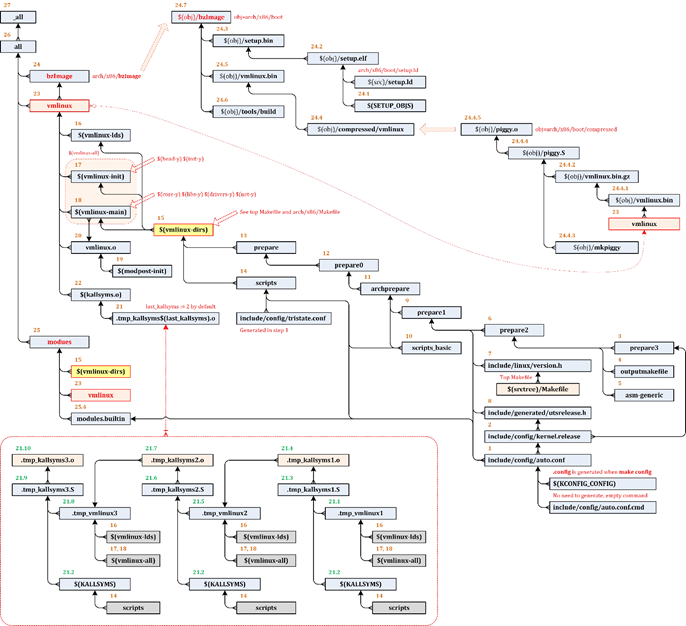
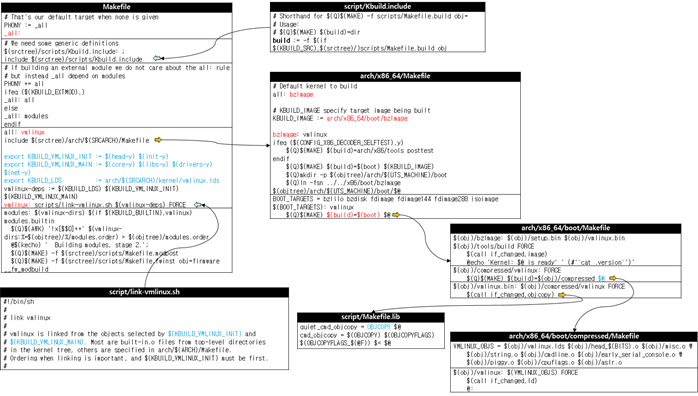

# Makefile

## Macro & Inline funtion

### Macro

#### define

##### #define, #undef

```c
#include <stdio.h>
#define COUNT 10    // 10을 COUNT로 정의
int main()
{
    printf("%d\n", COUNT);    // 10
#undef COUNT        // 앞에서 정의한 COUNT 해제
#define COUNT 20    // 20을 COUNT로 정의
    printf("%d\n", COUNT);    // 20: #undef로 COUNT를 해제한 뒤 20을 COUNT로 정의했으므로 20이 출력됨
    return 0;
}
```

##### #define

```c
#include <stdio.h>
#define PRINT_NUM(x) printf("%d\n", x)    // printf("%d\n", x)를 PRINT_NUM(x)로 정의
int main()
{
    PRINT_NUM(10);    // 10: printf("%d\n", 10)
    PRINT_NUM(20);    // 20: printf("%d\n", 20)
    return 0;
}
```

##### macro multi line

```c
#include <stdio.h>
// printf 세 줄을 PRINT_NUM3으로 정의
#define PRINT_NUM3(x) printf("%d\n", x); \
                      printf("%d\n", x + 1); \
                      printf("%d\n", x + 2);
int main()
{
    PRINT_NUM3(10);
    PRINT_NUM3(20);
    return 0;
}
```

##### swap macron 

```c
#include <stdio.h>
// 매크로 안에서 변수를 선언할 수 있도록 do while 사용
// a와 b의 값을 서로 바꿈
#define SWAP(a, b, type) do { \
    type temp; \
    temp = a;  \
    a = b;     \
    b = temp;  \
} while (0)

int main()
{
    int num1 = 10;
    int num2 = 20;

    SWAP(num1, num2, int);            // 값을 바꿀 자료형으로 int를 지정
    printf("%d %d\n", num1, num2);    // 20 10: 두 변수의 값이 바뀜

    float num3 = 1.5f;
    float num4 = 3.8f;

    SWAP(num3, num4, float);          // 값을 바꿀 자료형으로 float를 지정
    printf("%f %f\n", num3, num4);    // 3.800000 1.500000: 두 변수의 값이 바뀜

    return 0;
}
```


#### 조건부 컴파일 

##### #ifdef

```c
#include <stdio.h>

#define DEBUG    // DEBUG 매크로 정의

int main()
{
#ifdef DEBUG     // DEBUG 매크로가 정의되어 있다면 #ifdef, #endif 사이의 코드를 컴파일
    printf("Debug: %s %s %s %d\n", __DATE__, __TIME__, __FILE__, __LINE__);
#endif
    return 0;
}
```


##### #if  값 조건

```c
#include <stdio.h>

#define DEBUG_LEVEL 2     // 2를 DEBUG_LEVEL로 정의

int main()
{
#if DEBUG_LEVEL >= 2     // DEBUG_LEVEL이 2보다 크거나 같으면 #if, #endif 사이의 코드를 컴파일
    printf("Debug Level 2\n");
#endif

#if 1    // 조건이 항상 참이므로 #if, #endif 사이의 코드를 컴파일
    printf("1\n");
#endif

#if 0    // 조건이 항상 거짓이므로 #if, #endif 사이의 코드를 컴파일하지 않음
    printf("0\n");
#endif
    return 0;
}
```

##### #if () #endif

```c
#include <stdio.h>

#define DEBUG    // DEBUG 매크로 정의
#define TEST     // TEST 매크로 정의

int main()
{
    // DEBUG 또는 TEST가 정의되어 있으면서 VERSION_10이 정의되어 있지 않을 때
#if (defined DEBUG || defined TEST) && !defined (VERSION_10)
    printf("Debug\n");
#endif
    return 0;
}
```

#### compile option

```sh
$ gcc main.c -DDEBUG
$ gcc main.c -DDEBUG_LEVEL=2
```

##### #if  #ifdef  #endif

```c
#define DEBUG 1  // 코드에서 디버그 코드 제어
#if DEBUG
    printf("Debug message\n");
#endif

#ifdef DEBUG     // 코드에 DEBUG 매크로를 정의하거나 컴파일 옵션에서 DEBUG 매크로 설정
    printf("Debug message\n");
#endif

// 코드에서 2를 DEBUG_LEVEL 정의하거나 컴파일 옵션에서 DEBUG_LEVEL에 2를 설정
#ifdef DEBUG_LEVEL >= 2
    printf("Debug Level 2\n");
#endif
```


##### #ifdef #elif defined #else #endif

```c
#include <stdio.h>

#define USB    // USB 매크로 정의

int main()
{
#ifdef PS2              // PS2가 정의되어 있을 때 코드를 컴파일
    printf("PS2\n");
#elif defined USB       // PS2가 정의되어 있지 않고, USB가 정의되어 있을 때 코드를 컴파일
    printf("USB\n");
#else                   // PS2와 USB가 정의되어 있지 않을 때 코드를 컴파일
    printf("지원하지 않는 장치입니다.\n");
#endif

    return 0;
}
```


### Macro 함수와 inline 함수

#### Macro 함수

It is also called **preprocessors directive**. The macros are defined by the **#define** keyword. Before the program compilation, the preprocessor examines the program whenever the preprocessor detects the macros then preprocessor replaces the macro by the macro definition.

매크로함수는 함수와는 약간 다른데, 단순하게 치환만 해주므로 의도하지 않은 결과가 나오는 경우가 있습니다. 오류의 방지를 위해서는 모든 인자를 괄호로 묶어주어야 합니다.

`#define` 선행 처리 지시문에 함수 처럼 동작

일반 함수 처리를 위한 stack 메모리 할당이나 실행 위치 이동, 매개변수 저장, return 값 반환 같은 절차가 필요 없다.

```c
#include <iostream>
#define SQUARE(X) X*X
#define SQUARE2(X) ((X)*(X))
int main() {
    int x = 1;
    std::cout<<SQUARE(x + 5)<<std::endl;
    std::cout<<SQUARE2(x + 5)<<std::endl;
    return 0;
}
```

```
//console출력
11    // 1+5*1+5 = 1 + 5 + 5    // X-->1+5
36    // (1+5)*(1+5) = 6 * 6    //(X)-->(1+5)
```

### 

##### 매크로 함수의 장단점

1. 장점
   1. 인수타입을 신경쓰지 않아도 된다 매크로 함수는 단순히 치환만을 해주기 때문에 인수의 타입을 신경쓰지 않아도 됩니다. 따라서 위의 경우 정수값을 대입했지만 실수값을 대입해도 올바른 연산이 됩니다.
   2. 함수호출에 의한 성능 저하가 없습니다.  이에 대한 내용은 인라인 함수와 함께 알아보겠습니다.
2. 단점
   1. 구현이 어렵다 단순 치환방식이라는 특징 때문에 복잡한 함수의 기능을 하는 매크로함수는 구현이 어렵습니다. 
   2. 가독성이 떨어진다. 모든 인수에 대해서 괄호로 감싸주어야 하기 때문에 읽기가 힘듭니다.


#### Inline 함수 

인라인 함수를 쓰는 가장 큰 이유는 실행속도의 이점 때문입니다. 인라인 함수는 경우에 따라 일반 함수보다 실행속도가 빠른데 이러한 이점은 함수의 호출 방식에 대한 차이 때문입니다. 

일반 함수를 호출하는 경우 메모리에 일반 함수의 코드를 저장하고 함수를 호출했을 때 해당 함수의 주소로 점프하여 해당 함수의 코드를 실행하고 다시 원래 자리로 돌아와야 합니다. 그에 반해 인라인 함수는 함수 호출 코드에 직접 인라인 함수의 코드가 치환되어 실행되기 때문에 주소영역 점프가 필요하지 않아 함수의 실행속도가 더 빠른 것입니다.

인라인 함수는 inline이라는 키워드를 사용해서 선언하면 됩니다. 주의할 점은 클래스의 멤버함수가 인라인 함수를 호출하기 위해서는 인라인 함수의 선언이 헤더파일에 존재해야 합니다.

```c
#include <iostream>

inline int SQUARE(int x){
  return x * x;
}

int main(){
  std::cout<<SQUARE(5)<<std::endl;     // std::cout<<5*5<<std::endl; 처럼 인라인화됨
}
```


```
//console 출력
25
```


### 함수 선언 매크로

| 매크로              | 매크로 내용 (__attribute__)                                  |
| ------------------- | :----------------------------------------------------------- |
| __init              | init.text 섹션에 해당 코드를 배치한다. 컴파일 되면 실행 프로그램은 code, data, stack  segment로 구성되는데 init 섹션에 해당 코드를 배치한다는 의미 |
| __cold              | 호출될 가능성이 희박한 함수를 뜻함.  속도보다 사이즈에 더 최적화를 수행한다.  unlikely()의 사용을 줄일 수 있게 된다.  unlikely() 함수들은 old compiler 호환성을 위해 그냥같이 사용한다.  text 섹션의 한 쪽에  __cold 펑션들을 모아두는 지역성(locality)도 있다. 당연히 이로 인한 cache 효율성도 좋아진다 |
| notrace             | 컴파일러에서 -finstrument-functions 컴파일 옵션을  사용할 때에도 해당 함수에 대한 profiling을 비활성한다. |
| __weak              | 해당 심볼을 weak symbol로 만든다.  링커가 링크를 수행 시 다른곳에 같은 이름으로 만든 strong  symbol이 존재하면 weak symbol 대신  strong symbol을 사용한다. |
| __attribute_const__ | 전달 받은 인수외에 global 변수에 접근할 수 없다.  side effect가 생기지 않는다. |
| __pure              | 전달 받은 인수외에 global 변수로의 access는 읽기만 가능한다.  side effect가 생기지 않는다. |
| __read_monstly      | 읽기 위주의 데이터들만을 위한 섹션으로 캐시 라인 바운싱을 회피하기 위한 솔루션  SMP 머신에서 cache  eviction이 최소화될 수 있는 데이터들끼리 모여있도록 함으로 성능향상을 목표로 하였다. |
| __used              | 해당 객체 또는 함수가 참조되지 않아도 사용하는 것처럼 컴파일러로 하여금 삭제되지 않도록 한다. |
| __visible           | LTO(Link Time Optimization) 기능을 사용하는  경우 caller(호출측)와 callee(피호출측)의 관계에서 링커가 callee가 한 번만 사용된다고 판단되는 경우 caller에 callee를 inline화 하여 집어 넣는다.  externally_visible 속성을 사용하는 경우 LTO 옵션을 사용하여 링크를 하는 경우에도 하나의 완전한 함수나 객체로 외부에 보여질 수 있도록 심볼화하여  해당 함수나 객체가 inline화 되지 않도록 막는다.  -flto 또는  -whole-program을 사용하여 LTO 기능을 동작시킨다. |
| asmlinkage          | 어셈블리 코드에서 C 함수를 호출할 때 함수 인자의 전달을 레지스터가  아닌 스택을 이용하도록 해주는 속성지정 매크로이다.  extern “C”로  정의되어 있다. |


#### volatile

volatile: [valetil] 휘발성의, 불안정한, 휘발하는

gcc compiler는 성능 향상(optimization)을 목적으로 경우에 따라 변수의 사용에 대해 무시하거나 사용 위치를 변경할 수 있는데 volatile을 사용하면 다음의 optimization을 하지 않고 코드를 만들어낸다 

*  Optimization case: 
   *  객체(변수)가 사용되지 않아도 된다고 판단할 때 무시한다.
   *  루프 문 내부에서 사용되는 객체(변수)가 input용도로만 사용되는 경우 루프문 바깥으로 이전한다.
*  메모리, I/O 주소 등에 접근 시 생략될 가능성이 있거나 access 횟 수가 의도와 다르게 적게 호출될 가능성이 있는 경우 반드시 volatile을 사용하여 컴파일러로 하여금 관련 주소의 코드를 optimization 하지 않도록 해야 한다.

```c
void dscard1(){
int i;
int d1 = 1;
int sum = 0;
for (i = 0; i < 10; i++)  sum += d1;
}
void discard2(){
	int i;
	volatile int d2 = 1;
	int sum = 0;
	for (i = 0; i < 10; i++)
		sum += d2;
}
int main(){
	discard1();
	discard2();
}

[root@centos iamroot]# gcc -O2 volatile.c -o volatile
[root@centos iamroot]# objdump -d volatile
```


####  likely()&unlikely()

커널에서 사용되는 매크로..

- likely()는 true가 될 확률이 높은 조건문에서 사용하여 성능을 높이고자 사용한다.
- unlikely()는 false가 될 확률이 높은 조건문에서 사용하여 성능을 높이고자 사용한다.

```
#define likely(x)    __builtin_expect((x),1)
#define unlikely(x)   __builtin_expect((x),0)
```


#### asmlinkage 

asmlinkage는 어셈블리 코드에서 직접 호출(링크)할 수 있다는 의미이며  커널 소스의 <include/linux/linkage.h>에 다음과 같이 정의되어 있다.

```
#include <linux/config.h>
#include <asm/linkage.h>

#ifdef __cplusplus
#define CPP_ASMLINKAGE extern "C"
#else
#define CPP_ASMLINKAGE
#endif

#ifndef asmlinkage
#define asmlinkage CPP_ASMLINKAGE
#endif

...
```

그렇다면 어셈블리 코드에서 직접 호출할 수 있다는 것은 무엇을 의미할까?
일반적으로 C 함수는 어셈블리 코드에서 별 어려움없이 호출할 수 있지만 함수의 인자를 넘기거나 리턴값을 받는 부분 등의 호출 규약이 필요하다.

레지스터에 여유가 있는 ARM이나 MIPS 등의 아키텍처에서는 함수의 인자를 넘길 때 특정 레지스터를 사용하도록 호출 규약이 정의되어 있지만, 그렇지 못한 x86 아키텍처에서는 때에 따라 레지스터, 스택 혹은 별도의 메모리 영역에 함수의 인자를 저장하여 넘길 수 있도록 지원한다.

당연히 인자를 레지스터에 저장하여 넘기는 방식이 빠르기 때문에 (fastcall) 최적화 옵션을 켜고 컴파일하는 경우 인자를 레지스터를 통해 전달하도록 함수의 호출부와 구현부를 변경해 버릴 수 있다. (일반적인 최적화 방법) 이 경우 GCC를 통해 자동 생성되는 코드는 적절히 변환되므로 문제가 없을테지만 직접 작성한 어셈블리 코드에서 함수를 호출하는 경우 문제가 발생하게 된다.

이 경우를 방지하기 위해 어셈블리 코드와 링크되는 함수는 인자를 (레지스터를 이용하지 않고) 스택을 이용해서 전달하도록선언하는 데, 이 때 asmlinkage가 사용된다.


---

## make

### make rule

make는 Target, Depend, Command, Macro 로 구성되어 있습니다.

```
<Target>: <Depend> ?... [[;] <Command>] 
<탭문자><Command> 
```

- Target은 생성하고자 하는 목적물을 지칭
- Depend 는 Target을 만들기 위해서 필요한 요소를 기술
- Command 는 일반 Shell 명령
- Command는 Depend 의 파일생성시간(또는 변경된 시간)을 Target과 비교하여 Target 보다 Depend의 파일이 시간이 보다 최근인 경우로 판단될때에만 실행됩니다
- 주의할것은 Command 는 반드시 앞에 <TAB>문자가 와야 합니다

```makefile
<Makefile>
test: test.o 
        ld -lc -m elf_i386 -dynamic-linker /lib/ld-linux.so.2 -o test /usr/lib/crt1.o /usr/lib/crti.o /usr/lib/crtn.o test.o 
test.o: test.c 
        cc -O2 -Wall -Werror -fomit-frame-pointer -c -o test.o test.c 
```

### Macro

매크로는 다음과 같이 "=" 문자의 왼편에는 Macro의 대표이름(Label)을 기술하고 오른편에는 그 내용을 적습니다. 이때 "=" 문자에 인접한 양쪽의 공백(Space)문자는 무시됩니다.

```makefile
CC = cc 
LD = ld 
CFLAGS = -O2 -Wall -Werror -fomit-frame-pointer -c 
LDFLAGS = -lc -m elf_i386 -dynamic-linker /lib/ld-linux.so.2 
STARTUP = /usr/lib/crt1.o /usr/lib/crti.o /usr/lib/crtn.o 
test: test.o 
        $(LD) $(LDFLAGS) -o test $(STARTUP) test.o 
test.o: test.c 
        $(CC) $(CFLAGS) -o test.o test.c 
```

### 확장규칙 

우리는 보통 C source를 목적파일로 컴파일합니다. 이것은 확장자가 통상 ".c"에서 ".o"를 만들어 내는 규칙이 생성될법 합니다. 

- "$@" 또는 "$(@)"는 바로 Target 을 말합니다. 
- "$<"는 열거된 Depend중에 가장 왼쪽에 기술된 1개의 Depend를 말하며 "$^"는 Depend 전체를 의미합니다. 이것은 앞으로도 "make"를 사용하는데 있어서 굉장히 많은 부분 기여하는 매크로

- "$?" 로 있는데 이것은 Target과 Depend의 변경날짜를 비교하여 Depend의 변경날짜중에 최근에 변경된것만 선택하는 매크로입니다. "$?"는 주로 라이브러리의 생성 및 관리시에 사용
- 확장자 ".c"를 가진 파일을 확장자 ".o"를 가진 파일로 생성하는 공통적인 확장자 규칙을 예로 작성한 것입니다.

```makefile
CC = cc 
LD = ld 
CFLAGS = -O2 -Wall -Werror -fomit-frame-pointer -c 
LDFLAGS = -lc -m elf_i386 -dynamic-linker /lib/ld-linux.so.2 
STARTUP = /usr/lib/crt1.o /usr/lib/crti.o /usr/lib/crtn.o 
test: test.o 
        $(LD) $(LDFLAGS) -o $@ $(STARTUP) $^ 
.c.o: 
        $(CC) $(CFLAGS) -o $@ $< 
```


#### .PHONY 가짜 target

make clean은 가짜 target이라는 것을 명확하게 정의해 줘야 한다.  혹시 clean target이 있을 수도 있기 때문에...

````makefile
CC = cc 
LD = ld 
RM = rm -f 
CFLAGS = -O2 -Wall -Werror -fomit-frame-pointer -c 
LDFLAGS = -lc -m elf_i386 -dynamic-linker /lib/ld-linux.so.2 
STARTUP = /usr/lib/crt1.o /usr/lib/crti.o /usr/lib/crtn.o 

.PHONY: all clean 

all: test 

clean: 
        $(RM) test.o test 

test: test.o 
        $(LD) $(LDFLAGS) -o $@ $(STARTUP) $^ 

.c.o: 
        $(CC) $(CFLAGS) -o $@ $< 
````


### make helloworld

#### test file 

```c
<hello.c>
#include <stdio.h> 
void HelloWorld(void) { 
    fprintf(stdout, "Hello world.\n"); 
} 

<test.c>
#include <stdio.h> 
#include "hello.h" 
int main(void) { 
    HelloWorld(); 
    return(0); 
} 

<hello.h>
extern void HelloWorld(void); 
```

#### Makefile

- make -p option 

```makefile
<Makefile>
CC = cc 
LD = ld 
RM = rm -f 
CFLAGS = -O2 -Wall -Werror -fomit-frame-pointer -v -c 
LDFLAGS = -lc -m elf_i386 -dynamic-linker /lib/ld-linux.so.2 
STARTUP = /usr/lib/crt1.o /usr/lib/crti.o /usr/lib/crtn.o 

BUILD = test 
OBJS = test.o hello.o 

.PHONY: all clean 

all: $(BUILD) 
clean: ; $(RM) *.o $(BUILD) 
test: $(OBJS) ; $(LD) $(LDFLAGS) -o $@ $(STARTUP) $^ 

# 의존관계 성립 
hello.o: $($@:.o=.c) $($@:.o=.h) Makefile 
test.o: $($@:.o=.c) hello.h Makefile 

# 확장자 규칙 (컴파일 공통 규칙) 
.c.o: ; $(CC) $(CFLAGS) -o $@ $< 
```

- 치환 :  위에서 "$($@:.o=.c)" 라는 이상한 문자열이 좀 마음에 안들겁니다. 하지만 이것은 매우 함축적인 매크로이며 많이들 애용하고 있는 겁니다. 대략 다음과 같은 형식을 사용합니다. 
- "$(<문자열>:<우측으로부터 매칭될 문자열>=<치환될 문자열>)" 이것은 즉, "$@" 부분은 자신의 Target인 "hello.o" 또는 "test.o"를 말합니다. 그리고 거기서 우측으로부터 ".o"가 발견되면 ".c"로 치환하라는 뜻입니다. 
- 즉, "$(hello.o:.o=.c)" 또는 "$(test.o:.o=.c)"로 확장되고 여기서 다시 각각 "hello.c" 와 "test.c"로 치환되어 결국 해당 소스를 지칭하게 되는 셈입니다.
- Command 부분이 <TAB>이 쓰이지 않고 한줄에 ";"(세미콜론)으로 분리되어서 해당 라인에 직접 Command 가 쓰이는 것을 확인하실수 있을겁니다. 무지 거대한 "Makefile"을 간략히 보이게 하기 위해서 이렇게도 사용할수 있다는 것을 예로 보인것입니다. 의존관계를 성립하는 부분은 Command 가 없는것을 볼수 있는데 이것은 비슷한 다른 Target에서 Command 가 결합되어 수행될수 있고 여기서는 ".c.o: ; ..." 부분의 Command 가 결합됩니다. 여기서 의존관계를 최대한 자세하게 기술하였는데 만약 "hello.h" 가 변경된다면 "hello.o"와 "test.o"는 다시 빌드될것입니다. 또한 "Makefile" 도 수정되면 다시 빌드될것이라는 것이 예상됩니다. 이처럼 의존관계를 따로 기술하는 이유는 차후에 여러분들이 사용하시다보면 이유를 알게 될겁니다. 의존관계라는게 서로 굉장히 유기적으로 걸리는 경우가 많기 때문에 보다 보기 편하게 하는 이유도 있고 차후에 의존관계가 변경되었을때 쉽게 찾아서 변경을 할수 있도록 하는것도 한가지 이유입니다.

#### makefile

```makefile
CC = cc 
LD = ld 
RM = rm -f 
CFLAGS = -O2 -Wall -Werror -fomit-frame-pointer -v -c 
LDFLAGS = -lc -m elf_i386 -dynamic-linker /lib/ld-linux.so.2 
STARTUP = /usr/lib/crt1.o /usr/lib/crti.o /usr/lib/crtn.o 

BUILD = test 
OBJS = test.o hello.o 

.PHONY: all clean 

all: $(BUILD) 
clean: ; $(RM) *.o $(BUILD) 
test: $(OBJS) ; $(LD) $(LDFLAGS) -o $@ $(STARTUP) $^ 

# 의존관계 성립 
$(OBJS): $($@:.o=.c) hello.h Makefile 
# test.o hello.o: $($@:.o=.c) hello.h Makefile 

# 확장자 규칙 (컴파일 공통 규칙) 
.c.o: ; $(CC) $(CFLAGS) -o $@ $< 
```


## Linux Kernel main Makefile

#### Makefile dependency




#### make dependency


