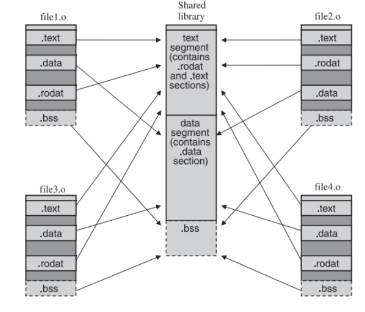

# readelf


## ELF

#### ELF 개념

ELF는 Executable and Linking Format의 약어입니다. UNIX / LINUX 기반에서 사용되는 실행 및 링킹 파일 포맷입니다.

* ELF는 하나의 ELF Header와 파일데이터로 구성되어 있습니다. 
* 파일의 가장 위에 ELF Header 정보가 들어있고, 
* 그 아래 program header table이 있습니다. 
* 그 이후 Segment 정보와 Section 관련 정보들 구성

| ELF 구조                      |
| ----------------------------- |
| ELF header                    |
| Program header table          |
| Segment1                      |
| Segemtn2                      |
| ....                          |
| Section header table optional |

- `Segment`
  : 동일한 메모리 속성(read-only, writable, ...)을 가진 하나 또는 그 이상의 섹션의 집합
- `Section`
  : 특정 정보(machine instructions, symbol table, ..)를 포함하고 있는 ELF file의 작은 조각
- Symbol
  : ELF file내에 저장된 함수 또는 변수의 디스크립션입니다. 간단한 함수 또는 변수의 정보를 포함하고 있습니다.
- Objec file
  : 컴퓨터에서 읽을 수 있는 소스파일 버전입니다. Object file은 소스파일의 전역, 정적 변수 이름같은 심볼 정보들이 아직 남아있는 파일입니다. 하지만 이 파일은 메모리에 어떻게 로드되어야 하는지 정보가 명시되어 있지 않기 때문에 직접 실행은 불가능합니다.
- Shared Library
  : 하나 또는 그 이상의 Object 파일의 심볼들로 구성된 파일입니다. 주소 공간 어디에든 로드 되어질 수 있습니다.
- Executables
  : Shared Library와 매우 유사하지만 메모리 내 특정 주소에 로드될 수 있는 파일입니다. 프로그램 시작을 위한 함수를 가지고 있습니다. 해당 함수에서 Executables 파일은 시작됩니다.
- Core Files
  : ELF 의 특별한 타입의 파일입니다. 실행된 프로세스에 의해 사용된 여러 메모리 세그먼트 들을 포함한 메모리 이미지 정보를 가지고 있습니다. 
- Linking
  : object 파일들로 부터 심볼 정도들을 가져와 특정 순서에 맞게 정렬을 해주는 과정입니다. 오브젝트의 각 섹션들을 공유 라이브러리나 실행파일 내에 각 세그먼트내에 정렬해 주는 과정입니다. 




#### ELF header 

* 프로그램 ELF header 

```
$ hexdump -C a.out | head -4
00000000  7f 45 4c 46 02 01 01 00  00 00 00 00 00 00 00 00  |.ELF............|
00000010  03 00 3e 00 01 00 00 00  a0 10 00 00 00 00 00 00  |..>.............|
00000020  40 00 00 00 00 00 00 00  80 43 00 00 00 00 00 00  |@........C......|
00000030  00 00 00 00 40 00 38 00  0d 00 40 00 24 00 23 00  |....@.8...@.$.#.|
```

* readelf -h 를 통해 살펴 보기

* readelf로 ELF Header를 확인

```sh
reallinux@ubuntu:~$ readelf -h a.out
ELF Header:
  Magic:   7f 45 4c 46 02 01 01 00 00 00 00 00 00 00 00 00
  Class:                             ELF64
  Data:                              2's complement, little endian
  Version:                           1 (current)
  OS/ABI:                            UNIX - System V
  ABI Version:                       0
  Type:                              DYN (Shared object file)
  Machine:                           Advanced Micro Devices X86-64
  Version:                           0x1
  Entry point address:               0x530
  Start of program headers:          64 (bytes into file)
  Start of section headers:          6448 (bytes into file)
  Flags:                             0x0
  Size of this header:               64 (bytes)
  Size of program headers:           56 (bytes)
  Number of program headers:         9
  Size of section headers:           64 (bytes)
  Number of section headers:         29
  Section header string table index: 28
```


#### program header 


Program Header Table은 ELF내의 Segment들에 대한 정보와 그 Segment들을 메모리에 어떻게 로드해야 하는지에 대한 정보가 포함되어 있습니다.  

Segment란  동일한 메모리 속성(read-only, writable, ...)을 가진 하나 또는 그 이상의 섹션의 집합입니다. 여러 개의 Segment들이 존재할테고 각 Segment들에 대한 정보가  명시된 곳이 Program Header입니다. 

* headr 구조는 type, offset, virtAddr, PhysAddr, FileSize, MemSiz,Flag,Align 
* Section to Segment Mapping이라고 표기된 정보들이 있습니다. 섹션들이 세그먼트 내에 위치하는 내용
* GNU_EH_FRAME Segment에는 .note.ABI-tag, .note.gnu.build-id 란 섹션이 있다.

- PHDR 
  : Programe Header 정보 자기 자신에 대한 Segment입니다. Offset과 Siz 등을 살펴보면 ELF Header정보에 들어있던 내용과 같음을 알 수 있습니다.
- LOAD 
  -  LOAD Segment는 로드할 수 있는 프로그램 Segment 입니다. 
  - 섹션을 다시 살펴보면 .intrp, .dynsym, .dynstr 등 다양한 섹션들이 존재하는데요. 메모리에 로드될 수 있는 섹션. 
  - 왜 LOAD란 이름이 두개일까요? 2개의 Segment는 같은 이름을 가지고 있지만 다른 메모리 속성을 가지고 있습니다. Segment는 각각의 메모리 속성을 가진 Section들의 그룹이라고 앞 글에서 설명했던 것 기억나시나요? 자세히 Flags 정보를 보시면 RE와 RW로 속성이 다릅니다. 그 말은 읽고 실행할 수 있는 영역과 읽고 쓸수만 있는 영역이란 것을 의미합니다.
- NOTE 
  : Array 요소들은 보조적인 정보들의 위치와 크기가 저장되어 있습니다
- DYNAMIC 
  : DYNAMIC Segment는 동적 링킹에 사용되는 세그먼트입니다. 자세한 내용은 나중에 다시 다루기로 하겠습니다. 지금은 말 그대로 프로그램 실행 중에 동적으로 링크되는 녀석들, 공유라이브러리 같은 놈들에 관련된(?) 것인가 추측만 하고 지나가셔도 됩니다.
- GNU_EH_FRAME / GNU_STACK / GNU_RELRO 
  :  Vendor-specific한 정보들을 위한 매우 특별한 세그먼트들입니다.

```sh
$ readelf -W -l a.out

Elf file type is DYN (Shared object file)
Entry point 0x10a0
There are 13 program headers, starting at offset 64

Program Headers:
  Type           Offset   VirtAddr           PhysAddr           FileSiz  MemSiz   Flg Align
  PHDR           0x000040 0x0000000000000040 0x0000000000000040 0x0002d8 0x0002d8 R   0x8
  INTERP         0x000318 0x0000000000000318 0x0000000000000318 0x00001c 0x00001c R   0x1
      [Requesting program interpreter: /lib64/ld-linux-x86-64.so.2]
  LOAD           0x000000 0x0000000000000000 0x0000000000000000 0x0006b0 0x0006b0 R   0x1000
  LOAD           0x001000 0x0000000000001000 0x0000000000001000 0x0002b1 0x0002b1 R E 0x1000
  LOAD           0x002000 0x0000000000002000 0x0000000000002000 0x0001b8 0x0001b8 R   0x1000
  LOAD           0x002da0 0x0000000000003da0 0x0000000000003da0 0x000270 0x000278 RW  0x1000
  DYNAMIC        0x002db0 0x0000000000003db0 0x0000000000003db0 0x0001f0 0x0001f0 RW  0x8
  NOTE           0x000338 0x0000000000000338 0x0000000000000338 0x000020 0x000020 R   0x8
  NOTE           0x000358 0x0000000000000358 0x0000000000000358 0x000044 0x000044 R   0x4
  GNU_PROPERTY   0x000338 0x0000000000000338 0x0000000000000338 0x000020 0x000020 R   0x8
  GNU_EH_FRAME   0x002010 0x0000000000002010 0x0000000000002010 0x00005c 0x00005c R   0x4
  GNU_STACK      0x000000 0x0000000000000000 0x0000000000000000 0x000000 0x000000 RW  0x10
  GNU_RELRO      0x002da0 0x0000000000003da0 0x0000000000003da0 0x000260 0x000260 R   0x1

 Section to Segment mapping:
  Segment Sections...
   00     
   01     .interp 
   02     .interp .note.gnu.property .note.gnu.build-id .note.ABI-tag .gnu.hash .dynsym .dynstr .gnu.version .gnu.version_r .rela.dyn .rela.plt 
   03     .init .plt .plt.got .plt.sec .text .fini 
   04     .rodata .eh_frame_hdr .eh_frame 
   05     .init_array .fini_array .dynamic .got .data .bss 
   06     .dynamic 
   07     .note.gnu.property 
   08     .note.gnu.build-id .note.ABI-tag 
   09     .note.gnu.property 
   10     .eh_frame_hdr 
   11     
   12     .init_array .fini_array .dynamic .got

```


```sh
good@linux:~/code/xv6$ readelf -W -l _init

Elf file type is EXEC (Executable file)
Entry point 0x0
There are 2 program headers, starting at offset 52

Program Headers:
  Type           Offset   VirtAddr   PhysAddr   FileSiz MemSiz  Flg Align
  LOAD           0x000074 0x00000000 0x00000000 0x00b75 0x00b84 RWE 0x4
  GNU_STACK      0x000000 0x00000000 0x00000000 0x00000 0x00000 RWE 0x10

 Section to Segment mapping:
  Segment Sections...
   00     .text .rodata .eh_frame .data .bss 
   01
```


```sh
good@linux:~/code/xv6$ readelf -S  _init
There are 15 section headers, starting at offset 0x25a4:

Section Headers:
  [Nr] Name              Type            Addr     Off    Size   ES Flg Lk Inf Al
  [ 0]                   NULL            00000000 000000 000000 00      0   0  0
  [ 1] .text             PROGBITS        00000000 000074 0008c1 00 WAX  0   0  1
  [ 2] .rodata           PROGBITS        000008c1 000935 000057 00   A  0   0  1
  [ 3] .eh_frame         PROGBITS        00000918 00098c 000244 00   A  0   0  4
  [ 4] .data             PROGBITS        00000b5c 000bd0 000019 00  WA  0   0  4
  [ 5] .bss              NOBITS          00000b78 000be9 00000c 00  WA  0   0  4
  [ 6] .comment          PROGBITS        00000000 000be9 000053 01  MS  0   0  1
  [ 7] .debug_aranges    PROGBITS        00000000 000c40 0000a0 00      0   0  8
  [ 8] .debug_info       PROGBITS        00000000 000ce0 0007e4 00      0   0  1
  [ 9] .debug_abbrev     PROGBITS        00000000 0014c4 0003c5 00      0   0  1
  [10] .debug_line       PROGBITS        00000000 001889 00046f 00      0   0  1
  [11] .debug_str        PROGBITS        00000000 001cf8 0002f6 01  MS  0   0  1
  [12] .symtab           SYMTAB          00000000 001ff0 0003f0 10     13  23  4
  [13] .strtab           STRTAB          00000000 0023e0 00013a 00      0   0  1
  [14] .shstrtab         STRTAB          00000000 00251a 000087 00      0   0  1
Key to Flags:
  W (write), A (alloc), X (execute), M (merge), S (strings), I (info),
  L (link order), O (extra OS processing required), G (group), T (TLS),
  C (compressed), x (unknown), o (OS specific), E (exclude),
  p (processor specific)

```


