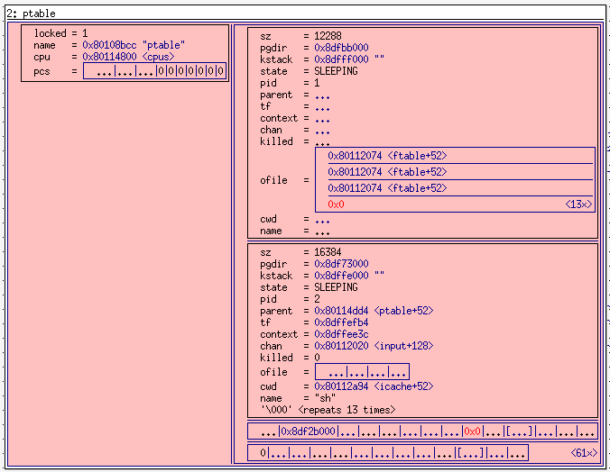
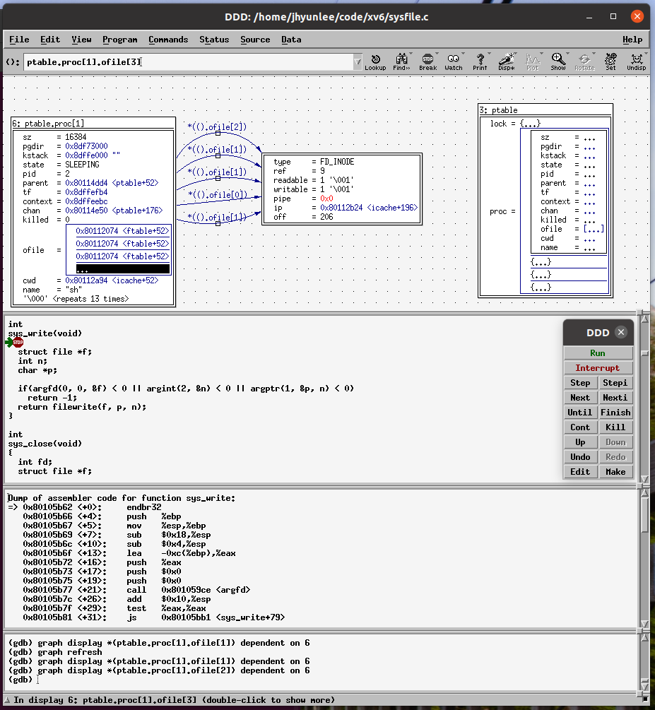

# DDD( Display Data Debugger)

https://www.gnu.org/software/ddd/manual/html_mono/ddd.html


```c
/* sample.c -- Sample C program to be debugged with DDD */
#include <stdio.h>
#include <stdlib.h>
static void shell_sort(int a[], int size)
{
	int i, j;
	int h = 1;
	do {
		h = h * 3 + 1;
	} while (h <= size);
	do {
		h /= 3;
		for (i = h; i < size; i++)
		{
			int v = a[i];
			for (j = i; j >= h && a[j - h] > v; j -= h)
				a[j] = a[j - h];
			if (i != j)
				a[j] = v;
		}
	} while (h != 1);
}

int main(int argc, char* argv[])
{
	int* a;
	int i;

	a = (int*)malloc((argc - 1) * sizeof(int));
	for (i = 0; i < argc - 1; i++)
		a[i] = atoi(argv[i + 1]);

	shell_sort(a, argc);

	for (i = 0; i < argc - 1; i++)
		printf("%d ", a[i]);
	printf("\n");

	free(a);
	return 0;
}
```


##### set print pretty on

```
(gdb) set print pretty on
(gdb) p ptable
$4 = {
  lock = {
    locked = 1,
    name = 0x80108bcc "ptable",
    cpu = 0x80114800 <cpus>,
    pcs = {2148551483, 2148547240, 2148547135, 0, 0, 0, 0, 0, 0, 0}
  },
  proc = {{
      sz = 12288,
      pgdir = 0x8dfbb000,
      kstack = 0x8dfff000 "",
      state = SLEEPING,
      pid = 1,
      parent = 0x0,
      tf = 0x8dffffb4,
      context = 0x8dfffebc,
      chan = 0x80114dd4 <ptable+52>,
      killed = 0,
      ofile = {0x80112074 <ftable+52>, 0x80112074 <ftable+52>, 0x80112074 <ftable+52>, 0x0 <repeats 13 times>},
      cwd = 0x80112a94 <icache+52>,
      name = "init\000\000de\000\000\000\000\000\000\000"
    }, {  pid = 2,
    }, {  pid = 0,
    }, {      
    } <repeats 61 times>}
}
```

##### print ptable.proc[1]

```
(gdb) p ptable.proc[1]
$9 = {
  sz = 16384,
  pgdir = 0x8df73000,
  kstack = 0x8dffe000 "",
  state = SLEEPING,
  pid = 2,
  parent = 0x80114dd4 <ptable+52>,
  tf = 0x8dffefb4,
  context = 0x8dffee3c,
  chan = 0x80112020 <input+128>,
  killed = 0,
  ofile = {0x80112074 <ftable+52>, 0x80112074 <ftable+52>, 0x80112074 <ftable+52>, 0x0 <repeats 13 times>},
  cwd = 0x80112a94 <icache+52>,
  name = "sh", '\000' <repeats 13 times>
}
```

##### print  *ptable.proc[1].cwd

```
(gdb) p ptable.proc[1]->cwd
$24 = (struct inode *) 0x80112a94 <icache+52>
(gdb) p *(ptable.proc[1].cwd)
$25 = {
  dev = 1,
  inum = 1,
  ref = 2,
  lock = {
    locked = 0,
    lk = {
      locked = 0,
      name = 0x80108d4b "sleep lock",
      cpu = 0x0,
      pcs = {0, 2148539564, 2148550989, 2148558757, 2148555154, 2148559995, 2148559459, 0, 0, 0}
    },
    name = 0x801089a0 "inode",
    pid = 0
  },
  valid = 1,
  type = 1,
  major = 0,
  minor = 0,
  nlink = 1,
  size = 512,
  addrs = {59, 0 <repeats 12 times>}
}
```


#### displaty ptable 

* display 창에서  선택 라인을 전체 선택하고 `rotate` 선택하면 pretty 형태로 내용을 확인 할 수 있다. 
* `(gdb) set print pretty on` : gdb 창에서는 컬럼 단위로 출력하기 위해서는 pretty on 하면 된다. 



#### graph display *ptable.proc[1].ofile




## linked list 


```c
#include <stdio.h>
#include <malloc.h>

typedef struct node *pnode;
typedef struct node {
	int n;
	pnode next;
	pnode pre;
};

pnode head;
pnode tail;
int count;

int n, k;

void add(int i) {
	pnode temp = (pnode)malloc(sizeof(struct node));
	count++;
	temp->n = i;
	temp->next = head;
	temp->pre = tail;
	if (tail == NULL) {
		head = tail = temp;
	}
	else {
		tail->next = temp;
		tail = temp;
		tail->next->pre = temp;
	}
}

void get(int k) {

	if (count <= 0) return;
	for (int i = 1; i <= k - 1; i++) {
		head = head->next;
	}
	if (count > 1)	printf("%d, ", head->n );
	else {
		printf("%d", head->n);
		return;
	}
	head->pre->next = head->next;
	head->next->pre = head->pre;
	pnode  temp = head;
	head = head->next;
	free(temp);
	count--;
}
int main() {
	scanf("%d %d", &n, &k);
	for (int i = 1; i <= n; i++) {
		add(i);
	}
	printf("<");
	for (int i = 1; i <= n; i++) {
		get(k);
	}
	printf(">");
	return 0;
}
```


#### gdb command within gdb

| Command                        | Description                                                  |
| :----------------------------- | :----------------------------------------------------------- |
| help                           | List gdb command topics.                                     |
| help *topic-classes*           | List gdb command within class.                               |
| help *command*                 | Command description. eg `help show` to list the show commands |
| apropos *search-word*          | Search for commands and command topics containing *search-word*. |
| info args i args               | List program command line arguments                          |
| info breakpoints               | List breakpoints                                             |
| info break                     | List breakpoint numbers.                                     |
| info break *breakpoint-number* | List info about specific breakpoint.                         |
| info watchpoints               | List breakpoints                                             |
| info registers                 | List registers in use                                        |
| info threads                   | List threads in use                                          |
| info set                       | List set-able option                                         |

##### info break

```
No breakpoint at this line.
(gdb) info break
Num     Type           Disp Enb Address    What
1       breakpoint     keep y   0x801039da in main at main.c:18
	breakpoint already hit 1 time
(gdb) 
```

##### info frame

```sh
(gdb) info break
No breakpoints or watchpoints.
(gdb) info frame
Stack level 0, frame at 0x8010d57c:
 eip = 0x80105529 in stosl (x86.h:60); saved eip = 0x80105599
 called by frame at 0x8010d580
 source language c.
 Arglist at 0x8010d574, args: addr=0x80118000, data=16843009, cnt=1024
 Locals at 0x8010d574, Previous frame's sp is 0x8010d57c
 Saved registers:
  ebx at 0x8010d56c, ebp at 0x8010d574, edi at 0x8010d570, eip at 0x8010d578
(gdb)
```

##### display memory 

```
(gdb) x/20  0x80105370
0x80105370 <release+83>:	0xf3c3c990	0x55fb1e0f	0xec83e589	0x08458b10
0x80105380 <getcallerpcs+13>:	0x8908e883	0x45c7fc45	0x000000f8	0x8338eb00
0x80105390 <getcallerpcs+29>:	0x7400fc7d	0xfc7d8153	0x7fffffff	0x7d834a76
0x801053a0 <getcallerpcs+45>:	0x4474fffc	0x8df8458b	0x00008514	0x458b0000
0x801053b0 <getcallerpcs+61>:	0x8bc2010c	0x408bfc45	0x8b028904	0x008bfc45
```


##### info all

```
(gdb) set print pretty on
(gdb) info all
```


##### signal SIGTRAP

* gdb를 하다보면 아래 신호를 계속 받아서 디버깅이 힘든데... 이것을 무시하는 방법은 없을 까?

```
Thread 2 received signal SIGTRAP, Trace/breakpoint trap.
[Switching to Thread 1.2]
readeflags () at x86.h:113
(gdb) 
```


```
(gdb) signal SIGTRAP
Continuing with signal SIGTRAP.
[Switching to Thread 1.2]

Thread 2 hit Breakpoint 2, trap (tf=0x1010101) at trap.c:41
```

