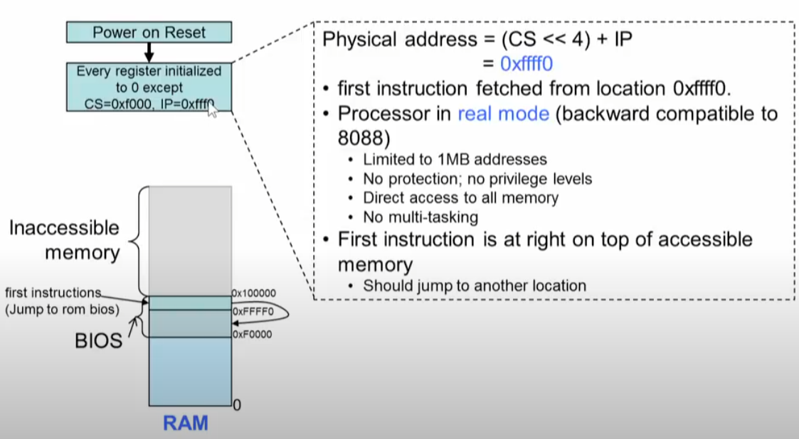
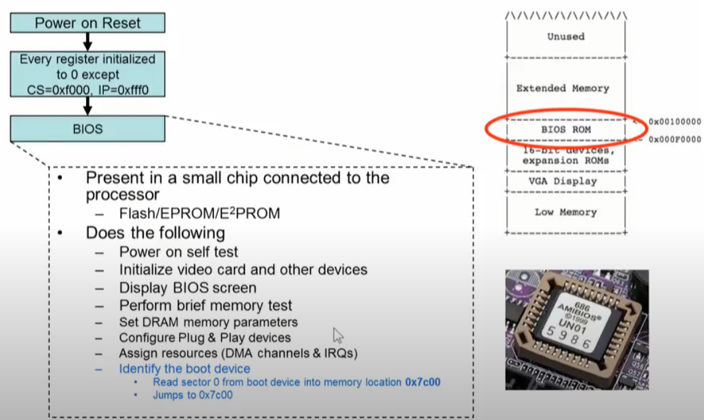
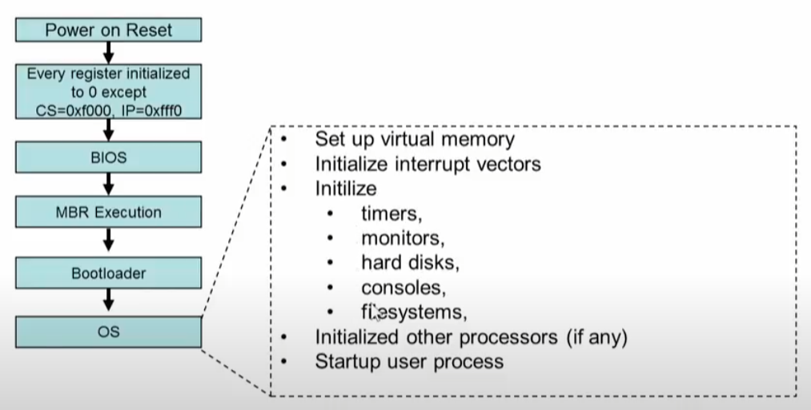
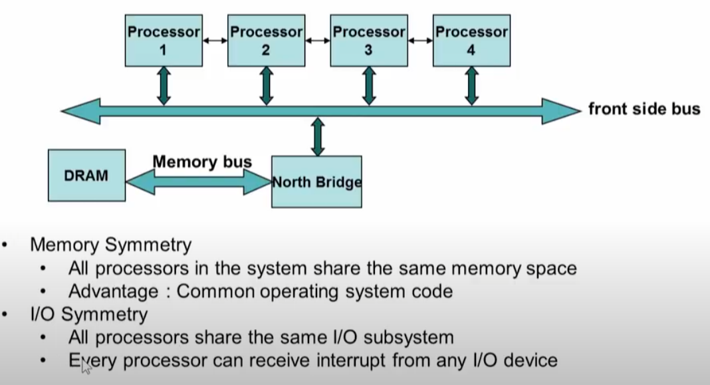

# Boot

#### 1. Power on Reset

* send reset signal to cpu

#### 2. Every register initialized

* except  CS, IP  
* CS=0xf000, IP=0xfff0 ==> CS<<4+IP ==> 0xFFFF0 => 1,048,560

#### 3. BIOS

#### 4. MBR

* boot code --> load bootloader
* 파티션 테이블 4개
* optional directly load OS

#### 5. bootloader

* GRUB

#### 6. OS 

#### multiprocessor system

#### multiprocessor booting

