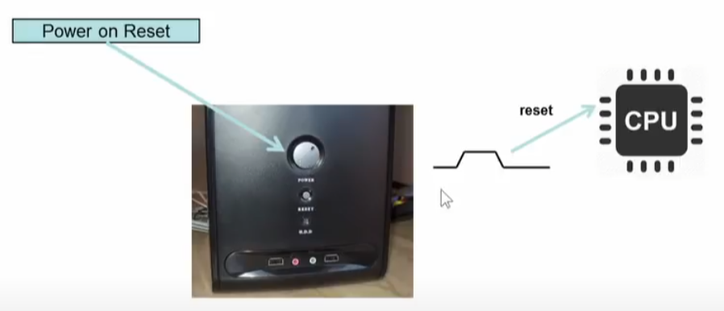
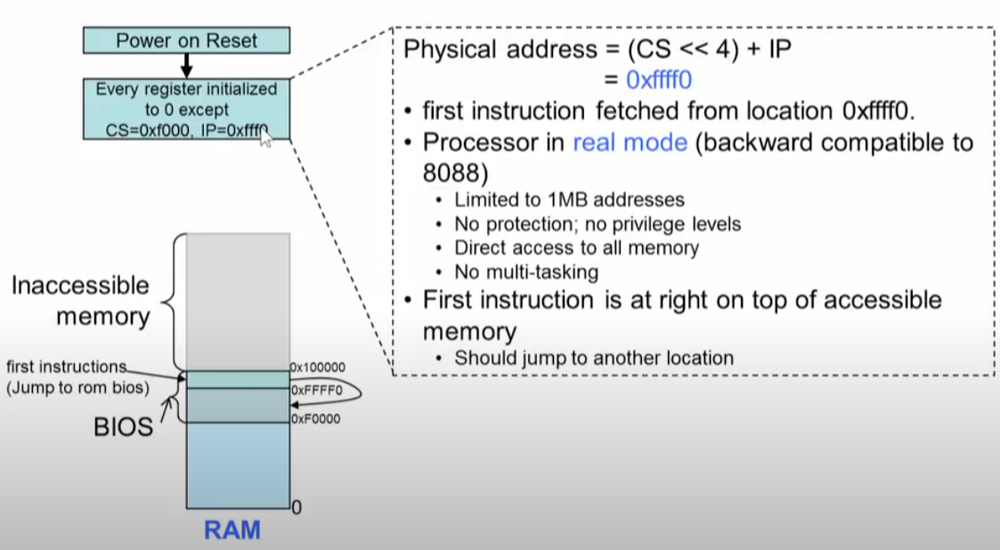
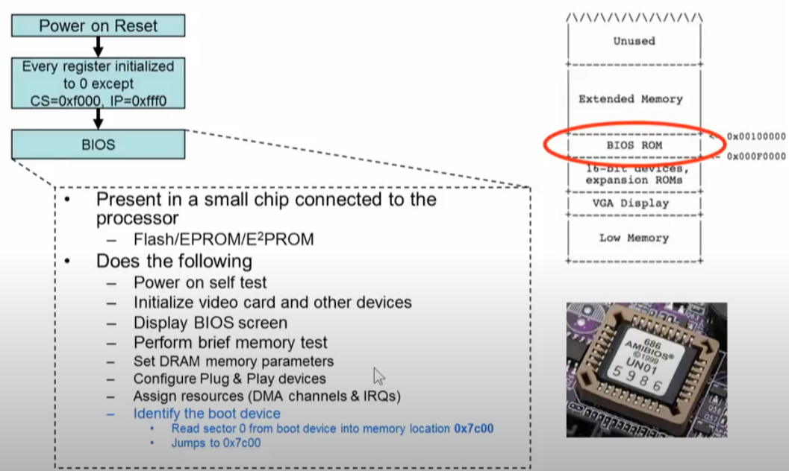
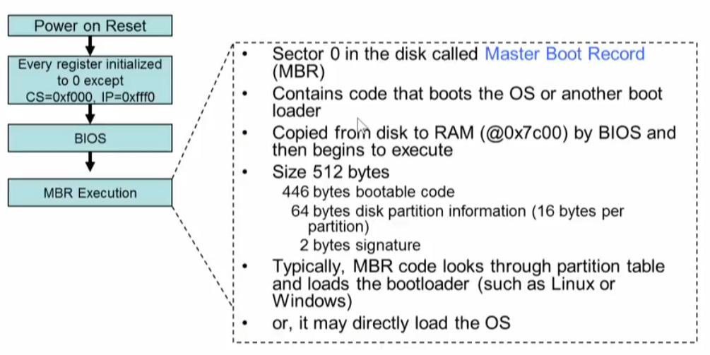
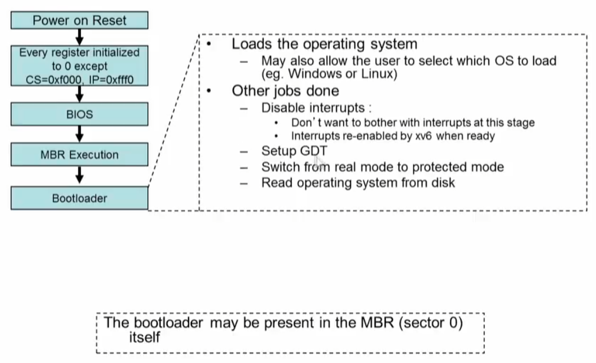
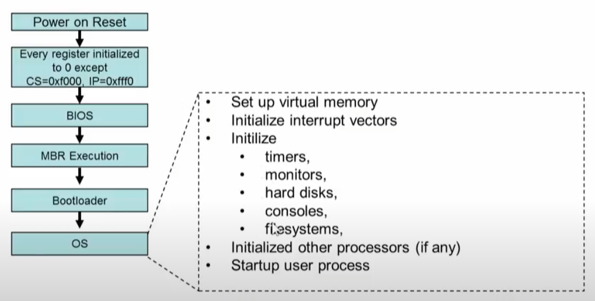
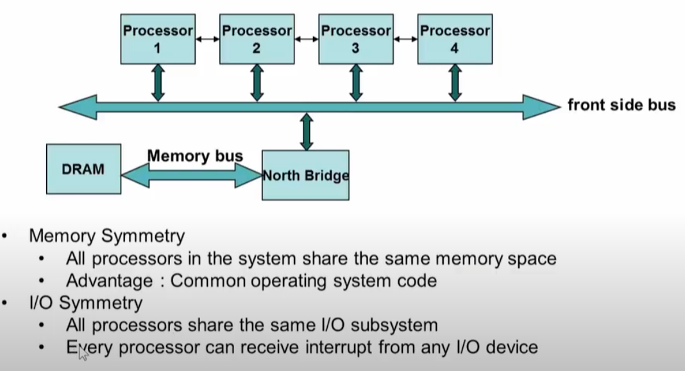
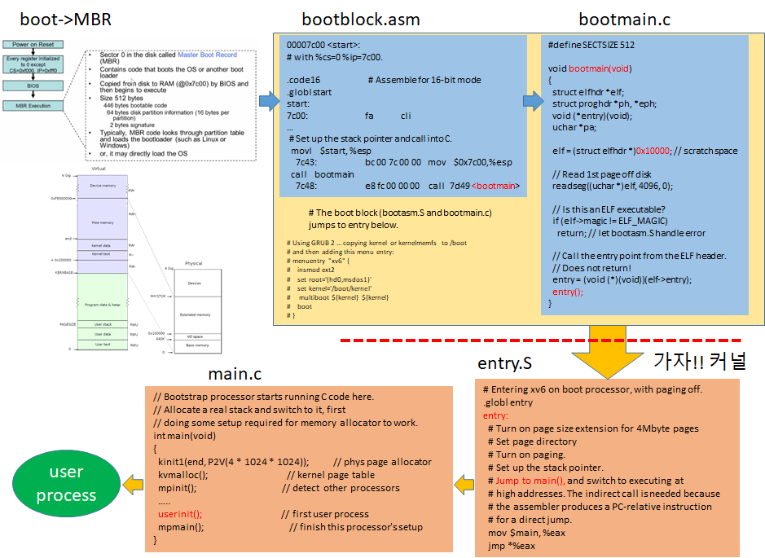
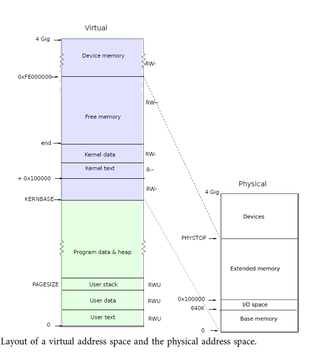

# Boot

## boot 절차

#### 1. Power on Reset

* send reset signal to cpu




#### 2. Every register initialized

* except  CS, IP  
* CS=0xf000, IP=0xfff0 ==> CS<<4+IP ==> 0xFFFF0 => 1,048,560



#### 3. BIOS




#### 4. MBR

* boot code --> load bootloader
* 파티션 테이블 4개
* optional directly load OS



#### 5. bootloader

* GRUB



#### 6. OS 




#### multiprocessor system





#### multiprocessor booting

* One processor designated as 'Boot Processor'  (BSP)

  * Designation done either by Hardware or BIOS
  * All other processors are designated AP (Application Processors)

* BIOS boots the BSP

* BSP learns system configuration

* BSP triggers boot of other AP

  * Done by sending an Startup IPI (inter processor interrupt) signal to the AP

  

## boot  xv6 kernel




#### 부팅 디버깅 위치는 enrty.S의 `_start`

```asm
# By convention, the _start symbol specifies the ELF entry point.
# Since we haven't set up virtual memory yet, our entry point is
# the physical address of 'entry'.
.globl _start
_start = V2P_WO(entry)

# Entering xv6 on boot processor, with paging off.
.globl entry
entry:
  # Turn on page size extension for 4Mbyte pages
  movl    %cr4, %eax
  orl     $(CR4_PSE), %eax
  movl    %eax, %cr4
  # Set page directory
  movl    $(V2P_WO(entrypgdir)), %eax
  movl    %eax, %cr3
  # Turn on paging.
  movl    %cr0, %eax
  orl     $(CR0_PG|CR0_WP), %eax
  movl    %eax, %cr0
```

#### qemu 부팅 절차에 대한  디버깅 하려면

```sh
$ make qemu-gdb
$ ddd --debugger gdb kernel

# GDB shell에서 target remote localhost:26000 
(gdb) target remote localhost:26000


# start_kernel 에 브레이크 포인트 셋팅
(gdb) b _start

Breakpoint 2 at 0x10000c

# 디버깅 시작.
(gdb) c
​```
```


#### kernel 실행 파일 메모리 적제 위치

