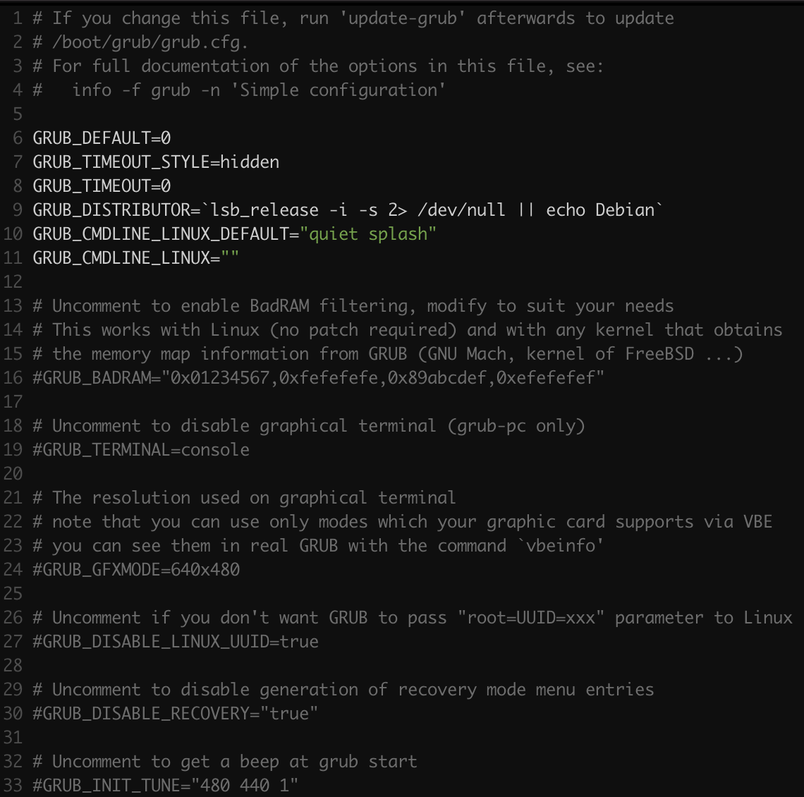

# 부팅

## 부팅 프로세스

1. 머신의 BIOS 또는 부트 펌웨어가 부트 로더를 로딩하고 실행한다.
2. **부트 로더**는 디스크상의 '커널 이미지'를 발견해 이를 메모리로 로딩해 실행한다.
3. 커널이 장치와 드라이버를 초기화한다.
4. 커널이 rootfs를 마운트한다.
5. 커널은 **PID 1**인 **`init`** 프로세스를 시작한다. 여기서 사용자 공간이 시작된다.
6. `init` 프로세스는 시스템 프로세스의 나머지들을 시작 시킨다.
7. `init`은 **로그인 프로세스**를 시작한다.


## 구식 BIOS/MBR 

#### 1. BIOS

- BIOS가 동작한다.
  - **ROM**에 저장되어 있다.
  - 부트 디스크의 첫 섹터 512Byte 메모리로 로딩
    - 이 첫 512Byte를 **MBR**(Master Boot Record)
    - MBR은 '디스크의 어느 파티션에' 부트로더가 존재하는지 정보등이 저장되어 있음
- MBR은 부트로더를 메모리에 동작 시킨다.

#### 2. 부트로더 GRUB

1. PC BIOS 또는 펌웨어는 HW를 초기 설정하고, 부트 순서별 저장 장치를 검색하여 부트 코드를 찾는다.
2. 부트 코드를 찾게되면 BIOS/펌웨어는 이를 로드하고 실행한다. (GRUB 시작)
3. GRUB의 core 부분이 로딩된다. 사용하는 파티셔닝에 따라 3가지의 경우로 부트 로더가 존재한다.
   3-1. MBR 다음, and 2)첫 번째 파티션 이전. -> BIOS가 512Byte를 MBR로부터 로드
   3-2. 일반적인 파티션
   3-3. 특별한 부트 파티션(GPT 부트 파티션, **EFI 시스템 파티션**(요즘 대부분); ESP, ..others)
4. core이 초기화 되어, 이 시점에서 GRUB는 디스크와 파일 시스템에 접근할 수 있다.
5. GRUB는 부트 파티션을 확인하고 그곳에 설정 파일을 '로딩'한다.
6. GRUB는 사용자에게 설정을 변경할 기회를 부여한다.
7. Timeout 또는 사용자의 선택이 되면, GRUB는 설정을 실행한다.
8. 설정을 실행하는 과정에서 GRUB는 부트 파티션에 추가적인 코드(모듈)을 로딩할 수 있다.
9. GRUB는 `linux`명령에 의해 명시된 커널을 로딩하고, 실행하기 위해 `boot` 명령을 실행한다.


#### 3. star tup message

- UNIX 시스템은 부팅 시에 부팅 프로세스에 대해서 알려주는 많은 진단 메시지들을 출력한다.

- 처음에는 커널에서 보내고, 프로세스들과 `init`에 의해 시작되는 초기화 절차로부터 보내는 메시지들이다.

- 커널 시스템 로그 파일을 살펴본다.

- /var/log/kern.log : 커널 시스템 로그 파일

- dmesg

- 아래의 순서로 체크한다.

  1. CPU 점검
  2. 메모리 점검
  3. 장치 버스 찾기
  4. 보조 커널 서브 시스템 설정 (네트워킹 등)
  5. 루트 파일 시스템 마운트
  6. 사용자 공간 시동

  

#### 4. 커널 기동 매개변수

- 커널은 실행할 때 부트 로더는 커널이 어떻게 시작되어야 하는지 알려주는 텍스트 기반의 **커널 매개 변수**들을 전달한다.
- 매개 변수들은 커널이 출력해야하는 진단 메시지의 양과 장치 드라이버 전용 옵션 등 여러가지 동작들을 구체적으로 명시한다.
- /proc/cmdline

```
$ cat /proc/cmdline
BOOT_IMAGE=/boot/vmlinuz-5.9.0 root=UUID=9a4aa9f5-dd83-4d6d-bd1e-115483e0aed9 ro quiet splash vt.handoff=7
```

- 커널의 매개변수 중 `root`가 **rootfs** 위치이다.

```
$ blkid
/dev/sda2: UUID="9a4aa9f5-dd83-4d6d-bd1e-115483e0aed9" TYPE="ext4" PARTUUID="5097cd77-6255-4248-883e-642d07224913"
```

- `/dev/sda2` 가 rootfs 임을 알 수 있다.
- ro 매개 변수는 사용자 공간이 시작되면 rootfs를 읽기 전용 모드로 마운트하도록 커널에 지시한다.
  - 읽기 전용 모드는 `fsck`가 rootfs를 안전하게 확인할 수 있도록 보장한다.
  - 확인 후, 부트업 프로세스가 rootfs를 `rw`모드로 다시 re-mount한다.

- 이 커널 매개 변수가 제대로 지정되지 않으면 **커널은 `init` 을 찾을 수 없다**. 그러면, 사용자 공간을 시동할 수 없다.
- 커널은 사용자 공간이 시동 될 때, 이 매개 변수를 init에게 전달한다. 
- 만약 커널 매개변수에 `-s`가 있으면 single-user mode에서 시작한다는 것이다.


## 부트로더


- 부트 로더는 부팅 프로세스에서 2번째이다.
- 커널을 찾아 메모리로 올린다. 그런데 우선 아래의 것들이 필요하다.
  - 커널이 어디에 있는가?
  - 커널 매개변수는 뭔가?
- 커널이 아직 실행된 것도 아니고, 매개변수가 어디에 있는지도 모른다.

- 기본 입출력 시스템(Basic I/O System, BIOS) 또는 통합 확장 펌웨어 인터페이스(UEFI)를 사용한다.
  - 거의 모든 디스크 HW는 BIOS로 하여금 **선형 블록 주소 지정(LBA)**를 사용해 연결된 저장장치 HW에 접속할 수 있게 해주는 SW를 갖추고 있다.
  - 이렇게 하여, 디스크로 일반적인 접근이 가능하도록 허용한다.

#### boot loader 종류

| **부트로더**                | 설명                                                         |
| --------------------------- | ------------------------------------------------------------ |
| **GRUB**                    | 리눅스 시스템의 보편적 표준 부트 로더                        |
| **LILO**                    | 최초의 리눅스 부트 로더 중 하나. ELILO는 UEFI 버전이다.      |
| **SYSLINUX**                | 다른 여러 종류의 파일 시스템에서 실행되도록 설정이 가능하다. |
| **LOADLIN**                 | MS-DOS에서 커널을 부팅한다.                                  |
| **efilinux**                | 다른 UEFI 부트 로더들을 위한 견본과 참조 모델로 제공하기 위해 제작된 UEFI 부트 로더 |
| **coreboot (구 LinuxBIOS)** | 커널을 포함할 수 있는 PC BIOS에 대한 고성능 대처 바이오스 펌웨어 |
| **Linux Kernel EFISTUB**    | 최근 시스템에서 볼 수 있는 EFI/UEFI 시스템 파티션(ESP)로 부터 커널을 직접 로딩하는 커널 플러그인 |


### GRUB

- GRUB legacy, GRUB 2 가 있다. (대부분 요즘은 GRUB 2를 사용한다)
- 부트 로더의 핵심 역할인 '커널'을 선택해 메모리에 로드 시킨다.

- 부팅 시, GRUB 메뉴가 뜨지 않으면, splash 이미지에서 `shift` 키를 잠시 누르고 있으면, GRUB가 뜬다.
- 여기서 **`e`**키를 누르면, 디폴트 부트 옵션에 대한 부트로더 설정 명령들을 확인한다.


#### GRUB 환경 설정

- GRUB 환경 설정 파일:
  - 위치: `/boot/grub`

- 직접 GRUB 환경 설정 파일을 건드리지 말자.
- 이 파일은 자동적으로 생성되고, 시스템이 경우에 따라 이 것을 덮어 쓴다.

##### /etc/default/grub

- 사용자가 GRUB 설정을 할 수 있는 파일
- 실제 GRUB 부트로더는 `/boot/grub/grub.cfg`이지만 절때 임의로 edit 하지말고,
  **`/etc/default/grub`**파일을 edit 후, `$ sudo update-grub`를 명령해 `/boot/grub/grub.cfg`에 적용시키자.



- `GRUB_TIMEOUT=시간(s)`
  - GRUB 메뉴가 출력되는 시간
  - 이 시간이 지나고 나면 부팅과정이 자동으로 진행된다.
  - e.g, `GRUB_TIMEOUT=10`: 10초 동안 GRUB 메뉴가 출력된다.
- `GRUB_CMD_LINE_LINUX_DEFAULT="quiet splash`
  - `quiet`: 부팅 메시지를 출력하지 않는다.
  - `splash`: 부팅 시 이미지를 띄운다.


## GRUB 

- GRUB2의 기본 메인 디렉토리
  - `/boot/grub/`
  - `/etc/grub.d`
- User preference
  - `/etc/default/grub` 에 저장
- GRUB2의 메뉴는 `/boot/grub/grub.cfg` 에 포함된 정보를 빌드한다


### 1. BIOS/MBR

- GRUB2의 부트로더 default 설치 위치: 

  1)MBR 다음, and  2)첫 번째 파티션 이전.

  - 부트로더 정보는 MBR의 embedded area에 반드시 설치할 필요가 없고, bypass 하여 특정 파티션에 지정할 수 있다.

### 

### 2. BIOS/GPT

- **BIOS 부트 파티션**이라는 '작은 파티션'을 생성해 (약 1MB) 부트로더, 부트로더 코드를 위치시킨다.
- 이 파티션은 `gparted`와 같은 툴들로 생성할 수 있다.
- `bios_grub` 플래그로 식별된다.
- GPT는 최근 UEFI와 함께 사용


### 3. UEFI 부트

- **EFI**: BIOS의 심각하게 떨어지는 제한된 성능을 해결하고나 대체된 **E**xtensible **F**irmware **I**nterface

- UEFI: 표준 EFI (Unified EFI)
  - 내장 셸 기능과 파티션 테이블을 읽고, 파일 시스템을 다룰 수 있는 기능들을 포함한다.
  - GPT 파티셔닝은 **UEFI** 표준의 **일부**이다.

- UEFI 상의 부트는 파일 시스템 외부에 존재하는 실행 가능한 부트 코드라기 보다는 **EFI 시스템 파티션(ESP)** 이고 불리는 특별한 파일 시스템이 항상 존재한다.

##### GPT disk 정보

```
good@code:~$ gdisk /dev/sda
GPT fdisk (gdisk) version 1.0.5

Problem opening /dev/sda for reading! Error is 13.
You must run this program as root or use sudo!
good@code:~$ sudo gdisk /dev/sda
[sudo] good의 암호:
GPT fdisk (gdisk) version 1.0.5

Partition table scan:
  MBR: protective
  BSD: not present
  APM: not present
  GPT: present

Found valid GPT with protective MBR; using GPT.

Command (? for help): p
Disk /dev/sda: 500118192 sectors, 238.5 GiB
Model: LITEON CV1-CC256
Sector size (logical/physical): 512/512 bytes
Disk identifier (GUID): 0CF5530D-4FF2-49DB-BDC5-D95EFD0A43F4
Partition table holds up to 128 entries
Main partition table begins at sector 2 and ends at sector 33
First usable sector is 34, last usable sector is 500118158
Partitions will be aligned on 2048-sector boundaries
Total free space is 2669 sectors (1.3 MiB)

Number  Start (sector)    End (sector)  Size       Code  Name
   1            2048         1050623   512.0 MiB   EF00  EFI System Partition
   2         1050624       500117503   238.0 GiB   8300

```

##### 파티션 정보

````
good@code:~$ sudo fdisk -l /dev/sda
Disk /dev/sda: 238.49 GiB, 256060514304 bytes, 500118192 sectors
Disk model: LITEON CV1-CC256
Units: sectors of 1 * 512 = 512 bytes
Sector size (logical/physical): 512 bytes / 512 bytes
I/O size (minimum/optimal): 512 bytes / 512 bytes
Disklabel type: gpt
Disk identifier: 0CF5530D-4FF2-49DB-BDC5-D95EFD0A43F4

Device       Start       End   Sectors  Size Type
/dev/sda1     2048   1050623   1048576  512M EFI System
/dev/sda2  1050624 500117503 499066880  238G Linux filesystem
````

##### /boot/efi mount 위치

```
good@code:~$ df
Filesystem     1K-blocks      Used Available Use% Mounted on
udev             3690788         0   3690788   0% /dev
tmpfs             806380      1936    804444   1% /run
/dev/sda2      244568380 115992440 116082884  50% /
/dev/sda1         523248      5356    517892   2% /boot/efi
```

##### 부트 로더/설정 파일

```
root@code:/boot/efi/EFI# tree
.
├── BOOT
│   ├── BOOTX64.EFI
│   ├── fbx64.efi
│   └── mmx64.efi
└── ubuntu
    ├── BOOTX64.CSV
    ├── grub.cfg     <<--- 부트로더 설정파일
    ├── grubx64.efi  <<--- 부트로더 파일
    ├── mmx64.efi
    └── shimx64.efi
```

##### grub.cfg

```
root@code:/boot/efi/EFI/ubuntu# cat grub.cfg
search.fs_uuid 9a4aa9f5-dd83-4d6d-bd1e-115483e0aed9 root hd0,gpt2
set prefix=($root)'/boot/grub'
configfile $prefix/grub.cfg
```

##### /proc/cmdline

```
$ cat /proc/cmdline
BOOT_IMAGE=/boot/vmlinuz-5.9.0 root=UUID=9a4aa9f5-dd83-4d6d-bd1e-115483e0aed9 ro quiet splash vt.handoff=7
```

##### /efi 파이션은 vfat 타입 파일 시스템 

```
$ blkid
root@code:/boot/efi/EFI/ubuntu# blkid
/dev/sda2: UUID="9a4aa9f5-dd83-4d6d-bd1e-115483e0aed9" TYPE="ext4" PARTUUID="5097cd77-6255-4248-883e-642d07224913"
/dev/loop0: TYPE="squashfs"
/dev/loop1: TYPE="squashfs"
/dev/loop2: TYPE="squashfs"
/dev/loop3: TYPE="squashfs"
/dev/sda1: UUID="9039-63CA" TYPE="vfat" PARTLABEL="EFI System Partition" PARTUUID="dfb23f68-3ba5-435f-a9af-47baaf715168"

```


- 각 부트로더는 자체의 식별자를 갖고, 그에 상응하는 `efi/microsoft`, `efi/apple`, `efi/grub`와 같은 서브 디렉토리를 보유하고 있다.
- 부트로더 파일은 `.efi`확장자를 가지며, 이 서브 디렉토리들 중 하나에 다른 지원 파일들과 같이있다.
- ESP는 BIOS Boot 파티션과 다르며, 이와 다른 UUID를 가지고 있음

- 이전의 부트로더 코드를 ESP에 삽입할 수 없다. 이는 BIOS 인터페이스를 위해 작성된 것이다.
  - 사용자가 UEFI를 위해 작성된 부트 로더를 제공해야한다.
  - e.g. GRUB를 사용할 때 BIOS 버전이 아니라 GRUB의 UEFI 버전을 설치해야한다.
  - 새로운 부트로더를 펌웨어에 '알려야'하며, 아래의 보안 부트에 관해 생각해봐야한다.