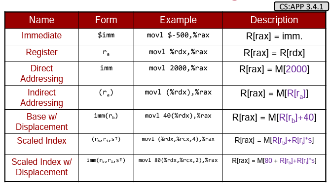
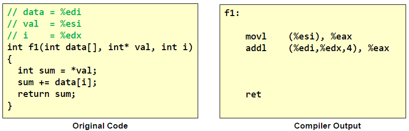
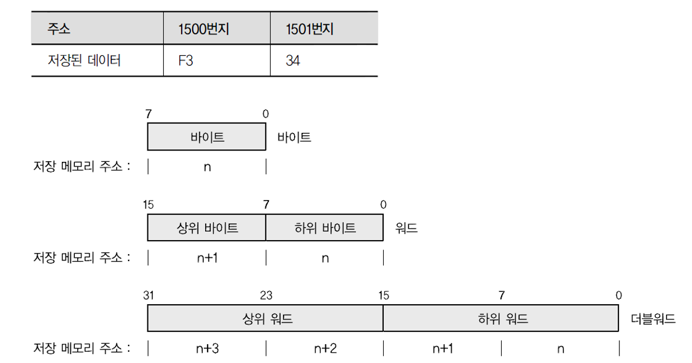

# Assembler


### hello world

```c
  1 #include<sys/syscall.h>
  2 #include<unistd.h>
  3 int main(void){
  4     syscall(SYS_write, 1,"hello, World!\n",14);
  5     return 0;
  6 }
```

* 컴파일 

```c
$ gcc -g -pg  -o 2hello 2hello.c
$ file ./2hello
$ ldd  ./2hello
$ readelf -h ./2hello
$ readelf -W -l ./2hello
$ objdump -d ./2hello
```

* assembly

```
$ gcc -S 2hello.c
$ gcc -o 2hello 2hello.s -no-pie
$ ./2hello
hello, World!
```

* hello.s

```asm
#include <asm/unistd.h>
#include <syscall.h>
	.file	"hello_sys.c"
	.section	.rodata
hello:
	.string	"hello, World!\n"
	.text
	.globl	_start
	.type	_start, @function
_start:
    ## write
	movl	$14, %edx
	movl	$hello, %esi
	movl	$1, %edi
	movl	$SYS_write, %eax
	syscall

    ## exit 0
	movl	$0, %edi
	movl    $SYS_exit, %eax
	syscall 

.size	_start, .-_start
	.section	.note.GNU-stack,"",@progbits
```

* gcc, ld

```
$ gcc -c -o 5hello.o 5hello.S
$ ld -o 5hello 5hello.o
```


### x86 어셈블러 

* AT&T 문법 : GNU linux
* Intel 문법 : microsoft

#### AT&T 문법 

- 문법 : opcode  source destination 
- 어셈블러: GAS (Linux 계열, 윈도우, DOS)
- GNU 어셈블러(GNU Assembler, 보통 gas 또는 간단히 as로 불리는)는 GNU 프로젝트에서 사용되는 어셈블러이다. 이것은 GCC의 기본 백엔드이며 GNU 운영 체제와 리눅스 커널 그리고 다양한 다른 소프트웨어를 어셈블하는데 사용된다. GNU 어셈블러는 GNU 바이너리 유틸리티의 한 부분이다. GAS 실행 파일은 이름이 as이며 유닉스 어셈블러의 표준 이름이다.hello world
- 인텔 문법도 `.intel_syntax` 지시자를 통해서 사용이 가능하다. 

```asm
.global	_start

.text
_start:
	movl $4, %eax
	movl $1, %ebx
	movl $msg, %ecx
	movl $len, %edx
	int $0x80

	movl $1, %eax
	movl $0, %ebx
	int $0x80
.data
msg:
	.ascii "Hello, world!\n"
	len = . - msg
```

#### intel 문법

- 문법 : opcode Destination Source
- 어셈블러: MASM  (windows, DOS, OS/2) 
- 마이크로소프트 매크로 어셈블러(Microsoft Macro Assembler, MASM)는 인텔 문법을 사용하는 MS-DOS 및 마이크로소프트 윈도우용 x86 어셈블러이다
- MASM은 마이크로소프트에 의해 유지보수되고 있으나 버전 6.12부터 독립 제품으로 판매되지 않고 있으며 그 대신 다양한 마이크로소프트 SDK 및 C 컴파일러와 함께 제공된다. 최근 버전의 MASM은 마이크로소프트 비주얼 스튜디오에 포함되어 있다.
- 

#### 차이점

* 접두사 규칙: 레지스터에는 % 접두사, 값들에는 $ 접두사 붙는다.
* 접미사 규칙: 'l' long 'w' word 'b' byte 

| 구분           | Intel                                                        | AT&T                                                         |
| -------------- | ------------------------------------------------------------ | ------------------------------------------------------------ |
| 접두사 규칙    | mov eax 1<br />mov ebx  offh<br />int 80h                    | movel #1, %eax<br />movel #1 %eax<br />int $0x80             |
| Operands 위치  | instrution dest  src<br />move eax [ecx]                     | instruction src dest<br />movel %exc %eax                    |
| Memory Operand | mov eax [ebx]<br />mov eax [ebx+3]                           | movl (%ebx) %eax<br />movl 3(%ebx) %eax                      |
| 접미사 규칙    | mov al bl<br />mov ax bx<br />mov eax ebx<br />mov eax, dword ptr[ebx] | movb %bl %al<br />movw %bx %ax<br />movl %ebx %eax<br />movl (%ebx) %eax |

### Addressing (주소 지정 방식)



* 4바이트 단위 scaled index 이용




#### 데이터 타입과 little endian

* 상위 바이트는 바이트는 상위 번지에 
* 하위 바이트는 하위 번지에 저장




#### calling Conventions

|  arch  | syscall NR | return | arg0 | arg1 | arg2 | arg3 | arg4 | arg5 |
| :----: | :--------: | :----: | :--: | :--: | :--: | :--: | :--: | :--: |
|  arm   |     r7     |   r0   |  r0  |  r1  |  r2  |  r3  |  r4  |  r5  |
| arm64  |     x8     |   x0   |  x0  |  x1  |  x2  |  x3  |  x4  |  x5  |
|  x86   |    eax     |  eax   | ebx  | ecx  | edx  | esi  | edi  | ebp  |
| x86_64 |    rax     |  rax   | rdi  | rsi  | rdx  | r10  |  r8  |  r9  |


#### syscall table

https://chromium.googlesource.com/chromiumos/docs/+/HEAD/constants/syscalls.md#x86-32_bit


### GAS hello world


```asm
##########################################################################
# Program: hello_world_gas
# Date: 04/22/2021
# Author: Travis Phillips
# Purpose: A simple hello world program in x86 assembly for GAS
# Compile: as --march=i386 --32 ./hello_world_gas.s -o hello_world_gas.o
#    Link: ld -m elf_i386 hello_world_gas.o -o hello_world_gas
##########################################################################
.global  _start                 # we must export the entry point to the
                                # ELF linker or loader. Conventionally,
                                # they recognize _start as their entry
                                # point but this can be overridden with
                                # ld -e "label_name" when linking.
.data                           # .data section declaration
msg:
    .ascii    "Hello, World!\n" # Declare a label "msg" which has
                                # our string we want to print.
    len = . - msg               # "len" will calculate the current
                                # offset minus the "msg" offset.
                                # this should give us the size of
                                # "msg".
.text                           # .text section declaration
_start:
    ######################################
    # syscall - write(1, msg, len);
    ######################################
    mov    $4,%eax              # 4 = Syscall number for Write()
    mov    $1,%ebx              # File Descriptor to write to
                                # In this case: STDOUT is 1
    mov    $msg,%ecx            # String to write. A pointer to
                                # the variable 'msg'
    mov    $len,%edx            # The length of string to print
                                # which is 14 characters
    int    $0x80                # Poke the kernel and tell it to run the
                                # write() call we set up
    ######################################
    # syscall - exit(0);
    ######################################
    mov    $1,%al               # 1 = Syscall for Exit()
    mov    $0,%ebx              # The status code we want to provide.
    int    $0x80                # Poke kernel. This will end the program.
```

The code above might look massive, but much like the NASM example, it’s mostly comments to help explain things.  If we remove the comments, the code part would simply be:

```asm

.global  _start
.data
msg:
    .ascii "Hello, World!\n"
    len = . - msg
.text
_start:
    mov    $4,%eax
    mov    $1,%ebx
    mov    $msg,%ecx
    mov    $len,%edx
    int    $0x80
    mov    $1,%al
    mov    $0,%ebx
    int    $0x80
```

