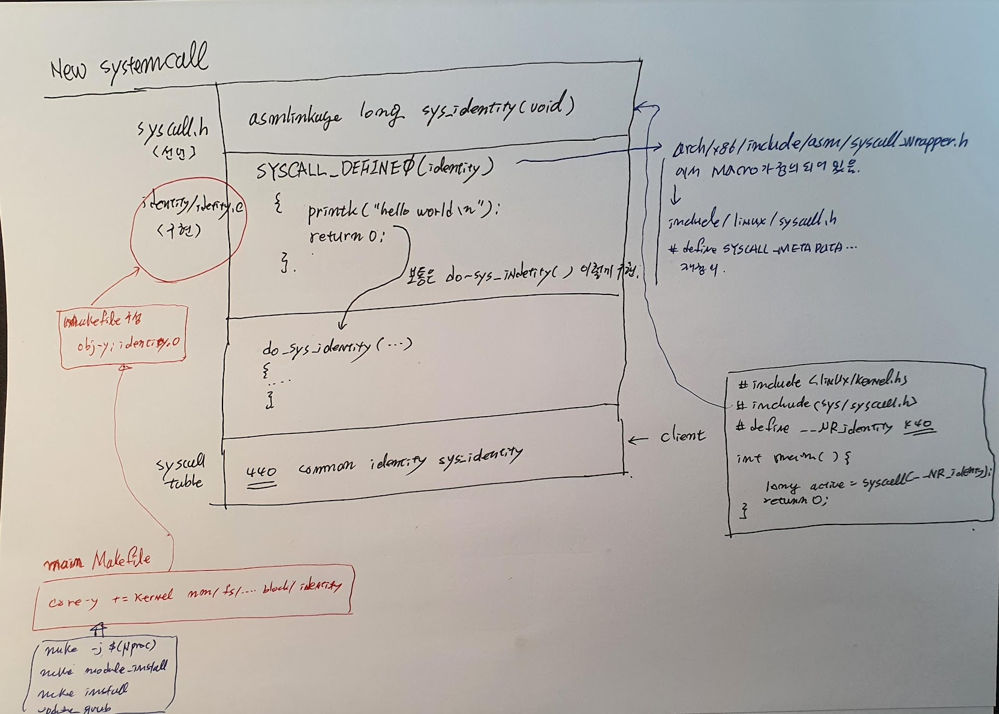

# Add a System call to Linux kernel 5.4


## Add System call 



* arch/x86/entry/syscalls/syscall_64.tbl
* identity/identy.c
* syscall.h
* identity/Makefile
* Makefile


### 1. 준비

* os

```
$ sudo apt update && sudo apt upgrade -y
$ sudo apt install build-essential libncurses-dev libssl-dev libelf-dev bison flex -y
$ sudo apt install vim -y
$ sudo apt clean && sudo apt autoremove -y
```

* ##### kernel source v5.4 로 합니다.

```
$ wget -P ~/ https://cdn.kernel.org/pub/linux/kernel/v5.x/linux-5.8.1.tar.xz
$ git remote -v
origin  https://github.com/torvalds/linux.git (fetch)
origin  https://github.com/torvalds/linux.git (push)

$ git checkout tags/v5.4
파일을 갱신합니다: 100% (14548/14548), 완료.
이전 HEAD 위치는 bbf5c979011a Linux 5.9
HEAD의 현재 위치는 bcf876870b95 Linux 5.8
```

* .config 파일을  여기 디릭토리 참조하고...

### 2. Create

```
$ uname -r
5.9.0
```

##### 1. new systecall 

Create a C file for your system call.

```c
$ mkdir identity
$ cat identity/identity.c
    
#include <linux/kernel.h>
#include <linux/syscalls.h>

SYSCALL_DEFINE0(identity)

{
    printk("Hello Wrold !! I am Jhyunlee.\n");
    return 0;
}
```

##### 2. Create a Makefile 

```
$ cat identity/Makefile
obj-y := identity.o
```

##### 3. main Makefile 

```
$ sudo apt install silversearcher-ag
$ vi ~/linux/Makefile

1072 ifeq ($(KBUILD_EXTMOD),)
1073 core-y      += kernel/ certs/ mm/ fs/ ipc/ security/ crypto/ block/ identity/
1074

```

##### 4. syscalls.h

add `asmlinkage long sys_identity(void);`

```
1427 asmlinkage long sys_identity(void);
```


##### 5. syscall table

`vi arch/x86/entry/syscalls/syscall_64.tbl` 

```
440 common  identity        sys_identity
```


### 3. Installation

##### 1. make menuconfig

Make no changes to keep it in default settings.


##### 2. compile

```
$ make -j $(nproc)
Kernel: arch/x86/boot/bzImage is ready  (#6)
x$ ll -l ./arch/x86/boot/bzImage
-rw-rw-r-- 1 good good 11240928  1월  9 14:46 ./arch/x86/boot/bzImag

$ sudo make modules_install -j12
$ sudo make install -j12
$ sudo update-grub
```

##### 3. reboot


### 4. Create Application

##### 1. check the version of current kernel

```
$ uname -r
5.8.0+
```


##### 2. create application

```c
$ cat app.c
#include <linux/kernel.h>
#include <sys/syscall.h>
#include <unistd.h>
#include <errno.h>
#define _GNU_SOURCE
#define __NR_identity 440


int main(int argc, char *argv[])
{
    long activity;
    activity=syscall(__NR_identity);

    return 0;
}

```

##### 3. test

```
$ ./app
Congratulations, Your system call is functional. Run the command dmesg and find out!

$ dmesg
Jan  9 16:01:47 code kernel: [   80.796152] hello world I am jhyunlee.
```


* 혹시 ` implicit declaration of function ‘syscall’` 나 온다면  unistd.h 포함 시켜준면 된다.  

```
c$ gcc -g -pg -o app ./app.c
./app.c: In function ‘main’:
./app.c:11:14: warning: implicit declaration of function ‘syscall’ [-Wimplicit-function-declaration]
   11 |     activity=syscall(__NR_identity);
      |              ^~~~~~~

```


#### __SYSCALL_DEFINEx

syscall wrapper 함수,   macro 함수...

* ~/code/linux/arch/x86/include/asm/syscall_wrapper.h

```c
227 #define __SYSCALL_DEFINEx(x, name, ...)                 \
228     static long __se_sys##name(__MAP(x,__SC_LONG,__VA_ARGS__)); \
229     static inline long __do_sys##name(__MAP(x,__SC_DECL,__VA_ARGS__));\
230     __X64_SYS_STUBx(x, name, __VA_ARGS__)               \
231     __IA32_SYS_STUBx(x, name, __VA_ARGS__)              \
232     static long __se_sys##name(__MAP(x,__SC_LONG,__VA_ARGS__))  \
233     {                               \
234         long ret = __do_sys##name(__MAP(x,__SC_CAST,__VA_ARGS__));\
235         __MAP(x,__SC_TEST,__VA_ARGS__);             \
236         __PROTECT(x, ret,__MAP(x,__SC_ARGS,__VA_ARGS__));   \
237         return ret;                     \
238     }                               \
239     static inline long __do_sys##name(__MAP(x,__SC_DECL,__VA_ARGS__))
240
241 /*
```


#### VFS에서 system call 


## uftrace

### uftrace code

```c
$ uftrace -V
uftrace v0.9.3 ( dwarf python tui perf sched dynamic )
```


#### uftrace

```
$ sudo uftrace record  -K 30 ./app
$ sudo uftrace tui  -t 8us  -N smp_apic_timer_interrupt@kernel
$ uftrace dump --flame-graph | ./flamegraph.pl > out.svg
```

* uftrace 

```
good@code:~/code/c$ sudo uftrace -K 30  ./app
# DURATION     TID     FUNCTION
   0.380 us [ 68302] | __monstartup();
   0.144 us [ 68302] | __cxa_atexit();
            [ 68302] | main() {
            [ 68302] |   syscall() {
            [ 68302] |     exit_to_user_mode_prepare() {
   0.205 us [ 68302] |       fpregs_assert_state_consistent();
   0.617 us [ 68302] |     } /* exit_to_user_mode_prepare */
   1.439 us [ 68302] |   } /* syscall */
   1.718 us [ 68302] | } /* main */
```

*  uftrace 하는데 kernel 모드의 추적이 안되어서... kernel 5.4 버젼의 config 파일을 가져다 다시 컴파일 했더니 정상적으로 커널의 디버깅 메세지가 나왔다.  이런 경우가 발생할 수도 있구나. 

##### strace 

```sh
good@code:~/code/c$ strace ./app
execve("./app", ["./app"], 0x7ffd0ed07770 /* 37 vars */) = 0
brk(NULL)                               = 0x55de252e3000
arch_prctl(0x3001 /* ARCH_??? */, 0x7fff8fa2ad40) = -1 EINVAL (부적절한 인수)
access("/etc/ld.so.preload", R_OK)      = -1 ENOENT (그런 파일이나 디렉터리가 없습니다)
openat(AT_FDCWD, "/etc/ld.so.cache", O_RDONLY|O_CLOEXEC) = 3
fstat(3, {st_mode=S_IFREG|0644, st_size=85101, ...}) = 0
mmap(NULL, 85101, PROT_READ, MAP_PRIVATE, 3, 0) = 0x7f5298eb2000
close(3)                                = 0
openat(AT_FDCWD, "/lib/x86_64-linux-gnu/libc.so.6", O_RDONLY|O_CLOEXEC) = 3
read(3, "\177ELF\2\1\1\3\0\0\0\0\0\0\0\0\3\0>\0\1\0\0\0\360q\2\0\0\0\0\0"..., 832) = 832
pread64(3, "\6\0\0\0\4\0\0\0@\0\0\0\0\0\0\0@\0\0\0\0\0\0\0@\0\0\0\0\0\0\0"..., 784, 64) = 784
pread64(3, "\4\0\0\0\20\0\0\0\5\0\0\0GNU\0\2\0\0\300\4\0\0\0\3\0\0\0\0\0\0\0", 32, 848) = 32
pread64(3, "\4\0\0\0\24\0\0\0\3\0\0\0GNU\0\t\233\222%\274\260\320\31\331\326\10\204\276X>\263"..., 68, 880) = 68
fstat(3, {st_mode=S_IFREG|0755, st_size=2029224, ...}) = 0
mmap(NULL, 8192, PROT_READ|PROT_WRITE, MAP_PRIVATE|MAP_ANONYMOUS, -1, 0) = 0x7f5298eb0000
pread64(3, "\6\0\0\0\4\0\0\0@\0\0\0\0\0\0\0@\0\0\0\0\0\0\0@\0\0\0\0\0\0\0"..., 784, 64) = 784
pread64(3, "\4\0\0\0\20\0\0\0\5\0\0\0GNU\0\2\0\0\300\4\0\0\0\3\0\0\0\0\0\0\0", 32, 848) = 32
pread64(3, "\4\0\0\0\24\0\0\0\3\0\0\0GNU\0\t\233\222%\274\260\320\31\331\326\10\204\276X>\263"..., 68, 880) = 68
mmap(NULL, 2036952, PROT_READ, MAP_PRIVATE|MAP_DENYWRITE, 3, 0) = 0x7f5298cbe000
mprotect(0x7f5298ce3000, 1847296, PROT_NONE) = 0
mmap(0x7f5298ce3000, 1540096, PROT_READ|PROT_EXEC, MAP_PRIVATE|MAP_FIXED|MAP_DENYWRITE, 3, 0x25000) = 0x7f5298ce3000
mmap(0x7f5298e5b000, 303104, PROT_READ, MAP_PRIVATE|MAP_FIXED|MAP_DENYWRITE, 3, 0x19d000) = 0x7f5298e5b000
mmap(0x7f5298ea6000, 24576, PROT_READ|PROT_WRITE, MAP_PRIVATE|MAP_FIXED|MAP_DENYWRITE, 3, 0x1e7000) = 0x7f5298ea6000
mmap(0x7f5298eac000, 13528, PROT_READ|PROT_WRITE, MAP_PRIVATE|MAP_FIXED|MAP_ANONYMOUS, -1, 0) = 0x7f5298eac000
close(3)                                = 0
arch_prctl(ARCH_SET_FS, 0x7f5298eb1540) = 0
mprotect(0x7f5298ea6000, 12288, PROT_READ) = 0
mprotect(0x55de239e9000, 4096, PROT_READ) = 0
mprotect(0x7f5298ef4000, 4096, PROT_READ) = 0
munmap(0x7f5298eb2000, 85101)           = 0
brk(NULL)                               = 0x55de252e3000
brk(0x55de25304000)                     = 0x55de25304000
rt_sigaction(SIGPROF, {sa_handler=0x7f5298de2d50, sa_mask=~[], sa_flags=SA_RESTORER|SA_RESTART|SA_SIGINFO, sa_restorer=0x7f5298d04210}, {sa_handler=SIG_DFL, sa_mask=[], sa_flags=0}, 8) = 0
setitimer(ITIMER_PROF, {it_interval={tv_sec=0, tv_usec=10000}, it_value={tv_sec=0, tv_usec=10000}}, {it_interval={tv_sec=0, tv_usec=0}, it_value={tv_sec=0, tv_usec=0}}) = 0
syscall_0x1b8(0x7fff8fa2ae18, 0x7fff8fa2ae28, 0, 0, 0, 0x7fff8fa2ae18) = 0
setitimer(ITIMER_PROF, {it_interval={tv_sec=0, tv_usec=0}, it_value={tv_sec=0, tv_usec=0}}, NULL) = 0
rt_sigaction(SIGPROF, {sa_handler=SIG_DFL, sa_mask=[], sa_flags=SA_RESTORER, sa_restorer=0x7f5298d04210}, NULL, 8) = 0
openat(AT_FDCWD, "gmon.out", O_WRONLY|O_CREAT|O_TRUNC|O_NOFOLLOW, 0666) = 3
write(3, "gmon\1\0\0\0\0\0\0\0\0\0\0\0\0\0\0\0", 20) = 20
writev(3, [{iov_base="\0", iov_len=1}, {iov_base="\240\20\0\0\0\0\0\0\304\22\0\0\0\0\0\0\214\0\0\0d\0\0\0seconds\0"..., iov_len=40}, {iov_base="\0\0\0\0\0\0\0\0\0\0\0\0\0\0\0\0\0\0\0\0\0\0\0\0\0\0\0\0\0\0\0\0"..., iov_len=280}], 3) = 321
close(3)                                = 0
exit_group(0)                           = ?
+++ exited with 0 +++

```


