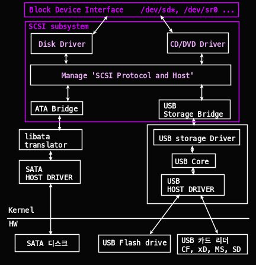
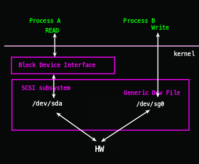

# 파일 시스템

### 파일 시스템

- VFS 레이어

  : Linux에서는 갖가지 파일 시스템을 전체적으로 이용하기 위한 Virtual Filesystem Layer

  - ext3/4 등도 VFS의 일부이다.

- 블록 레이어

  : 디바이스 드라이버를 사용해 물리 디스크에 데이터의 R/W를 담당

  - 파일 시스템의 블록 사이즈

    : 블록 레이어에 따른 디바이스 드라이버가 물리 디스크에 데이터를 R/W 하는 최소 단위

    - 물리디스크 설계상 512Byte의 섹터 단위로 하는 것이 많음(블록 사이즈)


* 파일 시스템 System call (interrupt)


* Block device


#### Block size

- Linux에서는 파일 시스템의 블록 사이즈로 1024Byte, 2048Byte, 4096Byte를 선택할 수 있다.
- 디폴트 블록 사이즈: /etc/mk23fs.conf
- mke2fs -b 옵션으로 변경 가능 하다.

```
good@code:~$ cat /etc/mke2fs.conf
[defaults]
        base_features = sparse_super,large_file,filetype,resize_inode,dir_index,ext_attr
        default_mntopts = acl,user_xattr
        enable_periodic_fsck = 0
        blocksize = 4096
        inode_size = 256
        inode_ratio = 16384

[fs_types]
        ext3 = {
                features = has_journal
        }
        ext4 = {
                features = has_journal,extent,huge_file,flex_bg,metadata_csum,64bit,dir_nlink,extra_isize
                inode_size = 256
        }
        small = {
                inode_size = 128
                inode_ratio = 4096
        }
        floppy = {
                inode_size = 128
                inode_ratio = 8192
        }
        big = {
                inode_ratio = 32768
        }
        huge = {
                inode_ratio = 65536
        }
        news = {
                inode_ratio = 4096
        }
        largefile = {
                inode_ratio = 1048576
                blocksize = -1
        }
        largefile4 = {
                inode_ratio = 4194304
                blocksize = -1
        }
        hurd = {
             blocksize = 4096
             inode_size = 128
        }

[options]

```

* 이미 생성된 파일 시스템에서 설젇오디어 있는 블럭 사이즈 확인 


### Linux 파일 시스템

#### 1. ext(ext1)

- Extended File System, 1992년 4월 리눅스 0.96c에 포함되어 발표
- 파일 시스템의 최대 크기는 2GB, 파일 이름의 길이는 255Byte까지 지원
- inode 수정과 데이터의 수정 시간 지원이 안되고, 파일 시스템이 복잡해지고 파편화되는 문제
- 현재 리눅스에서는 ext 파일 시스템은 사용되지 않음

#### 2. ext2

- ext 파일 시스템이 가지고 있는 문제를 해결하고, 1993년 1월 발표
- ext2는 ext3 파일 시스템이 도입되기 전까지, 사실상 리눅스 표준 파일 시스템
- 이론적으로 32TB까지 사용 가능

#### 3. ext3

- 2001년 11월 공개
- **저널링**(journaling) 기능을 도입 복구 기능 강화
- 블록의 크기에 따라 2~32TB까지 지원

#### 4. ext4

- 1EB(=1024∗1024TB) 이상의 볼륨과 16TB 이상의 파일을 지원
- **ext2, ext3**와 **호환성 유지**

#### 5. XFS

- e**X**tended **F**ile **S**ystem의 약자
- 1993년 실리콘 그래픽스가 가밸한 고성능 저널링 파일 시스템
- 2000년 5월 GNU GPL로 공개
- 2001년 리눅스에 이식되었고 현재 대부분의 리눅스 배포판에서 지원
- 64bit 파일 시스템으로 최대 16EB까지 지원


#### 6. 기타 파일 시스템

| File system | **기능**                                                     |
| :---------: | :----------------------------------------------------------- |
|   `msdos`   | MS-DOS 파티션을 사용하기 위한 파일 시스템                    |
|  `iso9660`  | CD-ROM, DVD의 표준 파일 시스템으로 읽기 전용으로 사용        |
|    `nfs`    | network filesystem으로 원격 서버의 디스크를 연결할 때 사용한다. |
|    `ufs`    | Unix File System으로 유닉스의 표준 파일 시스템이다.          |
|   `vfat`    | Windows 95, 98, NT를 지원하기 위한 파일 시스템, 리눅스에서 windows 파일 시스템인 FAT에 대해 전체 접근권한을 가지려면 vfat을 사용해야한다. |
|   `hpfs`    | HPFS를 지원하기 위한 파일 시스템                             |
|   `ntfs`    | Windows NTFS를 지원하기 위한 파일 시스템                     |
|   `sysv`    | 유닉스 시스템V를 지원하기 위한 파일 시스템                   |
|    `hfs`    | 맥 컴퓨터의 `hfs` 파일 시스템을 지원하기 위한 파일 시스템    |


```
good@code:~$ blkid -o list
device              fs_type   label      mount point             UUID
-----------------------------------------------------------------------------------------
/dev/sda2           ext4                 /                       9a4aa9f5-dd83-4d6d-bd1e-115483e0aed9
/dev/loop0          squashfs             /snap/0ad/251
/dev/loop1          squashfs             /snap/0ad/242
/dev/loop2          squashfs             /snap/core/11993
/dev/loop3          squashfs             /snap/core18/2253
/dev/loop4          squashfs             /snap/core20/1270
/dev/loop5          squashfs             /snap/gnome-3-34-1804/72
/dev/loop6          squashfs             /snap/bare/5
/dev/loop7          squashfs             /snap/gnome-3-34-1804/77
/dev/sda1           vfat                 /boot/efi               9039-63CA
/dev/loop8          squashfs             /snap/core/11743
/dev/loop9          squashfs             /snap/core18/2128
/dev/loop10         squashfs             /snap/gtk-common-themes/1519
/dev/loop11         squashfs             /snap/gtk-common-themes/1515
/dev/loop12         squashfs             /snap/postman/147
/dev/loop13         squashfs             /snap/gnome-3-38-2004/87
/dev/loop14         squashfs             /snap/snapd/14295
/dev/loop15         squashfs             /snap/slack/48
/dev/loop16         squashfs             /snap/snap-store/558
/dev/loop17         squashfs             /snap/slack/49
/dev/loop18         squashfs             /snap/postman/149
/dev/loop19         squashfs             /snap/snap-store/547
/dev/loop20         squashfs             /snap/snapd/13170
good@code:~$

```

#### 7. 특수 용도 파일 시스템

| **파일 시스템** | **기능**                                                     |
| --------------- | ------------------------------------------------------------ |
| `swap`          | * 스왑 영역을 관리하기 위한 스왑 파일 시스템 - Ubuntu 17.04 이후는 스왑 파일 시스템 대신, **스왑 파일**을 사용한다. |
| `tmpfs`         | - **`temporary file system`**으로 **메모리에 임시 파일을 저장하기 위한 파일 시스템**, 시스템이 재시작할 때마다 기존 내용 사라진다. - **`/run`** 디렉토리를 예로 들 수 있다. |
| `proc`          | - **`proc`** 파일 시스템으로 `/proc` 디렉토리 - 커널의 현재 상태를 나타내는 파일을 가지고 있다. - `/proc/번호` 디렉토리는 실제 PID이다. - `/proc/self`는 현재 프로세스를 나타낸다. |
| `ramfs`         | - 램디스크를 지원하는 파일 시스템                            |
| `rootfs`        | - **`rootfs`**로 **`/`** 디렉토리 - 시스템 초기화 및 관리에 필요한 내용 관리 |


### ext4 저널링

- 파일시스템이 정상적으로 종료(unmount) 되지 않았다면, 저장장치 내에 있는 모든 i-node와 bitmap 등의 metadata를 검사하여 일관성 문제를 해결한다.
  - 하지만 시간이 너무 많이든다!!

- 이를 해결하기위해 **ext3**부터 journaling 방식을 사용한다.

- File에 Write 하는 작업을 할 때, 파일시스템의 '특정 영역 저널'이라 불리는 로그를 기록한 뒤 -> **작업이 정상적으로 완료**되면 Commit 후, **실제 사용되는 영역에 기록**한다.
- 이 방법을 사용하면 시스템이 중간에 종료되어도, 종료된 위치를 보고 바로 알 수 있기 때문에 **파일 시스템 전체를 검사할 필요가 없다**

- 저널링 방식에는 로그를 기록하는 옵션에 따라 크게 3가지로 분류된다.

| **Journaling 방식** | **특징**                                                     |
| ------------------- | ------------------------------------------------------------ |
| Journal 모드        | 모든 파일 시스템 데이터 및 메타데이터 변경사항을 기록한다. 파일시스템에서 변경된 내용의 손실 가능성을 최소화한다. 데이터가 1)저널에 한번 2)파일 시스템에 한번 두 번 써지기 때문에 가장 **느리다** |
| Ordered 모드        | 파일 시스템의 **메타데이터(i-node)**에 대한 변경 사항만 기록하되, 관련 파일 시스템이 메타 데이터를 변경하기 전에 업데이트를 디스크에 flush 하여 **저널이 데이터 write와 동기화** 되도록한다. (default) |
| Write-back          | 파일시스템의 메타데이터에 대한 변경사항만 기록하되, 표준 파일 시스템 write process를 사용하여 파일 데이터 변경사항을 디스크에 write한다. 제일 빠르지만, 파일 손실 가능성이 제일 크다. |


#### Journal

- 저널 로그를 기록하는 영역은 저널링을 위한 영역에 따로 저장된다.
- Superblock의 journal inode number가 저널링을 위한, 아이노드 번호를 나타내며 일반적으로 8번이다. 저널링을 사용하지 않는 경우 Padding 되어 있다.

- 파일시스템 저널링은 디스크에 데이터를 Write 하기 전에 모든 파일시스템 변화의 로그를 보관할 수 있도록 하는 파일시스템 타입이다.
- 이 로그를 저널이라고 하며 보통 파일시스템의 할당된 공간에 있는 순환로그이다.

- 저널의 첫번째 구조를 Journal Superblock이라고 하며, 저널의 블록 크기, 저널이 스토리지에 사용 가능한 총 블록 수, 저널의 시작위치, 첫 번째 트랜잭션의 시퀀스 번호, 첫번째 저널에 대한 정보를 가지고 있다.
- 그 다음 트랜잭션이 있고 저널에대한 일반 구조정보가 있다.
- 저널의 매커니즘은 트랜잭션의 순서를 사용하여 파일시스템의 변경 사항을 추적한다.
- 트랜잭션 순서는 다음과 같이 구성된다.
- Descriptor block: 모든 트랜잭션의 시작 부분에 있는 블록
- Metadata block: 각 트랜잭션마다 하나 이상의 메타데이터 블록이 있으며, 변경 사항이 메타데이터 블록에 기록된다.
- commit block: 저널 모드에 따라 성공적인 트랜잭션의 끝을 나타낸다.
- revoke block: 작업 중 비정상적인 오류가 발생하면 revoke block이 생성되고 일관성 검사 중에 복원해야 하는 파일 시스템 목록이 유지된다.
  저널링 메커니즘은 블록 level에서 작동하며 파일시스템의 메타데이터(inode)가 약간이라도 수정되면 그 inode가 있는 전체 블록이 저널에 복사된다.

- 저널은 파일 시스템이 해제되고 다시 마운트 될 때마다 다시 시작되거나 저널이 가득 찰 때마다 순환 list처럼 첫 번째 블록을 재사용하여 다시 시작한다.
- 파일 시스템이 마운트될 때, 저널 블록 1에서 시퀀스 번호가 증가하였고 일련의 파일이 파일 시스템에 복사되었다.
- 파일을 복사 한 후, 시퀀스 번호가 순차적으로 증가한다.
- 마운트가 해지되면 다시 저널 블록 1부터 트랜잭션이 쌓아진다. 저널을 덮어 쓰면, 이전 마운트에 사용된 이전 마운트의 나머지 트랜잭션이 사라지므로 주의한다. 이미지를 마운트 할 때는 읽기전용 옵션을 사용해야 해시값이 변하지 않는다.


## Disk Device 


| **명령**              | **description**                                              | link                                                         |
| --------------------- | ------------------------------------------------------------ | ------------------------------------------------------------ |
| `$ cat /proc/devices` | **Char**acter, **Block** device 구분                         | [**/proc/devices 링크**](https://velog.io/@markyang92/devicefiles#procdevices) |
| **`$ udevadm`**       | device file의 **sysfs** 찾아줌                               | [**udevadm 링크**](https://velog.io/@markyang92/devicefile#-udevadm-디바이스장치의-sysfs를-알려줌) |
| **`$ blkid -o list`** | 디바이스 파일 / 파일 시스템 / 라벨 / 마운트포인트 / ★**UUID**★ | [**blkid 링크**](https://velog.io/@markyang92/devicefiles#-blkid--o-list) |
| **`$ lsblk`**         | 디바이스파일 / Major:Minor / RM / Size / Type /마운트포인트  | [**lsblk 링크**](https://velog.io/@markyang92/devicefiles#-lsblk) |
| **`$ lsusb`**         | USB버스/USB디바이스 번호/                                    | [**lsusb 링크**](https://velog.io/@markyang92/devicefiles#-lsusb) |

### Device

#### /proc/devices

* character, block device

```
$ cat /proc/devices
Character devices:
  1 mem
  4 /dev/vc/0
  4 tty
  4 ttyS
  5 /dev/tty
  5 /dev/console
  5 /dev/ptmx
  5 ttyprintk
  6 lp
  7 vcs
 10 misc
 13 input
 21 sg
 29 fb
 81 video4linux
 89 i2c
 99 ppdev
108 ppp
116 alsa
128 ptm
136 pts
180 usb
189 usb_device
202 cpu/msr
204 ttyMAX
216 rfcomm
226 drm
235 aux
236 cec
237 BaseRemoteCtl
238 media
239 mei
240 hidraw
241 ttyDBC
242 vfio
243 bsg
244 watchdog
245 remoteproc
246 ptp
247 pps
248 rtc
249 dma_heap
250 dax
251 dimmctl
252 ndctl
253 tpm
254 gpiochip

Block devices:
  7 loop
  8 sd
  9 md
 11 sr
 65 sd
 66 sd
 67 sd
 68 sd
 69 sd
 70 sd
 71 sd
128 sd
129 sd
130 sd
131 sd
132 sd
133 sd
134 sd
135 sd
253 device-mapper
254 mdp
259 blkext

```


#### $ blkid -o list

* `$ blkid -o list`: 디바이스파일/파일시스템/라벨/마운트포인트/★**UUID**★

```
good@code:~$ blkid -o list
device              fs_type   label      mount point             UUID
-----------------------------------------------------------------------------------------------------
/dev/sda2           ext4                 /                       9a4aa9f5-dd83-4d6d-bd1e-115483e0aed9
/dev/loop0          squashfs             /snap/0ad/251
/dev/loop1          squashfs             /snap/0ad/242
/dev/loop2          squashfs             /snap/core/11993
/dev/loop3          squashfs             /snap/core18/2253
/dev/loop4          squashfs             /snap/core20/1270
/dev/loop5          squashfs             /snap/gnome-3-34-1804/72
/dev/loop6          squashfs             /snap/bare/5
/dev/loop7          squashfs             /snap/gnome-3-34-1804/77
/dev/sda1           vfat                 /boot/efi               9039-63CA
/dev/loop8          squashfs             /snap/core/11743
/dev/loop9          squashfs             /snap/core18/2128
/dev/loop10         squashfs             /snap/gtk-common-themes/1519
/dev/loop11         squashfs             /snap/gtk-common-themes/1515
/dev/loop12         squashfs             /snap/postman/147
/dev/loop13         squashfs             /snap/gnome-3-38-2004/87
/dev/loop14         squashfs             /snap/snapd/14295
/dev/loop15         squashfs             /snap/slack/48
/dev/loop16         squashfs             /snap/snap-store/558
/dev/loop17         squashfs             /snap/slack/49
/dev/loop18         squashfs             /snap/postman/149
/dev/loop19         squashfs             /snap/snap-store/547
/dev/loop20         squashfs             /snap/snapd/13170

```


#### $ lsblk

* **`$ lsblk`**: 디바이스파일/Major:Minor/RM/Size/Type/마운트포인트

```
good@code:~$ lsblk
NAME   MAJ:MIN RM   SIZE RO TYPE MOUNTPOINT
loop0    7:0    0   1.6G  1 loop /snap/0ad/251
loop1    7:1    0   1.6G  1 loop /snap/0ad/242
loop2    7:2    0  99.4M  1 loop /snap/core/11993
loop3    7:3    0  55.5M  1 loop /snap/core18/2253
loop4    7:4    0  61.9M  1 loop /snap/core20/1270
loop5    7:5    0   219M  1 loop /snap/gnome-3-34-1804/72
loop6    7:6    0     4K  1 loop /snap/bare/5
loop7    7:7    0   219M  1 loop /snap/gnome-3-34-1804/77
loop8    7:8    0  99.3M  1 loop /snap/core/11743
loop9    7:9    0  55.4M  1 loop /snap/core18/2128
loop10   7:10   0  65.2M  1 loop /snap/gtk-common-themes/1519
loop11   7:11   0  65.1M  1 loop /snap/gtk-common-themes/1515
loop12   7:12   0 168.1M  1 loop /snap/postman/147
loop13   7:13   0 247.9M  1 loop /snap/gnome-3-38-2004/87
loop14   7:14   0  43.3M  1 loop /snap/snapd/14295
loop15   7:15   0 129.4M  1 loop /snap/slack/48
loop16   7:16   0  54.2M  1 loop /snap/snap-store/558
loop17   7:17   0 129.4M  1 loop /snap/slack/49
loop18   7:18   0 168.1M  1 loop /snap/postman/149
loop19   7:19   0    51M  1 loop /snap/snap-store/547
loop20   7:20   0  32.3M  1 loop /snap/snapd/13170
sda      8:0    0 238.5G  0 disk
├─sda1   8:1    0   512M  0 part /boot/efi
└─sda2   8:2    0   238G  0 part /
sr0     11:0    1  1024M  0 rom

```


#### $ lsusb

```
good@code:~$ lsusb
Bus 002 Device 001: ID 1d6b:0003 Linux Foundation 3.0 root hub
Bus 001 Device 005: ID 2232:1063 Silicon Motion ATIV Real HD Camera
Bus 001 Device 004: ID 8087:0a2b Intel Corp.
Bus 001 Device 003: ID 0bda:0129 Realtek Semiconductor Corp. RTS5129 Card Reader Controller
Bus 001 Device 002: ID 046d:c534 Logitech, Inc. Unifying Receiver
Bus 001 Device 001: ID 1d6b:0002 Linux Foundation 2.0 root hub
```


## Device 파일


### Block device

* 프로그램은 고정된 양을 가진 **block device**로부터 **데이터에 접근**한다.

```
good@code:~$ ls -l /dev | grep sda
brw-rw----   1 root disk      8,   0  1월 10 23:16 sda
brw-rw----   1 root disk      8,   1  1월 10 23:16 sda1
brw-rw----   1 root disk      8,   2  1월 10 23:16 sda2
```

- `sda1` 과 같은 '디바이스 파일'은 1)디바이스 파일 이며 2)block device에서 3)디스크 장치이다.
  - 디스크 장치는 아주 쉽게 **block 단위**의 데이터로 분리된다.
  - 블록 장치의 **전체 크기**는 **고정**, **idx로 정리**하기 쉽기 때문에 프로세스는 커널의 도움으로 장치의 어떤 블록이든지 *임의로 접근* 할 수 있다.
- **버퍼 캐시****를 사용**
- sda의 sda1, sda2는 각각 sda의 파티션이다.
  - *sda, sda1, sda2*는 각각의 ***Major\***, ***Minor\*** 번호를 가진다.
  - 디바이스 파일에 접근할 때, 아래와 같은 Major -> Minor 순으로 접근한다.
    - 이 번호들은 각각 1Byte만 할당되어, 디스크당 파티션 수가 제한되는 것임


#### Character Device

- **데이터 스트림**과 함께 작동된다.
- 문자를 r/w 가능하다.
  - r/w 때 커널이 장치상에서 읽고 쓰는 작업을 수행한다.
- character device는 **크기를 가지고 있지 않다**!!!!
- 컴퓨터에 직접 연결된 프린터는 character device 라고 할 수 있다.
- character device의 상호 간 작동이 이뤄지는 동안, 커널은 데이터를 장치나 프로세스에 전달한 후에 데이터를 백업하고 재컴토하지 않는다는 점에 유의한다.

- **버퍼 캐시 사용 안함**


#### Pipe Device 

- **named pipe**와 비슷하다.
- 커널 드라이버 대신 **I/O stream**의 다른 쪽에 또 다른 프로세스를 가지고 있다.

#### Socket Device

- **소켓**은 프로세스 간의 소통을 위해 자주 사용되는 특수 목적의 인터페이스다.


### SCSI 디스크 디바이스 파일 

#### /dev/sd*

- **sd**가 붙는 디바이스 파일은 스카시(SCSI) 디스크 디바이스 파일이다.
- 원래는 디스크 같은 장치들과 그 외 주변 장치들 간의 소통을 위한 HW와 프로토콜 표준으로 개발되었다.
- 전통적인 SCSI HW는 현재 사용되지 않지만, SCSI 프로토콜은 융통성이 뛰어나 현재에도 사용되고 있다.
- 시스템 상의 SCSI 장치들을 목록으로 정리하려면, sysfs 에서 제공하는 장치 경로를 나타내는 유틸리티를 사용해야한다.
  - `lsscsi` 유틸리티
- 만약 fstab 에서 직접 /dev/sdb 와 같이 명시했을 경우, /dev/sdb 가 깨지면 마운트 안됨
  - 이를 방지하기 위해 지속적으 접근할 수 있는 '보편적 고유 식별자'(Universally Unique Identifier, UUID)를 사용한다.

#### SCSI 서브시스템 

* SATA, USB 모두 scsi 서브 시스템에서 다뤄 진다. 




#### SCSI Generic devfile: `sg*`

* 만약 SCSI 디스크 디바이스 파일 하나를 읽고 쓸때를 대비한 `Generic Dev file`을 둔다.




### sysfs: 장치 경로

- **`/dev`**는 사용자 프로세스가 커널에서 지원하는 장치들을 참조하고 접속하기에 아주 편리하다.
- 하지만, 장치들이 발견되는 순서에 따라 커널이 장치들을 배정
  - 재부팅하면 **device file이 바뀔수 있음**

- 따라서 커널은 파일과 디렉터리의 시스템을 통해 **sysfs** 인터페이스를 제공한다.

#### /dev/sda 예시

```
good@code:~$ ls -al /dev/sda*
brw-rw---- 1 root disk 8, 0  1월 10 23:16 /dev/sda
brw-rw---- 1 root disk 8, 1  1월 10 23:16 /dev/sda1
brw-rw---- 1 root disk 8, 2  1월 10 23:16 /dev/sda2
```

* `/dev/sda, 8:0`
* `/dev/sda1, 8:1`
* `/dev/sda2, 8:2`


#### /sys/block

* sda의 sysfs: 

```
good@code:~$ ls -l /sys/block/sda
lrwxrwxrwx 1 root root 0  1월 11 23:09 /sys/block/sda -> ../devices/pci0000:00/0000:00:17.0/ata3/host2/target2:0:0/2:0:0:0/block/sda


```

* `$ cat dev`를 해보면 major:minor 번호 나온다.
  실제로 프로그램은 `/dev/sda`를 사용할 때, 이 곳을 사용한다.

```
$ ls -l /sys/devices/pci0000:00/0000:00:17.0/ata3/host2/target2:0:0/2:0:0:0/block/sda
$ cat  /sys/devices/pci0000:00/0000:00:17.0/ata3/host2/target2:0:0/2:0:0:0/block/sda/dev
8:0
```


#### $ udevadm: 디바이스 장치의 sysfs를  알려줌

- device file의 sysfs를 노가다로 찾기는 힘들다.
- 리눅스에서는 `udevadm`이라는 명령을 통해 쉽게 device file의 sysfs를 찾을 수 있다.

```bash
$ udevadm info --query=all --name=/dev/sda
```

```sh
good@code:~$ udevadm info --query=all --name=/dev/sda
P: /devices/pci0000:00/0000:00:17.0/ata3/host2/target2:0:0/2:0:0:0/block/sda
N: sda
L: 0
S: disk/by-id/ata-LITEON_CV1-CC256_002552101UU6
S: disk/by-path/pci-0000:00:17.0-ata-3
E: DEVPATH=/devices/pci0000:00/0000:00:17.0/ata3/host2/target2:0:0/2:0:0:0/block/sda
E: DEVNAME=/dev/sda
E: DEVTYPE=disk
E: MAJOR=8
E: MINOR=0
E: SUBSYSTEM=block
E: USEC_INITIALIZED=2512487
E: ID_ATA=1
E: ID_TYPE=disk
E: ID_BUS=ata
E: ID_MODEL=LITEON_CV1-CC256
E: ID_MODEL_ENC=LITEON\x20CV1-CC256\x20\x20\x20\x20\x20\x20\x20\x20\x20\x20\x20\x20\x20\x20\x20\x20\x20\x20\x20\x20\x20\x20\x20\x20
E: ID_REVISION=7C82001
E: ID_SERIAL=LITEON_CV1-CC256_002552101UU6
E: ID_SERIAL_SHORT=002552101UU6
E: ID_ATA_WRITE_CACHE=1
E: ID_ATA_WRITE_CACHE_ENABLED=1
E: ID_ATA_FEATURE_SET_HPA=1
E: ID_ATA_FEATURE_SET_HPA_ENABLED=1
E: ID_ATA_FEATURE_SET_PM=1
E: ID_ATA_FEATURE_SET_PM_ENABLED=1
E: ID_ATA_FEATURE_SET_SECURITY=1
E: ID_ATA_FEATURE_SET_SECURITY_ENABLED=0
E: ID_ATA_FEATURE_SET_SECURITY_ERASE_UNIT_MIN=6
E: ID_ATA_FEATURE_SET_SECURITY_ENHANCED_ERASE_UNIT_MIN=6
E: ID_ATA_FEATURE_SET_SECURITY_FROZEN=1
E: ID_ATA_FEATURE_SET_SMART=1
E: ID_ATA_FEATURE_SET_SMART_ENABLED=1
E: ID_ATA_DOWNLOAD_MICROCODE=1
E: ID_ATA_SATA=1
E: ID_ATA_SATA_SIGNAL_RATE_GEN2=1
E: ID_ATA_SATA_SIGNAL_RATE_GEN1=1
E: ID_ATA_ROTATION_RATE_RPM=0
E: ID_PATH=pci-0000:00:17.0-ata-3
E: ID_PATH_TAG=pci-0000_00_17_0-ata-3
E: ID_PART_TABLE_UUID=0cf5530d-4ff2-49db-bdc5-d95efd0a43f4
E: ID_PART_TABLE_TYPE=gpt
E: DEVLINKS=/dev/disk/by-id/ata-LITEON_CV1-CC256_002552101UU6 /dev/disk/by-path/pci-0000:00:17.0-ata-3
E: TAGS=:systemd:

```


- udevadm 은 udevd  의 관리자 툴이다.
  - `udevd` rules를 리-로드 하고 이벤트가 동작하도록 할 수 있다.
- N: 장치 노드(Node, 즉 `/dev` 파일에 주어지는 이름)
- S: `udevd`가 그 rule에 따라 `/dev`에 생성한 장치 노드로 이어지는 심볼릭 링크
- E: `udevd`가 rules에서 발췌한 장치의 추가 정보

