# PC Hardware

## Address

### 1. Everything has an address

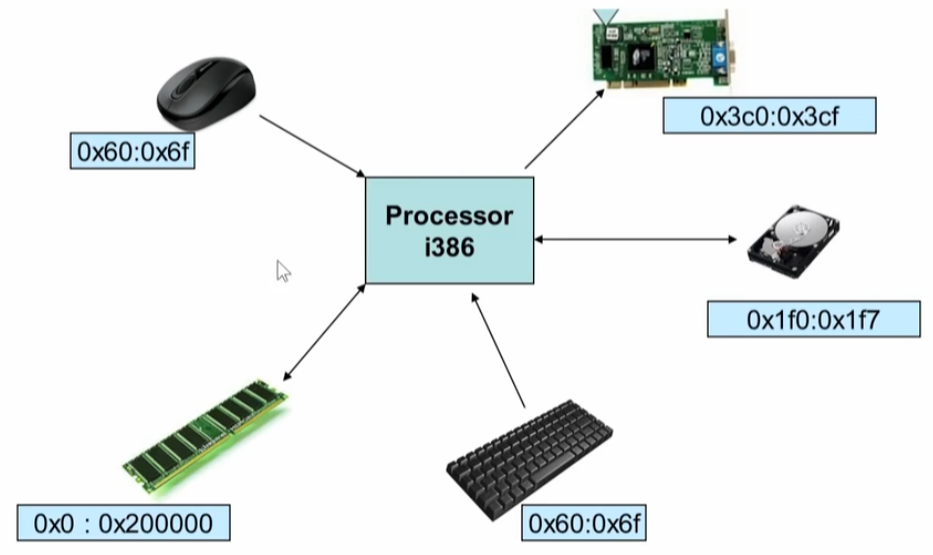

### 2. Address Types

* Memory addresses
* IO Addresses 
* Memory Mapped IO Addresses 

#### Memory Addresses 

* 그냥 우리가 알고 있는 물리적 RAM에 대해서 주소를 부여한것 

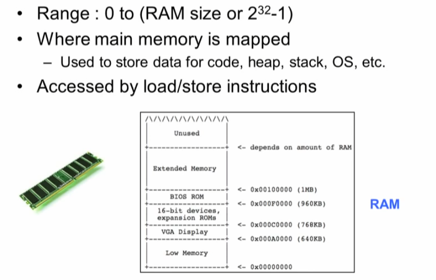

#### IO Ports

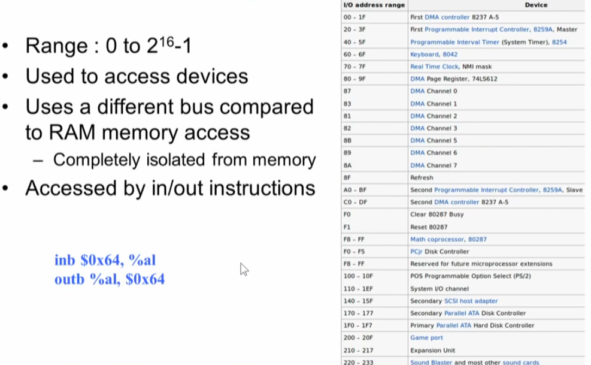

#### Memory Mapped IO

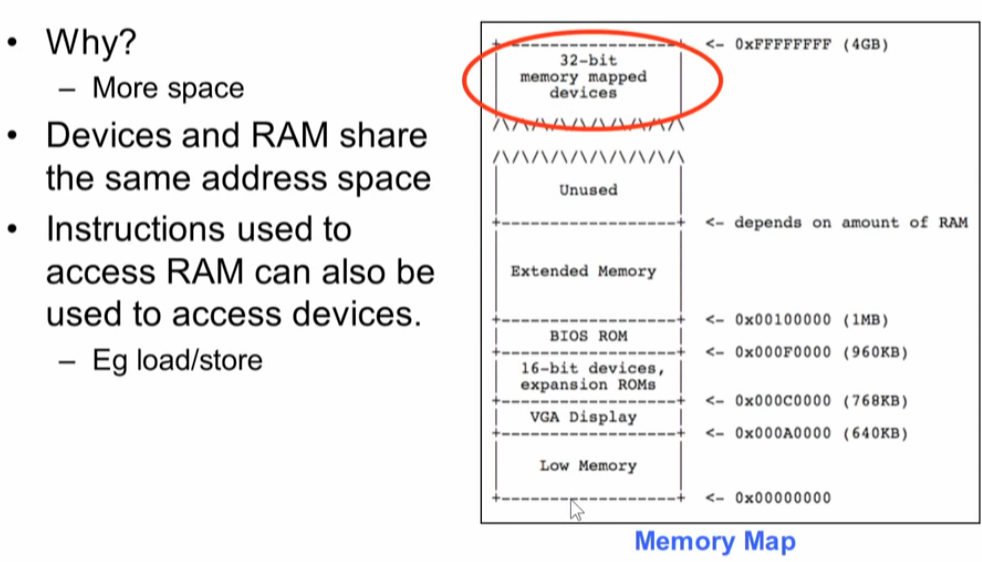

#### 누가 Address 를 결정하는가?

* Standards/Legacy
  * such as the IBM PC standard
  * Fixed for all PCs
  * Ensures BIOS and OS to be portable across platforms
* Plug and Play Devices
  * address range set by BIOS or OS
  * A device address rage may vary every time the system is restarted 

## HW 구조

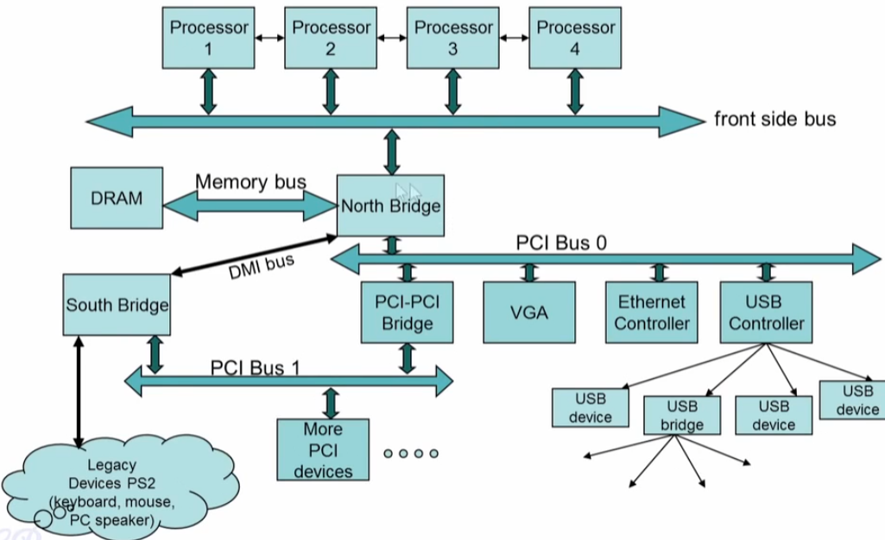

### x86 아키텍처

x86 또는 80x86은 인텔이 개발한 마이크로프로세서 계열을 부르는 말이자, 이들과 호환되는 프로세서들에서 사용한 명령어 집합 구조들을 통칭하는 말이다.

x86 또는 80x86이라는 이름은 여기에 속하는 초기의 프로세서들 이름이 모두 80으로 시작해서 86으로 끝났기 때문에 붙여졌다. 여기에는 8086, 80186, 80286, 386, 486이 포함되며, 숫자로 상표를 등록할 수 없었기 때문에 그 뒤로는 펜티엄과 같은 별도의 이름을 사용하게 되었다. 그러나 586, 686과 같은 이름은 아직까지도 (비공식적으로) 사용되며, 전체 아키텍처를 나타내는 말에도 그 흔적이 남아 있다.

x86 아키텍처를 사용하는 최초의 프로세서는 1978년에 발표된 인텔 8086으로, 이전 프로세서인 인텔 8080과 어셈블리어 단에서 호환되도록 설계되었다.[1][2] 인텔 8086은 3년 후에 IBM PC의 표준 프로세서로 채택되었다. IBM PC는 그 후로 계속 성장하여 개인용 컴퓨터 업계의 표준이 되었으며, 그에 따라 x86 아키텍처는 매우 성공적인 명령 집합 아키텍처가 되었다. 

x86 아키텍처는 가변 길이 명령을 쓰는 CISC 설계를 채용했으며, 하위 호환성에 중점을 두고 있다. x86 아키텍처는 다른 아키텍처와 같이 워드 경계에 맞춰서 메모리를 읽는 것이 효율적이긴 하지만, 워드 경계에 걸치는 메모리도 한 번에 접근할 수 있다. 워드들은 최하위 바이트부터 최상위 바이트까지 순서대로 (리틀 엔디안) 저장된다. 현재의 x86 프로세서들은 명령들을 내부적으로 더 작은 단위로 쪼개서 RISC와 비슷한 내부 아키텍처에서 수행한다.

### 8088 

* 8088 프로세스는 그냥 하위 호완성 유지를 위해서 어떻게 구성되었는지 참조하는 수준으로...

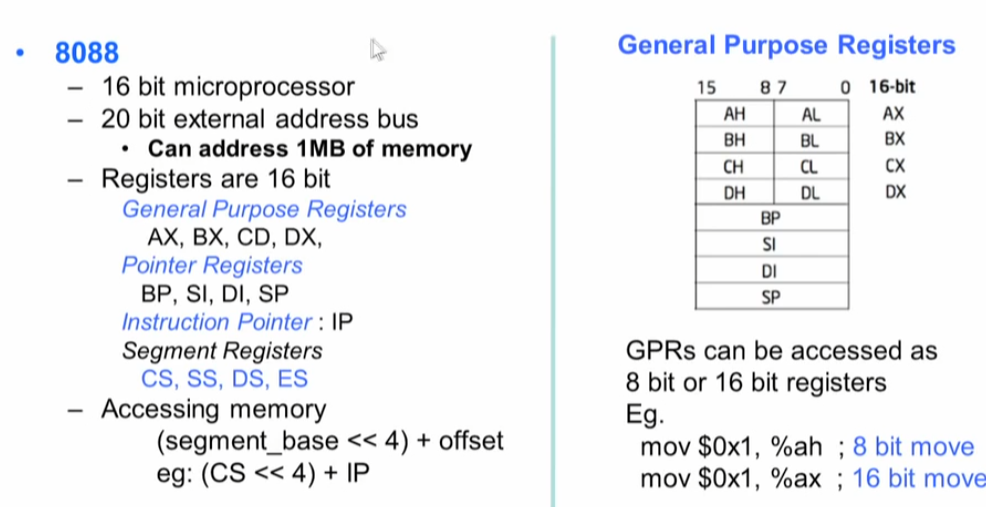

### 80386 

* xv6-public OS는  80386  QEMU 환경에서 동작하기 때문에 아키텍처를 이해할 필요가 있다. 

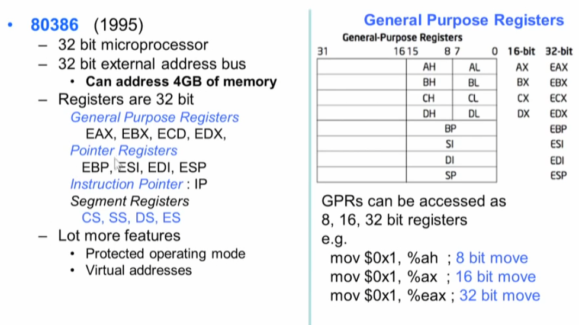

### 64bit 아키텍처

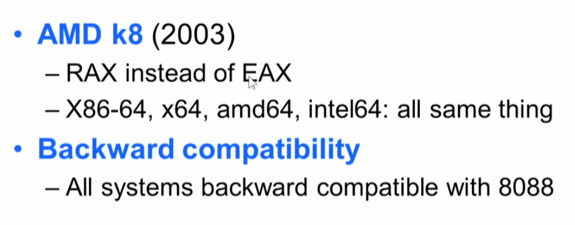

## 80x86 아키텍처

#### 레지스터의 종료와 기능

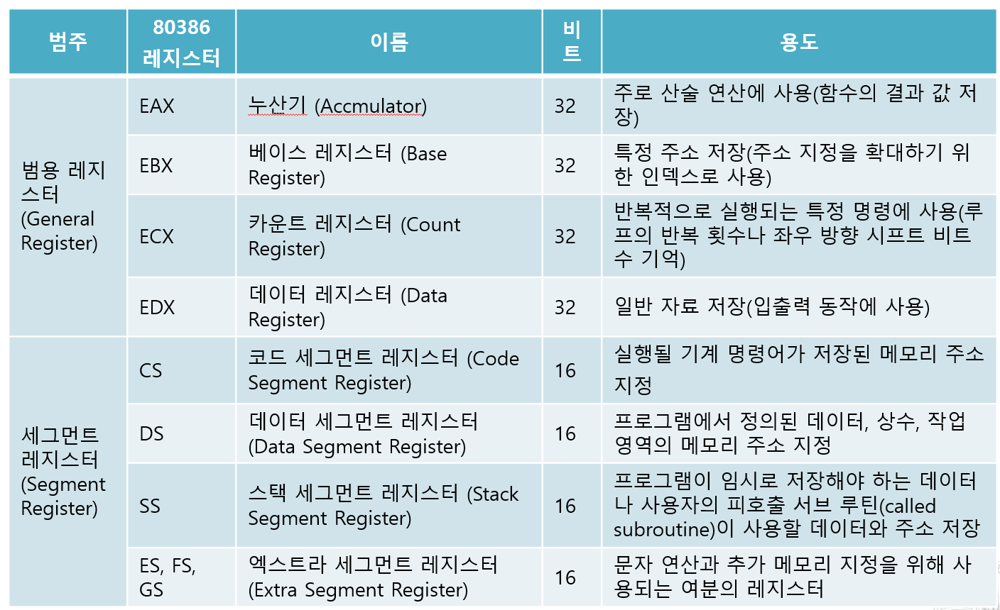

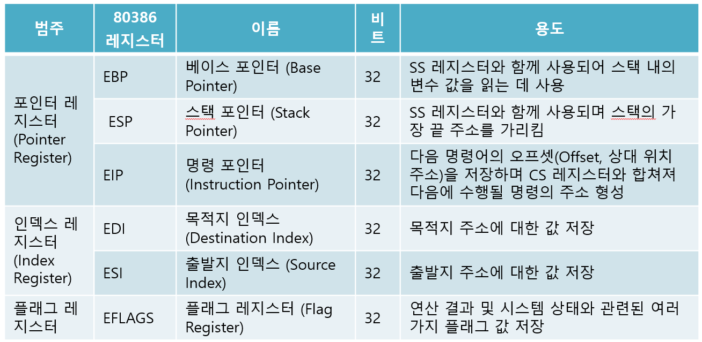

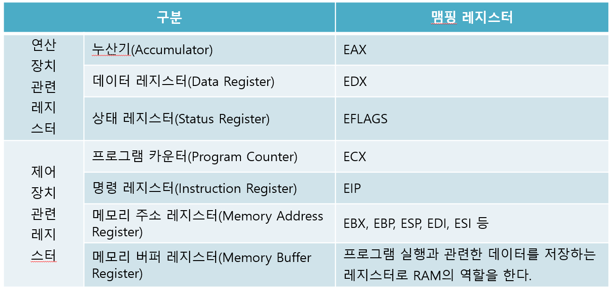

#### 범용 레지스터

### 메모리 기본 구조

<<== Text Segment 오 탈자...

### 메모리 접근 모드

#### real mode

* 물리 주소 변환 과정..

#### Protected Mode 

* 물리주소의 변환 과정은 Virtual address를 물리 주소로 변환하여 사용

### 어셈블리 문법

