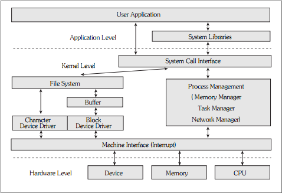
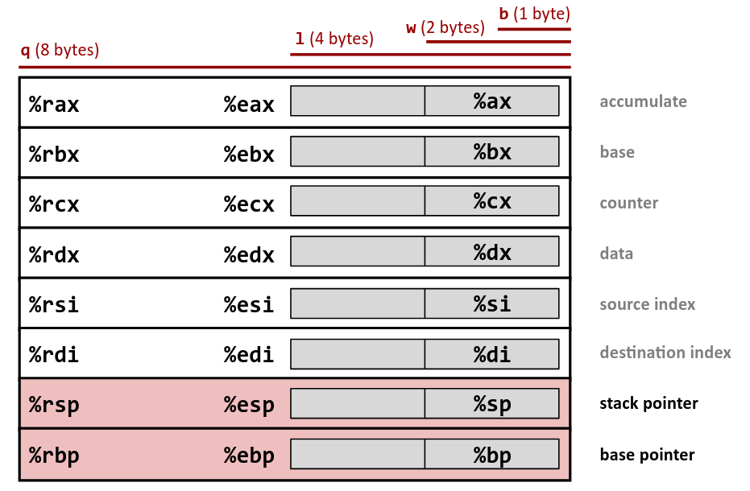
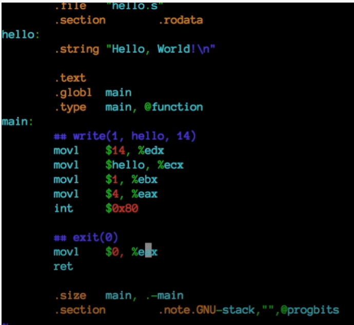
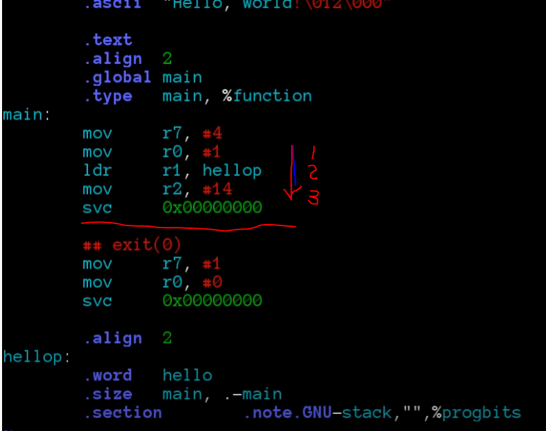
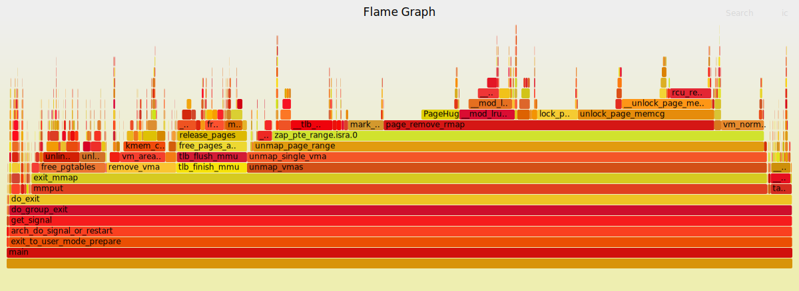

# System call

## user mode and Kernel mode

사용자 어플리케이션이 운영체제의 데이터를 수정하거나 삭제하지 못하게 접근을 막기 위해 운영체제에서는 유저 모드와 커널 모드 두 가지 프로세서 접근 모드를 지원한다. 때문에 커널 모드는 모든 시스템과 메모리에 접근이 허가된 프로세스 실행 모드이다. 커널 모드에 더 높은 권한을 부여함으로써 유저 모드에서 오류가 발생했을 때 시스템 전체의 안정성을 보장한다.



사용자가 직접적으로 하드웨어 장치를 제어한다면, 큰 문제가 발생할 수 있기 때문에, 사용자 어플리케이션은 System Call을 통해 직접적인 하드웨어 요청이나 중요한 시스템 요청을 한다. 위와 같은 구조를 통해 사용자의 프로세스가 운영체제와 데이터에 함부로 접근할 수 없도록 계층을 나누어 놓았다고 할 수 있다.


##  API, ABI, ISA

#### API : Application Program Interface 

Application Program Interface works as an interface between the operating system and application programs in the context of source code

#### ABI : Application Binary Interface 

Application Binary Interface works as an interface between the operating system and application programs in the context of object/binary code.

- Calling conventions
- [Data type](https://t4tutorials.com/data-types-in-cpp-c-plus-plus/)
- How functions arguments are passed
- How [functions return values](https://t4tutorials.com/call-by-reference-and-call-by-value-in-c-user-define-functions/) retrieved
- Program libraries
- The binary format of object files
- Exception propagation
- *Byte* *ordering*
- Register Use

#### ISA: Instruction Set Archtecture

ISA is an instruction set architecture.

* ISA is a visible part of the processor and programmer can look at the ISA because ISA works as the boundary between the hardware and software.

* ISA works as an intermediate interface between computer software and computer hardware.


## syscalls

#### man syscalls

```text
SYSCALLS(2)                                                           Linux Programmer's Manual                                                          SYSCALLS(2)

NAME
       syscalls - Linux system calls

SYNOPSIS
       Linux system calls.

DESCRIPTION
       The system call is the fundamental interface between an application and the Linux kernel.
   System calls 과 라이브러리 래퍼 함수 
       System calls are generally not invoked directly, but rather via wrapper functions in glibc (or perhaps some other library).  For details of direct invocation
       of a system call, see intro(2).  Often, but not always, the name of the wrapper function is the same as the name of the system call that it invokes.  For ex‐
       ample, glibc contains a function chdir() which invokes the underlying "chdir" system call.
```


`*ABI* ( Application Binary Interface )`


#### Architecture call Conventions

##### system call  Instruction, system call number

```
       Arch/ABI    Instruction           System  Ret  Ret  Error    Notes
                                         call #  val  val2
       ───────────────────────────────────────────────────────────────────
       alpha       callsys               v0      v0   a4   a3       1, 6
       arc         trap0                 r8      r0   -    -
       arm/OABI    swi NR                -       a1   -    -        2
       arm/EABI    swi 0x0               r7      r0   r1   -
       arm64       svc #0                x8      x0   x1   -
       i386        int $0x80             eax     eax  edx  -
       mips        syscall               v0      v0   v1   a3       1, 6
       powerpc     sc                    r0      r3   -    r0       1
       powerpc64   sc                    r0      r3   -    cr0.SO   1
       riscv       ecall                 a7      a0   a1   -
       s390        svc 0                 r1      r2   r3   -        3
       s390x       svc 0                 r1      r2   r3   -        3
       superh      trap #0x17            r3      r0   r1   -        4, 6
       sparc/32    t 0x10                g1      o0   o1   psr/csr  1, 6
       sparc/64    t 0x6d                g1      o0   o1   psr/csr  1, 6
       tile        swint1                R10     R00  -    R01      1
       x86-64      syscall               rax     rax  rdx  -        5
```


##### to pass the system call arguments

```
       Arch/ABI      arg1  arg2  arg3  arg4  arg5  arg6  arg7  Notes
       ──────────────────────────────────────────────────────────────
       arm/OABI      a1    a2    a3    a4    v1    v2    v3
       arm/EABI      r0    r1    r2    r3    r4    r5    r6
       arm64         x0    x1    x2    x3    x4    x5    -
       i386          ebx   ecx   edx   esi   edi   ebp   -
       mips/o32      a0    a1    a2    a3    -     -     -     1
       mips/n32,64   a0    a1    a2    a3    a4    a5    -
       powerpc       r3    r4    r5    r6    r7    r8    r9
       powerpc64     r3    r4    r5    r6    r7    r8    -
       riscv         a0    a1    a2    a3    a4    a5    -
       s390          r2    r3    r4    r5    r6    r7    -
       s390x         r2    r3    r4    r5    r6    r7    -
       superh        r4    r5    r6    r7    r0    r1    r2
       sparc/32      o0    o1    o2    o3    o4    o5    -
       sparc/64      o0    o1    o2    o3    o4    o5    -
       x86-64        rdi   rsi   rdx   r10   r8    r9    -
```




#### System에서 syscall  number

* 찾는 방법 : `$ ag   __NR_read  /usr/include`

* $ cat /usr/include/x86_64-linux-gnu/asm/unistd_64.h

```
#ifndef _ASM_X86_UNISTD_64_H
#define _ASM_X86_UNISTD_64_H 1

#define __NR_read 0
#define __NR_write 1
#define __NR_open 2
#define __NR_close 3
#define __NR_stat 4
#define __NR_fstat 5
#define __NR_lstat 6
#define __NR_poll 7
#define __NR_lseek 8
#define __NR_mmap 9
#define __NR_mprotect 10
...
#define __NR_pkey_alloc 330
#define __NR_pkey_free 331
#define __NR_statx 332
#define __NR_io_pgetevents 333
#define __NR_rseq 334
#define __NR_pidfd_send_signal 424
#define __NR_io_uring_setup 425
#define __NR_io_uring_enter 426
#define __NR_io_uring_register 427
#define __NR_open_tree 428
#define __NR_move_mount 429
#define __NR_fsopen 430
#define __NR_fsconfig 431
#define __NR_fsmount 432
#define __NR_fspick 433
#define __NR_pidfd_open 434
#define __NR_clone3 435

#endif /* _ASM_X86_UNISTD_64_H */
```


#### Source Code에서 syscall number

* x86_64: arch/x86/entry/syscalls/syscall_64.tbl: read is 0

* x86: arch/x86/entry/syscalls/syscall_32.tbl: read is 3

* arm64: include/uapi/asm-generic/unistd.h: read is 63,
* arm: arch/arm/tools/syscall.tbl, read is 3

##### arch/x86/entry/syscalls/syscall_64.tbl:

```
#
# 64-bit system call numbers and entry vectors
#
# The format is:
# <number> <abi> <name> <entry point>
#
# The __x64_sys_*() stubs are created on-the-fly for sys_*() system calls
#
# The abi is "common", "64" or "x32" for this file.
#
0	common	read			__x64_sys_read
1	common	write			__x64_sys_write
2	common	open			__x64_sys_open
3	common	close			__x64_sys_close
4	common	stat			__x64_sys_newstat
5	common	fstat			__x64_sys_newfstat
6	common	lstat			__x64_sys_newlstat
7	common	poll			__x64_sys_poll
8	common	lseek			__x64_sys_lseek
9	common	mmap			__x64_sys_mmap
10	common	mprotect		__x64_sys_mprotect
11	common	munmap			__x64_sys_munmap
12	common	brk			__x64_sys_brk
...
...
331	common	pkey_free		__x64_sys_pkey_free
332	common	statx			__x64_sys_statx
333	common	io_pgetevents		__x64_sys_io_pgetevents
334	common	rseq			__x64_sys_rseq
# don't use numbers 387 through 423, add new calls after the last
# 'common' entry
424	common	pidfd_send_signal	__x64_sys_pidfd_send_signal
425	common	io_uring_setup		__x64_sys_io_uring_setup
426	common	io_uring_enter		__x64_sys_io_uring_enter
427	common	io_uring_register	__x64_sys_io_uring_register
428	common	open_tree		__x64_sys_open_tree
429	common	move_mount		__x64_sys_move_mount
430	common	fsopen			__x64_sys_fsopen
431	common	fsconfig		__x64_sys_fsconfig
432	common	fsmount			__x64_sys_fsmount
433	common	fspick			__x64_sys_fspick
434	common	pidfd_open		__x64_sys_pidfd_open
435	common	clone3			__x64_sys_clone3/ptregs

#
# x32-specific system call numbers start at 512 to avoid cache impact
# for native 64-bit operation. The __x32_compat_sys stubs are created
# on-the-fly for compat_sys_*() compatibility system calls if X86_X32
# is defined.
#
512	x32	rt_sigaction		__x32_compat_sys_rt_sigaction
513	x32	rt_sigreturn		sys32_x32_rt_sigreturn
514	x32	ioctl			__x32_compat_sys_ioctl
515	x32	readv			__x32_compat_sys_readv
516	x32	writev			__x32_compat_sys_writev
517	x32	recvfrom		__x32_compat_sys_recvfrom
518	x32	sendmsg			__x32_compat_sys_sendmsg
519	x32	recvmsg			__x32_compat_sys_recvmsg
520	x32	execve			__x32_compat_sys_execve/ptregs
521	x32	ptrace			__x32_compat_sys_ptrace
522	x32	rt_sigpending		__x32_compat_sys_rt_sigpending
523	x32	rt_sigtimedwait		__x32_compat_sys_rt_sigtimedwait_time64
524	x32	rt_sigqueueinfo		__x32_compat_sys_rt_sigqueueinfo
525	x32	sigaltstack		__x32_compat_sys_sigaltstack
526	x32	timer_create		__x32_compat_sys_timer_create
527	x32	mq_notify		__x32_compat_sys_mq_notify
528	x32	kexec_load		__x32_compat_sys_kexec_load
529	x32	waitid			__x32_compat_sys_waitid
530	x32	set_robust_list		__x32_compat_sys_set_robust_list
531	x32	get_robust_list		__x32_compat_sys_get_robust_list
532	x32	vmsplice		__x32_compat_sys_vmsplice
533	x32	move_pages		__x32_compat_sys_move_pages
534	x32	preadv			__x32_compat_sys_preadv64
535	x32	pwritev			__x32_compat_sys_pwritev64
536	x32	rt_tgsigqueueinfo	__x32_compat_sys_rt_tgsigqueueinfo
537	x32	recvmmsg		__x32_compat_sys_recvmmsg_time64
538	x32	sendmmsg		__x32_compat_sys_sendmmsg
539	x32	process_vm_readv	__x32_compat_sys_process_vm_readv
540	x32	process_vm_writev	__x32_compat_sys_process_vm_writev
541	x32	setsockopt		__x32_compat_sys_setsockopt
542	x32	getsockopt		__x32_compat_sys_getsockopt
543	x32	io_setup		__x32_compat_sys_io_setup
544	x32	io_submit		__x32_compat_sys_io_submit
545	x32	execveat		__x32_compat_sys_execveat/ptregs
546	x32	preadv2			__x32_compat_sys_preadv64v2
547	x32	pwritev2		__x32_compat_sys_pwritev64v2

```


### 1. Libc 이용한 syscall

#### libc

```c
 1   #include<stdio.h>
 2   int main(void){
 3        printf("hello, World!\n");
 4        return 0;
 5   }


$ file ./hello
./hello: ELF 64-bit LSB shared object, x86-64, version 1 (SYSV), dynamically linked, interpreter /lib64/ld-linux-x86-64.so.2, BuildID[sha1]=60609435bfceccbbf3a9f686f9165ff3cd5fe032, for GNU/Linux 3.2.0, with debug_info, not stripped

$ ldd ./hello
	linux-vdso.so.1 (0x00007ffdd6594000)
	libc.so.6 => /lib/x86_64-linux-gnu/libc.so.6 (0x00007f55e6b45000) <<== C library
	/lib64/ld-linux-x86-64.so.2 (0x00007f55e6d53000                                 
```

#### objdump

```asm
$ objdump -d ./hello
                                 
00000000000011e9 <main>:
    11e9:       f3 0f 1e fa             endbr64 
    11ed:       55                      push   %rbp
    11ee:       48 89 e5                mov    %rsp,%rbp
    11f1:       ff 15 f1 2d 00 00       callq  *0x2df1(%rip)        # 3fe8 <mcount@GLIBC_2.2.5>
    11f7:       48 8d 3d 06 0e 00 00    lea    0xe06(%rip),%rdi        # 2004 <_IO_stdin_used+0x4>
    11fe:       e8 6d fe ff ff          callq  1070 <puts@plt>
    1203:       b8 00 00 00 00          mov    $0x0,%eax
    1208:       5d                      pop    %rbp
    1209:       c3                      retq   
    120a:       66 0f 1f 44 00 00       nopw   0x0(%rax,%rax,1)


jhyunlee@ubuntu20:~/code/lk/systemcall$ objdump -s -j .rodata hello

hello:     file format elf64-x86-64

Contents of section .rodata:
 2000 01000200 68656c6c 6f2c2057 6f726c64  ....hello, World    <<=== # 2004 address 
 2010 2100
```

* glib: `puts() writes the string s and a trailing newline to stdout`
* 16KB file size 

```sh
-rwxrwxr-x 1 jhyunlee jhyunlee   16696  1월  1 23:50 hello*   
-rw-rw-r-- 1 jhyunlee jhyunlee     488  1월  2 00:15 hello.c
```

* static compile 하면 더 커짐

```
$ gcc -static -o hello hello.c
-rwxrwxr-x 1 jhyunlee jhyunlee  871760  1월  2 00:28 hello*
-rw-rw-r-- 1 jhyunlee jhyunlee      93  1월  2 00:27 hello.c
```


### 2. SYS_write Call 

#### SYS_write

```c
  1 #include<sys/syscall.h>
  2 #include<unistd.h>
  3 int main(void){
  4     syscall(SYS_write, 1,"hello, World!\n",14);
  5     return 0;
  6 }
```

##### objdump -d

```
00000000000011e9 <main>:
    11e9:       f3 0f 1e fa             endbr64 
    11ed:       55                      push   %rbp
    11ee:       48 89 e5                mov    %rsp,%rbp
    11f1:       ff 15 f1 2d 00 00       callq  *0x2df1(%rip)        # 3fe8 <mcount@GLIBC_2.2.5>
    11f7:       b9 0e 00 00 00          mov    $0xe,%ecx            <<----14bytes
    11fc:       48 8d 15 01 0e 00 00    lea    0xe01(%rip),%rdx        # 2004 <_IO_stdin_used+0x4>
    1203:       be 01 00 00 00          mov    $0x1,%esi             <----- fd 번호 1번 
    1208:       bf 01 00 00 00          mov    $0x1,%edi             
    120d:       b8 00 00 00 00          mov    $0x0,%eax
    1212:       e8 69 fe ff ff          callq  1080 <syscall@plt>  
    1217:       b8 00 00 00 00          mov    $0x0,%eax
    121c:       5d                      pop    %rbp
    121d:       c3                      retq   
    121e:       66 90                   xchg   %ax,%ax

```


##### $ gcc -g -static   -o hello_sys hello_sys.c

* main 함수 찾기

```
0000000000401ce5 <main>:
  401ce5:       f3 0f 1e fa             endbr64 
  401ce9:       55                      push   %rbp
  401cea:       48 89 e5                mov    %rsp,%rbp
  401ced:       b9 0e 00 00 00          mov    $0xe,%ecx                <---- 0xE 14 byte 
  401cf2:       48 8d 15 0b 33 09 00    lea    0x9330b(%rip),%rdx        # 495004 <_IO_stdin_used+0x4>
  401cf9:       be 01 00 00 00          mov    $0x1,%esi                <------syscall fd 번호 1번
  401cfe:       bf 01 00 00 00          mov    $0x1,%edi                 
  401d03:       b8 00 00 00 00          mov    $0x0,%eax
  401d08:       e8 03 76 04 00          callq  449310 <syscall>
  401d0d:       b8 00 00 00 00          mov    $0x0,%eax
  401d12:       5d                      pop    %rbp
  401d13:       c3                      retq   
  401d14:       66 2e 0f 1f 84 00 00    nopw   %cs:0x0(%rax,%rax,1)
  401d1b:       00 00 00 
  401d1e:       66 90                   xchg   %ax,%ax

```


* syscall 함수
* syscall(SYS_write, 1,"hello, World!\n",14);
* 함수 매개 변수 전달 순서는 Calling Convention에 따라서 뒤에서 부터 전달..
* main 

```
0000000000449310 <syscall>:
  449310:       f3 0f 1e fa             endbr64 
  449314:       48 89 f8                mov    %rdi,%rax  #SYS_write -> %rax
  449317:       48 89 f7                mov    %rsi,%rdi  #1--> %rdi
  44931a:       48 89 d6                mov    %rdx,%rsi  #"hello world"  --> %rsi
  44931d:       48 89 ca                mov    %rcx,%rdx  # 14 ---> %rdx
  449320:       4d 89 c2                mov    %r8,%r10
  449323:       4d 89 c8                mov    %r9,%r8
  449326:       4c 8b 4c 24 08          mov    0x8(%rsp),%r9
  44932b:       0f 05                   syscall 
  44932d:       48 3d 01 f0 ff ff       cmp    $0xfffffffffffff001,%rax
  449333:       73 01                   jae    449336 <syscall+0x26>
  449335:       c3                      retq   
  449336:       48 c7 c1 c0 ff ff ff    mov    $0xffffffffffffffc0,%rcx
  44933d:       f7 d8                   neg    %eax
  44933f:       64 89 01                mov    %eax,%fs:(%rcx)
  449342:       48 83 c8 ff             or     $0xffffffffffffffff,%rax
  449346:       c3                      retq   
  449347:       66 0f 1f 84 00 00 00    nopw   0x0(%rax,%rax,1)
  44934e:       00 00 


```

* syscall argemtn passing 

       Arch/ABI      arg1  arg2  arg3  arg4  arg5  arg6  arg7  Notes
       ──────────────────────────────────────────────────────────────
       x86-64        rdi   rsi   rdx   r10   r8    r9    -


### 3. Assembly 

```
$ gcc -S hello_sys.c
$ mv hello_sys.s hello_sys.S
gcc -o hello_sys hello_sys.S -no-pie
$ ./hello_sys
hello, World!
```

#### syscall  x86-64

```asm
  	.file	"hello_sys.c"
	.section	.rodata
hello:
	.string	"hello, World!\n"
	.text
	.globl	main
	.type	main, @function
main:
	pushq	%rbp
	movq	%rsp, %rbp

    ## write
	movl	$14, %ecx
	movl	$hello, %edx
	movl	$1, %esi
	movl	$1, %edi
	movl	$0, %eax
	call	syscall

    ## exit 0
	movl	$0, %eax
	popq	%rbp
	ret
.size	main, .-main
	.section	.note.GNU-stack,"",@progbits
```

##### objdump 

* main 함수

```
0000000000401126 <main>:
  401126:       55                      push   %rbp
  401127:       48 89 e5                mov    %rsp,%rbp
  40112a:       b9 0e 00 00 00          mov    $0xe,%ecx
  40112f:       ba 04 20 40 00          mov    $ㅂ,%edx
  401134:       be 01 00 00 00          mov    $0x1,%esi
  401139:       bf 01 00 00 00          mov    $0x1,%edi
  40113e:       b8 00 00 00 00          mov    $0x0,%eax
  401143:       e8 e8 fe ff ff          callq  401030 <syscall@plt>   <<=== 401030 주소는 아래 "hello..."
  401148:       b8 00 00 00 00          mov    $0x0,%eax
  40114d:       5d                      pop    %rbp
  40114e:       c3                      retq   
  40114f:       90                      nop


$ objdump -s -j .rodata  hello_sys 

hello_sys:     file format elf64-x86-64

Contents of section .rodata:
 402000 01000200 68656c6c 6f2c2057 6f726c64  ....hello, World
 402010 210a00                               !.. 
```


#### x86 syscall

ABI에 따라서 system call이 서로 다르게 동작된다는 것을 보여줌. 

* edx 에 14 byte
* ecx <<- hello string pointer
* ebx <<-- 1 file FD 값
* eax <<--- 4  systemcall 4번 write
* int  <<--- interrupt ox80  호출하여 trap 



#### arm syscall

ABI에 따라서 system call 전에 prameter 입력 방법에 차이가 있음.

* R0  <<---  FD 값 전달
* R1  <<-- Hello World string pointer 전달
* R3 <<-- string  size 전달
* SVC 호출하여 system call




### 4. SYS_call by assembly

#### direct SYS_write call

```asm
#include <asm/unistd.h>
#include <syscall.h>
	.file	"hello_sys.c"
	.section	.rodata
hello:
	.string	"hello, World!\n"
	.text
	.globl	main
	.type	main, @function
main:
	pushq	%rbp
	movq	%rsp, %rbp

    ## write
	movl	$14, %edx
	movl	$hello, %esi
	movl	$1, %edi
	movl	$SYS_write, %eax
	syscall

    ## exit 0
	movl	$0, %eax
	popq	%rbp
	ret
.size	main, .-main
	.section	.note.GNU-stack,"",@progbits

```

* compile 

```
$ rm hello_sys
jhyunlee@ubuntu20:~/code/lk/systemcall$ gcc -o hello_sys hello_sys.S -no-pie
jhyunlee@ubuntu20:~/code/lk/systemcall$ ./hello_sys 
hello, World!
$ ll -l hello_sys
-rwxrwxr-x 1 jhyunlee jhyunlee 16224  1월  2 00:58 hello_sys*
```

* objdump

```
0000000000401106 <main>:
  401106:       55                      push   %rbp        <---- 모든 함수의 시작은 stack에 bp push
  401107:       48 89 e5                mov    %rsp,%rbp
  40110a:       ba 0e 00 00 00          mov    $0xe,%edx   <------- oxE ==> 14
  40110f:       be 04 20 40 00          mov    $0x402004,%esi    <------- "hello world 주소"
  401114:       bf 01 00 00 00          mov    $0x1,%edi       <<------1 
  401119:       b8 01 00 00 00          mov    $0x1,%eax
  40111e:       0f 05                   syscall 
  401120:       b8 00 00 00 00          mov    $0x0,%eax
  401125:       5d                      pop    %rbp
  401126:       c3                      retq   
  401127:       66 0f 1f 84 00 00 00    nopw   0x0(%rax,%rax,1)
  40112e:       00 00
```


#### SYS_write call

```asm
#include <asm/unistd.h>
#include <syscall.h>
	.file	"hello_sys.c"
	.section	.rodata
hello:
	.string	"hello, World!\n"
	.text
	.globl	main
	.type	main, @function
main:
	pushq	%rbp
	movq	%rsp, %rbp

    ## write
	movl	$14, %edx
	movl	$hello, %esi
	movl	$1, %edi
	movl	$SYS_write, %eax
	syscall

    ## exit 0
	movl	$0, %edi
	movl    $SYS_exit, %eax
	syscall 

.size	main, .-main
	.section	.note.GNU-stack,"",@progbits
```


* compile & objdump

```
jhyunlee@ubuntu20:~/code/lk/systemcall$ objdump -d hello_sys.o

hello_sys.o:     file format elf64-x86-64


Disassembly of section .text:

0000000000000000 <main>:
   0:	55                   	push   %rbp
   1:	48 89 e5             	mov    %rsp,%rbp
   4:	ba 0e 00 00 00       	mov    $0xe,%edx
   9:	be 00 00 00 00       	mov    $0x0,%esi
   e:	bf 01 00 00 00       	mov    $0x1,%edi
  13:	b8 01 00 00 00       	mov    $0x1,%eax
  18:	0f 05                	syscall 
  1a:	bf 00 00 00 00       	mov    $0x0,%edi
  1f:	b8 3c 00 00 00       	mov    $0x3c,%eax
  24:	0f 05                	syscall
```

* ld

```
jhyunlee@ubuntu20:~/code/lk/systemcall$ ld -o hello_sys hello_sys.o
ld: warning: cannot find entry symbol _start; defaulting to 0000000000401000
jhyunlee@ubuntu20:~/code/lk/systemcall$ ls -l
-rwxrwxr-x 1 jhyunlee jhyunlee    8928  1월  2 01:33 hello_sys
jhyunlee@ubuntu20:~/code/lk/systemcall$ ./hello_sys
hello, World!

```


* objdump 결과

```
jhyunlee@ubuntu20:~/code/lk/systemcall$ objdump -d hello_sys

hello_sys:     file format elf64-x86-64


Disassembly of section .text:

0000000000401000 <main>:
  401000:	55                   	push   %rbp
  401001:	48 89 e5             	mov    %rsp,%rbp
  401004:	ba 0e 00 00 00       	mov    $0xe,%edx
  401009:	be 00 20 40 00       	mov    $0x402000,%esi
  40100e:	bf 01 00 00 00       	mov    $0x1,%edi
  401013:	b8 01 00 00 00       	mov    $0x1,%eax
  401018:	0f 05                	syscall 
  40101a:	bf 00 00 00 00       	mov    $0x0,%edi
  40101f:	b8 3c 00 00 00       	mov    $0x3c,%eax
  401024:	0f 05                	syscall 
```


* not dynamic link file 

```
$ file hello_sys
hello_sys: ELF 64-bit LSB executable, x86-64, version 1 (SYSV), statically linked, not stripped
jhyunlee@ubuntu20:~/code/lk/systemcall$ ldd hello_sys
	동적 실행 파일이 아닙니다
```


#### _start로 수정

* no main -->  _start 위치로 변경

```asm
#include <asm/unistd.h>
#include <syscall.h>
	.file	"hello_sys.c"
	.section	.rodata
hello:
	.string	"hello, World!\n"
	.text
	.globl	_start
	.type	_start, @function
-start:
    ## write
	movl	$14, %edx
	movl	$hello, %esi
	movl	$1, %edi
	movl	$SYS_write, %eax
	syscall

    ## exit 0
	movl	$0, %edi
	movl    $SYS_exit, %eax
	syscall 

.size	main, .-main
	.section	.note.GNU-stack,"",@progbits
```

* compile 

```
$ gcc -c -o hello_sys.o hello_sys.S
$ ld -o hello_sys hello_sys.o

jhyunlee@ubuntu20:~/code/lk/systemcall$ ll -l
-rwxrwxr-x 1 jhyunlee jhyunlee    8896  1월  2 01:46 hello_sys*
```

* readelf 

```
jhyunlee@ubuntu20:~/code/lk/systemcall$ file   hello_sys
hello_sys: ELF 64-bit LSB executable, x86-64, version 1 (SYSV), statically linked, not stripped
jhyunlee@ubuntu20:~/code/lk/systemcall$ ldd hello_sys
	동적 실행 파일이 아닙니다
	
jhyunlee@ubuntu20:~/code/lk/systemcall$ readelf -l ./hello_sys
```

* objdump

```
$ objdump -d hello_sys

hello_sys:     file format elf64-x86-64


Disassembly of section .text:

0000000000401000 <_start>:
  401000:	ba 0e 00 00 00       	mov    $0xe,%edx
  401005:	be 00 20 40 00       	mov    $0x402000,%esi
  40100a:	bf 01 00 00 00       	mov    $0x1,%edi
  40100f:	b8 01 00 00 00       	mov    $0x1,%eax
  401014:	0f 05                	syscall 
  401016:	bf 00 00 00 00       	mov    $0x0,%edi
  40101b:	b8 3c 00 00 00       	mov    $0x3c,%eax
  401020:	0f 05                	syscall 

```


#### C 코드로 다시...

```c
#include <unistd.h>
#include<sys/syscall.h>

int main (void){
    syscall(SYS_write,1,"hello world\n",14);
    syscall(SYS_exit,0);
}
```


## uftrace

### uftrace code

```c
       #define _GNU_SOURCE
       #include <unistd.h>
       #include <sys/syscall.h>
       #include <sys/types.h>
       #include <signal.h>

       int
       main(int argc, char *argv[])
       {
           pid_t tid;

           tid = syscall(SYS_gettid);
           syscall(SYS_tgkill, getpid(), tid, SIGHUP);
       }
```

$ gcc -g -pg -o scall syscall.c

#### uftrace

```
$ sudo uftrace record  -K 30 ./scall
$ sudo uftrace tui  -t 8us  -N smp_apic_timer_interrupt@kernel
$ uftrace dump --flame-graph | ./flamegraph.pl > out.svg
```




#### write

```
NAME
       write - write to a file descriptor
SYNOPSIS
       #include <unistd.h>
       ssize_t write(int fd, const void *buf, size_t count);

```

##### write.c

```c
#include <unistd.h>
void main(){
    write(1, "HELLO\n",6);
}
```


```sh
jhyunlee@ubuntu20:~/code/lk/systemcall$ gcc -g -pg  -o write write.c
jhyunlee@ubuntu20:~/code/lk/systemcall$ ./write
jhyunlee@ubuntu20:~/code/lk/systemcall$ strace ./write
execve("./write", ["./write"], 0x7ffc915e1e70 /* 64 vars */) = 0
brk(NULL)                               = 0x55a1ee34f000
arch_prctl(0x3001 /* ARCH_??? */, 0x7ffcc08fc360) = -1 EINVAL (부적절한 인수)
access("/etc/ld.so.preload", R_OK)      = -1 ENOENT (그런 파일이나 디렉터리가 없습니다)
openat(AT_FDCWD, "/etc/ld.so.cache", O_RDONLY|O_CLOEXEC) = 3
fstat(3, {st_mode=S_IFREG|0644, st_size=80061, ...}) = 0
mmap(NULL, 80061, PROT_READ, MAP_PRIVATE, 3, 0) = 0x7fb8a9c2c000
close(3)                                = 0
openat(AT_FDCWD, "/lib/x86_64-linux-gnu/libc.so.6", O_RDONLY|O_CLOEXEC) = 3
read(3, "\177ELF\2\1\1\3\0\0\0\0\0\0\0\0\3\0>\0\1\0\0\0\360q\2\0\0\0\0\0"..., 832) = 832
pread64(3, "\6\0\0\0\4\0\0\0@\0\0\0\0\0\0\0@\0\0\0\0\0\0\0@\0\0\0\0\0\0\0"..., 784, 64) = 784
pread64(3, "\4\0\0\0\20\0\0\0\5\0\0\0GNU\0\2\0\0\300\4\0\0\0\3\0\0\0\0\0\0\0", 32, 848) = 32
pread64(3, "\4\0\0\0\24\0\0\0\3\0\0\0GNU\0\t\233\222%\274\260\320\31\331\326\10\204\276X>\263"..., 68, 880) = 68
fstat(3, {st_mode=S_IFREG|0755, st_size=2029224, ...}) = 0
mmap(NULL, 8192, PROT_READ|PROT_WRITE, MAP_PRIVATE|MAP_ANONYMOUS, -1, 0) = 0x7fb8a9c2a000
pread64(3, "\6\0\0\0\4\0\0\0@\0\0\0\0\0\0\0@\0\0\0\0\0\0\0@\0\0\0\0\0\0\0"..., 784, 64) = 784
pread64(3, "\4\0\0\0\20\0\0\0\5\0\0\0GNU\0\2\0\0\300\4\0\0\0\3\0\0\0\0\0\0\0", 32, 848) = 32
pread64(3, "\4\0\0\0\24\0\0\0\3\0\0\0GNU\0\t\233\222%\274\260\320\31\331\326\10\204\276X>\263"..., 68, 880) = 68
mmap(NULL, 2036952, PROT_READ, MAP_PRIVATE|MAP_DENYWRITE, 3, 0) = 0x7fb8a9a38000
mprotect(0x7fb8a9a5d000, 1847296, PROT_NONE) = 0
mmap(0x7fb8a9a5d000, 1540096, PROT_READ|PROT_EXEC, MAP_PRIVATE|MAP_FIXED|MAP_DENYWRITE, 3, 0x25000) = 0x7fb8a9a5d000
mmap(0x7fb8a9bd5000, 303104, PROT_READ, MAP_PRIVATE|MAP_FIXED|MAP_DENYWRITE, 3, 0x19d000) = 0x7fb8a9bd5000
mmap(0x7fb8a9c20000, 24576, PROT_READ|PROT_WRITE, MAP_PRIVATE|MAP_FIXED|MAP_DENYWRITE, 3, 0x1e7000) = 0x7fb8a9c20000
mmap(0x7fb8a9c26000, 13528, PROT_READ|PROT_WRITE, MAP_PRIVATE|MAP_FIXED|MAP_ANONYMOUS, -1, 0) = 0x7fb8a9c26000
close(3)                                = 0
arch_prctl(ARCH_SET_FS, 0x7fb8a9c2b540) = 0
mprotect(0x7fb8a9c20000, 12288, PROT_READ) = 0
mprotect(0x55a1ec58a000, 4096, PROT_READ) = 0
mprotect(0x7fb8a9c6d000, 4096, PROT_READ) = 0
munmap(0x7fb8a9c2c000, 80061)           = 0
brk(NULL)                               = 0x55a1ee34f000
brk(0x55a1ee370000)                     = 0x55a1ee370000
rt_sigaction(SIGPROF, {sa_handler=0x7fb8a9b5cd50, sa_mask=~[], sa_flags=SA_RESTORER|SA_RESTART|SA_SIGINFO, sa_restorer=0x7fb8a9a7e210}, {sa_handler=SIG_DFL, sa_mask=[], sa_flags=0}, 8) = 0
setitimer(ITIMER_PROF, {it_interval={tv_sec=0, tv_usec=10000}, it_value={tv_sec=0, tv_usec=10000}}, {it_interval={tv_sec=0, tv_usec=0}, it_value={tv_sec=0, tv_usec=0}}) = 0
write(1, "HELLO\n", 6HELLO
)                  = 6
setitimer(ITIMER_PROF, {it_interval={tv_sec=0, tv_usec=0}, it_value={tv_sec=0, tv_usec=0}}, NULL) = 0
rt_sigaction(SIGPROF, {sa_handler=SIG_DFL, sa_mask=[], sa_flags=SA_RESTORER, sa_restorer=0x7fb8a9a7e210}, NULL, 8) = 0
openat(AT_FDCWD, "gmon.out", O_WRONLY|O_CREAT|O_TRUNC|O_NOFOLLOW, 0666) = 3
write(3, "gmon\1\0\0\0\0\0\0\0\0\0\0\0\0\0\0\0", 20) = 20
writev(3, [{iov_base="\0", iov_len=1}, {iov_base="\240\20\0\0\0\0\0\0\264\22\0\0\0\0\0\0\210\0\0\0d\0\0\0seconds\0"..., iov_len=40}, {iov_base="\0\0\0\0\0\0\0\0\0\0\0\0\0\0\0\0\0\0\0\0\0\0\0\0\0\0\0\0\0\0\0\0"..., iov_len=272}], 3) = 313
close(3)                                = 0
exit_group(6)                           = ?
+++ exited with 6 +++

```


#### radare2 

``` asm
jhyunlee@ubuntu20:~/code/lk/systemcall$ radare2 -d  ./write
Process with PID 399453 started...
= attach 399453 399453
bin.baddr 0x562e9e2b7000
Using 0x562e9e2b7000
asm.bits 64
[0x7fb2dfe84100]> s sym.main
[0x562e9e2b81e9]> pd
            ;-- main:
            0x562e9e2b81e9      f3             invalid
            0x562e9e2b81ea      0f             invalid
            0x562e9e2b81eb      1e             invalid
            0x562e9e2b81ec      fa             cli
            0x562e9e2b81ed      55             push rbp
            0x562e9e2b81ee      4889e5         mov rbp, rsp
            0x562e9e2b81f1      ff15f12d0000   call qword [reloc.mcount] ; [0x562e9e2bafe8:8]=0
            0x562e9e2b81f7      ba06000000     mov edx, 6
            0x562e9e2b81fc      488d35010e00.  lea rsi, qword str.HELLO ; 0x562e9e2b9004 ; "HELLO\n"
            0x562e9e2b8203      bf01000000     mov edi, 1
            0x562e9e2b8208      e863feffff     call sym.imp.write
            0x562e9e2b820d      90             nop
            0x562e9e2b820e      5d             pop rbp
            0x562e9e2b820f      c3             ret
            ;-- __libc_csu_init:
            0x562e9e2b8210      f3             invalid
            0x562e9e2b8211      0f             invalid
            0x562e9e2b8212      1e             invalid
            0x562e9e2b8213      fa             cli
            0x562e9e2b8214      4157           push r15
            0x562e9e2b8216      4c8d3d832b00.  lea r15, qword obj.__frame_dummy_init_array_entry ; loc.__init_array_start
                                                                       ; 0x562e9e2bada0
            0x562e9e2b821d      4156           push r14
            0x562e9e2b821f      4989d6         mov r14, rdx
            0x562e9e2b8222      4155           push r13
            0x562e9e2b8224      4989f5         mov r13, rsi
            0x562e9e2b8227      4154           push r12
            0x562e9e2b8229      4189fc         mov r12d, edi
            0x562e9e2b822c      55             push rbp
            0x562e9e2b822d      488d2d742b00.  lea rbp, qword obj.__do_global_dtors_aux_fini_array_entry ; loc.__init_array_end
                                                                       ; 0x562e9e2bada8
            0x562e9e2b8234      53             push rbx
            0x562e9e2b8235      4c29fd         sub rbp, r15
            0x562e9e2b8238      4883ec08       sub rsp, 8
            0x562e9e2b823c      e8bffdffff     call map.home_jhyunlee_code_lk_systemcall_write.r_x
            0x562e9e2b8241      48c1fd03       sar rbp, 3
        ┌─< 0x562e9e2b8245      741f           je 0x562e9e2b8266
        │   0x562e9e2b8247      31db           xor ebx, ebx
        │   0x562e9e2b8249      0f1f80000000.  nop dword [rax]
       ┌──> 0x562e9e2b8250      4c89f2         mov rdx, r14
       ╎│   0x562e9e2b8253      4c89ee         mov rsi, r13
       ╎│   0x562e9e2b8256      4489e7         mov edi, r12d
       ╎│   0x562e9e2b8259      41ff14df       call qword [r15 + rbx*8]
       ╎│   0x562e9e2b825d      4883c301       add rbx, 1
       ╎│   0x562e9e2b8261      4839dd         cmp rbp, rbx
       └──< 0x562e9e2b8264      75ea           jne 0x562e9e2b8250
        └─> 0x562e9e2b8266      4883c408       add rsp, 8
            0x562e9e2b826a      5b             pop rbx
            0x562e9e2b826b      5d             pop rbp
            0x562e9e2b826c      415c           pop r12
            0x562e9e2b826e      415d           pop r13
            0x562e9e2b8270      415e           pop r14
            0x562e9e2b8272      415f           pop r15
            0x562e9e2b8274      c3             ret
            0x562e9e2b8275      66662e0f1f84.  nop word cs:[rax + rax]
            ;-- __libc_csu_fini:
            0x562e9e2b8280      f3             invalid
            0x562e9e2b8281      0f             invalid
            0x562e9e2b8282      1e             invalid
            0x562e9e2b8283      fa             cli
            0x562e9e2b8284      c3             ret
            0x562e9e2b8285      662e0f1f8400.  nop word cs:[rax + rax]
            0x562e9e2b828f      90             nop
            ;-- atexit:
            0x562e9e2b8290      f3             invalid
            0x562e9e2b8291      0f             invalid
            0x562e9e2b8292      1e             invalid
            0x562e9e2b8293      fa             cli
            0x562e9e2b8294      488b156d2d00.  mov rdx, qword [obj.__dso_handle] ; [0x562e9e2bb008:8]=0x4008

```


```
[0x7fb2dfe84100]> s sym.main
[0x562e9e2b81e9]> pd
[0x55ff7d2c01e9]> db 0x55ff7d2c0208
[0x55ff7d2c01e9]> v!
```

