# Process

## Create a process by cloning

* 부모 DNA를 복제하듯이  child는 parent를 복제한다.

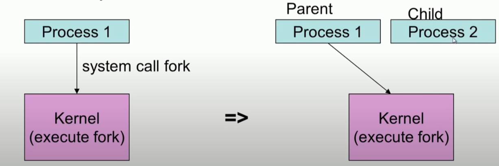


#### system call  interrupt


### 1. Fork()

* copy meta data : Page table, Kernel stack, PCB (struct proc, task_struct)
* 


##### struct proc

```c
enum procstate { UNUSED, EMBRYO, SLEEPING, RUNNABLE, RUNNING, ZOMBIE };

// Per-process state
struct proc {
  uint sz;                     // Size of process memory (bytes)
  pde_t* pgdir;                // Page table
  char *kstack;                // Bottom of kernel stack for this process
  enum procstate state;        // Process state
  int pid;                     // Process ID
  struct proc *parent;         // Parent process
  struct trapframe *tf;        // Trap frame for current syscall
  struct context *context;     // swtch() here to run process
  void *chan;                  // If non-zero, sleeping on chan
  int killed;                  // If non-zero, have been killed
  struct file *ofile[NOFILE];  // Open files
  struct inode *cwd;           // Current directory
  char name[16];               // Process name (debugging)
};
```

##### fork()

```c
// Create a new process copying p as the parent.
// Sets up stack to return as if from system call.
// Caller must set state of returned proc to RUNNABLE.
int fork(void)
{
  int i, pid;
  struct proc *np;
  struct proc *curproc = myproc();

  // Allocate process.
  if ((np = allocproc()) == 0)
  {
    return -1;
  }

  // Copy process state from proc.
  if ((np->pgdir = copyuvm(curproc->pgdir, curproc->sz)) == 0)
  {
    kfree(np->kstack);
    np->kstack = 0;
    np->state = UNUSED;
    return -1;
  }
  np->sz = curproc->sz;
  np->parent = curproc;
  *np->tf = *curproc->tf;

  // Clear %eax so that fork returns 0 in the child.
  np->tf->eax = 0;

  for (i = 0; i < NOFILE; i++)
    if (curproc->ofile[i])
      np->ofile[i] = filedup(curproc->ofile[i]);
  np->cwd = idup(curproc->cwd);

  safestrcpy(np->name, curproc->name, sizeof(curproc->name));

  pid = np->pid;

  acquire(&ptable.lock);

  np->state = RUNNABLE;

  release(&ptable.lock);

  return pid;
}
```


### 2. duplicating page tables

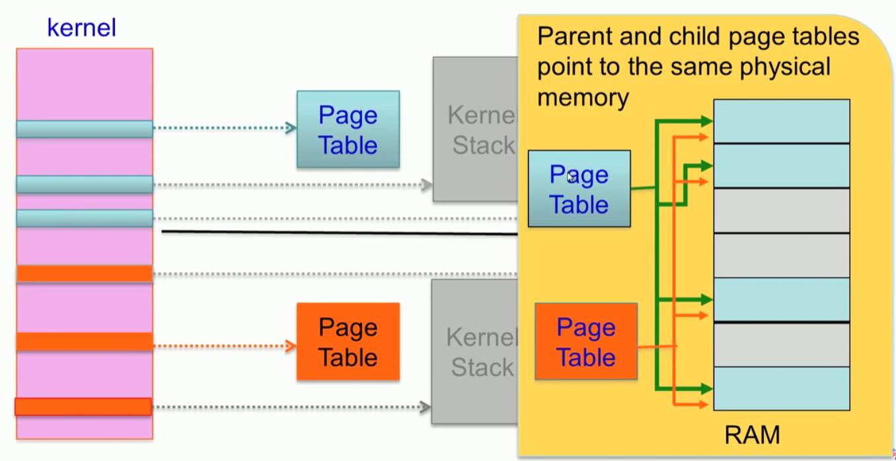


* 초기에는 부모와 자식은 동일 한 테이블 보기 때문에 같은 값을 갖는다. 
* 하지만 자식의 값이 변경될 때 COW에 의해서 참조되는 위치를 변경하게 된다. 


#### COW : copy on Write

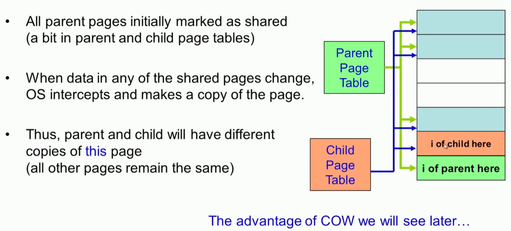

##### copyuvm (curporc->pgdir, curproc-sz)

```c
// Create a new process copying p as the parent.
// Sets up stack to return as if from system call.
// Caller must set state of returned proc to RUNNABLE.
int fork(void)
{
  int i, pid;
  struct proc *np;
  struct proc *curproc = myproc();
...
  // Copy process state from proc.
  if ((np->pgdir = copyuvm(curproc->pgdir, curproc->sz)) == 0)
  {
    kfree(np->kstack);
    np->kstack = 0;
    np->state = UNUSED;
    return -1;
  }
  np->sz = curproc->sz;
  np->parent = curproc;
  *np->tf = *curproc->tf;
...
  return pid;
}
```

* setupkvm, walkpgdir,kalloc 좀 더 봐야....

```c
// Given a parent process's page table, create a copy
// of it for a child.
pde_t *
copyuvm(pde_t *pgdir, uint sz)
{
  pde_t *d;
  pte_t *pte;
  uint pa, i, flags;
  char *mem;

  if ((d = setupkvm()) == 0) return 0;
  for (i = 0; i < sz; i += PGSIZE)
  {
    if ((pte = walkpgdir(pgdir, (void *)i, 0)) == 0) panic("copyuvm: pte should exist");
    if (!(*pte & PTE_P))  panic("copyuvm: page not present");
    pa = PTE_ADDR(*pte);
    flags = PTE_FLAGS(*pte);
    if ((mem = kalloc()) == 0) goto bad;
    memmove(mem, (char *)P2V(pa), PGSIZE);
    if (mappages(d, (void *)i, PGSIZE, V2P(mem), flags) < 0) { kfree(mem); goto bad; }
  }
  return d;

bad:
  freevm(d);
  return 0;
}
```


## Executing a new program


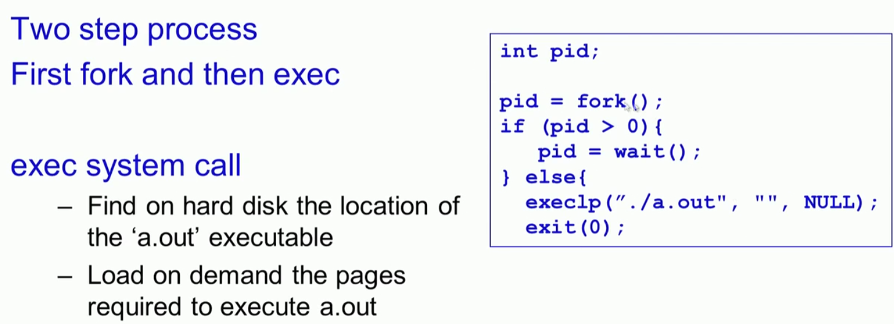


##### systemcall : sys_exec

```c
int sys_exec(void)
{
  char *path, *argv[MAXARG];
  int i;
  uint uargv, uarg;

  if(argstr(0, &path) < 0 || argint(1, (int*)&uargv) < 0){
    return -1;
  }
  memset(argv, 0, sizeof(argv));
  for(i=0;; i++){
    if(i >= NELEM(argv))
      return -1;
    if(fetchint(uargv+4*i, (int*)&uarg) < 0)
      return -1;
    if(uarg == 0){
      argv[i] = 0;
      break;
    }
    if(fetchstr(uarg, &argv[i]) < 0)
      return -1;
  }
  return exec(path, argv);
}
```

* argstr, argint, fetchint((myproc()->tf->esp) + 4 + 4 * n, ip);


#### Fork then exec


#### Advantage of Copy on Write


* shared libraries를 사용하기 때문에 COW 사용하는 것이 도움이 된다.
* 공통 라이브러리가 그만큼 많다는 이야기


#### Process tree


* who create th first process?


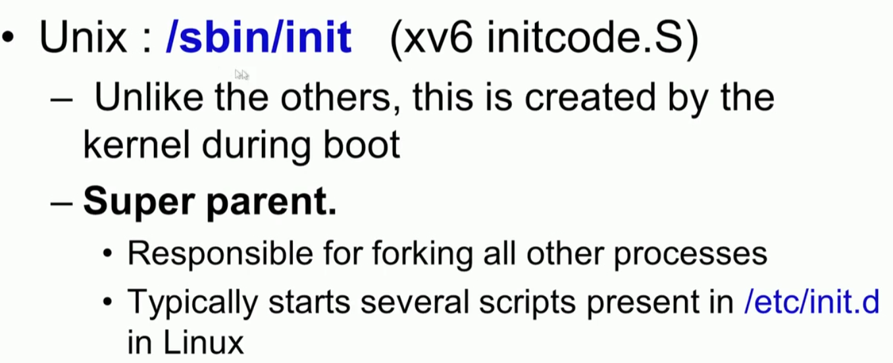


##### initcode.S

``` asm
# Initial process execs /init.
# This code runs in user space.

#include "syscall.h"
#include "traps.h"


# exec(init, argv)
.globl start
start:
  pushl $argv
  pushl $init
  pushl $0  // where caller pc would be
  movl $SYS_exec, %eax
  int $T_SYSCALL

# for(;;) exit();
exit:
  movl $SYS_exit, %eax
  int $T_SYSCALL
  jmp exit

# char init[] = "/init\0";
init:
  .string "/init\0"

# char *argv[] = { init, 0 };
.p2align 2
argv:
  .long init
  .long 0
```

##### init.c

```c
// init: The initial user-level program

#include "types.h"
#include "stat.h"
#include "user.h"
#include "fcntl.h"

char *argv[] = { "sh", 0 };

int
main(void)
{
  int pid, wpid;

  if(open("console", O_RDWR) < 0){
    mknod("console", 1, 1);
    open("console", O_RDWR);
  }
  dup(0);  // stdout
  dup(0);  // stderr

  for(;;){
    printf(1, "init: starting sh\n");
    pid = fork();
    if(pid < 0){
      printf(1, "init: fork failed\n");
      exit();
    }
    if(pid == 0){
      exec("sh", argv);
      printf(1, "init: exec sh failed\n");
      exit();
    }
    while((wpid=wait()) >= 0 && wpid != pid)
      printf(1, "zombie!\n");
  }
}
```

* dup(0) :  이것이 뭐더라. ?

* dup는 fd로 전달받은 파일 서술자를 복제하여 반환합니다. dup가 돌려주는 파일 서술자는 가장 낮은 서술자를 반환합니다. 성공시 새 파일 서술자, 오류시 -1을 반환합니다.

* dup2는 새 서술자의 값을 fd2로 지정합니다. 만일 fd2가 이미 열려있으면 fd2를 닫은 후 복제가 됩니다. 역시 성공시 새 파일 서술자, 오류시 -1을 반환합니다.

   

## Exit

#### exit()

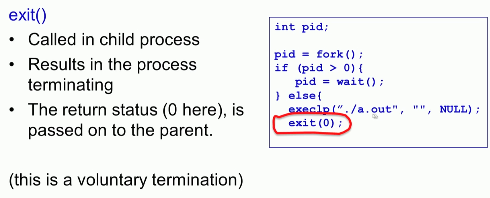


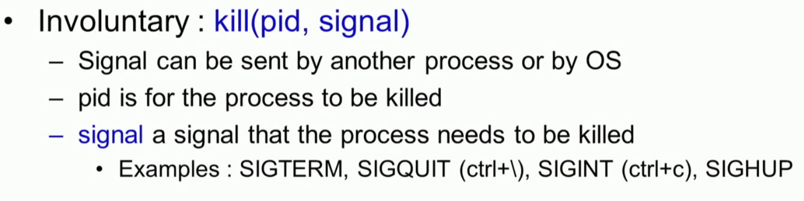


#### wait()

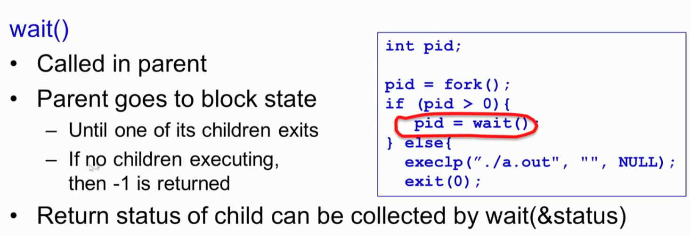

```c
// Wait for a child process to exit and return its pid.
// Return -1 if this process has no children.
int wait(void)
{
  struct proc *p;
  int havekids, pid;
  struct proc *curproc = myproc();

  acquire(&ptable.lock);
  for (;;)
  {
    // Scan through table looking for exited children.
    havekids = 0;
    for (p = ptable.proc; p < &ptable.proc[NPROC]; p++)
    {
      if (p->parent != curproc)
        continue;
      havekids = 1;
      if (p->state == ZOMBIE)
      {
        // Found one.
        pid = p->pid;
        kfree(p->kstack);
        p->kstack = 0;
        freevm(p->pgdir);
        p->pid = 0;
        p->parent = 0;
        p->name[0] = 0;
        p->killed = 0;
        p->state = UNUSED;
        release(&ptable.lock);
        return pid;
      }
    }

    // No point waiting if we don't have any children.
    if (!havekids || curproc->killed)
    {
      release(&ptable.lock);
      return -1;
    }

    // Wait for children to exit.  (See wakeup1 call in proc_exit.)
    sleep(curproc, &ptable.lock); //DOC: wait-sleep
  }
}
```


#### zombies

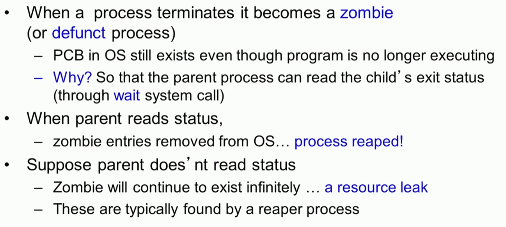

#### orphans

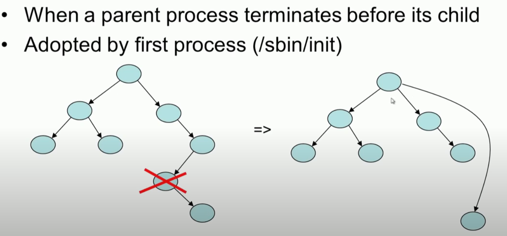


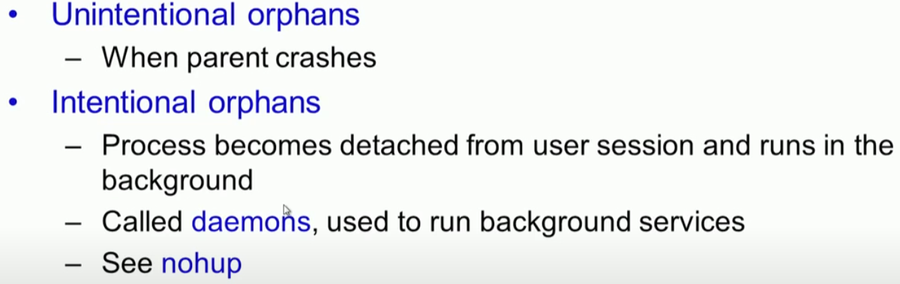


#### exit() internals

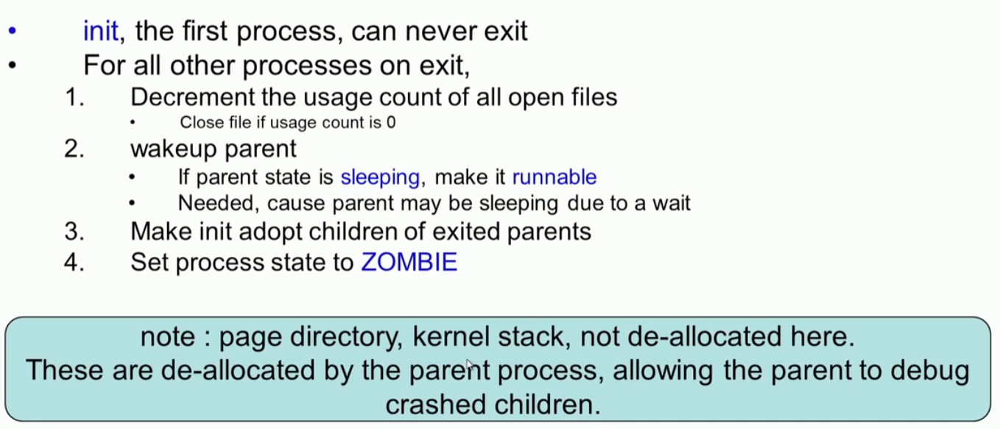

#### wait() internal

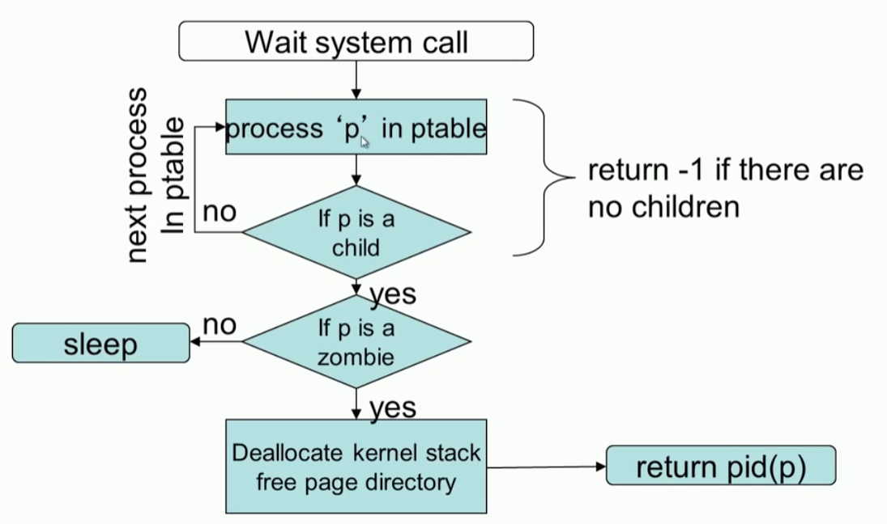

```c
// Exit the current process.  Does not return.
// An exited process remains in the zombie state
// until its parent calls wait() to find out it exited.
void exit(void)
{
  struct proc *curproc = myproc();
  struct proc *p;
  int fd;

  if (curproc == initproc)
    panic("init exiting");

  // Close all open files.
  for (fd = 0; fd < NOFILE; fd++)
  {
    if (curproc->ofile[fd])
    {
      fileclose(curproc->ofile[fd]);
      curproc->ofile[fd] = 0;
    }
  }

  begin_op();
  iput(curproc->cwd);
  end_op();
  curproc->cwd = 0;

  acquire(&ptable.lock);

  // Parent might be sleeping in wait().
  wakeup1(curproc->parent);

  // Pass abandoned children to init.
  for (p = ptable.proc; p < &ptable.proc[NPROC]; p++)
  {
    if (p->parent == curproc)
    {
      p->parent = initproc;
      if (p->state == ZOMBIE)
        wakeup1(initproc);
    }
  }

  // Jump into the scheduler, never to return.
  curproc->state = ZOMBIE;
  sched();
  panic("zombie exit");
}
```

