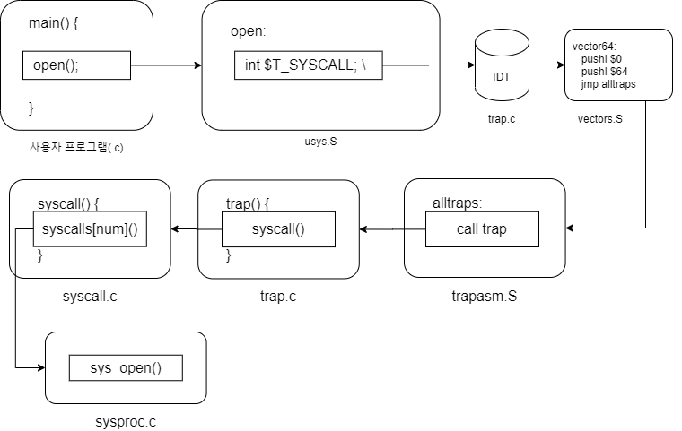
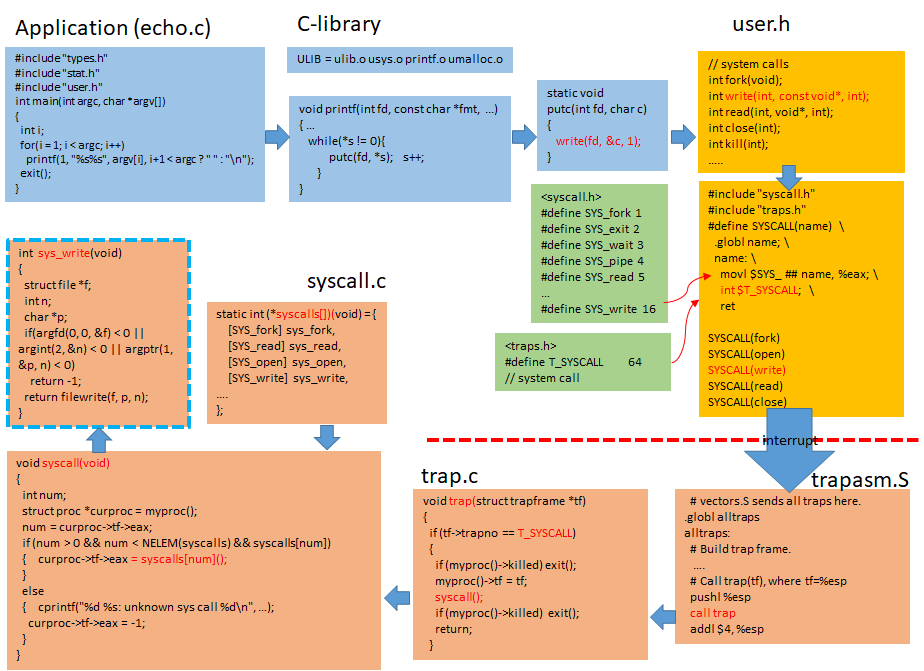
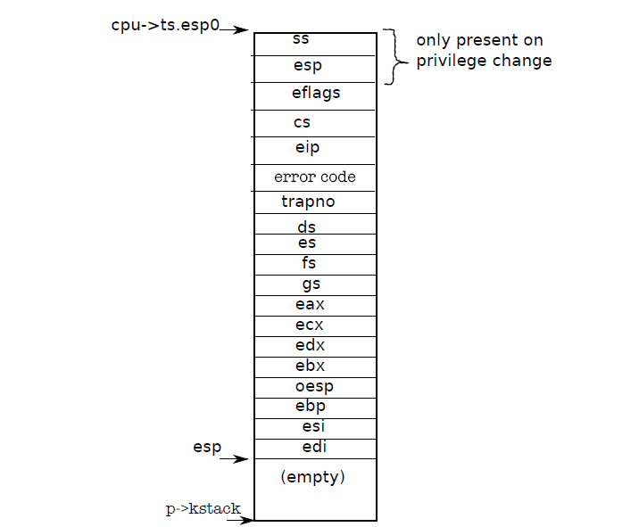
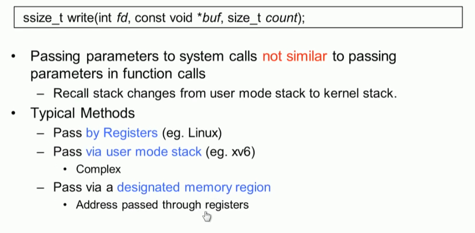
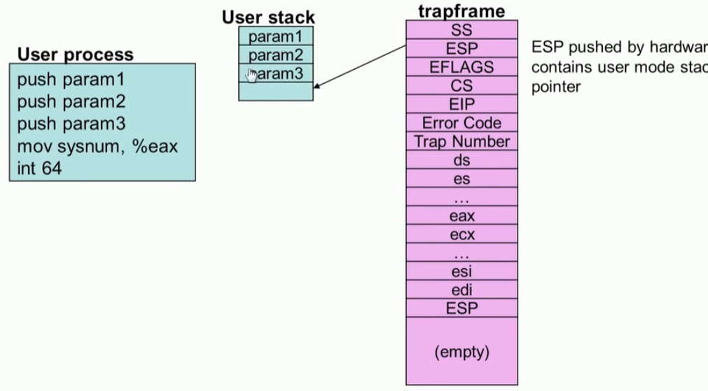
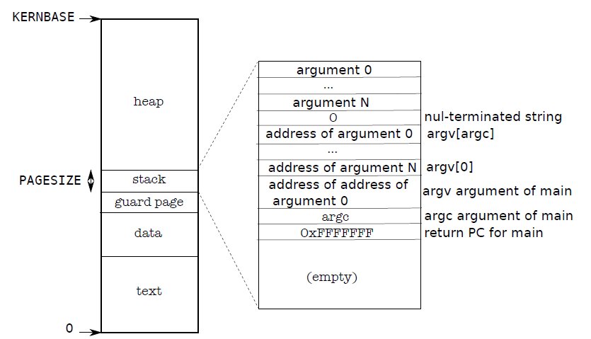
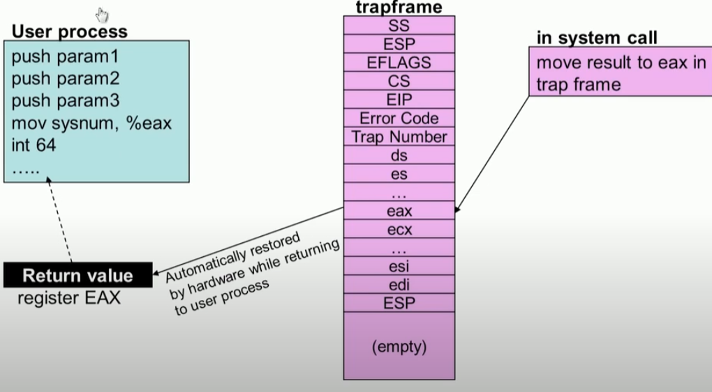

# Syscalls

## Linux system calls

* The system call is the fundamental interface between an application and the Linux kernel.

### syscall

```c
#include <unistd.h>
#include <sys/syscall.h>   /* For SYS_xxx definitions */
long syscall(long number, ...);
```

* syscall()  is a small library function that invokes the system call whose assembly language interface has the specified number with the specified arguments.  
* Employing syscall() is useful, for example,  when invoking a system call that has no wrapper function in the C library.
* syscall() saves CPU registers before making the system call, restores the registers upon return from the system call, and stores any error code returned by the system call in errno(3) if an  error  oc‐curs.
*  Symbolic constants for system call numbers can be found in the header file <sys/syscall.h>.

#### C-library 통한 syscall()

```c
#include <stdio.h>
int main(int argc, char *argv[])
{
    printf("hello world\n");
}
```


#### syscall() 직접 호출

```c
#include <unistd.h>
#include <sys/syscall.h>
#include <sys/types.h>
#include <signal.h>
int main(int argc, char *argv[])
{
    pid_t tid;
    tid = syscall(SYS_gettid);
    syscall(SYS_tgkill, getpid(), tid, SIGHUP);
}
```


## Syscall 흐름

#### open()




#### write()




### struct proc

* 프로세스 fork 될때  메모리 할당 후 clone -> exec

```c
// Per-process state
struct proc {
  uint sz;                     // Size of process memory (bytes)
  pde_t* pgdir;                // Page table
  char *kstack;                // Bottom of kernel stack for this process
  enum procstate state;        // Process state
  int pid;                     // Process ID
  struct proc *parent;         // Parent process
  struct trapframe *tf;        // Trap frame for current syscall
  struct context *context;     // swtch() here to run process
  void *chan;                  // If non-zero, sleeping on chan
  int killed;                  // If non-zero, have been killed
  struct file *ofile[NOFILE];  // Open files
  struct inode *cwd;           // Current directory
  char name[16];               // Process name (debugging)
};
```


### 커널 Stack 

* syscall() 이용한 kernel 진입 단계의 Stack
* 커널 진입후 cpu에 의해서 자동으로 채워지는 영역과 커널 코드에 의해서 채워지는 영역 있음
* 전제 조건은 이미 프로세스가 fork() 생성되어 3형제가 (kernel stack, page table, PCB)가 준비되었다고 가정하고 진행




#### 1. USER에서 kernel로 파라미터 전달




#### 2. user stack을 통한 파라미터 전달



#### 3. syscall() argc 

```c
// Fetch the nth 32-bit system call argument.
int argint(int n, int *ip)
{
  return fetchint((myproc()->tf->esp) + 4 + 4 * n, ip);
}

int fetchint(uint addr, int *ip)
{
  struct proc *curproc = myproc();

  if (addr >= curproc->sz || addr + 4 > curproc->sz)
    return -1;
  *ip = *(int *)(addr);
  return 0;
}
```


#### 4. user stack의 파라미터 전달




#### 5. return  설정




```c
int fork(void)
{
  int i, pid;
  struct proc *np;
  struct proc *curproc = myproc();

  // Allocate process.
  if ((np = allocproc()) == 0)
  {
    return -1;
  }
  ... 
  // Clear %eax so that fork returns 0 in the child.
  np->tf->eax = 0;   <<-- syscall return 설정
  ...
  return pid;
}

```

