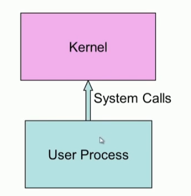

## Program,Process

### Program & Process

#### Process

* 실행 중인 프로그램
* RAM에 위치
* Executable instructions, Stack, Heap, State in the OS (in kernel)
* State Contains : registers, list of open files, etc

#### Process Memory Map

* text, data, heap, stack

#### Kernel memory map

* user program cannot access kernel memory area
* 왜 0xFE00 0000 일까?  0x100 0000

### system call

* 시스템 콜은 trap을 이용해서 커널에 있는 함수를 호출한다. 
* 시스템 콜은 프로세서 사용자 모드에서 Privileged 모드로  변경된다.
* 시스템 콜이 완료되면 user mode로 되돌아 온다. 

#### trap handler

* 시스템 콜은 인터럽트를 발생 시키고 이것은 trap이다. 
* 이 trap을 처리하는 것은 인터럽트 핸들러 (인터럽트 처리기)에서 한다.

#### system call vs procedure call

| System call                                   | Procedure Call                  |
| --------------------------------------------- | ------------------------------- |
| TRAP instruction ( int 0x80 )                 | CALL  instruction 이용          |
| System shifts from user space to kernel space | user space에서 처리 (변경 없음) |
| TRAP은 언제나 고정된 주소로 jump 한다.        | Re-locatable address            |

* system call은 사용자에게  OS 에 대한 인터페이스를 제공한다.
* OS 가 지원해야하는 시스템 콜의 종류
  * 세련된 기능
  * 필요한 것은 무엇이든지 간단하고 추상적인 것
  * 일반 설계의 목표 :  일반성을 제공하기 위한 결합 가능한 몇가지 메커니즘?

#### monolithic structure

#### microkernel

