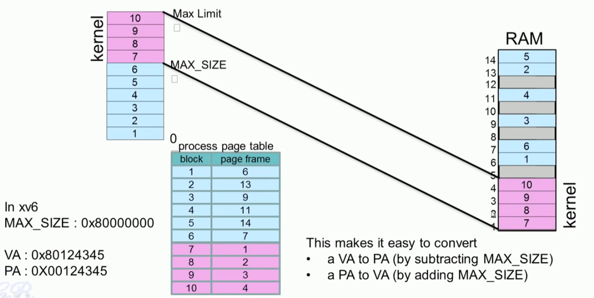

### 프로세스의  Address Space

#### 1. Application memory Map


#### 2. Virtual address Map 


#### 3. Kernel Memory 위치

* Virtual memory 에서는 MAX_SIZE 위쪽에 위치
* 물리 메모리에서는 page frame에 연속적 공간에 위치 (주소 변환을 쉽게 하기위해서)


#### 4. Kernel 주소와 User  program 주소

* 사용자 주소 공간은 사용자 주소 공간만 Access 가능
* 커널 주소 공간은 사용자 주소 공간을 포함하여 Access 가능
* 시스템 호출시 파라미터 전달


#### 5. 연속공간에 할당되는 커널 주소

* 왜 커널은 연속 메모리에 매핑하는가?

* 주소 변환을 좀 쉽게 할 수 있기 때문이다.

  




```c
#define EXTMEM  0x100000            // Start of extended memory
#define PHYSTOP 0xE000000           // Top physical memory
#define DEVSPACE 0xFE000000         // Other devices are at high addresses

// Key addresses for address space layout (see kmap in vm.c for layout)
#define KERNBASE 0x80000000         // First kernel virtual address
#define KERNLINK (KERNBASE+EXTMEM)  // Address where kernel is linked

#define V2P(a) (((uint) (a)) - KERNBASE)
#define P2V(a) ((void *)(((char *) (a)) + KERNBASE))

#define V2P_WO(x) ((x) - KERNBASE)    // same as V2P, but without casts
#define P2V_WO(x) ((x) + KERNBASE)    // same as P2V, but without casts
```


#### 6. Multi-Process 환경에서 Kernel 주소

* 커널의 주소 공간은 모든 프로세스에서 공유한다. 
* 모든 프로세스의 페이지 변환 테이블에서 같은 주소로 변환된다. 


#### 7. kernel data

* 프로세스 가 만들어 지면 반드시 커널에 생성되는 커널 데이터가 있다. 
  * PCB, 
  * 커널 스텍
  * 페이지  테이블 
* 모든 프로세스는 이 3가지를 커널에서 관리한다. 


#### 8. Process Stack과 Kernel Stack

* 모든 Process는 2개의 스텍을 가진다. 
* 더 중요한 것은 커널 스텍이다. 
* User Stack은 Application 함수 호출할때 사용한다.
* Kernel Stack은 커널에 인터럽트 걸어서 커널로 진입하여 해당 프로세스가 커널 모드에서 동작할 때 사용하다. 
* 사용자 모드에서 커널 모드로 진입할 때는 사용자의 CPU 상태를 Trapframe에 저장하는데. 이것은  CPU에 의해서 자동으로 저장되는 부분과 커널 코드에 의해서 자장되는 부분으로 구성된다.
* 커널로 진입할때 변수 전달은 xv6는 사용자  스택에 저장하는 방식을 쓰고, Linux에서는 register를 통해 매개 변수를 전달하는 방식을 사용한다.  
* Kernel 모드로 동작하다가 또 다른 인터럽트가 걸리게 되면 Context 스위칭하게 된다.


#### 9. PCB : struct proc

* xv6: struct porc 


<proc.h>

```go
enum procstate { UNUSED, EMBRYO, SLEEPING, RUNNABLE, RUNNING, ZOMBIE };

// Per-process state
struct proc {
  uint sz;                     // Size of process memory (bytes)
  pde_t* pgdir;                // Page table
  char *kstack;                // Bottom of kernel stack for this process
  enum procstate state;        // Process state
  int pid;                     // Process ID
  struct proc *parent;         // Parent process
  struct trapframe *tf;        // Trap frame for current syscall
  struct context *context;     // swtch() here to run process
  void *chan;                  // If non-zero, sleeping on chan
  int killed;                  // If non-zero, have been killed
  struct file *ofile[NOFILE];  // Open files
  struct inode *cwd;           // Current directory
  char name[16];               // Process name (debugging)
};

```

```
struct
{
  struct spinlock lock;
  struct proc proc[NPROC];
} ptable;
```

```c
//PAGEBREAK: 17
// Saved registers for kernel context switches.
// Don't need to save all the segment registers (%cs, etc),
// because they are constant across kernel contexts.
// Don't need to save %eax, %ecx, %edx, because the
// x86 convention is that the caller has saved them.
// Contexts are stored at the bottom of the stack they
// describe; the stack pointer is the address of the context.
// The layout of the context matches the layout of the stack in swtch.S
// at the "Switch stacks" comment. Switch doesn't save eip explicitly,
// but it is on the stack and allocproc() manipulates it.
struct context {
  uint edi;
  uint esi;
  uint ebx;
  uint ebp;
  uint eip;
};
```


##### PID

* porcess Identifier
* Number incremented sequentially
* Need to ensure each process has a unique PID

```c
//  Look in the process table for an UNUSED proc.
//  If found, change state to EMBRYO and initialize
//  state required to run in the kernel.
//  Otherwise return 0.
static struct proc *
allocproc(void)
{
  ...
  for (p = ptable.proc; p < &ptable.proc[NPROC]; p++)
    if (p->state == UNUSED)
      goto found;
  ...
found:
  p->state = EMBRYO;
  p->pid = nextpid++;
  ...
}
```

* pid 할당하는 것은 ptable에서 미사용을 찾아서 그것을 할당한다. 


##### Process States


#### 10. process Scheduling 

* 스케쥴러가 있다는 것, CPU마다 한개의 스케쥴러가 있다. 
* CPU 사용시간 vruntime이 만료되거, 스스로 양보하거나 할 경우 스케쥴러에게 Context Switch 하게 된다.
* 스케쥴러가 동작해서 어느 Process가 가장 우선 순위가 높은지 확인한다.
* 당연히 vruntime이 가장 작은 것이 우선순위가 높다. 
* 자료구조 O(1)에 의해 찾는다.
* 선택된 프로세스로 Context Switch 한다. 


#### 11. PCB 항목

* trapfram, context 정보를 가지고 있다. 

* 커널 스텍의 일부로 위치한다. 

* 프로세스의 모든 Register 정보를 저장한다. 

* Context Switch 이후 process 재시작을 위해서 사용된다. 

  


```c
// Per-process state
struct proc {
  uint sz;                     // Size of process memory (bytes)
  pde_t* pgdir;                // Page table
  char *kstack;                // Bottom of kernel stack for this process
  enum procstate state;        // Process state
  int pid;                     // Process ID
  struct proc *parent;         // Parent process
  struct trapframe *tf;        // Trap frame for current syscall
  struct context *context;     // swtch() here to run process
  void *chan;                  // If non-zero, sleeping on chan
  int killed;                  // If non-zero, have been killed
  struct file *ofile[NOFILE];  // Open files
  struct inode *cwd;           // Current directory
  char name[16];               // Process name (debugging)
};
```

* 실제 xv6에서 Proc이 만들어지고 kernel stack에 채워지는 내용은 아래 그림을 참조 한다. 

```c
static struct proc *
allocproc(void)
{
  struct proc *p;
  char *sp;

  acquire(&ptable.lock);

  for (p = ptable.proc; p < &ptable.proc[NPROC]; p++)
    if (p->state == UNUSED)  goto found;
  release(&ptable.lock);
  return 0;

found:
  p->state = EMBRYO;
  p->pid = nextpid++;

  release(&ptable.lock);

  // Allocate kernel stack.
  if ((p->kstack = kalloc()) == 0)
  {
    p->state = UNUSED;
    return 0;
  }
  sp = p->kstack + KSTACKSIZE; //#define KSTACKSIZE 4096 //kernel stack size

  // Leave room for trap frame.
  sp -= sizeof *p->tf;
  p->tf = (struct trapframe *)sp;

  // Set up new context to start executing at forkret,
  // which returns to trapret.
  sp -= 4;
  *(uint *)sp = (uint)trapret;

  sp -= sizeof *p->context;
  p->context = (struct context *)sp;
  memset(p->context, 0, sizeof *p->context);
  p->context->eip = (uint)forkret;

  return p;
}
```


#### 12. Process 저장 (xv6)

* in a globally defined array present in ptable
* NPROC is th maximum number of processes that can be presetn in the system  `#define NPROC 64`
* Also present in ptable is a lock that  is a lock that serializes access to the array 

```c
struct
{
  struct spinlock lock;
  struct proc proc[NPROC];
} ptable;
```


