# Interrupt

## Event 기반 OS

#### OS&Events

* 커널은 Event 기반 아키텍처 이다.
* 오직 interrupt에 의해서만 동작된다. 

### Events 종류

1. 하드웨어 인터럽트
2. 트랩 : software interrupts 
3. Exceptions

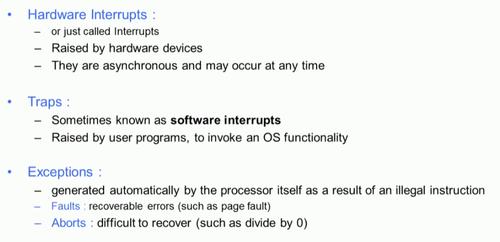

## Hardware Interrupts 

#### 1. Multiple devices 

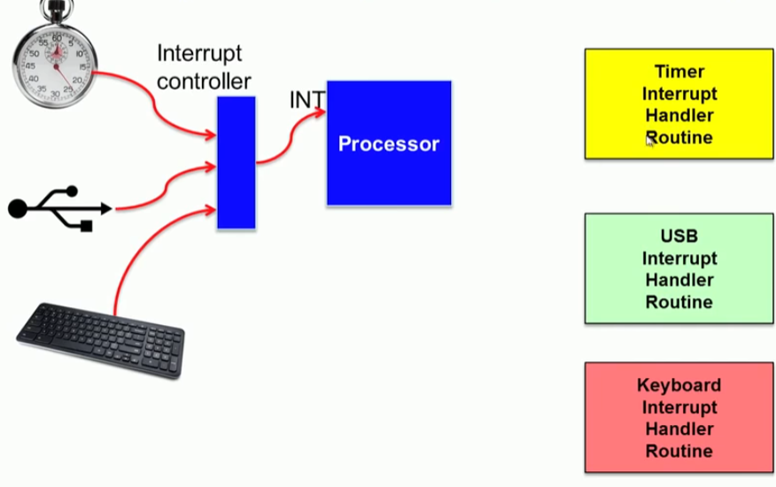

#### 2. interrupt handler routine 

#### 3. Programmable Interrupt Controller 

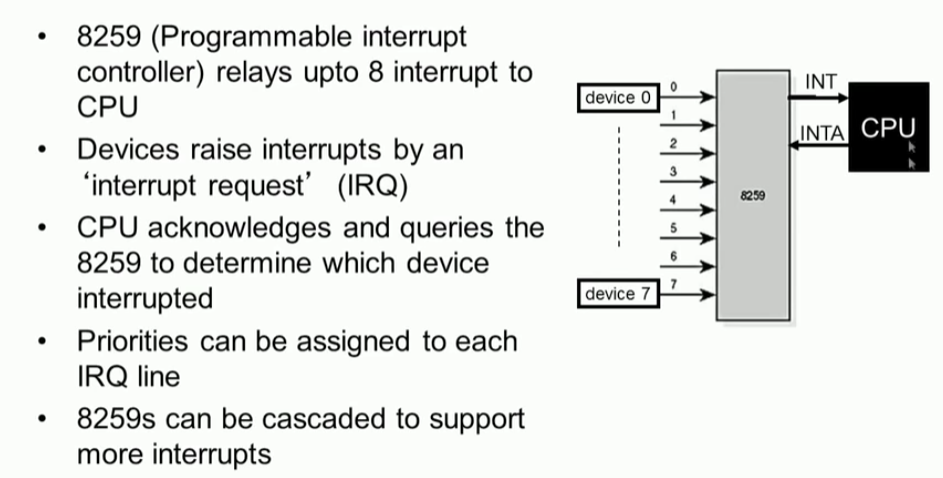

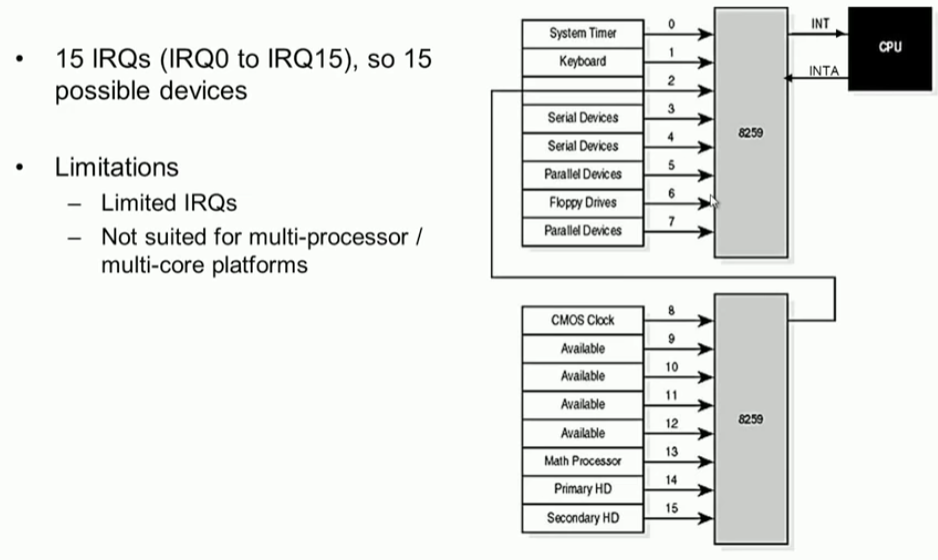

#### 4. APIC

* advanced Programmable Interrupt

* External interrupts are routed from peripherals to CPUs in multi processor systems through APIC 
* APIC distributes and priotitizes interrupts to processors
* Comprises of two components
  * local APIC (LAPIC)
  * I/O  APIC
* APIC communicate through a special 3-wire APICS bus 

##### 1. LAPIC

* Receives interrups from I/O APIC and routes it to the local CPU
* Can also receive local interrupts (such as from themal sensor, internal timer, etc)
* Send and receive IPIs (inter processor interrupts)
  * IPIs used to distribute interrupts between processors or execute system wide functions like booting, load distribution, etc

##### 2. I/O APIC

* present in chipset (north bridge)
* used to route external interrupt to local APIC 

### 

#### 5. IDTR : interrupt descriptor table

#### 6. interrupt trap gate

#### 7. interrupt descriptor 

#### 8. Exception and interrupt vectors in x86

## Interrupt handling 

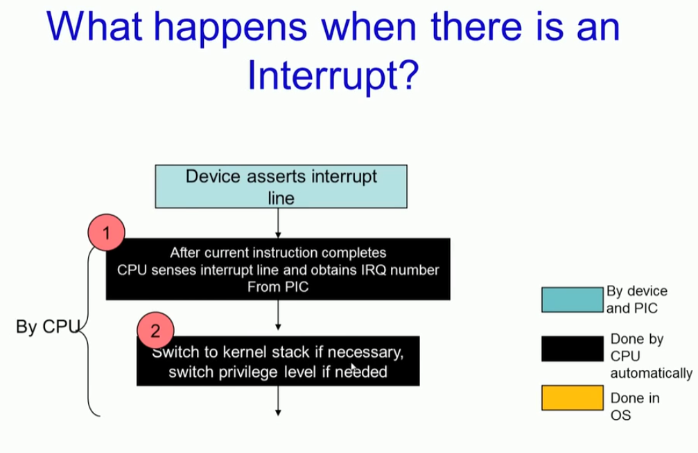

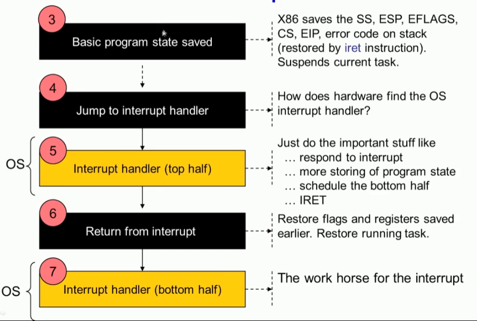

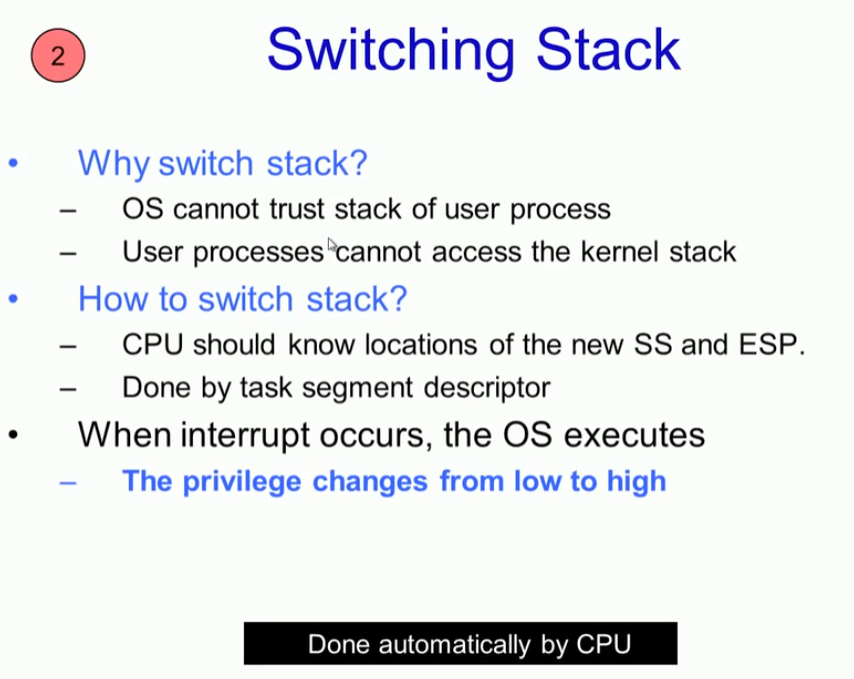

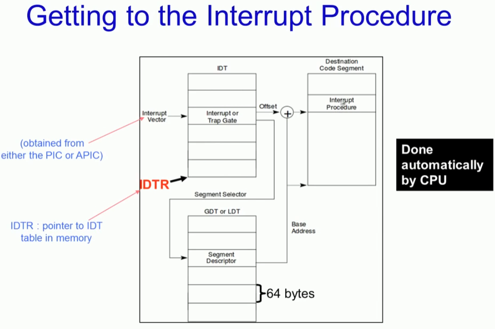

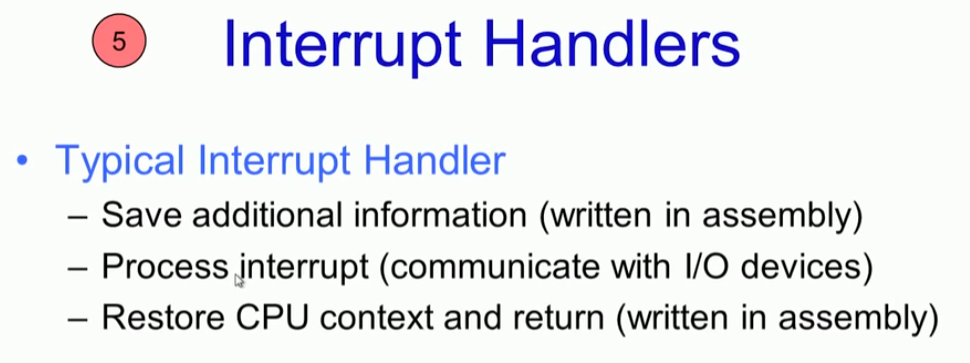

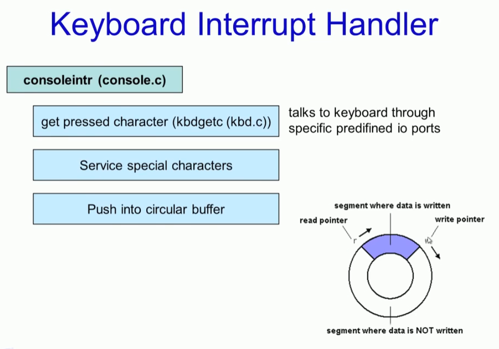

## Software Interrupt

### hardware vs Software interrupt

#### Software interrupt 

* software interrupt used fot implementing system calls
  * in linux Int 128
  * in xv6  int 64 

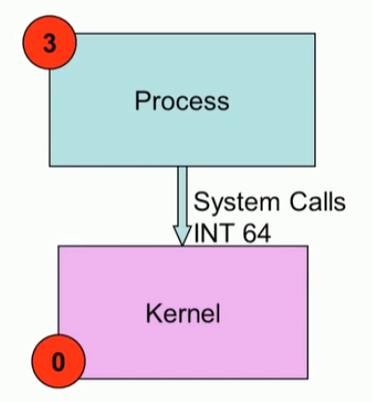

### system call : example

#### 1. write system call 

#### 2. System  call in xv6

#### 3. system call number

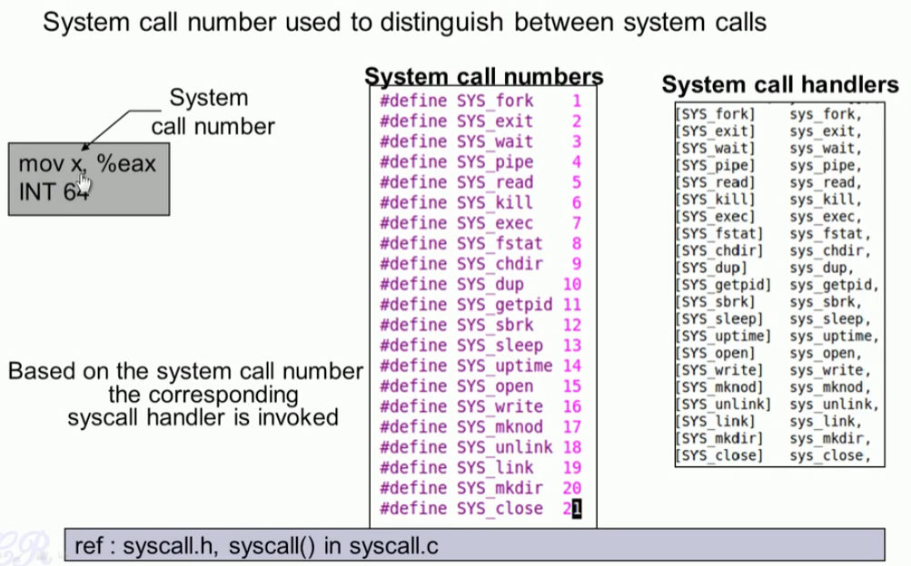

#### 4. prototype of a typical system call 

#### 5. passing parameters in system call

#### 6. pass by register (linux)

* 내가 System call 할때 상태를 저장하는 것과 파라미터를 전달하는 것을 혼동 했구나.

#### 7. pass via user stack (xv6)

#### 8. return from system call

