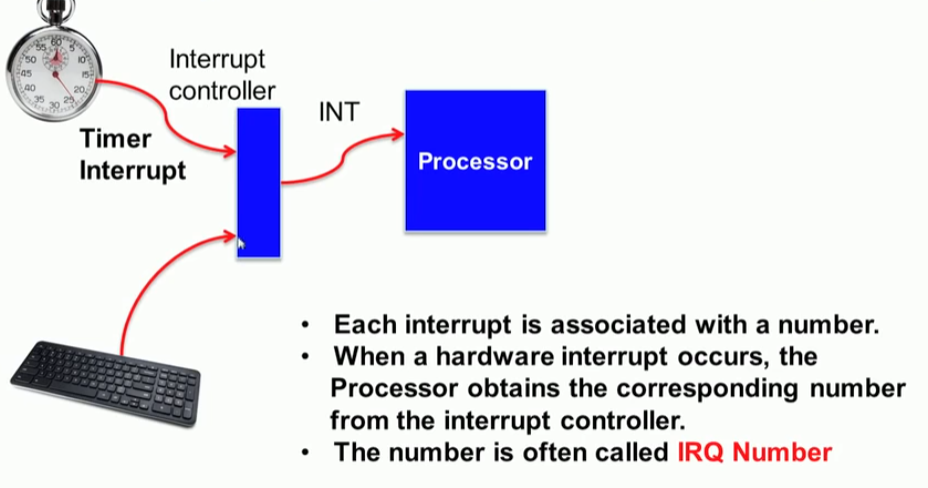
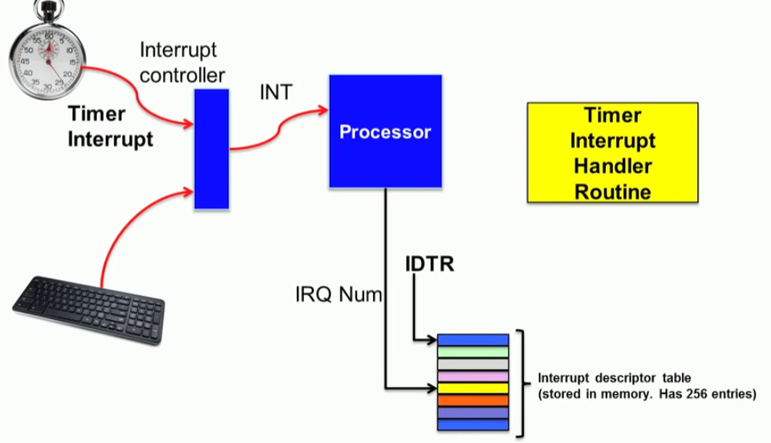
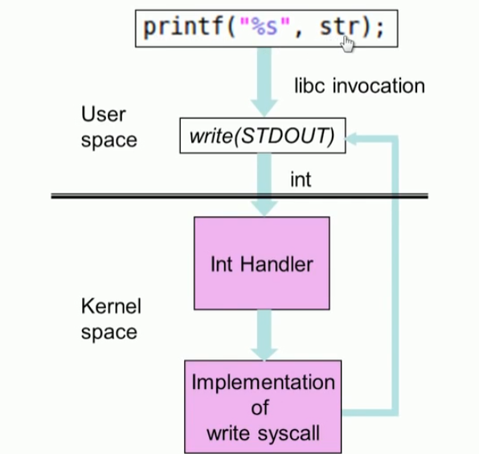
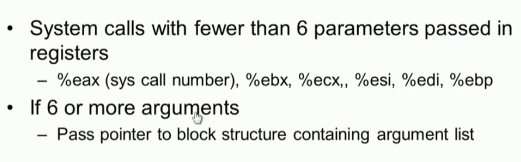
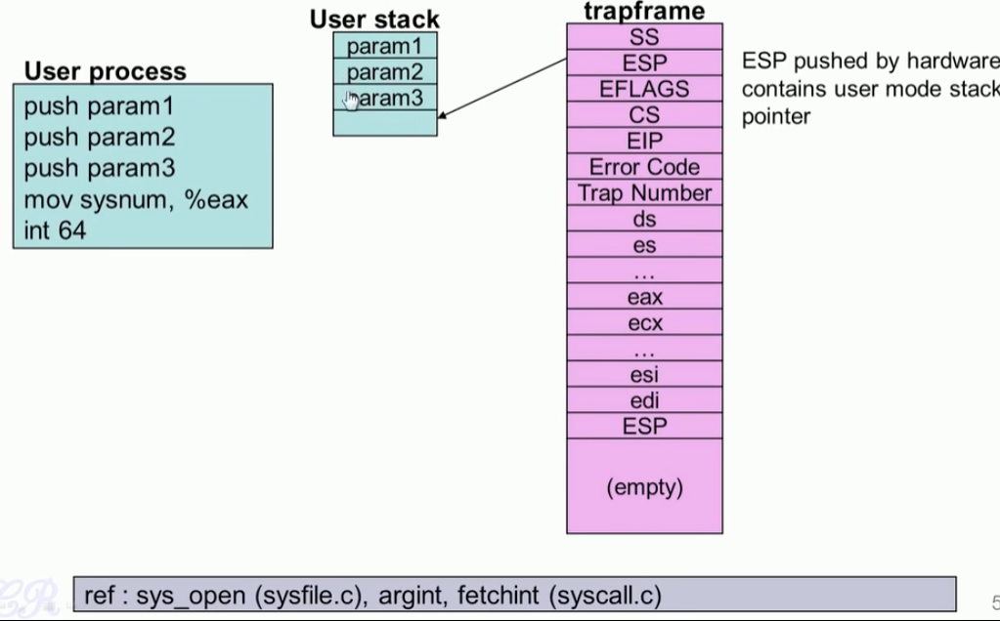
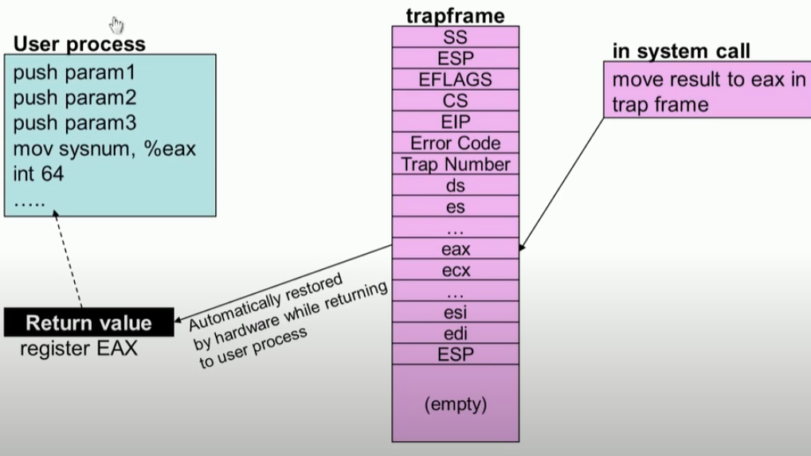

# Interrupt

## Event 기반 OS

#### OS&Events

* 커널은 Event 기반 아키텍처 이다.
* 오직 interrupt에 의해서만 동작된다. 

### Events 종류

1. 하드웨어 인터럽트
2. 트랩 : software interrupts 
3. Exceptions

#### Hardware Interrupts 

* Multiple devices 

#### Programmable Interrupt Controller 

## Interrupt handling 

## Software Interrupt

### System  Call in xv6

* 내가 System call 할때 상태를 저장하는 것과 파라미터를 전달하는 것을 혼동 했구나.

