## Memory Management

### Program & Process

#### Process란 

* 실행 중인 프로그램
* RAM에 위치
* Executable instructions, Stack, Heap, State in the OS (in kernel)
* State Contains : registers, list of open files, etc

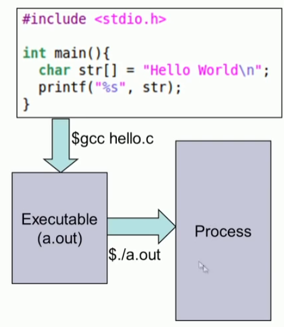


#### Process 메모리 맵

* text, data, heap, stack


```sh
$ readelf -W -l 4hello

Elf file type is EXEC (Executable file)
Entry point 0x401000
There are 4 program headers, starting at offset 64

Program Headers:
  Type   Offset   VirtAddr           PhysAddr           FileSiz  MemSiz   Flg Align
  LOAD   0x000000 0x0000000000400000 0x0000000000400000 0x000120 0x000120 R   0x1000
  LOAD   0x001000 0x0000000000401000 0x0000000000401000 0x000021 0x000021 R E 0x1000
  LOAD   0x002000 0x0000000000402000 0x0000000000402000 0x00000f 0x00000f R   0x1000
  GNU    0x000000 0x0000000000000000 0x0000000000000000 0x000000 0x000000 RW  0x10

 Section to Segment mapping:
  Segment Sections...
   00     
   01     .text 
   02     .rodata 
   03 
```


#### Kernel memory map

* user program cannot access kernel memory area
* kernel은 전체 주소 공간을 access할 수 있다.
* 모든 프로세스는 kernel 주소 공간을 가지고 page table를 가지고 있다. 


### 물리 메모리 공유 


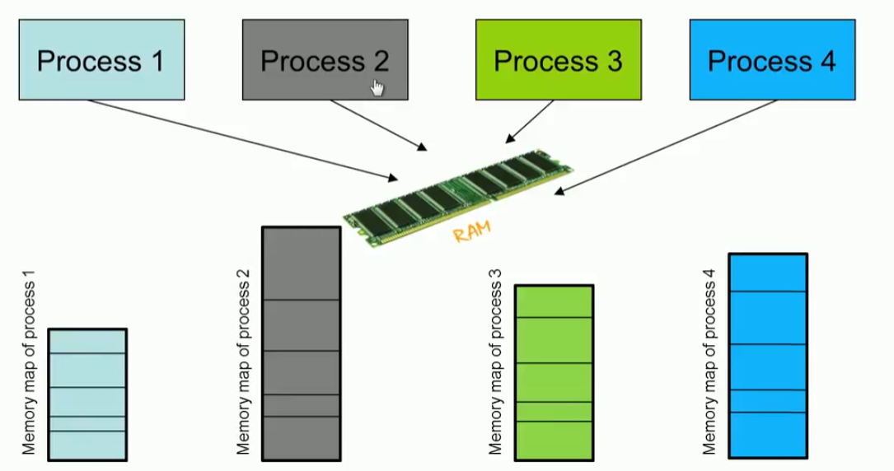


#### 1. 단일 연속 모델 (Single Contiguous Mode)

* No sharing
  * One process occupies RAM at a time
  * When one process completes, another process is allocated RAM
  * Proess memory 크기는 RAM 크기에 따라 제약 된다.
  * 이론적인 모델이군.

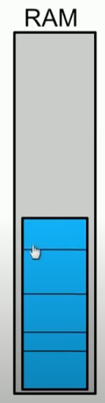


#### 2. 파티션 모델

* 충분한 연속 공간을 사용할 수 있는 한 새 프로세스에 메모리가 할당됩니다.
* 파티션 테이블


* 제약사항
  * 전체 프로세스가 RAM에 상주해야 한다.
  * 연속된 공간을 확보해야 RAM을 할당할 수 있다. 
  * Fragmentation
  * Limit the size of process by RAM size


## Virtual Memory

* 가상은 없으나 있는것 처럼 보이게 한다는 의미이다.

#### 1. Page Frame 

* RAM을 4KB 단위로 관리: page frame이라고 부름
* Process를 page frame size와 동일한 Block size로  쪼갬 

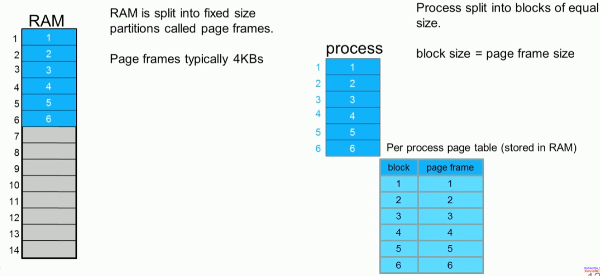


#### 2. Page table

* page table이 있어서 RAM에서 연속적 공간을 할당 받을 필요가 없어짐
* CPU가 page table를 참조해서 page frame 주소를 매번 참조해야 한다.

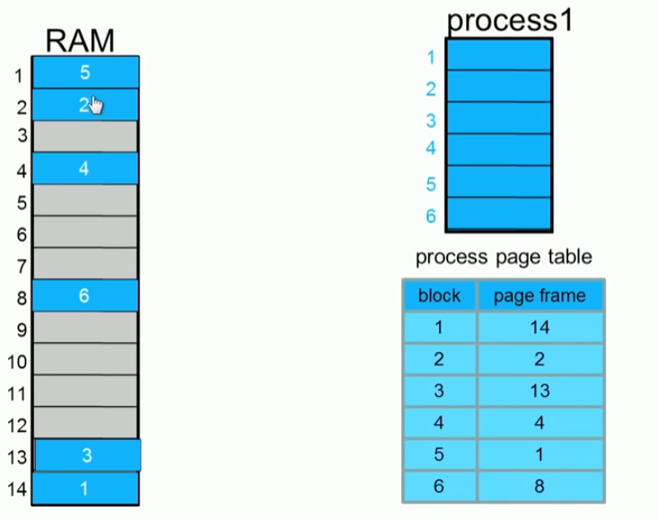

#### 3. process 별 page table 

* 프로세스 별 page table 구성
* 여러 프로세스의 Block 들이 RAM을 동시에 공유 하여 사용 가능 

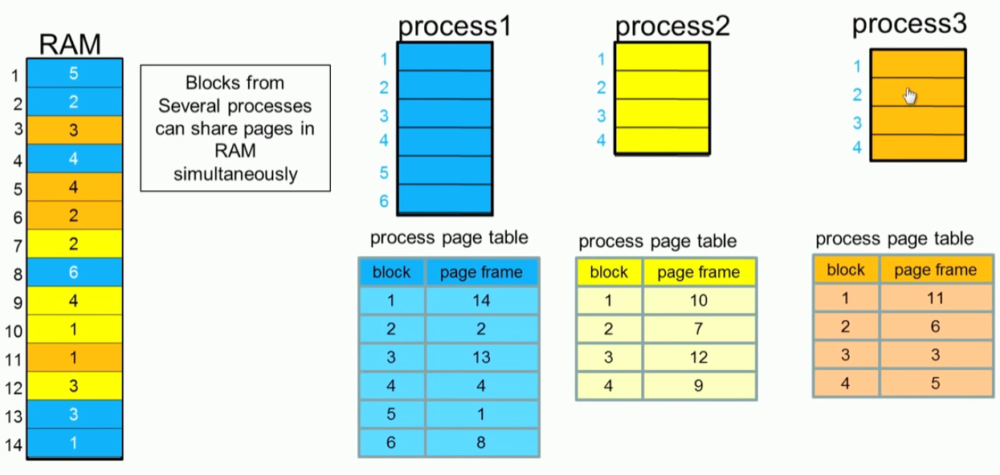


#### 4. Demand Paging 

* 프로세스의 모든 블럭이 RAM에 있어야 하나?

* Do we really need to load all blocks into memory before the process starts executing?

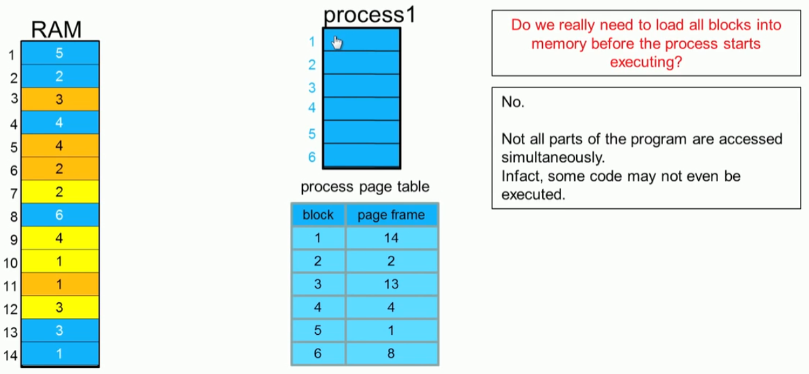

#### 5. Replacement policy 

* 프로그램을 RAM에 로딩하기 충분하지 않은 상황 발생
* OS는 어떤 블럭을 RAM에서 제거 할지  선택이 필요함
* Replacement policy 
  * First in first out
  * Least recently used
  * Least frequently used
* swap out :  block이 disk에 write back 

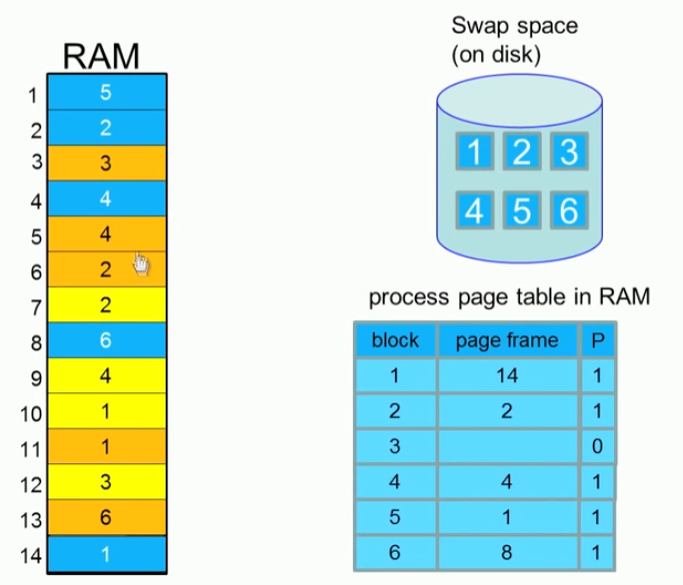

#### 6. dirty bit

* Page table에 dirty bit이 표시: disk에 write back 할 필요가 있을때
* dirty bit이 1로 표시되면 page는 write back된다. 

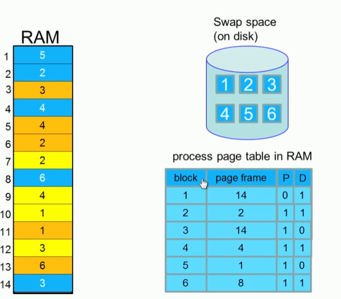


* xv6에서 flage 구성

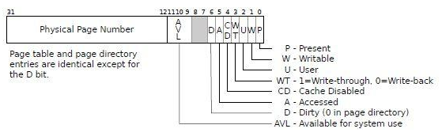

#### 7. Protection bit

* 실행코드, readonly 페이지에 대해서 protection bit 설정

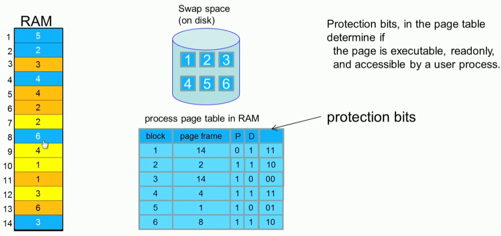


## 프로세스의 가상 주소 공간

#### 1. 프로세스의 주소공간

* 프로세서의 주소는 가상 주소로 표시된다.
* 주소는 0~ MAX_SIZE 크기
* a.out의 ELF 에는 가상 주소 공간에 어떻게 배치 할지 정보가 들어 있다. 

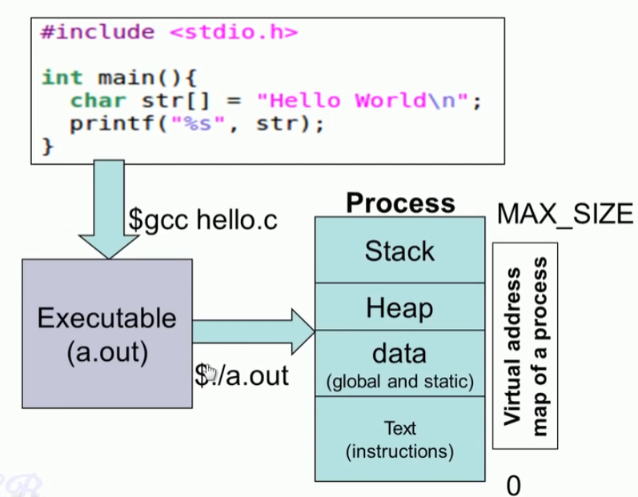

* Entry point 

```sh
$ readelf -W -l 4hello

Elf file type is EXEC (Executable file)
Entry point 0x401000
There are 4 program headers, starting at offset 64

Program Headers:
  Type           Offset   VirtAddr           PhysAddr           FileSiz  MemSiz   Flg Align
  LOAD    0x000000 0x0000000000400000 0x0000000000400000 0x000120 0x000120 R   0x1000
  LOAD    0x001000 0x0000000000401000 0x0000000000401000 0x000021 0x000021 R E 0x1000
  LOAD    0x002000 0x0000000000402000 0x0000000000402000 0x00000f 0x00000f R   0x1000
  GNU_STACK 0x000000 0x0000000000000000 0x0000000000000000 0x000000 0x000000 RW  0x10

 Section to Segment mapping:
  Segment Sections...
   00     
   01     .text 
   02     .rodata 
   03
```


#### 2. Addressing 

* CPU는  virtual address를 사용한다. 
* logical address -> Linear address -> physical address

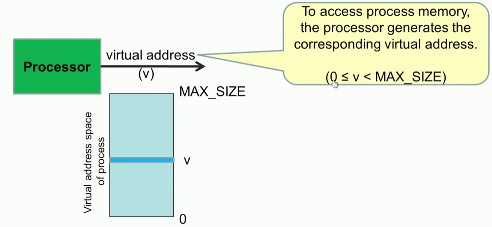


#### 3. MMU  **(memory management unit)** 

* MMU는 가상 메모리 시스템을 관리하는 하드웨어 요소이다. MMU는 설계에 따라 별도의 칩으로 되어 있는 경우도 있지만, 일반적으로 CPU의 일부가 된다. MMU는 가상 메모리를 실제 메모리로 사상시키는데 필요한 표를 유지할 수 있도록 소량의 메모리를 가진다.
* 데이터를 읽기 위한 모든 요청들은, 그 데이터를 램에서 즉시 읽을 수 있는지 또는 하드디스크 등으로부터 가져와야 하는지를 결정하기 위해 일단 MMU로 보내어진다. 만약 그 데이터가 메모리에 있지 않다면 MMU는 페이지 없음에 대해 인터럽트를 발생시킨다.


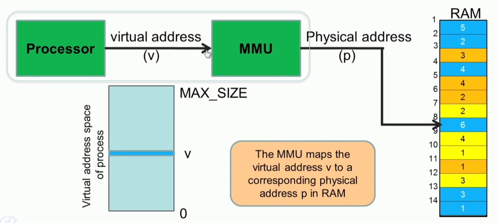


#### 4. page table 문제점

* 32bit 가상 주소 공간에서 page table 구성 방법
* 페이지 index 2^20 => 1MB  
* 각 PDE 엔트리에 4byte (PPN 정보) : 1MB * 4bytes  => 4MB 
* 모든 프로세스 별로 4MB 공간을 할당하는 것은 너무 비효율적이다.  


#### 5. 2Level page table

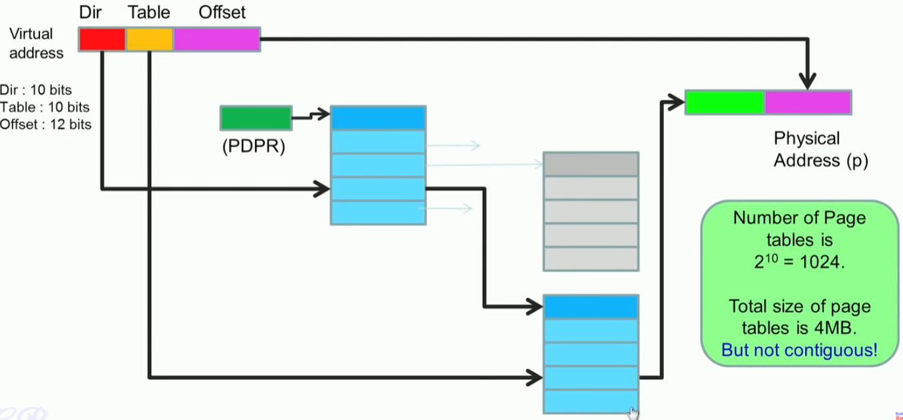


#### 6. virtual memory  동작

##### 1. new process의 page table

* 프로그램 시작할때는 page table이 비어 있다. 
* RAM에는 프로그램 block이 적재 되어 있지 않다.
* xv6에서는 
  * sys_fork () 함수에서 기존 page_table 복제
  * sys_exec() 실행 파일의 ELF 구성에 따라 page_table 구성  

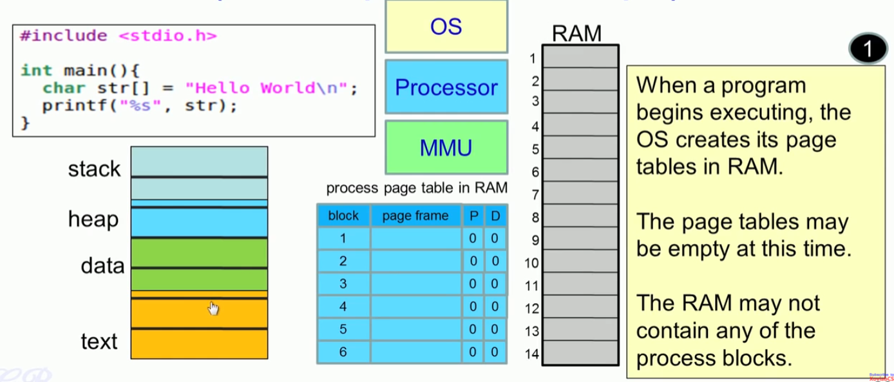

* xv6에서 exec() 함수에서 eip 지정하는 위치 : 즉 ELF.entry point에서 시작한다. 

```c
  // Commit to the user image.
  oldpgdir = curproc->pgdir;
  curproc->pgdir = pgdir;
  curproc->sz = sz;
  curproc->tf->eip = elf.entry; // main
  curproc->tf->esp = sp;
  switchuvm(curproc);
  freevm(oldpgdir);
  return 0;
```


##### 2. instruction : ELF entry

* ELF의 entry point 를 읽기 시작하면 page fault 발생한다는 이야기
* xv6에서는 이렇게 안되어 있다. 

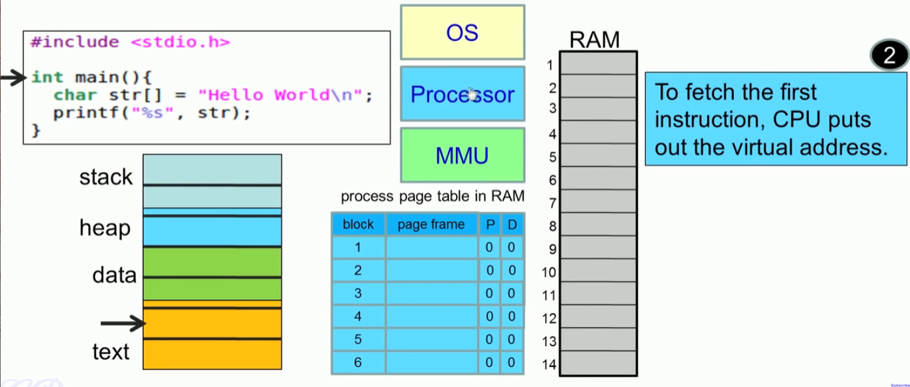


##### 3. page fault 

* interrupt 중에서 exception 발생 :  page fault

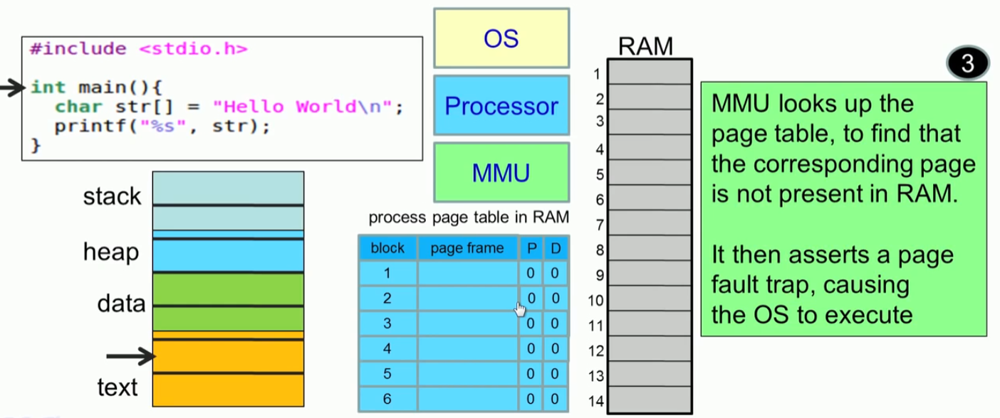


##### 4. Page fault 처리: intrrupt handling 

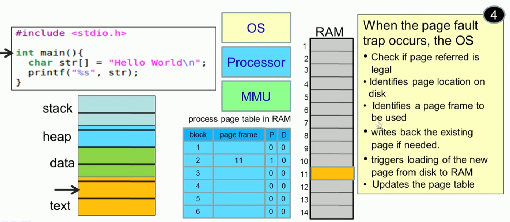

##### 5. page fault 발생 instruction 재실행

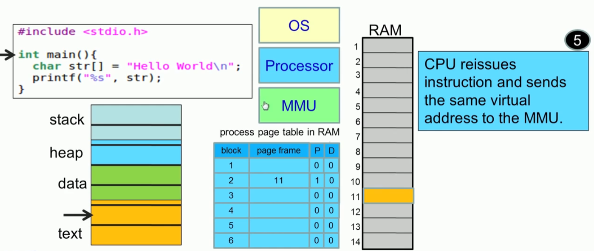

##### 6. MMU 처리

* virtual address를 Physical address로 전환

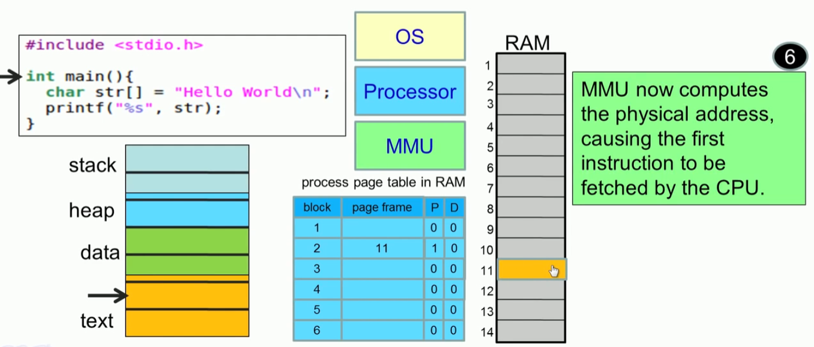


