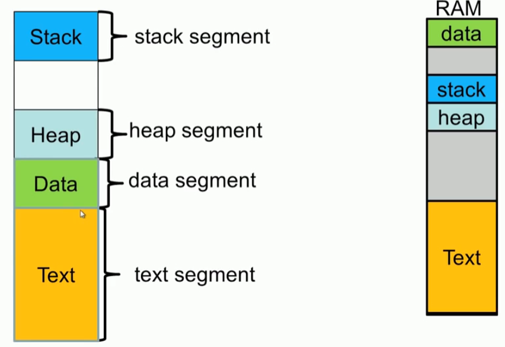
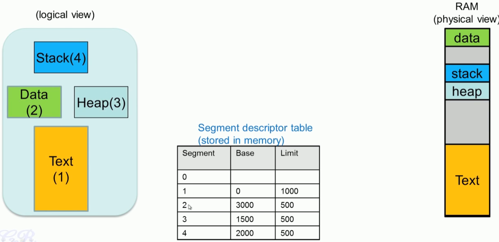
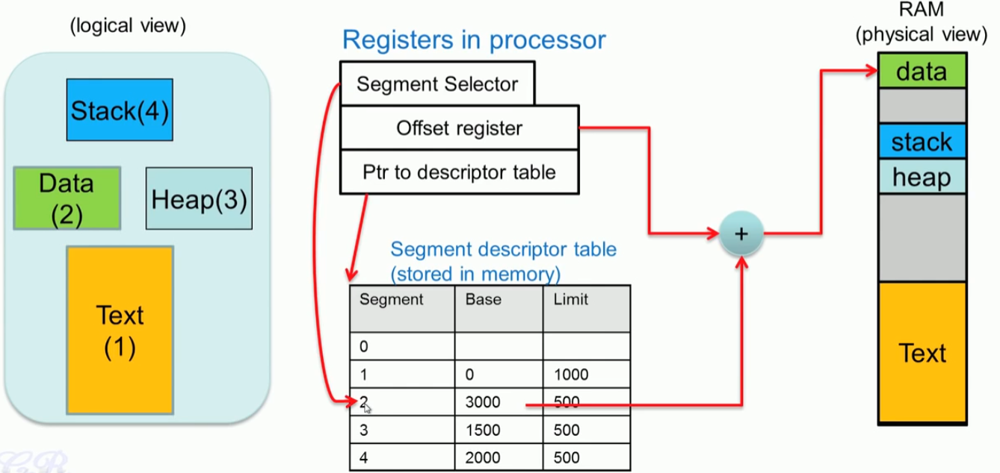
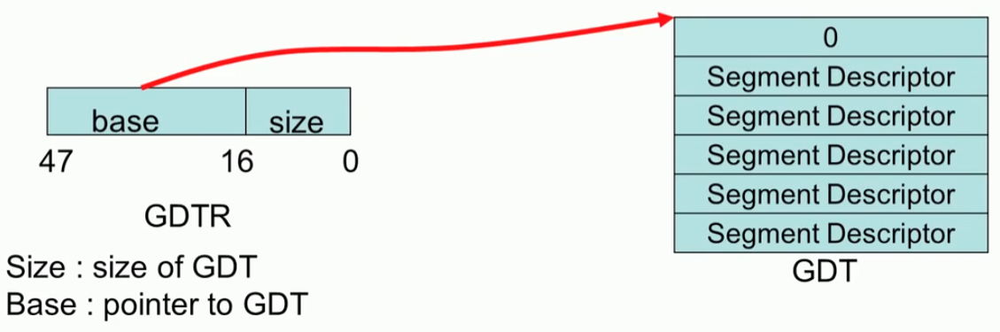
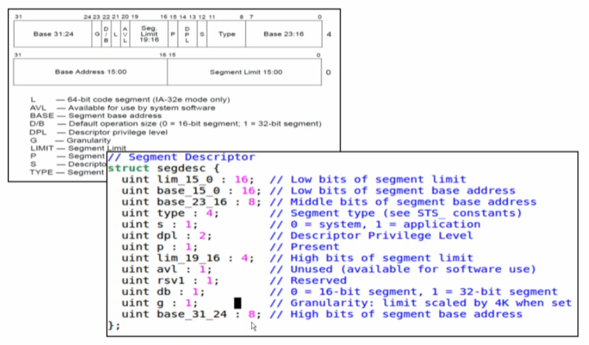
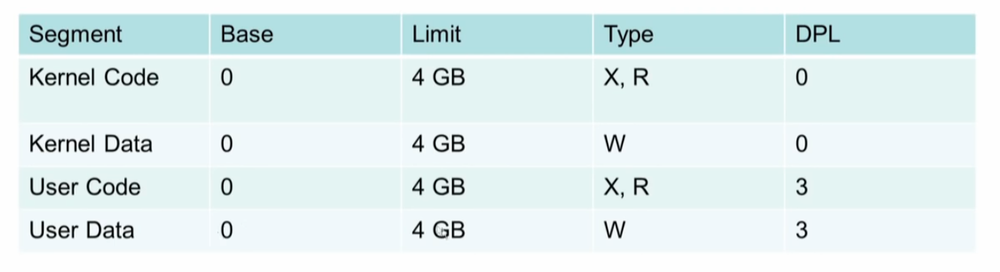
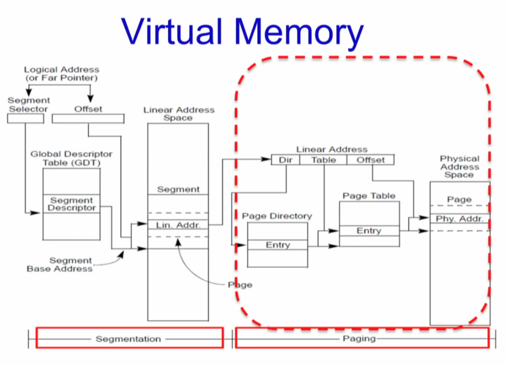

# GDT

* virtual : 없는 것을 있는 것 처럼
* Transparent : 있는데 없는 것 처럼 


## Segment, GDT

## Segment

 


#### 프로그램은 Logical module의 모음

* 프로그램을 논리적인 segment 단위로 분리한다. 
  * Logical address
  * Linear address를 확보하기 위해서 (그러나 물리 주소 매핑은 전혀 다르다)

* 프로그램 덩어리들
  * Global data, stack,  heap, functions, classes, namespaces, etc








## GDT

* GDT :  Global Descriptor Table 
  * 한국말로 번역하면 linux 커널에서 전역적으로 사용하는 Segment 종류들을 모아 놓은 테이블
  * GDT는 CPU에서 바로 찾아 갈 수 있도록 GDT Register에 GDT 테이블 시작 주소를 알려 준다.




* 결국 ELF 프로그램이 메모리에 로딩되어서 어떻게 실행되고 가상 주소가 물리 주소에 매핑 되는가에 대한 것이 정리된다.


#### XV6 Memory management





#### GDT, Segment Selector

##### 1. GDT

* GDT는 protected mode에서 커널이 메모리를 어떻게 사용하겠다는 메모리 설계이다.
* Segment는  메모리를 프로세스에 할당할 수 있는 다양한 크기의 청크로 나누는 메모리 관리 기술이다. 각 청크를 세그먼트라고 합니다. 테이블은 이러한 모든 세그먼트에 대한 정보를 저장하며 GDT(Global Descriptor Table)라고 합니다. 


##### 2. 논리 주소에서 선형주소

CPU가 사용하는 논리 주소를 선형 주소로 변환

1. segment selector offset를 이용하여  GDT 또는 LDT의 세그먼트에 대한 세그먼트 설명자를 찾고 프로세서로 읽습니다. (이 단계는 new segment selector가 segment register에 로드 될때 사용된다, 그러니까, segment register가 변경될 때  GDT를 다시 읽는다는 것)
2. Segment Descriptor 를 검사하여 액세스 권한과 세그먼트 범위를 확인하여 세그먼트에 액세스할 수 있고 오프셋이 세그먼트 제한 내에 있는지 확인합니다.
3. Segment Descriptor의 base address를  오프셋을 더해서  선형 주소를 만든다.


만약 Paging system을 사용하지 않는다면 프로세스는 선형 주소를 직접 physical address로 매핑한다.  Paging system을 사용한다면 선형 주소를 physical address로 변환하는 과정을 거친다. pgdir, page table, pte( PPN+flag) 

##### 3. segment selector

segment selector는 16비트로 구성된 segment에 대한 id이다.  이것이 직접 segment를 가르키지는 않고 당연하겠지만 GDT의 항목을 가르킨다. 


* Index : 3~15 비트 dlsep... 8192개의 GDT나 LDT를 가르킬수 있겠지.. 이것의 주소를 찾아가는 방법은 C 언어의 배열을 찾아가는 것 처럼 그렇게 순진한 방법으로 찾아 가지는 않는다. 프로세서는 인덱스 값에 8(세그먼트 설명자의 바이트 수)을 곱하고 결과를 GDT 또는 LDT의 기본 주소(각각 GDTR 또는 LDTR 레지스터에서)에 추가합니다.
  * segment selector는 `$(SEG_KDATA<<3)` 방법으로 8바이트씩 건너 뛰면서 인덱싱한다. 

```asm
  # Set up the protected-mode data segment registers
  movw    $(SEG_KDATA<<3), %ax    # Our data segment selector
  movw    %ax, %ds                # -> DS: Data Segment
  movw    %ax, %es                # -> ES: Extra Segment
  movw    %ax, %ss                # -> SS: Stack Segment
```

* Table Indicator : 사용할 설명자 테이블을 지정합니다. 이 플래그를 지우면 GDT가 선택됩니다. 이 플래그를 설정하면 현재 LDT가 선택됩니다








### xv6 GDT


```c
// various segment selectors.
#define SEG_KCODE 1  // kernel code
#define SEG_KDATA 2  // kernel data+stack
#define SEG_UCODE 3  // user code
#define SEG_UDATA 4  // user data+stack
#define SEG_TSS   5  // this process's task state

// cpu->gdt[NSEGS] holds the above segments.
#define NSEGS     6

#ifndef __ASSEMBLER__
// Segment Descriptor
struct segdesc {
  uint lim_15_0 : 16;  // Low bits of segment limit
  uint base_15_0 : 16; // Low bits of segment base address
  uint base_23_16 : 8; // Middle bits of segment base address
  uint type : 4;       // Segment type (see STS_ constants)
  uint s : 1;          // 0 = system, 1 = application
  uint dpl : 2;        // Descriptor Privilege Level
  uint p : 1;          // Present
  uint lim_19_16 : 4;  // High bits of segment limit
  uint avl : 1;        // Unused (available for software use)
  uint rsv1 : 1;       // Reserved
  uint db : 1;         // 0 = 16-bit segment, 1 = 32-bit segment
  uint g : 1;          // Granularity: limit scaled by 4K when set
  uint base_31_24 : 8; // High bits of segment base address
};
```

##### SEG macro

```c
// Normal segment
#define SEG(type, base, lim, dpl) (struct segdesc)    \
{ ((lim) >> 12) & 0xffff, 
   (uint)(base) & 0xffff, 
   ((uint)(base) >> 16) & 0xff, 
   type, 1, dpl, 1,       \
  (uint)(lim) >> 28, 0, 0, 1, 1, (uint)(base) >> 24 }
#define SEG16(type, base, lim, dpl) (struct segdesc)  \
{ (lim) & 0xffff, (uint)(base) & 0xffff,              \
  ((uint)(base) >> 16) & 0xff, type, 1, dpl, 1,       \
  (uint)(lim) >> 16, 0, 0, 1, 0, (uint)(base) >> 24 }
#endif
```


#### seginit

* "logical" addresses to virtual addresses 
* lgdt 함수를 이용해서 gdt위치와 gdt size를 등록 한다. 

```c
// Set up CPU's kernel segment descriptors.
// Run once on entry on each CPU.
void seginit(void)
{
  struct cpu *c;

  // Map "logical" addresses to virtual addresses using identity map.
  // Cannot share a CODE descriptor for both kernel and user
  // because it would have to have DPL_USR, but the CPU forbids
  // an interrupt from CPL=0 to DPL=3.
  c = &cpus[cpuid()];
  c->gdt[SEG_KCODE] = SEG(STA_X | STA_R, 0, 0xffffffff, 0);
  c->gdt[SEG_KDATA] = SEG(STA_W, 0, 0xffffffff, 0);
  c->gdt[SEG_UCODE] = SEG(STA_X | STA_R, 0, 0xffffffff, DPL_USER);
  c->gdt[SEG_UDATA] = SEG(STA_W, 0, 0xffffffff, DPL_USER);
  lgdt(c->gdt, sizeof(c->gdt));
}
```


##### lgdt

* 실제 GDTR에 등록하는 

```c
static inline void lgdt(struct segdesc *p, int size)
{
  volatile ushort pd[3];
  pd[0] = size - 1;
  pd[1] = (uint)p;
  pd[2] = (uint)p >> 16;

  asm volatile("lgdt (%0)"
               :
               : "r"(pd));
}
```


#####  GDTR에 GDT size와 GDT 시작 주소 등록


#### 소회:

* 프로그램이 컴파일 되면 몇개의 segment로 만들어 진다는 것
* GDT가 있고 LDT가 있다는 것 그래서 모든 프로그램은 로딩 될 때 각자의  DT가 있을 것을 생각했는데.
* 현재까지 xv6의 코드를 보면 GDT 테이블에 등록된 항목 5개를 가지고 그냥 쓴다.
* 그럼 exec에서 프로그램을 로딩할때 어디에 

