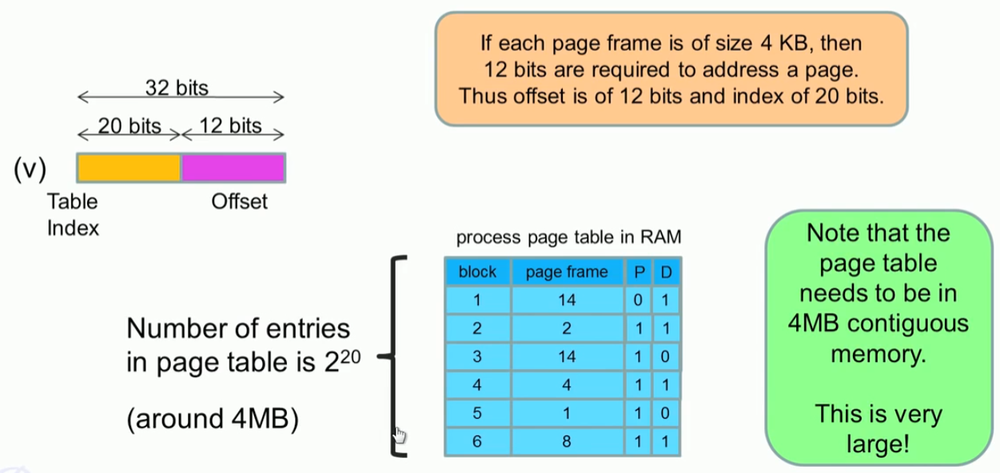
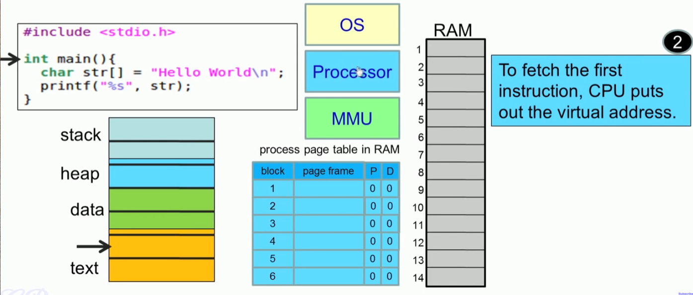
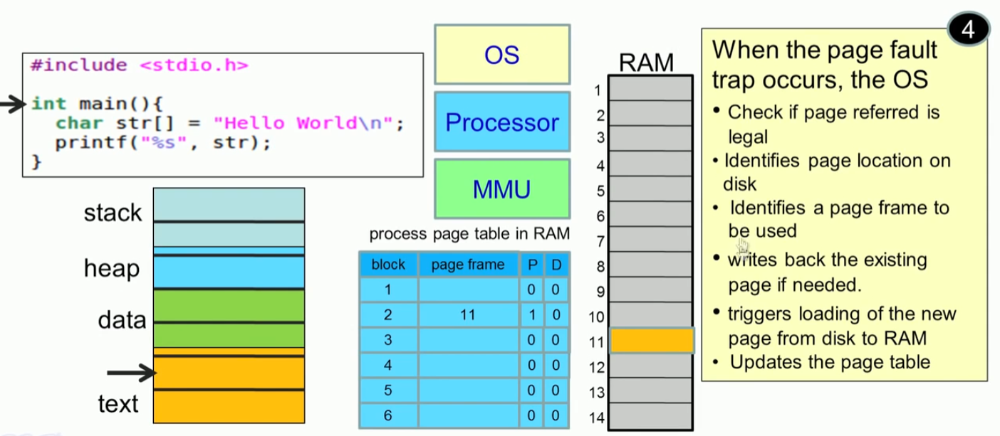
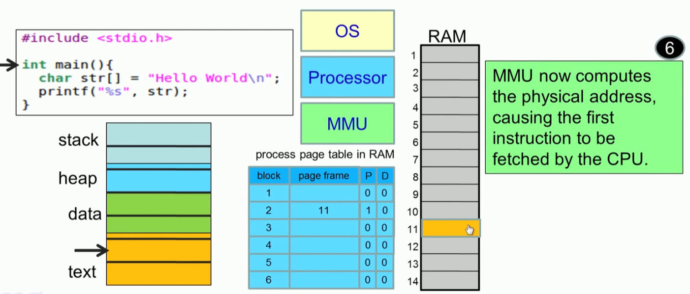

## 프로세스의 가상 주소 공간

#### 1. 프로세스의 주소공간

* 프로세서의 주소는 가상 주소로 표시된다.
* 주소는 0~ MAX_SIZE 크기
* a.out의 ELF 에는 가상 주소 공간에 어떻게 배치 할지 정보가 들어 있다. 


* Entry point 

```sh
$ readelf -W -l 4hello

Elf file type is EXEC (Executable file)
Entry point 0x401000
There are 4 program headers, starting at offset 64

Program Headers:
  Type           Offset   VirtAddr           PhysAddr           FileSiz  MemSiz   Flg Align
  LOAD    0x000000 0x0000000000400000 0x0000000000400000 0x000120 0x000120 R   0x1000
  LOAD    0x001000 0x0000000000401000 0x0000000000401000 0x000021 0x000021 R E 0x1000
  LOAD    0x002000 0x0000000000402000 0x0000000000402000 0x00000f 0x00000f R   0x1000
  GNU_STACK 0x000000 0x0000000000000000 0x0000000000000000 0x000000 0x000000 RW  0x10

 Section to Segment mapping:
  Segment Sections...
   00     
   01     .text 
   02     .rodata 
   03
```


#### 2. Addressing 

* CPU는  virtual address를 사용한다. 
* logical address -> Linear address -> physical address


#### 3. MMU  **(memory management unit)** 

* MMU는 가상 메모리 시스템을 관리하는 하드웨어 요소이다. MMU는 설계에 따라 별도의 칩으로 되어 있는 경우도 있지만, 일반적으로 CPU의 일부가 된다. MMU는 가상 메모리를 실제 메모리로 사상시키는데 필요한 표를 유지할 수 있도록 소량의 메모리를 가진다.
* 데이터를 읽기 위한 모든 요청들은, 그 데이터를 램에서 즉시 읽을 수 있는지 또는 하드디스크 등으로부터 가져와야 하는지를 결정하기 위해 일단 MMU로 보내어진다. 만약 그 데이터가 메모리에 있지 않다면 MMU는 페이지 없음에 대해 인터럽트를 발생시킨다.


#### 4. page table 문제점

* 32bit 가상 주소 공간에서 page table 구성 방법
* 페이지 index 2^20 => 1MB  
* 각 PDE 엔트리에 4byte (PPN 정보) : 1MB * 4bytes  => 4MB 
* 모든 프로세스 별로 4MB 공간을 할당하는 것은 너무 비효율적이다.  




#### 5. 2Level page table


#### 6. virtual memory  동작

##### 1. new process의 page table

* 프로그램 시작할때는 page table이 비어 있다. 
* RAM에는 프로그램 block이 적재 되어 있지 않다.
* xv6에서는 
  * sys_fork () 함수에서 기존 page_table 복제
  * sys_exec() 실행 파일의 ELF 구성에 따라 page_table 구성  


* xv6에서 exec() 함수에서 eip 지정하는 위치 : 즉 ELF.entry point에서 시작한다. 

```c
  // Commit to the user image.
  oldpgdir = curproc->pgdir;
  curproc->pgdir = pgdir;
  curproc->sz = sz;
  curproc->tf->eip = elf.entry; // main
  curproc->tf->esp = sp;
  switchuvm(curproc);
  freevm(oldpgdir);
  return 0;
```


##### 2. instruction : ELF entry

* ELF의 entry point 를 읽기 시작하면 page fault 발생한다는 이야기
* xv6에서는 이렇게 안되어 있다. 




##### 3. page fault 

* interrupt 중에서 exception 발생 :  page fault


##### 4. Page fault 처리: intrrupt handling 



##### 5. page fault 발생 instruction 재실행


##### 6. MMU 처리

* virtual address를 Physical address로 전환




