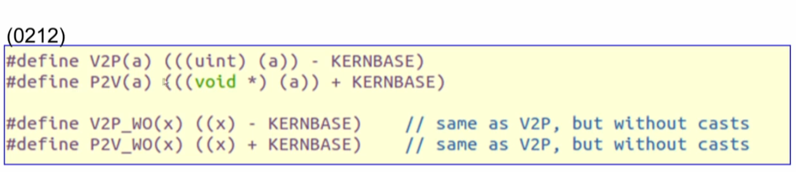
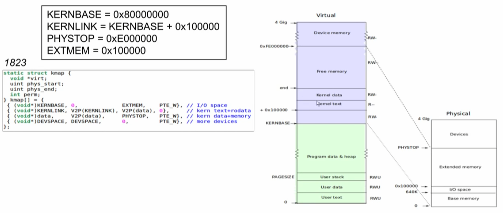
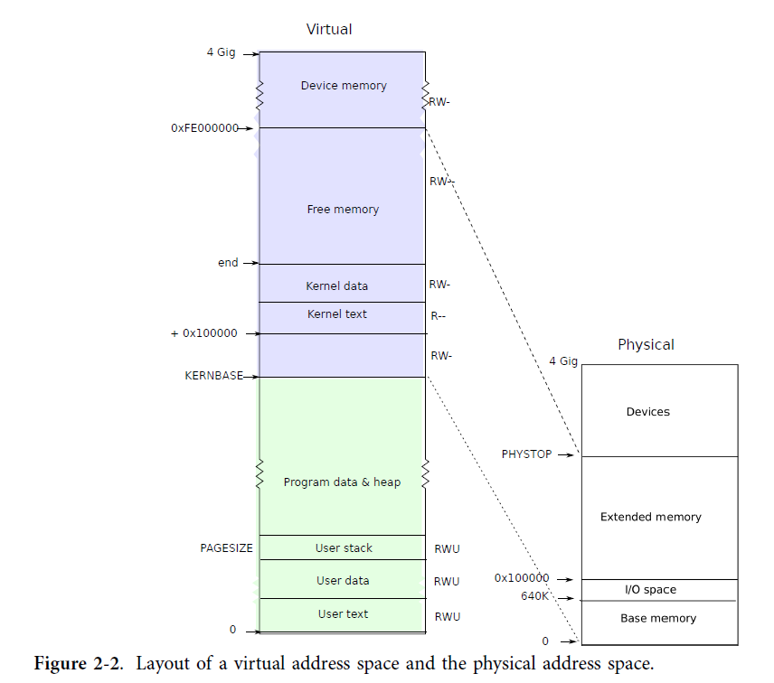
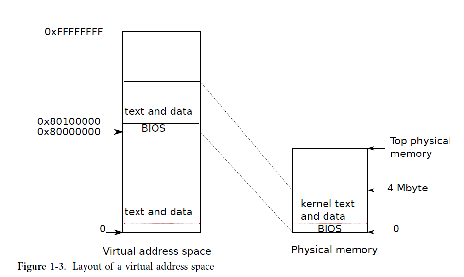
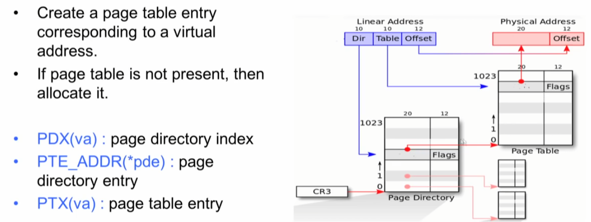
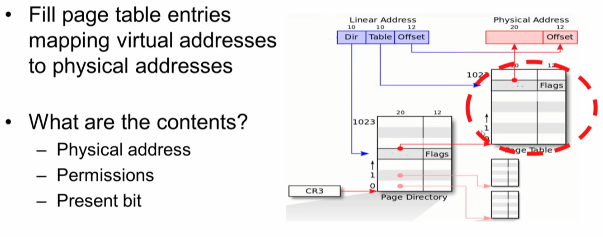
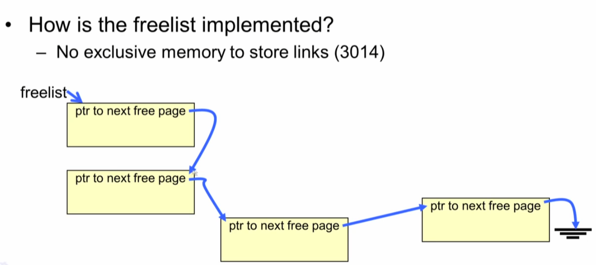

## Code

#### Segment Descriptor


#### Segment Descriptor in xv6


#### Loading the GDT


```c
// various segment selectors.
#define SEG_KCODE 1  // kernel code
#define SEG_KDATA 2  // kernel data+stack
#define SEG_UCODE 3  // user code
#define SEG_UDATA 4  // user data+stack
#define SEG_TSS   5  // this process's task state

// cpu->gdt[NSEGS] holds the above segments.
#define NSEGS     6

#ifndef __ASSEMBLER__
// Segment Descriptor
struct segdesc {
  uint lim_15_0 : 16;  // Low bits of segment limit
  uint base_15_0 : 16; // Low bits of segment base address
  uint base_23_16 : 8; // Middle bits of segment base address
  uint type : 4;       // Segment type (see STS_ constants)
  uint s : 1;          // 0 = system, 1 = application
  uint dpl : 2;        // Descriptor Privilege Level
  uint p : 1;          // Present
  uint lim_19_16 : 4;  // High bits of segment limit
  uint avl : 1;        // Unused (available for software use)
  uint rsv1 : 1;       // Reserved
  uint db : 1;         // 0 = 16-bit segment, 1 = 32-bit segment
  uint g : 1;          // Granularity: limit scaled by 4K when set
  uint base_31_24 : 8; // High bits of segment base address
};
```

##### SEG macro

```c
// Normal segment
#define SEG(type, base, lim, dpl) (struct segdesc)    \
{ ((lim) >> 12) & 0xffff, 
   (uint)(base) & 0xffff, 
   ((uint)(base) >> 16) & 0xff, 
   type, 1, dpl, 1,       \
  (uint)(lim) >> 28, 0, 0, 1, 1, (uint)(base) >> 24 }
#define SEG16(type, base, lim, dpl) (struct segdesc)  \
{ (lim) & 0xffff, (uint)(base) & 0xffff,              \
  ((uint)(base) >> 16) & 0xff, type, 1, dpl, 1,       \
  (uint)(lim) >> 16, 0, 0, 1, 0, (uint)(base) >> 24 }
#endif
```


#### seginit

* "logical" addresses to virtual addresses 
* lgdt 함수를 이용해서 gdt위치와 gdt size를 등록 한다. 

```c
// Set up CPU's kernel segment descriptors.
// Run once on entry on each CPU.
void seginit(void)
{
  struct cpu *c;

  // Map "logical" addresses to virtual addresses using identity map.
  // Cannot share a CODE descriptor for both kernel and user
  // because it would have to have DPL_USR, but the CPU forbids
  // an interrupt from CPL=0 to DPL=3.
  c = &cpus[cpuid()];
  c->gdt[SEG_KCODE] = SEG(STA_X | STA_R, 0, 0xffffffff, 0);
  c->gdt[SEG_KDATA] = SEG(STA_W, 0, 0xffffffff, 0);
  c->gdt[SEG_UCODE] = SEG(STA_X | STA_R, 0, 0xffffffff, DPL_USER);
  c->gdt[SEG_UDATA] = SEG(STA_W, 0, 0xffffffff, DPL_USER);
  lgdt(c->gdt, sizeof(c->gdt));
}
```


##### lgdt

* 실제 GDTR에 등록하는 

```c
static inline void lgdt(struct segdesc *p, int size)
{
  volatile ushort pd[3];
  pd[0] = size - 1;
  pd[1] = (uint)p;
  pd[2] = (uint)p >> 16;

  asm volatile("lgdt (%0)"
               :
               : "r"(pd));
}
```


#####  GDTR에 GDT size와 GDT 시작 주소 등록


#### 소회:

* 프로그램이 컴파일 되면 몇개의 segment로 만들어 진다는 것
* GDT가 있고 LDT가 있다는 것 그래서 모든 프로그램은 로딩 될 때 각자의  DT가 있을 것을 생각했는데.
* 현재까지 xv6의 코드를 보면 GDT 테이블에 등록된 항목 5개를 가지고 그냥 쓴다.
* 그럼 exec에서 프로그램을 로딩할때 어디에 


### Mapping the Kernel in xv6


Entire RAM mapped into kernel space 

Memory mapped device also mapped into kernel space 

For the kernel, converting virtual to physical memory (V2P) and physical to virtual memory (P2V) is easy 


#### V2P and P2V




#### Mapping the kernel in xv6










### Page table 구성

#### 1. Creating the Page Table Mapping for the kernel

* Enable paging
* Create/Fill page directory
* Create/Fill page tables
* Load CR3 register 








## 9. Allocating Page


