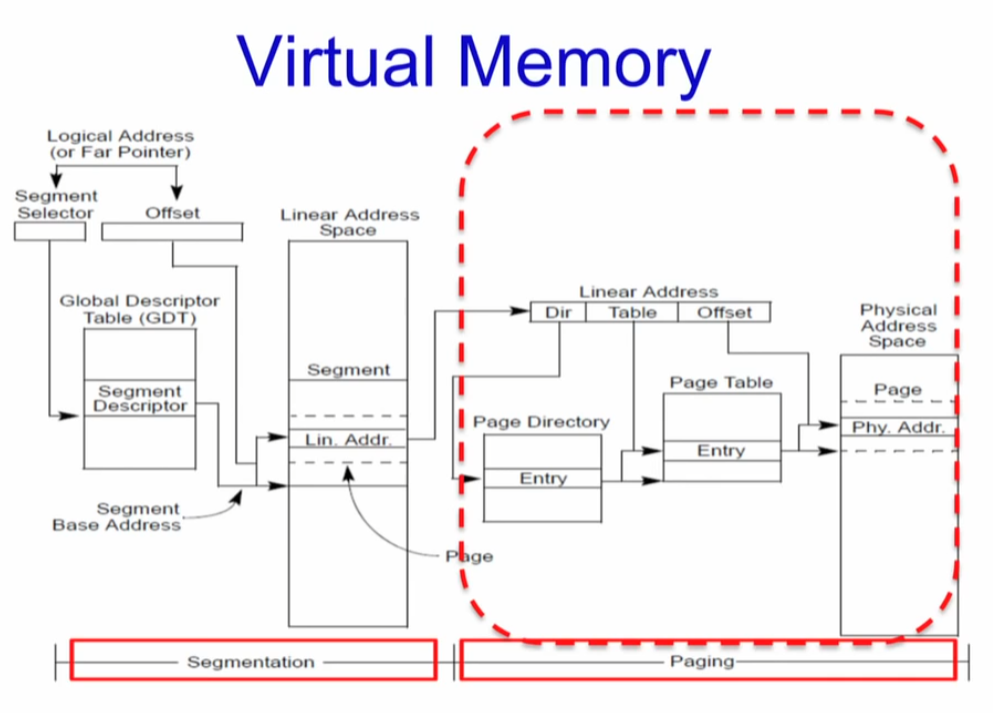
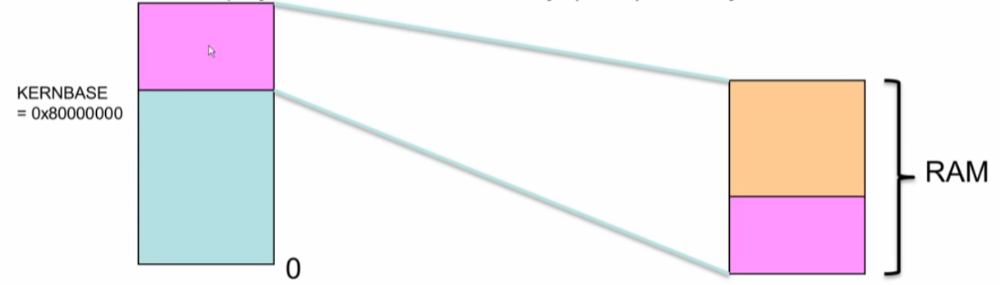
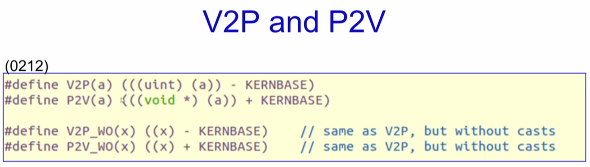
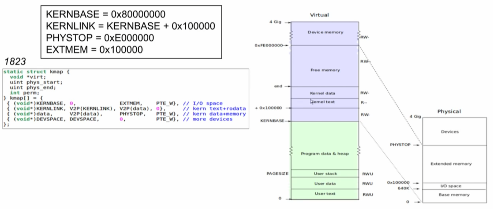
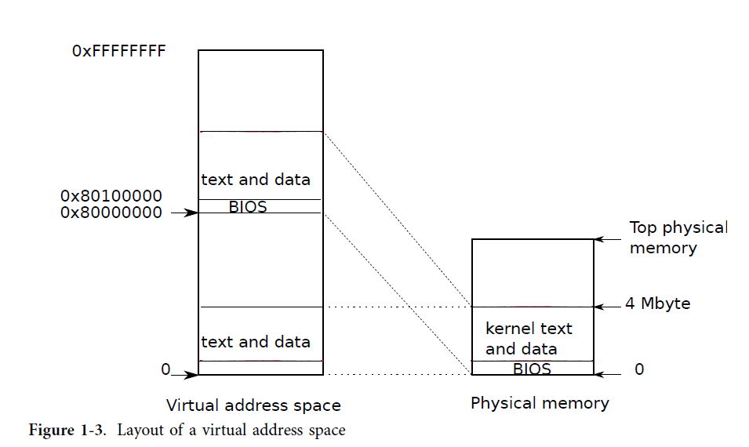
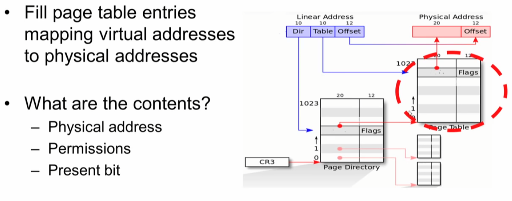
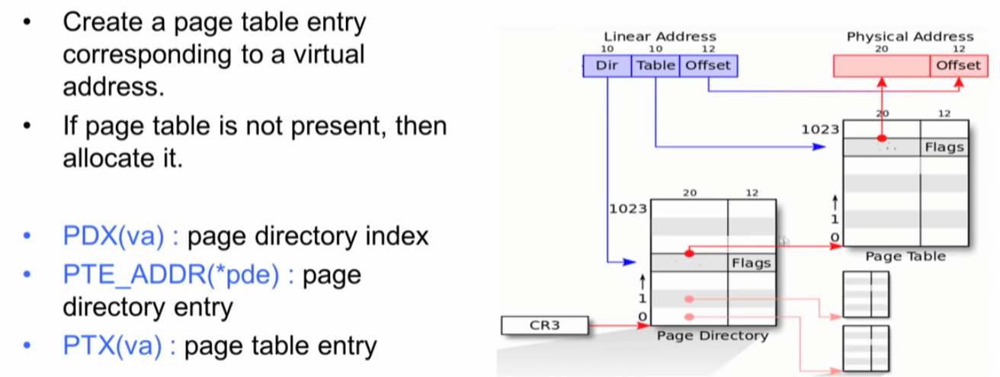
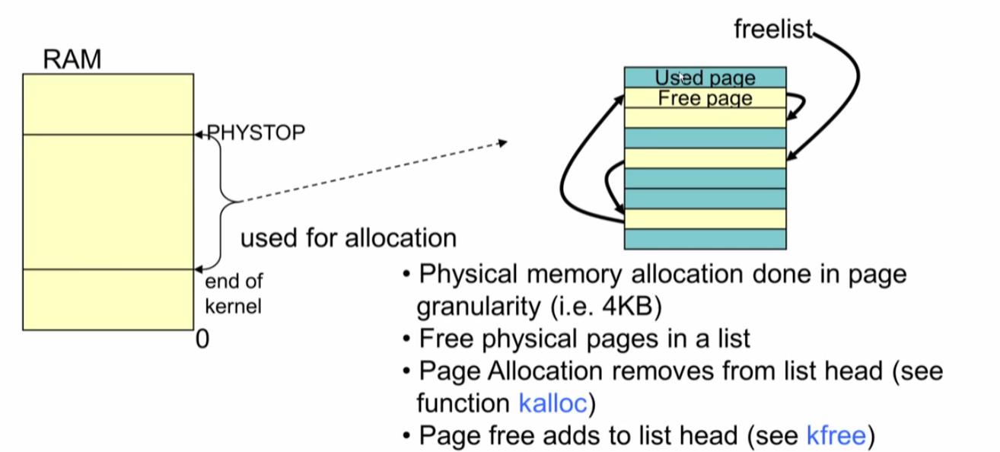
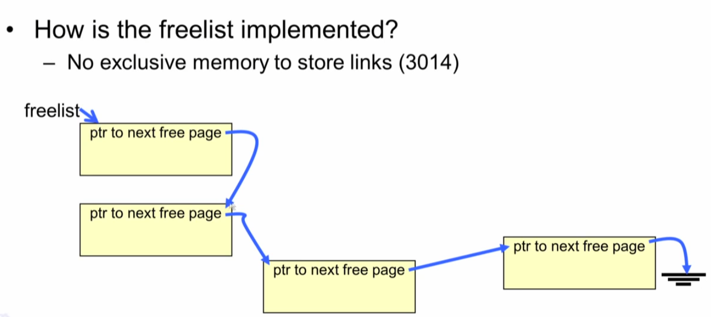

## Code

#### Segment Descriptor


#### Segment Descriptor in xv6


#### Loading the GDT


```c
// various segment selectors.
#define SEG_KCODE 1  // kernel code
#define SEG_KDATA 2  // kernel data+stack
#define SEG_UCODE 3  // user code
#define SEG_UDATA 4  // user data+stack
#define SEG_TSS   5  // this process's task state

// cpu->gdt[NSEGS] holds the above segments.
#define NSEGS     6

#ifndef __ASSEMBLER__
// Segment Descriptor
struct segdesc {
  uint lim_15_0 : 16;  // Low bits of segment limit
  uint base_15_0 : 16; // Low bits of segment base address
  uint base_23_16 : 8; // Middle bits of segment base address
  uint type : 4;       // Segment type (see STS_ constants)
  uint s : 1;          // 0 = system, 1 = application
  uint dpl : 2;        // Descriptor Privilege Level
  uint p : 1;          // Present
  uint lim_19_16 : 4;  // High bits of segment limit
  uint avl : 1;        // Unused (available for software use)
  uint rsv1 : 1;       // Reserved
  uint db : 1;         // 0 = 16-bit segment, 1 = 32-bit segment
  uint g : 1;          // Granularity: limit scaled by 4K when set
  uint base_31_24 : 8; // High bits of segment base address
};
```

##### SEG macro

```c
// Normal segment
#define SEG(type, base, lim, dpl) (struct segdesc)    \
{ ((lim) >> 12) & 0xffff, 
   (uint)(base) & 0xffff, 
   ((uint)(base) >> 16) & 0xff, 
   type, 1, dpl, 1,       \
  (uint)(lim) >> 28, 0, 0, 1, 1, (uint)(base) >> 24 }
#define SEG16(type, base, lim, dpl) (struct segdesc)  \
{ (lim) & 0xffff, (uint)(base) & 0xffff,              \
  ((uint)(base) >> 16) & 0xff, type, 1, dpl, 1,       \
  (uint)(lim) >> 16, 0, 0, 1, 0, (uint)(base) >> 24 }
#endif
```





#### seginit

* "logical" addresses to virtual addresses 
* lgdt 함수를 이용해서 gdt위치와 gdt size를 등록 한다. 

```c
// Set up CPU's kernel segment descriptors.
// Run once on entry on each CPU.
void seginit(void)
{
  struct cpu *c;

  // Map "logical" addresses to virtual addresses using identity map.
  // Cannot share a CODE descriptor for both kernel and user
  // because it would have to have DPL_USR, but the CPU forbids
  // an interrupt from CPL=0 to DPL=3.
  c = &cpus[cpuid()];
  c->gdt[SEG_KCODE] = SEG(STA_X | STA_R, 0, 0xffffffff, 0);
  c->gdt[SEG_KDATA] = SEG(STA_W, 0, 0xffffffff, 0);
  c->gdt[SEG_UCODE] = SEG(STA_X | STA_R, 0, 0xffffffff, DPL_USER);
  c->gdt[SEG_UDATA] = SEG(STA_W, 0, 0xffffffff, DPL_USER);
  lgdt(c->gdt, sizeof(c->gdt));
}
```


##### lgdt

* 실제 GDTR에 등록하는 

```c
static inline void lgdt(struct segdesc *p, int size)
{
  volatile ushort pd[3];
  pd[0] = size - 1;
  pd[1] = (uint)p;
  pd[2] = (uint)p >> 16;

  asm volatile("lgdt (%0)"
               :
               : "r"(pd));
}
```


#####  GDTR에 GDT size와 GDT 시작 주소 등록


#### 소회:

* 프로그램이 컴파일 되면 몇개의 segment로 만들어 진다는 것
* GDT가 있고 LDT가 있다는 것 그래서 모든 프로그램은 로딩 될 때 각자의  DT가 있을 것을 생각했는데.
* 현재까지 xv6의 코드를 보면 GDT 테이블에 등록된 항목 5개를 가지고 그냥 쓴다.
* 그럼 exec에서 프로그램을 로딩할때 어디에 


### Mapping the Kernel in xv6


Entire RAM mapped into kernel space 

Memory mapped device also mapped into kernel space 

For the kernel, converting virtual to physical memory (V2P) and physical to virtual memory (P2V) is easy 




#### V2P and P2V




#### Mapping the kernel in xv6







### Page table 구성

#### 1. Creating the Page Table Mapping for the kernel

* Enable paging
* Create/Fill page directory
* Create/Fill page tables
* Load CR3 register 

#### 2. Enable paging

* `#define CR0_PG      0x80000000    // Paging`
* `#define CR0_WP      0x00010000    // Write Protect`

```asm
# Entering xv6 on boot processor, with paging off.
.globl entry
entry:
  # Turn on page size extension for 4Mbyte pages
  movl    %cr4, %eax
  orl     $(CR4_PSE), %eax
  movl    %eax, %cr4
  # Set page directory
  movl    $(V2P_WO(entrypgdir)), %eax
  movl    %eax, %cr3
  # Turn on paging.
  movl    %cr0, %eax
  orl     $(CR0_PG|CR0_WP), %eax
  movl    %eax, %cr0

  # Set up the stack pointer.
  movl $(stack + KSTACKSIZE), %esp

  # Jump to main(), and switch to executing at
  # high addresses. The indirect call is needed because
  # the assembler produces a PC-relative instruction
  # for a direct jump.
  mov $main, %eax
  jmp *%eax

.comm stack, KSTACKSIZE

```

#### 3. Create/Fill Page directory

```c
// Allocate one page table for the machine for the kernel address
// space for scheduler processes.
void kvmalloc(void)
{
  kpgdir = setupkvm();
  switchkvm();
}
```

* setupkvm

```c
// There is one page table per process, plus one that's used when
// a CPU is not running any process (kpgdir). The kernel uses the
// current process's page table during system calls and interrupts;
// page protection bits prevent user code from using the kernel's
// mappings.
// The kernel allocates physical memory for its heap and for user memory
// between V2P(end) and the end of physical memory (PHYSTOP)
// (directly addressable from end..P2V(PHYSTOP)).

// This table defines the kernel's mappings, which are present in
// every process's page table.
static struct kmap
{
  void *virt;
  uint phys_start;
  uint phys_end;
  int perm;
} kmap[] = {
    {(void *)KERNBASE, 0, EXTMEM, PTE_W},            // I/O space
    {(void *)KERNLINK, V2P(KERNLINK), V2P(data), 0}, // kern text+rodata
    {(void *)data, V2P(data), PHYSTOP, PTE_W},       // kern data+memory
    {(void *)DEVSPACE, DEVSPACE, 0, PTE_W},          // more devices
};

// Set up kernel part of a page table.
pde_t *
setupkvm(void)
{
  pde_t *pgdir;
  struct kmap *k;

  if ((pgdir = (pde_t *)kalloc()) == 0)
    return 0;
  memset(pgdir, 0, PGSIZE);
  if (P2V(PHYSTOP) > (void *)DEVSPACE)
    panic("PHYSTOP too high");
  for (k = kmap; k < &kmap[NELEM(kmap)]; k++)
    if (mappages(pgdir, k->virt, k->phys_end - k->phys_start,
                 (uint)k->phys_start, k->perm) < 0)
    {
      freevm(pgdir);
      return 0;
    }
  return pgdir;
}
```

#### 4. Mapping 




```c
// Create PTEs for virtual addresses starting at va that refer to
// physical addresses starting at pa. va and size might not
// be page-aligned.
static int
mappages(pde_t *pgdir, void *va, uint size, uint pa, int perm)
{
  char *a, *last;
  pte_t *pte;

  a = (char *)PGROUNDDOWN((uint)va);
  last = (char *)PGROUNDDOWN(((uint)va) + size - 1);
  for (;;)
  {
    if ((pte = walkpgdir(pgdir, a, 1)) == 0)
      return -1;
    if (*pte & PTE_P)
      panic("remap");
    *pte = pa | perm | PTE_P;
    if (a == last)
      break;
    a += PGSIZE;
    pa += PGSIZE;
  }
  return 0;
}
```


#### 5. walkpgdir



```c
// Return the address of the PTE in page table pgdir
// that corresponds to virtual address va.  If alloc!=0,
// create any required page table pages.

static pte_t *walkpgdir(pde_t *pgdir, const void *va, int alloc)
{
  pde_t *pde;
  pte_t *pgtab;

  pde = &pgdir[PDX(va)];
  if (*pde & PTE_P)
  {
    pgtab = (pte_t *)P2V(PTE_ADDR(*pde));
  }
  else
  {
    if (!alloc || (pgtab = (pte_t *)kalloc()) == 0)
      return 0;
    // Make sure all those PTE_P bits are zero.
    memset(pgtab, 0, PGSIZE);
    // The permissions here are overly generous, but they can
    // be further restricted by the permissions in the page table
    // entries, if necessary.
    *pde = V2P(pgtab) | PTE_P | PTE_W | PTE_U;
  }
  return &pgtab[PTX(va)];
}
```

#### 6. Load CR3

```c
// Switch h/w page table register to the kernel-only page table,
// for when no process is running.
void switchkvm(void)
{
  lcr3(V2P(kpgdir)); // switch to the kernel page table
}
```


### Allocating Page

#### 1. Page 할당(kalloc)





```c
// Allocate one 4096-byte page of physical memory.
// Returns a pointer that the kernel can use.
// Returns 0 if the memory cannot be allocated.
char *
kalloc(void)
{
  struct run *r;

  if (kmem.use_lock)
    acquire(&kmem.lock);
  r = kmem.freelist;
  if (r)
    kmem.freelist = r->next;
  if (kmem.use_lock)
    release(&kmem.lock);
  return (char *)r;
}
```

#### 2. freelist 구현



```c
struct
{
  struct spinlock lock;
  int use_lock;
  struct run *freelist;
} kmem;
```

