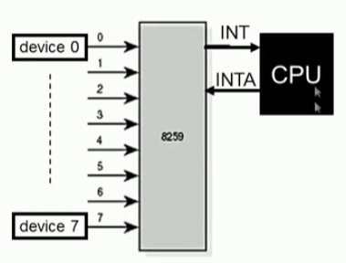
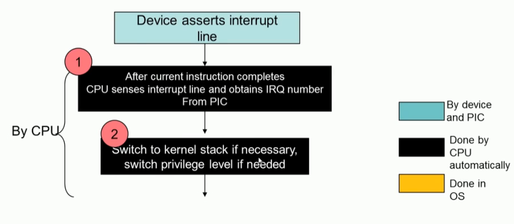
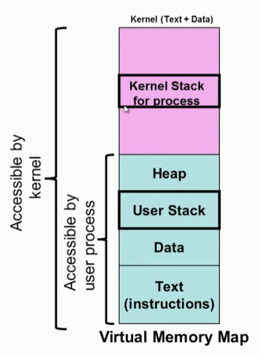
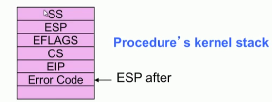
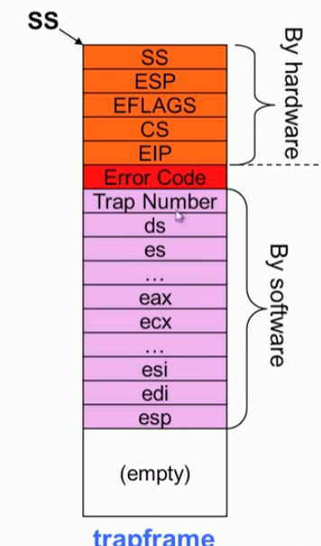
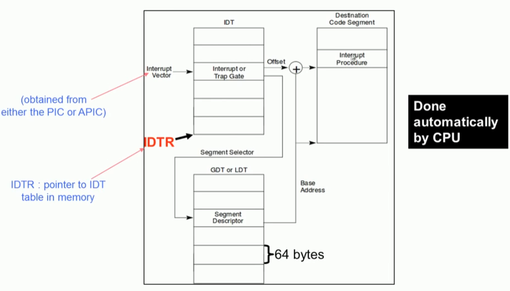
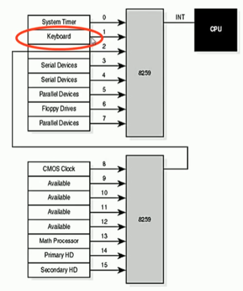
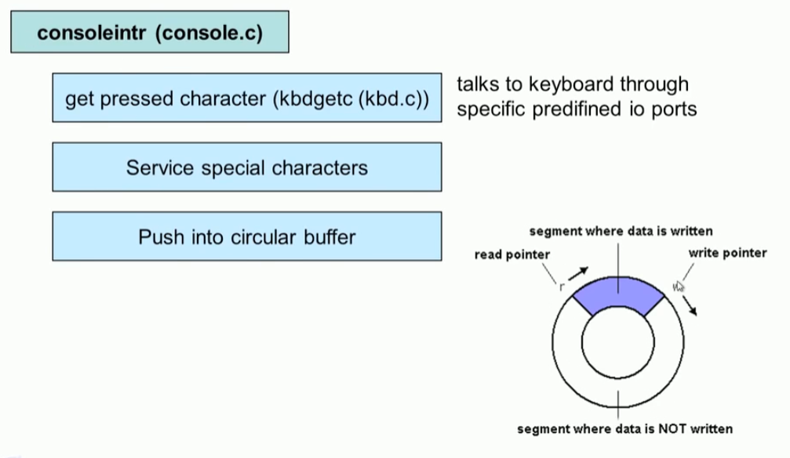

# Interrupt

## Event 기반 OS

#### OS&Events

* 커널은 Event 기반 아키텍처 이다.
* 오직 interrupt에 의해서만 동작된다. 


### Events 종류

1. 하드웨어 인터럽트
   * 하드웨어 device에서 발생
   * 비동기적으로 발생, 언제든지 발생 가능
2. 트랩 : software interrupts 
   * Software interrupt 라고 알려짐
   * user program에 의해서 발생, OS 기능을 사용하기 위해서
3. Exceptions
   * 프로세서 내부에서 발생 (illegal instruction)
   * Faults:  복구 될 수 있는 exception ( page fault)
   * Aborts :  복구 불가능 ( divide by 0)


## Hardware Interrupts 

#### 1. Multiple devices 


* timer interrupt handler routine
* USB interrupt handler routine
* Keyboard interrupt handler routine

#### 2. interrupt handler routine 

* 각 인터럽트는 인터럽트 번호가 있따.
* 하드웨어 인터럽트가 발생되면 Processor는 인터럽트 컨트롤러 로 부터 IRQ 번호를 획득한다.
* IRQ 


#### 3. Programmable Interrupt Controller 

* 8259 (Programmable interrupt controller ) relays up to 8 interrupt to CPU

* Device raise interrupts by an IRQ (interrupt request)

* CPU acknowledges and qeueries the 8259 to determine which device interrupted

* Priorites can be assigned to each IRQ line

* 8259 can be cascased to support more interrupts 

* 15 IRQ (IRQ 0 to IRQ15), so 15 possible devices

* 이 방식의 한계

  * IRQs 의 구성 제한 (갯수 제한)

  * Multi-processor/Multi-core platform에 부적합

  

#### 4. APIC

* advanced Programmable Interrupt


* External interrupts are routed from peripherals(주변기기) to CPUs in multi processor systems through APIC 
* APIC distributes and priotitizes interrupts to processors
* Comprises of two components
  * local APIC (LAPIC)
  * I/O  APIC
* APIC communicate through a special 3-wire APICS bus 


##### 1. LAPIC

* Receives interrups from I/O APIC and routes it to the local CPU
* Can also receive local interrupts (such as from themal sensor, internal timer, etc)
* Send and receive IPIs (inter processor interrupts)
  * IPIs used to distribute interrupts between processors or execute system wide functions like booting, load distribution, etc

##### 2. I/O APIC

* present in chipset (north bridge)
* used to route external interrupt to local APIC 


#### 5. IDTR : interrupt descriptor table


#### 6. interrupt trap gate


* trap.c
  * SEG_KCODE << 3  `#define SEG_KCODE 1  // kernel code`  1segment당 8bytes라서 8byte offset하게 되면 GDT 항목을 표시하게 된다. 
  * vetcotrs[i]  : vector.pl 스크립트에 의해서  vector routine를 자동으로 생성한다. 모든 routine은 `jmp alltrps` 를 호출하도록 되어 있다.

```c
void tvinit(void)
{
  int i;

  for (i = 0; i < 256; i++)
    SETGATE(idt[i], 0, SEG_KCODE << 3, vectors[i], 0);
  SETGATE(idt[T_SYSCALL], 1, SEG_KCODE << 3, vectors[T_SYSCALL], DPL_USER);

  initlock(&tickslock, "time");
}
```


#### 7. interrupt descriptor 


#### 8. Exception and interrupt vectors in x86


## 인터럽트 처리 (Interrupt handling) 

### 인터럽트 핸들링

#### 1. interrupt 내부 동작

1. CPU는 현재 처리 중인 instruction을 완료하고 인터럽트 라인을 확인하여 IRQ 번호를  가져온다.
2. (user mode 일때)  kernel 스택으로 전환, 필요시 privilege level switch 
3. Program state 저장 ( %ss, %esp, %eflags, %cs, %eip, error code) -> iret에 의해서 복구
4. JUMP interrupt handler (xv6: vectors[i] -> alltraps(결국)-> 상태저장)
5. interrupt handler (top half) :  최대한 간단하게 인터럽트 처리
6. Return from interrupt :  restore flags, register, restore running task
7. Interrupt handler (bottom half) : 인터럽트 후속 처리




#### 2. stack 

* 모든 프로세스는 2개의 stack 이 있다.
  * user space stack
  * kernel space stack 
* 커널은 전체 주소 공간을 access 할 수 있다.
* 모든 user processd의 주소 공간에서 kernel 주소 공간 정보는 공유 한다.




#### 3. Switching stack

* 왜 커널 스택으로 스위칭하는가?
  * OS는 user porcess의 stack을 신뢰하지 않는다.
  * user process는 Kernel data 구조인 kernel stack를  access 할수 없다.
* 어떻게 스위치 하나?
  * CPU는  new %ss, %esp의 위치를 알 수 있다.
  * task segment descriptor에 의해서 알 수 있다.
* trap이 발생하면  privilege의 변경 발생
* 이것은 CPU에 의해서 자동으로 수행

#### 4. Program state 저장

* cpu는 user program 실행 상태 정보를  kernel 스택에 저장한다.





#### 5. Interrupt handlers

* Typical interrupt handler
  * Save additional information (writen in assembly; xv6 alltraps)
  * process interrupt: communicate with I/O devices
  * Restore CPU context and return : iret
* 프로세스 상태를 저장
  * trapframe 데이터 구조 저장




#### 6. interrupt handler 시작 주소




### 이벤트 처리

#### interrupt latency 

* interrupt 발생 이후 interrut 처리까지 시간 지연 발생
* latency는 realtime 시스템에서 중요하다. 


* Minimum interrupt Latency
  * mostrly due to the interrupt controller
* Maximum interrupt latency
  * due to the OS
  * Occures when interrupt handler cannot be service immediately
  * when OS doing some other important jobs, interrupt handler would need to wait till completion of atomic operations

#### Nested interrupts

* to improve responsiveness, enable interrupts within handlers

  * this often cause nested interrupts
  * makes system more responsive but diffcult to develop and validate

* Ideal interrupt design approach

  * design interrupt handlers to be small so that nested interrupts are less likely

  


#### Top and Bottom Half  기술 (LINUX)

##### Top half 

* do minimum work and return from interrupts handler
  * Saving reginsters
  * Unmasking other interrupts (CPU의 지시에 의해 비활성화되거나 무시될 수 없는 인터럽트를 Non-Maskable Interrupt라고 하다 ), CPU의 명령에 의해 비활성화되거나 무시될 수 있는 인터럽트를 Maskable Interrupt라고 한다. 
  * Trigger bottom half intrrupt
  * Restore registers and return to previous context

##### Bottom half

* deferred processing
* Workqueue
* Can be interrupted

#### 

#### 키보드 인터럽트 예시

* 키보드는 8259 2번 컨트롤러에 연결되어 있다.
* xv6에서는 vector 33번에 매핑
* 키보드 인터럽트는  consoleintr 함수를 기동한다. 






```c
void consoleintr(int (*getc)(void))
{
  int c, doprocdump = 0;

  acquire(&cons.lock);
  while ((c = getc()) >= 0)
  {
    switch (c)
    {
    case C('P'): // Process listing.
      // procdump() locks cons.lock indirectly; invoke later
      doprocdump = 1;
      break;
    case C('U'): // Kill line.
      while (input.e != input.w &&
             input.buf[(input.e - 1) % INPUT_BUF] != '\n')
      {
        input.e--;
        consputc(BACKSPACE);
      }
      break;
    case C('H'):
    case '\x7f': // Backspace
      if (input.e != input.w)
      {
        input.e--;
        consputc(BACKSPACE);
      }
      break;
    default:
      if (c != 0 && input.e - input.r < INPUT_BUF)
      {
        c = (c == '\r') ? '\n' : c;
        input.buf[input.e++ % INPUT_BUF] = c;
        consputc(c);
        if (c == '\n' || c == C('D') || input.e == input.r + INPUT_BUF)
        {
          input.w = input.e;
          wakeup(&input.r);
        }
      }
      break;
    }
  }
  release(&cons.lock);
  if (doprocdump)
  {
    procdump(); // now call procdump() wo. cons.lock held
  }
}
```


