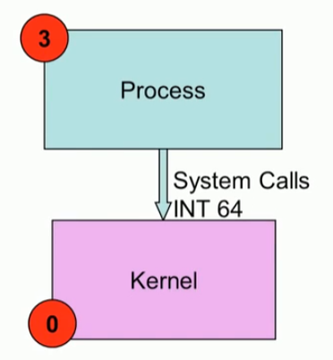
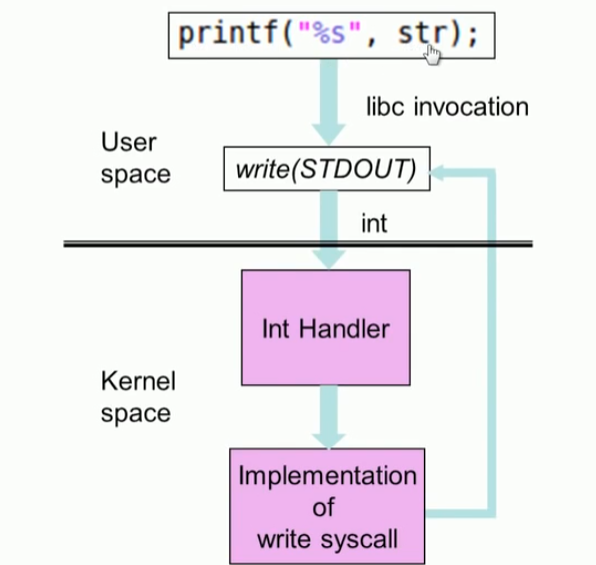
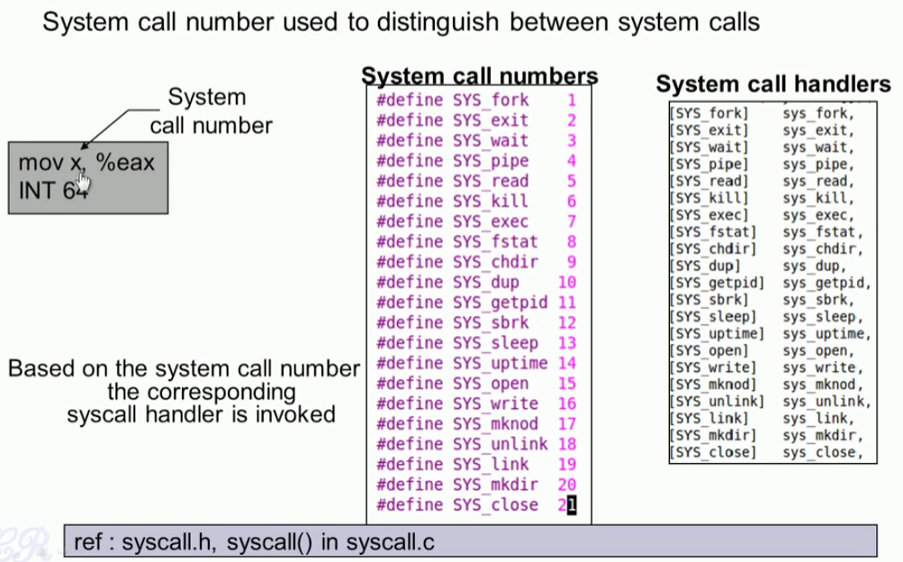
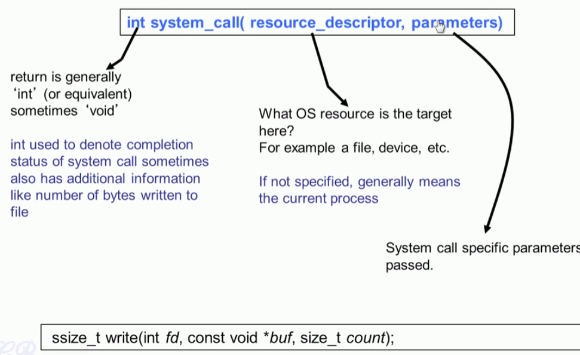
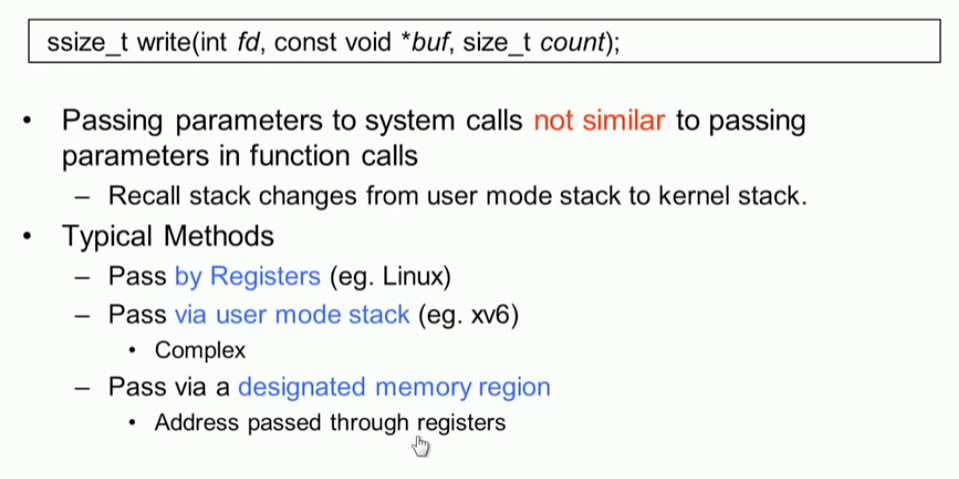
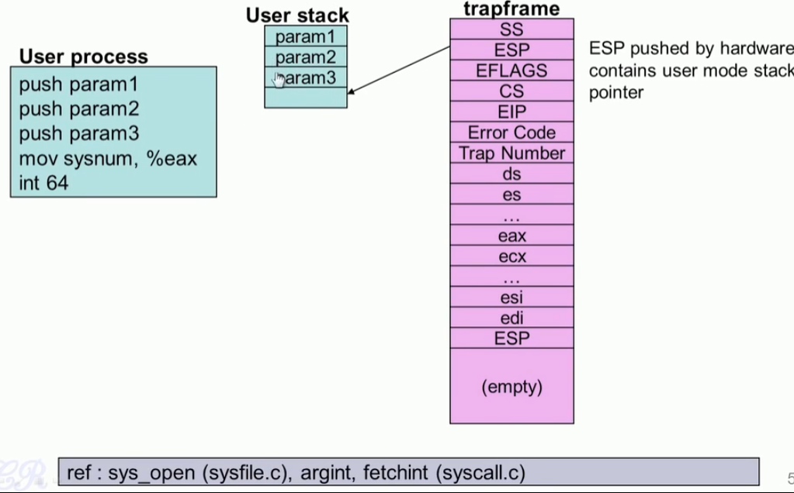

## Software Interrupt

### hardware vs Software interrupt

#### Software interrupt 

* software interrupt used fot implementing system calls
  * in linux Int 128
  * in xv6  int 64 

### system call : example

#### 1. write system call 

#### 2. System  call in xv6

#### 3. system call number

#### 4. prototype of a typical system call 

#### 5. passing parameters in system call

#### 6. pass by register (linux)

* 파라미터가 6개보다 작을 경우는 레지스터를 이용하고 전달
  * %eax(sys call number), %ebx, %ecx, %esi, %edi, %dbp
* 시스템 Call 파라미터 6개 이상
  * argment를 가지고 있는 bock  struct의 pointer 를 전달한다. 

* 내가 System call 할때 상태를 저장하는 것과 파라미터를 전달하는 것을 혼동 했구나.

#### 7. pass via user stack (xv6)

#### 8. return from system call

