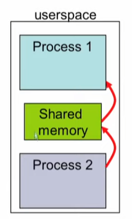
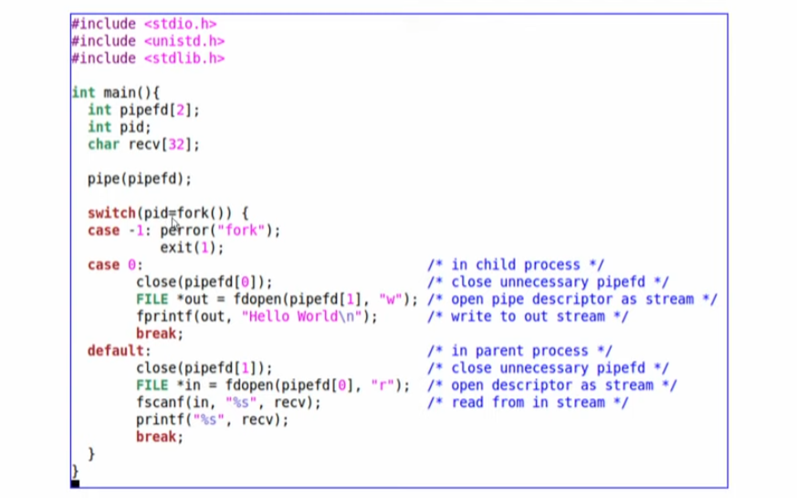

# Inter Process Communication


### Virtual memory view

* During execution, each process can only view its virtual addresses
* it cannot
  * view another processes virtual address space
  * Determine the physical address mapping 

#### IPC 

* Advantages of Inter process Communications
  1. information sharing 
  2. Modularity/Convenience
* 3 ways
  1. Shared memory 
  2. Message Passing
  3. Signals
* 결국 동시성 문제가 발생한다는 것...


### 1. Shared Memory

* One process will create an area in RAM which the other process can access
* Both process can access shared memory like a regular working memory
  * reading/writing is like regular reading/writing
  * Fast
* Limitation: 에러가 발생하기 쉬운 문제. Needs synchronization between processes 





####  Shared Memory in Linux

* int shmget (key, size, flags)

  * Create a shared memory segment
  * Return ID of segment : shmid
  * key: unique identifier of th shared memory segment
  * size : size of the shared memory (rounded up to the PAGE_SIZE)

* int shmat (shmid, addr, flags)

  * Attach shmid sharded memory to address space of  calling process
  * addr: pointer to the shared memory address space

* Int shmdt (shmid)

  * Detach shared memory

    


### 2. Message Passing

* Shared memory created in the kernel
* System calls such as send and receive used for communication
  * cooperating : each send must have a receive
* Advantage : Explicit sharing, 오류 발생 가능성이 좀 낮다
* Limitation: Slow. Each call  involves marshaling / de marshaling of information


### 3. Pipe

*  Always between parent and Child
* Always unidirectional
* Accessed by two associated file descriptors:
  * fd[0]  for reading form pipe
  * fd[1] for writing to pipe


* two pipes opened pipe 0 and pipe 1
* Note the unnecessary pipes
* close unnecesssary pipes





### 4. signals 

* Asynchronous unidirectional communication between processes
* Signals are a small integet
  * 9: kill, 11: segmentation fault
* Send a signal to process
  * kill (pid, sgnum)
* Process handler for a signal
  * signadler_t signal(signum, handler);
  * Default if no handler defined


### 구현

### Implementing 2 pipes between a parent and child process

```c
int main (void)
{
    pid_t pid;
    int pipe_in[2];
    int pipe_out[2];
    char buffer[800];

    /* Create the pipe.  */
    pipe (pipe_in);
    pipe (pipe_out);

    /* Create the child process.  */
    pid = vfork ();
    if (pid == (pid_t) 0) /* child 1 */
    {
		/*close unneeded*/
                close(pipe_in[1]);
                close(pipe_out[0]);
		
		/*Make pipes the stdin and stdout*/
                dup2(pipe_in[0], 0);
                close(pipe_in[0]);
                dup2(pipe_out[1], 1);
                close(pipe_out[1]);

		/*change a to b*/ 
                execl("/bin/tr", "tr", "a", "b" , 0);
                perror("exec prog1");
                exit(1);
    }
    else /*parent*/
    {
                /*close unneeded*/
                close(pipe_in[0]);
                close(pipe_out[1]);
                /*write to and then read from child*/
                write(pipe_in[1], "This is the data\n", 14);
                read(pipe_out[0], buffer, sizeof(buffer));

                /*send EOF to child*/
                close(pipe_in[1]);
                /*wait for end then close other end of pipe*/
                waitpid(pid, NULL, 0);
                close(pipe_out[0]);
                return EXIT_SUCCESS;
    }
}
```

#### dup

dup는 fd로 전달받은 파일 서술자를 복제하여 반환합니다. dup가 돌려주는 파일 서술자는 가장 낮은 서술자를 반환합니다. 성공시 새 파일 서술자, 오류시 -1을 반환합니다.

```
#include <unistd.h>
int dup(int fd);
```

```c
#include <unistd.h>
#include <stdio.h>
#include <stdlib.h>
#include <sys/stat.h>
#include <string.h>
#include <fcntl.h>

int main(void){
        int fd1, fd2;
        char message[32]={"message via fd2\n"};

        fd1=open("made_by_fd1",O_RDWR|O_CREAT, S_IRUSR|S_IWUSR);
        if(fd1<0){
                printf("file open error\n");
                exit(0);
        }


        fd2=dup(fd1);

        write(fd2,message,strlen(message));
        printf("fd1 :%d, fd2:%d\n",fd1,fd2);
        close(fd1);
        close(fd2);

}
```


#### dup2

dup2는 새 서술자의 값을 fd2로 지정합니다. 만일 fd2가 이미 열려있으면 fd2를 닫은 후 복제가 됩니다. 역시 성공시 새 파일 서술자, 오류시 -1을 반환합니다.

```c
#include <unistd.h>
int dup2(int fd, int fd2);
```


```c
#include <unistd.h>
#include <stdio.h>
#include <stdlib.h>
#include <sys/stat.h>
#include <string.h>
#include <fcntl.h>

int main(void){
        int fd1, ret;
        char message[32]={"STDERR from fd1\n"};

        //그림 1번
        fd1=open("made_by_fd1",O_RDWR|O_CREAT, S_IRUSR|S_IWUSR);
        if(fd1<0){
                printf("file open error\n");
                exit(0);
        }
        //표준 입출력으로 print됨
        printf("file open\n");

        //fd1의 파일 디스크립터가 명시한 STDOUT_FILENO의 파일 디스크립터로
        //복제됨,
        //그림 2번
        ret=dup2(fd1,STDOUT_FILENO);

        //fd1으로 출력됨
        printf("fd1 :%d, ret:%d\n",fd1,ret);

        //STDERR_FILENO 디스크립터가 명시된 fd1으로 복제됨
        //그림 3번
        ret=dup2(STDERR_FILENO,fd1);

        //fd1은 에러로 출력됨
        write(fd1,message,strlen(message));

        //stdout이 file로 써짐
        printf("printf를 썼지만 파일에 기록됨 \n");

        close(fd1);

}
```


