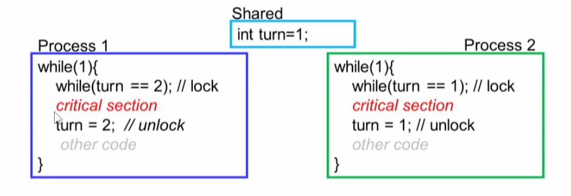
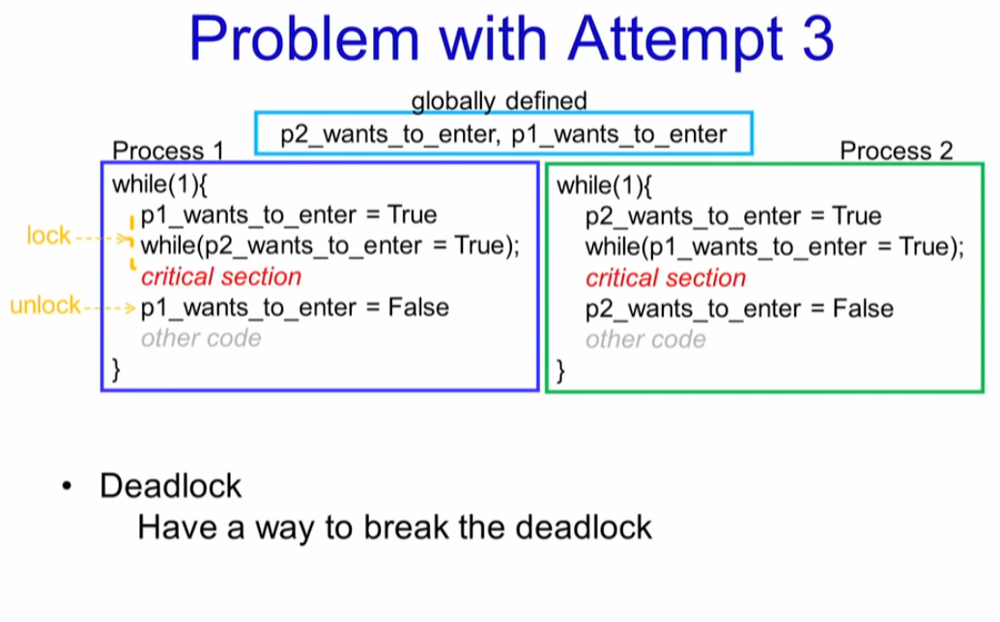
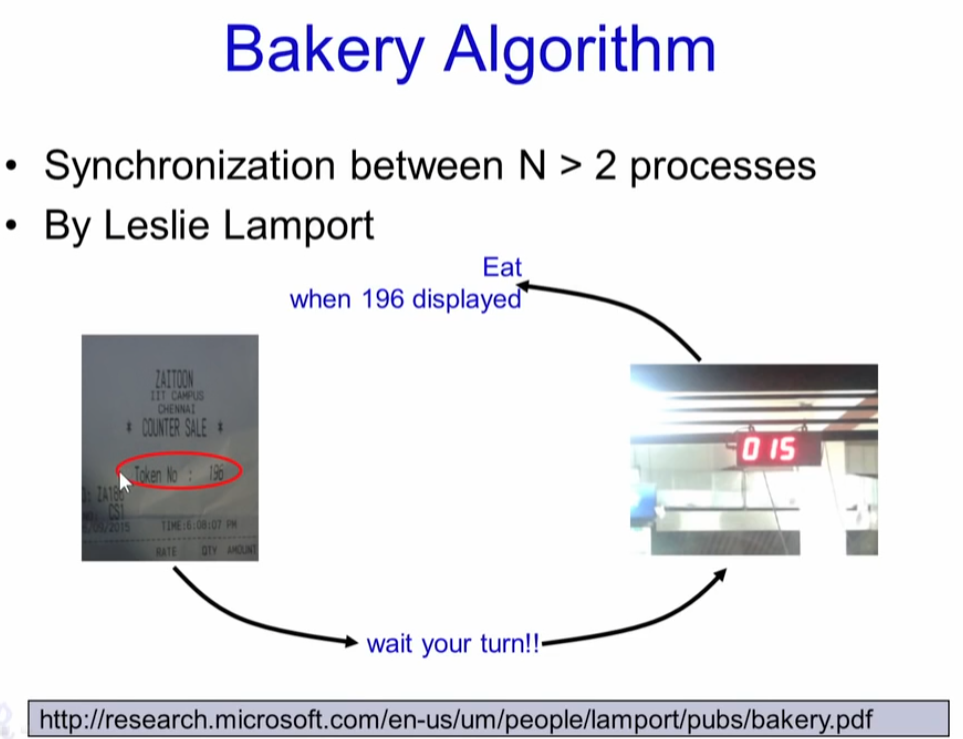

# Synchronization: Race Conditions, Critical Section, Locks & Unlocks

# How to Implement Locking: Software Solutions

#  Bakery Algorithm

# Hardware Locks: Spinlock & its Usage

# Mutexes, Thundering Herd Problem

# Semaphores

