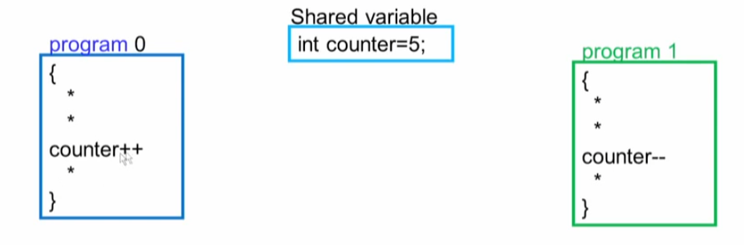

# Synchronization: Race Conditions, Critical Section, Locks & Unlocks

## 문제

생각해봅시다. single core cpu 상황에서...

공유 변수 count=5가 있을때 2개의 프로그램이 각각 수행될 때 결과는 얼마가 될까?

각각 1회씩 실행 했다면 결과는 5가 될 것으로 예상할 수 있다. 

#### 1. 공유 변수 사용하는 프로그램

##### 예상 결과는 

* 순차적으로 스케쥴링 된다면 결과는 5가 될텐데...
* 불행하게도 4 와 6도 될 수 있다.  

##### Context Switching 관점의 instruction 

* counter  주소에서 R1 레지스터에 로딩하고
* R1 레지스터에 R1+1
* counter 주소에 R1 값을 저장하는 instruction 

#### 2. Instruction 수행 중 interrupt (Context Switching 발생)

* C언어 한 라인이 원자성을 보장되지 않는다.
* 작업이 완료되기전에 interrupt 허용될때 발생 가능한 현상

##### 오류 발생 유형들

* context switching 발생 위치에 따라서 결과 값이 달라 진다. 

### Race Conditions 

#### 1. 공유 자원에 대한  경쟁 상황 

* Critical Section :  여러 프로세스가 동일한 데이터에 접근하여 조작하는 상황  
* 결과는 액세스가 발생하는 순서에 따라 다릅니다.
* Prevent race condtions by synchronization 
  * Ensure only one process at a time manipulates the critical data 
  * 공유 영역인 Critical section에 대해서는 하나만 접근하여 완료될 수 있도록 하는 것

#### 2. Race conditions in Multicore

#### 3. Critical Section

* 모든 안전한 프로그램은 다음 요구 사항을 만족 해야 한다. 
  * **Mutual Exclustion: 상호배제** : 

    주어진 시간에 임계 섹션에 한개의 프로세스만 있을 수 있다. 

  * **Progress** : 

    Critaical section에 프로세스가 없을 때 Critical section으로의 진입을 요청하는 모든 프로세스는 지체 없이 허용되어야 함

  * **No starvation (bounded wait)** : 

    다른 프로세스가 대기하는 동안 프로세스가 임계 영역에 들어가는 횟수에는 상한선이 있습니다.

#### Locks and Unlocks

* lock(L) : acquire lock L exclusively
  * only the process with L can access the critical section
* unlock(L) : release exclusive access to lock L
  * permitting other proceses to access the critical section 

#### Lock 고려 사항 

* 단일 instructions은 쪼개지지 (인터럽트가 발생할 수 없는) 원자적 성격이 있다.
  * `eg. add %eax, %ebx`
* Multiple instructions need to be explicityly made atomic 
  * 복수의 instruciton은  명시적으로 원자성을 갖도록 만들어야 한다. 
  * Each piece of code in the OS must be checked if they need to be atomic 
  * OS 안에서 각각의 코드들은 그것들이 원자성이 있는지 체크 해야 한다. 

