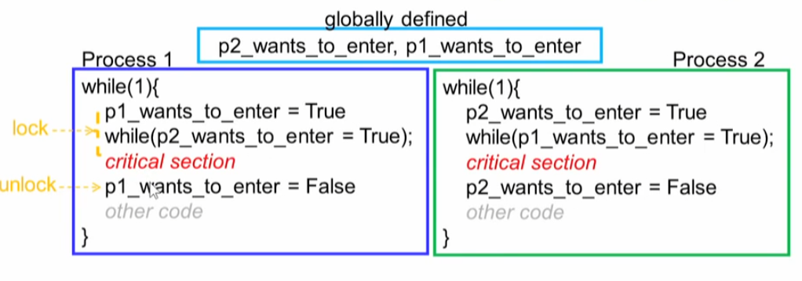

# How to Implement Locking: 

### Software Solutions

#### 1. Using Interrupts 

* simple 
  * when interrupts are disabled, context switches won't happen
* Requires privileges
  * User processess generally cannot disable interrupts
* Not suited for multicore system

#### 2. Software Solution 시도#1

* Mutual exclustion 달성
* Busy waiting - cpu 자원 소모
* 좀 뭔가 다른 대안이 필요 

#### 3. Software Solution 시도 #1

*  두개의 프로세스에서 동시에 사용할 수 있는 공통 플레그가 필요

* 가능한 방안은 프로세서 별로 플래그를 각각 구성하는 방안을 생각해 볼수 있다.  

#### 4. Software Solution 시도 #1

* Need not alternate execution in critical section 
* 상호 배제를 보장하지 못함. 

* 왜 상호 배제를 보장하지 못하는가?

#  Bakery Algorithm

