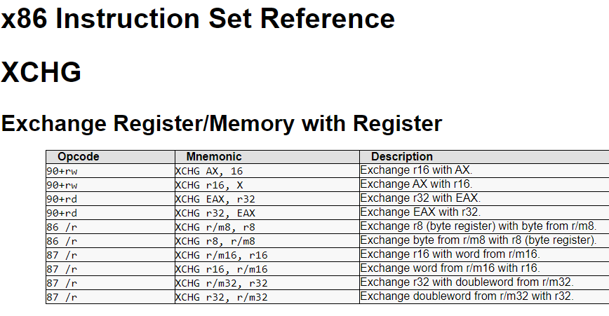

# Hardware Locks

### Spinlock & its Usage


#### 1. 문제

* 이런 방식으로  공유 자원 lock 변수를 이용해서  mutaul exclustion을 보장할 수 있을까?
* 당연하지만  보장되지 않는다.  


#### 2. 생각해보면 

* 인터럽트 이슈가 발생
* context switching


#### 3. 공유 변수를 확인과 설정을 하나로 묶을 수 있다면 

* 이것을 atomic operation으로 구현 할 수 있다면  혹시나....
* lock 변수 값을 메모리에서 가져오는 것과  그 메모리 주소에 값을 설정하는 것을 하나로 묶을 수 있다면...


#### 4. Hardware support

* Test & Set Instruction 
* Write to a memory location, return its old value


#### 4. Multiple CPU 상황에서

* 하드웨어적으로 다른 프로세서에서 Test&Set instruction 이 동시에 진입하지 못하도록 보장한다. 


#### 5. 이것은 어떻게 동작 하는가?

* 하드웨적으로 동시 진입을 허용하지 않을때
* 첫번째 프로세스가 
  * Lock을 읽고서 1로 설정
  * Critical section 에서 일을 수행할 
  * lock 변수를 0 으로 설정하여 unlock
* 두번째 프로세스는 
  * 메모리 주소에서 Lock 값을 읽어 올때 1일 설정되어 있으면 while 대기 상태
  * 만약 첫번째 프로세스가 0으로 lock 값을 설정하고 critical section을 빠져 나왔다면  lock 획득 가능


* 여기서는 while 대기를 하게 되는 것은 overhead가 있기 때문에 sleep하고 wakeup 하는 것이 효율적이지만..
* 스케쥴러가 간섭하여 스케쥴링 오버헤드를 가져갈 것인지 판단이 필요하다. 


#### 6. Intel : xchg Instruction 





#### 7. acquire, release 


* acquire

```go
// Acquire the lock.
// Loops (spins) until the lock is acquired.
// Holding a lock for a long time may cause
// other CPUs to waste time spinning to acquire it.
void
acquire(struct spinlock *lk)
{
  pushcli(); // disable interrupts to avoid deadlock.
  if(holding(lk))
    panic("acquire");

  // The xchg is atomic.
  while(xchg(&lk->locked, 1) != 0)
    ;

  // Tell the C compiler and the processor to not move loads or stores
  // past this point, to ensure that the critical section's memory
  // references happen after the lock is acquired.
  __sync_synchronize();

  // Record info about lock acquisition for debugging.
  lk->cpu = mycpu();
  getcallerpcs(&lk, lk->pcs);
}
```

* xchg

```go
static inline uint
xchg(volatile uint *addr, uint newval)
{
  uint result;

  // The + in "+m" denotes a read-modify-write operand.
  asm volatile("lock; xchgl %0, %1"
               : "+m"(*addr), "=a"(result)
               : "1"(newval)
               : "cc");
  return result;
}
```


* struct lock

```go
// Mutual exclusion lock.
struct spinlock {
  uint locked;       // Is the lock held?

  // For debugging:
  char *name;        // Name of lock.
  struct cpu *cpu;   // The cpu holding the lock.
  uint pcs[10];      // The call stack (an array of program counters)
                     // that locked the lock.
};
```


##### Lock 구현 방법

* Spinlock
* Mutex
* semaphore


#### 8. Spinlocks Usage 


#### 9. Spinlock 고려 사항


`xchg %eax, X`

* 컴파일러 optimizations을 허용해서는 안된다. 
* X 변수를 레지스터 변수로 하면 안된다.
* 메모리 에 로딩하고 적재하는 순서를 변경해서는 안된다. 
  


* 좀 더 많은 이슈들  


* 좀더 좋은 방법은  


#### 10. spinlock은 언제 유용?


* 특성 : busy waiting 
  * Useful for shot critical sections, where much CPU time is not wasted waiting  (CPU cycle )
  * 예시: increment a counter, access an array element, etc
* 적용하면 안되는 곳
  * wait을 예상 할 수 없는 곳, 언제  허용될지  모르는 long time  (이럴때는 그냥 sleep 하고 다시 스케쥴링 받는 것이 더  좋다)
  * read from disk 이런데는 쓰면 안된다  이런데는 mutex를 써라.


#### 11. mutex 


#### 12. Thundering Herd Problem 


* 하나만  깨운다. 


