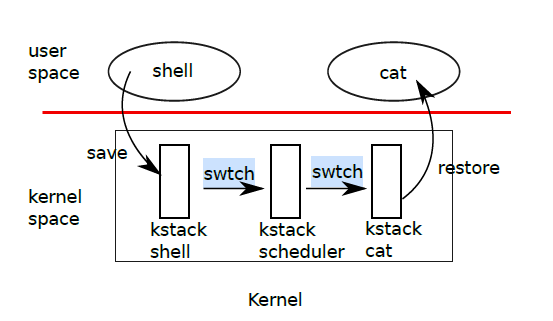
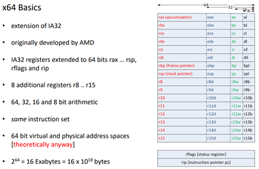
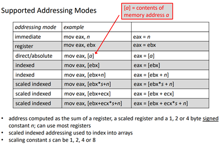
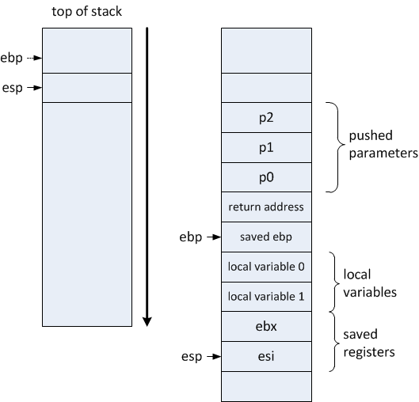
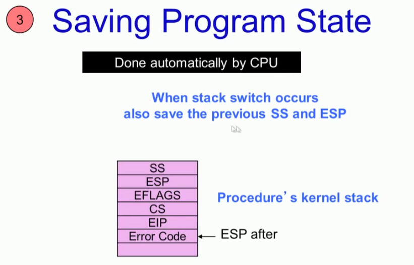
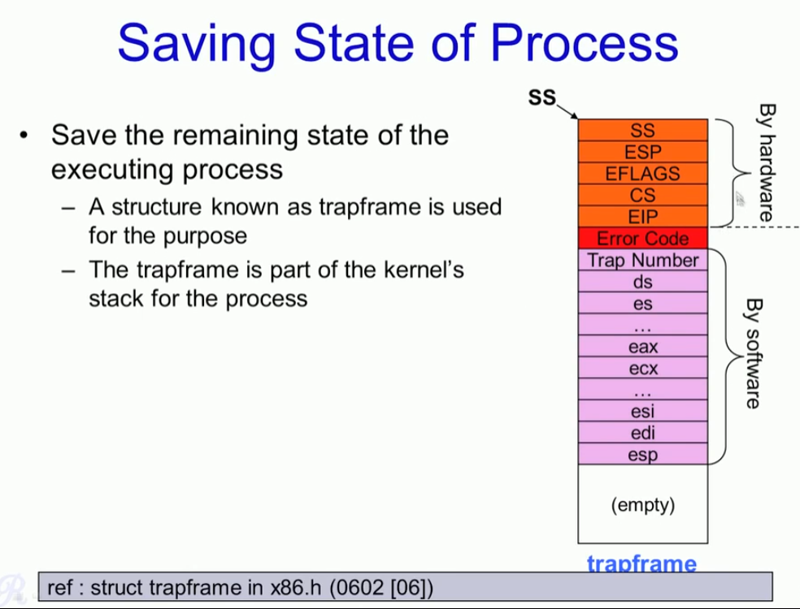

# Context switch

* cpu 별 Scheduler가 있다. 

* 영원히 종료되지 않는 scheduler kernel task가 돌아간다. (당연히 이것도 kernel stack이 있다. )
* task가 종료되는 시점 (timout, sleep) 이 발생할때 yied 또는 sched를 호출한다.
* sched는 현재 task에서 scheduler로 전환하는 Context switching을 하게 된다. 


#### sched 

* sched()를 호출해서 schedulere 커널이 동작하도록 한다.
* `swtch(&p->context, mycpu()->scheduler);` 작업이 scheduler로 switching하게 한다. 

```c
// Enter scheduler.  Must hold only ptable.lock
// and have changed proc->state. Saves and restores
// intena because intena is a property of this
// kernel thread, not this CPU. It should
// be proc->intena and proc->ncli, but that would
// break in the few places where a lock is held but
// there's no process.
void sched(void)
{
  //cprintf("k:sched\n");
  int intena;
  struct proc *p = myproc();

  if (!holding(&ptable.lock))  panic("sched ptable.lock");
  if (mycpu()->ncli != 1)      panic("sched locks");
  if (p->state == RUNNING)     panic("sched running");
  if (readeflags() & FL_IF)    panic("sched interruptible");
  intena = mycpu()->intena;
  swtch(&p->context, mycpu()->scheduler);
  mycpu()->intena = intena;
}
```


```c
struct cpu {
  uchar apicid;                // Local APIC ID
  struct context *scheduler;   // swtch() here to enter scheduler <<--- 이 스케쥴러를 호출
  struct taskstate ts;         // Used by x86 to find stack for interrupt
  struct segdesc gdt[NSEGS];   // x86 global descriptor table
  volatile uint started;       // Has the CPU started?
  int ncli;                    // Depth of pushcli nesting.
  int intena;                  // Were interrupts enabled before pushcli?
  struct proc *proc;           // The process running on this cpu or null
};
```


#### scheduler

* Per-CPU process scheduler. <<--- cpu 마다 스케쥴러가 있는 것을 명심하자. 
* Each CPU calls scheduler() after setting itself up. -->> 영차 영차 돌릴만한 task 있는지 검사 시작한다. 
* Scheduler never returns.  It loops, doing:
  * hoose a process to run
  * swtch to start running that process
  * eventually that process transfers control  via swtch back to the scheduler.

```c
void scheduler(void)
{
  struct proc *p;
  struct cpu *c = mycpu();
  c->proc = 0;

  for (;;)
  {
    // Enable interrupts on this processor.
    sti();

    // Loop over process table looking for process to run.
    acquire(&ptable.lock);
    for (p = ptable.proc; p < &ptable.proc[NPROC]; p++)
    {
      if (p->state != RUNNABLE)
        continue;

      // Switch to chosen process.  It is the process's job
      // to release ptable.lock and then reacquire it
      // before jumping back to us.
      c->proc = p;
      switchuvm(p);
      p->state = RUNNING;

      swtch(&(c->scheduler), p->context);
      switchkvm();

      // Process is done running for now.
      // It should have changed its p->state before coming back.
      c->proc = 0;
    }
    release(&ptable.lock);
  }
}

```


```c
// Switch h/w page table register to the kernel-only page table,
// for when no process is running.
void switchkvm(void)
{
  lcr3(V2P(kpgdir)); // switch to the kernel page table
}


static inline void lcr3(uint val)
{
  asm volatile("movl %0,%%cr3"
               :
               : "r"(val));
}
```




#### switch

````asm
# Context switch
#
#   void swtch(struct context **old, struct context *new);
# 
# Save the current registers on the stack, creating
# a struct context, and save its address in *old.
# Switch stacks to new and pop previously-saved registers.

.globl swtch
swtch:
  movl 4(%esp), %eax
  movl 8(%esp), %edx

  # Save old callee-saved registers
  pushl %ebp
  pushl %ebx
  pushl %esi
  pushl %edi

  # Switch stacks
  movl %esp, (%eax)
  movl %edx, %esp

  # Load new callee-saved registers
  popl %edi
  popl %esi
  popl %ebx
  popl %ebp
  ret

````

* Swtch (kernel/swtch.S:3) saves only callee-saved registers; caller-saved registers are saved on the stack (if needed) by the calling C code.  

  * callee-saved --> registers  (new task )
  * caller-saved register --> on stack  (old task)

  

* system call  Instruction, system call number

```
       Arch/ABI    Instruction           System  Ret  Ret  Error    Notes
                                         call #  val  val2
       ───────────────────────────────────────────────────────────────────
       i386        int $0x80             eax     eax  edx  -
       x86-64      syscall               rax     rax  rdx  -        5
```

* to pass the system call arguments

```
       Arch/ABI      arg1  arg2  arg3  arg4  arg5  arg6  arg7  Notes
       ──────────────────────────────────────────────────────────────
       i386          ebx   ecx   edx   esi   edi   ebp   -
       x86-64        rdi   rsi   rdx   r10   r8    r9    -
```


* EBP : Pointer to data on the stack (in the SS segment)

* ESI : Source pointer for string operations

* EDI : Destination pointer for string operations

* ESP : Stack pointer (in the SS segment)


#### x64 Register




#### addressing




#### IA32 Function Stack Frame







