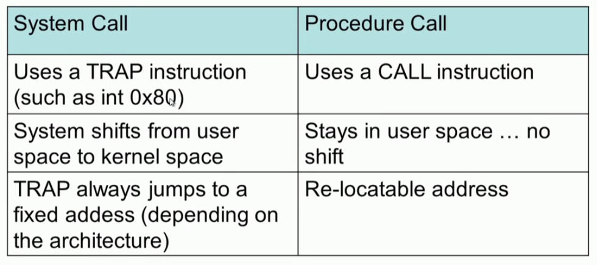
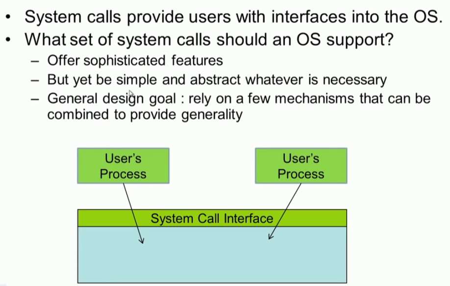
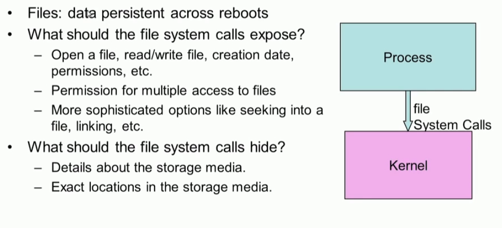
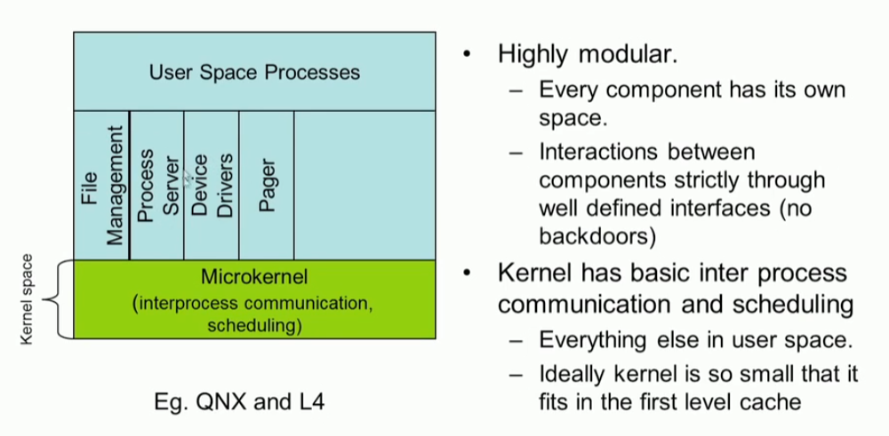
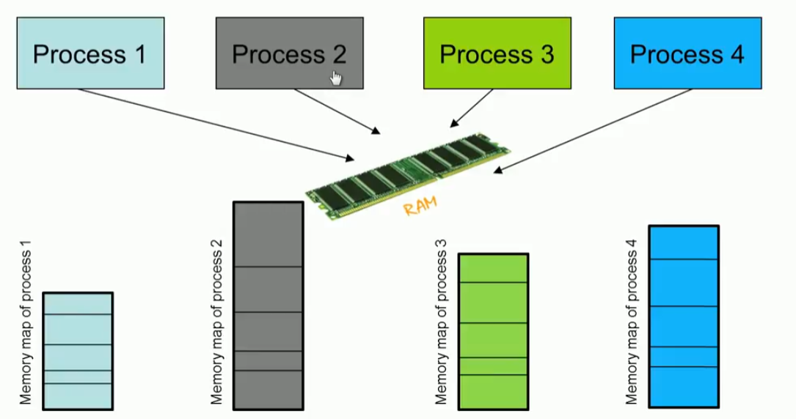
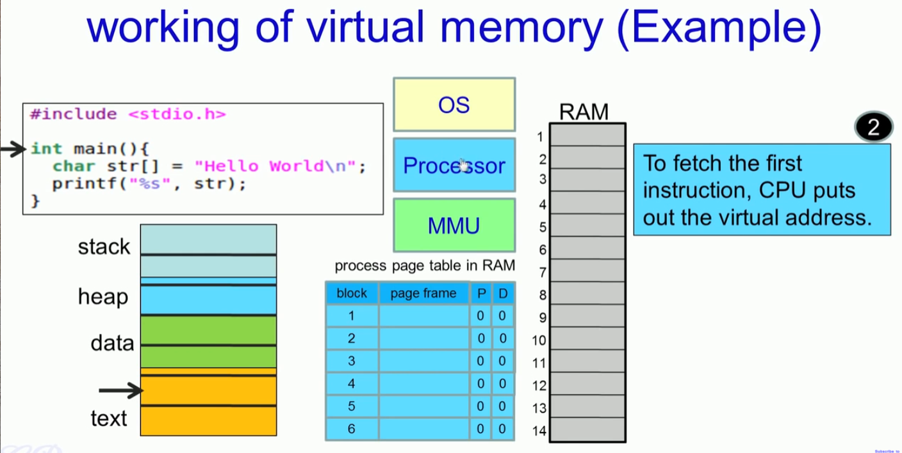
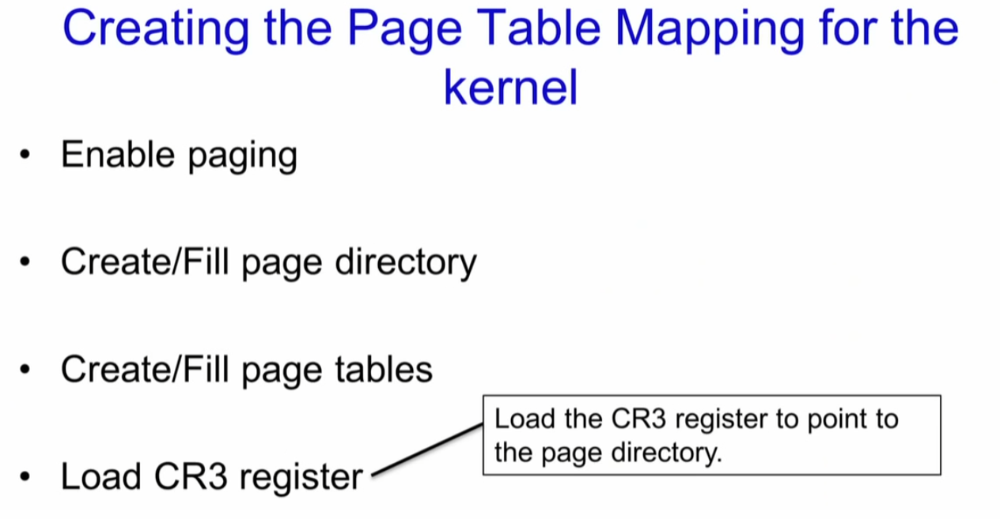

# Memory Management

## 1. Program & Process

### Process

### Process Memory Map

#### Kernel memory map

* user program cannot access kernel memory area
* 왜 0xFE00 0000 일까?  0x100 0000

## 2. system call

#### system call trap handler

#### system call vs procedure call

#### monolithic structure

#### microkernel

## 3. Programs Memory

### process

### Sharing RAM

## 4. Virtual Memory

Do we really need to load all blocks into memory before the process starts executing?

* dirty bit 

## 5. Virtual Address Space of a process

## 6. Working of virtual memory

## 7. Segmentation & Fragmentation

 

* 결국 ELF 프로그램이 메모리에 로딩되어서 어떻게 실행되고 가상 주소가 물리 주소에 매핑 되는가에 대한 것이 정리된다.

## 8. XV6 Memory management

## 9. Allocating Page

