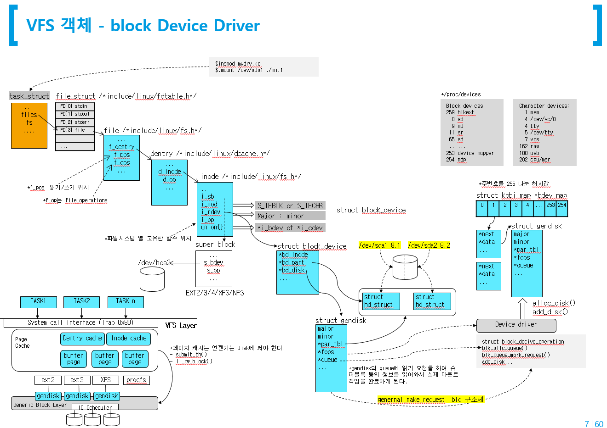
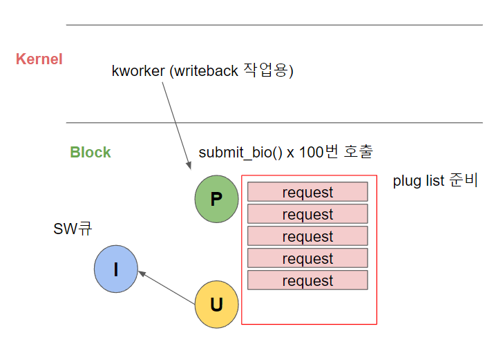

# Linux IO

### Linux IO stack diagram

* VFS : Process와 연결된는 Object 4개, Cache
* 파일 시스템 : 물리적 저장 구조에 대한 것
* Block Layer 


####  VFS, FS, Bock layer


### BIO


### 


### NVME IO


# 

## VFS

### IO layer

#### VFS

* 이것은 진짜 중요한 개념이다. 


* file system format은 가장 중요한 핵심 원리는 디스크의 물리적 불럭을 어떻게 읽고 쓸지에 대한 규칙을 정의한 것이다.
* 파일을 큰것이 유리한것 , 파일이 많을때 유리한것 등등 장단점이 있다.
* 이런 물리적 디스크 특성에 따라 관리하는 것이 파일 시스템이다.
* 블럭 layer를 통해서 처리...
* 결국은 메모리의 변경이 물리적 블럭들이 변경 Read/Write를 한다는 것에서 중요하다.
* 아무튼 물리적 세계로 접근하는 방법은 VFS이기 때문에 파일 시스템을 통해서 접근하는 것 처럼 보인다. 리눅스의 철학...


## Buffered IO


* Page Cache가 뭔가요? : 디스크에 있는 것이 메모리에 올라와 있는 것 (meta, data) <<=== 
* anonymouse page는 프로그램 에서 사용하는 데이터가 올라와 있는 페이지... (malloc....)

* page(물리) 메모리 조각: 4K, 4096, 0x1000, 12bit  2^12   2<<12
* page에 들어가 있는 내용이 stack, heap 이라면 anonymous memory라고 부른다.
* page에 들어가 있는 내용이 디스크에 들어 있는 내용이면 이것은 pageCache라고 부른다.
* 이 pagecache를 2가지로 부른다. (일반적 용어가 아니라, 여기 계층에서  사용하는 용어)
  * buffer : 파일의 정보
  * cached:  파일의 내용

```
reallinux@ubuntu:~/git/linux/mm$ cat /proc/meminfo | head -5
MemTotal:        2035676 kB
MemFree:         1723368 kB
MemAvailable:    1896472 kB
Buffers:           21184 kB
Cached:           156284 kB
```


writeback 프로세스가 5초 단위로 진행된다.  5초 이내 디스크를 뽑아 버리면 실패한다. sync 명령 하면 내려간다.


#### 1. buffered IO Read


#### 2. buffered IO Write


* xv6 코드를 추적해 보자.


#### 3. struct file, struct inode


* xv6 코드를 추적해 보자


## 파일 시스템 

#### 1. super block

* struct super_block
* struct ext4_super_block


* super block은 여러개로 copy해 놓는다. 
* 복구가 불가능한것은 아니지만...
* 자신의 어플리케이션 환경에서 파일시스템 벤치 마크를 돌려 보면서 최선의 파일 시스템을 선택하는 것이 맞을 듯...

* 여기는 스스로 공부하세요.


#### 2. ext2 File system


#### File 객체




## Block Layer

### bio

* 여러단계 A 단계, ...Q단계  6단계....


#### 블럭 처리 단계: 일반적 A Q G I D C 단계


#### 머지 단계 

* 특정  bio가 물리적으로 연속될 때 머지 발생한다. 
* 앞으로 연결될수 있고, 뒤로 연결될 수 있는데... Back merge가 많이 발생된다. 영화 볼때 뒷쪽 블럭을 더 많이 본다. 


#### Plug list 이렇게 모아서 처리하는 이유는?

* 리눅스는 연결된 디바이스가 많기 때문에 다양한 IO가 발생하기 때문에 sumit io가 불려질때.. 이것이 우발적으로 정리 안되게 처리될  수 있는데.... 이것을 좀 묶어서 처리하면 교통정리 측면에서 plug list를 선택적으로 사용할수도 있고 안할 수도 있디.
* 커널 내부에서  좀 목적에 맞게.....




#### Block 처리 단계


