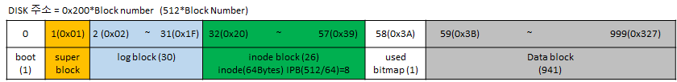

# mkfs


## mkfs 소스 분석

#### fs.img 생성을 위한 mkfs

```
fs.img: mkfs README $(UPROGS)
	./mkfs fs.img README $(UPROGS)
```


#### disk layout




```c
#define FSSIZE       1000  // size of file system in blocks
#define MAXOPBLOCKS  10  // max # of blocks any FS op writes
#define LOGSIZE      (MAXOPBLOCKS*3) 
#define NINODES 200
#define BSIZE 512   // block size
#define IPB           (BSIZE / sizeof(struct dinode)) //  512/64 =>8

int nlog = LOGSIZE;  //30
int ninodeblocks = NINODES / IPB + 1;  200/9=> (200/8)+1=>26
nmeta = 2 + nlog + ninodeblocks + nbitmap; 2+30+26+1 => 59
nblocks = FSSIZE - nmeta;
```


#### disk 슈퍼 블럭

```
struct superblock {
  uint size;         // Size of file system image (blocks)
  uint nblocks;      // Number of data blocks
  uint ninodes;      // Number of inodes.
  uint nlog;         // Number of log blocks
  uint logstart;     // Block number of first log block
  uint inodestart;   // Block number of first inode block
  uint bmapstart;    // Block number of first free map block
};
```


#### disk inode 구조

```
#define NDIRECT 12
struct dinode {
  short type;           // File type
  short major;          // Major device number (T_DEV only)
  short minor;          // Minor device number (T_DEV only)
  short nlink;          // Number of links to inode in file system
  uint size;            // Size of file (bytes)
  uint addrs[NDIRECT+1];   // Data block addresses
}; //64Bytes
```


