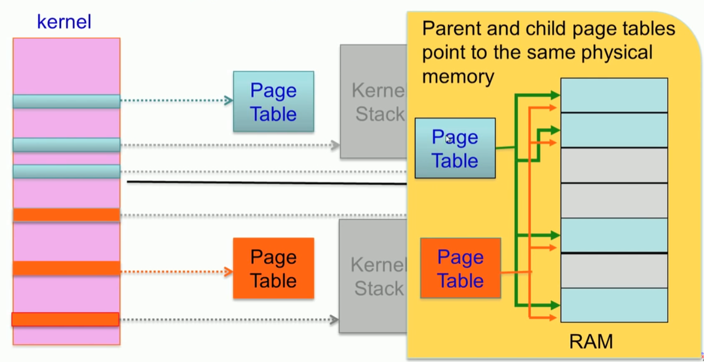
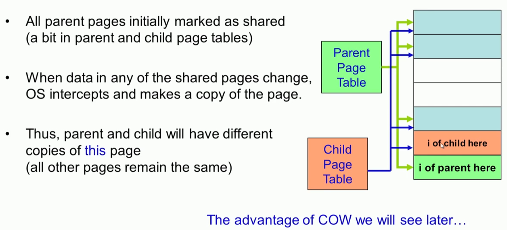
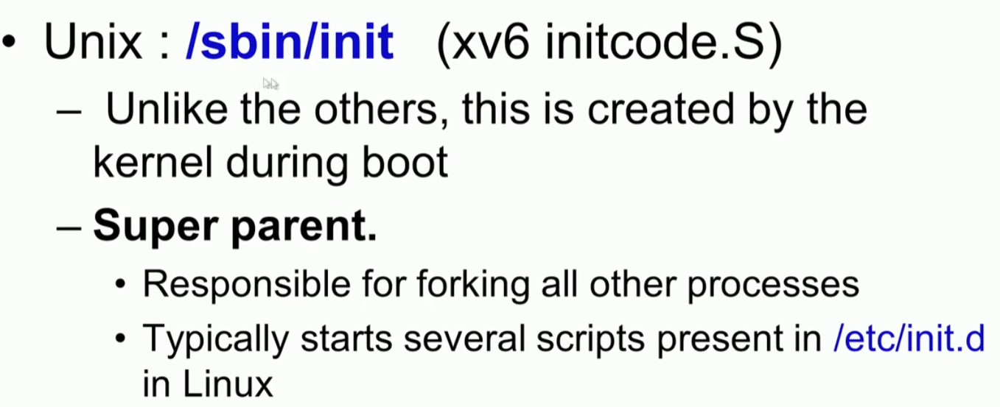
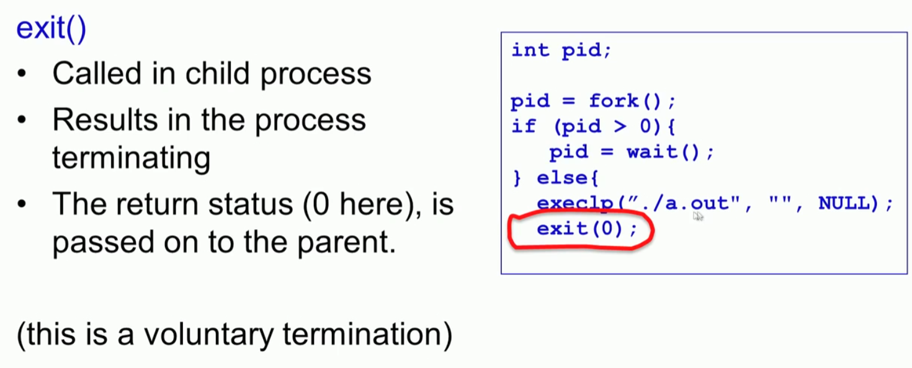
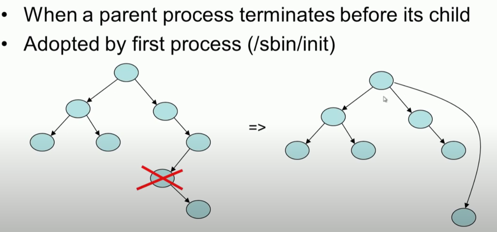
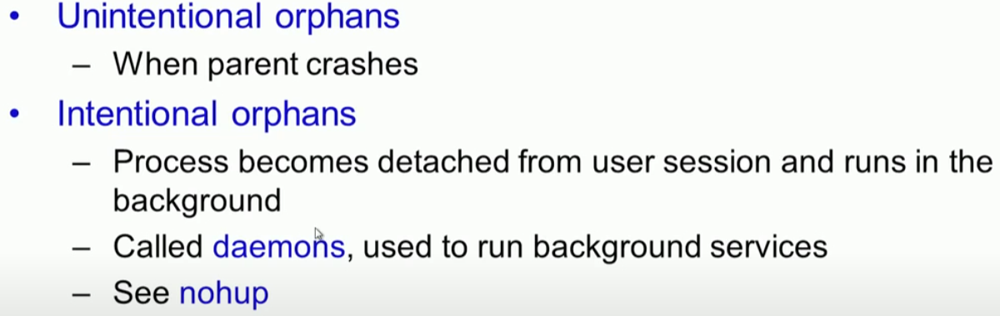
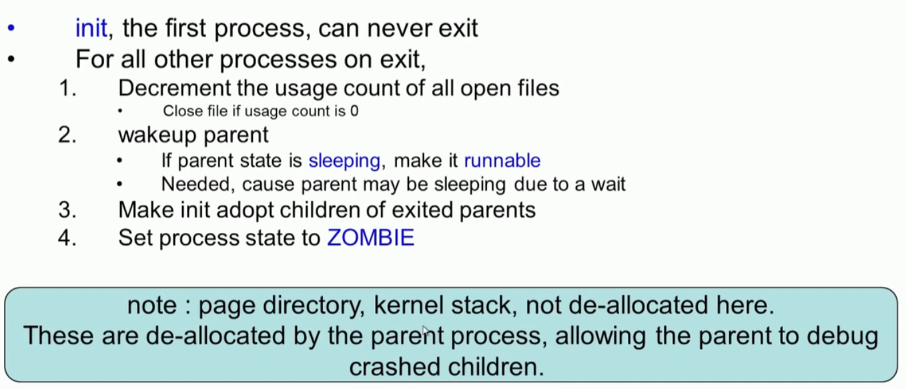

# Process Management

## 프로세스의 Virtual Address Space

### 1. Application memory Map


### 2. Virtual address Map 


### 3. Kernel Memory 위치

* Virtual memory 에서는 MAX_SIZE 위쪽에 위치
* 물리 메모리에서는 page frame에 연속적 공간에 위치 (주소 변환을 쉽게 하기위해서)


### 4. Kernel 주소와 User  program 주소

* 사용자 주소 공간은 사용자 주소 공간만 Access 가능
* 커널 주소 공간은 사용자 주소 공간을 포함하여 Access 가능
* 시스템 호출시 파라미터 전달


### 5. 연속공간에 할당되는 커널 주소

* 왜 커널은 연속 메모리에 매핑하는가?

* 주소 변환을 좀 쉽게 할 수 있기 때문이다.

  


```c
#define EXTMEM  0x100000            // Start of extended memory
#define PHYSTOP 0xE000000           // Top physical memory
#define DEVSPACE 0xFE000000         // Other devices are at high addresses

// Key addresses for address space layout (see kmap in vm.c for layout)
#define KERNBASE 0x80000000         // First kernel virtual address
#define KERNLINK (KERNBASE+EXTMEM)  // Address where kernel is linked

#define V2P(a) (((uint) (a)) - KERNBASE)
#define P2V(a) ((void *)(((char *) (a)) + KERNBASE))

#define V2P_WO(x) ((x) - KERNBASE)    // same as V2P, but without casts
#define P2V_WO(x) ((x) + KERNBASE)    // same as P2V, but without casts
```


### 6. Multi-Process 환경에서 Kernel 주소

* 커널의 주소 공간은 모든 프로세스에서 공유한다. 
* 모든 프로세스의 페이지 변환 테이블에서 같은 주소로 변환된다. 


### 7. kernel data

* 프로세스 가 만들어 지면 반드시 커널에 생성되는 커널 데이터가 있다. 
  * PCB, 
  * 커널 스텍
  * 페이지  테이블 
* 모든 프로세스는 이 3가지를 커널에서 관리한다. 


### 8. Process Stack과 Kernel Stack

* 모든 Process는 2개의 스텍을 가진다. 
* 더 중요한 것은 커널 스텍이다. 
* User Stack은 Application 함수 호출할때 사용한다.
* Kernel Stack은 커널에 인터럽트 걸어서 커널로 진입하여 해당 프로세스가 커널 모드에서 동작할 때 사용하다. 
* 사용자 모드에서 커널 모드로 진입할 때는 사용자의 CPU 상태를 Trapframe에 저장하는데. 이것은  CPU에 의해서 자동으로 저장되는 부분과 커널 코드에 의해서 자장되는 부분으로 구성된다.
* 커널로 진입할때 변수 전달은 xv6는 사용자  스택에 저장하는 방식을 쓰고, Linux에서는 register를 통해 매개 변수를 전달하는 방식을 사용한다.  
* Kernel 모드로 동작하다가 또 다른 인터럽트가 걸리게 되면 Context 스위칭하게 된다.


### 9. PCB : struct proc

* xv6: struct porc 


<proc.h>

```go
enum procstate { UNUSED, EMBRYO, SLEEPING, RUNNABLE, RUNNING, ZOMBIE };

// Per-process state
struct proc {
  uint sz;                     // Size of process memory (bytes)
  pde_t* pgdir;                // Page table
  char *kstack;                // Bottom of kernel stack for this process
  enum procstate state;        // Process state
  int pid;                     // Process ID
  struct proc *parent;         // Parent process
  struct trapframe *tf;        // Trap frame for current syscall
  struct context *context;     // swtch() here to run process
  void *chan;                  // If non-zero, sleeping on chan
  int killed;                  // If non-zero, have been killed
  struct file *ofile[NOFILE];  // Open files
  struct inode *cwd;           // Current directory
  char name[16];               // Process name (debugging)
};

```


```c
//PAGEBREAK: 17
// Saved registers for kernel context switches.
// Don't need to save all the segment registers (%cs, etc),
// because they are constant across kernel contexts.
// Don't need to save %eax, %ecx, %edx, because the
// x86 convention is that the caller has saved them.
// Contexts are stored at the bottom of the stack they
// describe; the stack pointer is the address of the context.
// The layout of the context matches the layout of the stack in swtch.S
// at the "Switch stacks" comment. Switch doesn't save eip explicitly,
// but it is on the stack and allocproc() manipulates it.
struct context {
  uint edi;
  uint esi;
  uint ebx;
  uint ebp;
  uint eip;
};
```


#### PID

* porcess Identifier
* Number incremented sequentially
* Need to ensure each process has a unique PID

```c
//  Look in the process table for an UNUSED proc.
//  If found, change state to EMBRYO and initialize
//  state required to run in the kernel.
//  Otherwise return 0.
static struct proc *
allocproc(void)
{
  ...
  for (p = ptable.proc; p < &ptable.proc[NPROC]; p++)
    if (p->state == UNUSED)
      goto found;
  ...
found:
  p->state = EMBRYO;
  p->pid = nextpid++;
  ...
}
```

* pid 할당하는 것은 ptable에서 미사용을 찾아서 그것을 할당한다. 


##### Process States


### 10. process Scheduling 

* 스케쥴러가 있다는 것, CPU마다 한개의 스케쥴러가 있다. 
* CPU 사용시간 vruntime이 만료되거, 스스로 양보하거나 할 경우 스케쥴러에게 Context Switch 하게 된다.
* 스케쥴러가 동작해서 어느 Process가 가장 우선 순위가 높은지 확인한다.
* 당연히 vruntime이 가장 작은 것이 우선순위가 높다. 
* 자료구조 O(1)에 의해 찾는다.
* 선택된 프로세스로 Context Switch 한다. 


### 11. PCB 항목

* trapfram, context 정보를 가지고 있다. 

* 커널 스텍의 일부로 위치한다. 

* 프로세스의 모든 Register 정보를 저장한다. 

* Context Switch 이후 process 재시작을 위해서 사용된다. 

  


```c
// Per-process state
struct proc {
  uint sz;                     // Size of process memory (bytes)
  pde_t* pgdir;                // Page table
  char *kstack;                // Bottom of kernel stack for this process
  enum procstate state;        // Process state
  int pid;                     // Process ID
  struct proc *parent;         // Parent process
  struct trapframe *tf;        // Trap frame for current syscall
  struct context *context;     // swtch() here to run process
  void *chan;                  // If non-zero, sleeping on chan
  int killed;                  // If non-zero, have been killed
  struct file *ofile[NOFILE];  // Open files
  struct inode *cwd;           // Current directory
  char name[16];               // Process name (debugging)
};
```

* 실제 xv6에서 Proc이 만들어지고 kernel stack에 채워지는 내용은 아래 그림을 참조 한다. 

```c
static struct proc *
allocproc(void)
{
  struct proc *p;
  char *sp;

  acquire(&ptable.lock);

  for (p = ptable.proc; p < &ptable.proc[NPROC]; p++)
    if (p->state == UNUSED)  goto found;
  release(&ptable.lock);
  return 0;

found:
  p->state = EMBRYO;
  p->pid = nextpid++;

  release(&ptable.lock);

  // Allocate kernel stack.
  if ((p->kstack = kalloc()) == 0)
  {
    p->state = UNUSED;
    return 0;
  }
  sp = p->kstack + KSTACKSIZE; //#define KSTACKSIZE 4096 //kernel stack size

  // Leave room for trap frame.
  sp -= sizeof *p->tf;
  p->tf = (struct trapframe *)sp;

  // Set up new context to start executing at forkret,
  // which returns to trapret.
  sp -= 4;
  *(uint *)sp = (uint)trapret;

  sp -= sizeof *p->context;
  p->context = (struct context *)sp;
  memset(p->context, 0, sizeof *p->context);
  p->context->eip = (uint)forkret;

  return p;
}
```


### 12. Process 저장 (xv6)

* in a globally defined array present in ptable
* NPROC is th maximum number of processes that can be presetn in the system  `#define NPROC 64`
* Also present in ptable is a lock that  is a lock that serializes access to the array 

```c
struct
{
  struct spinlock lock;
  struct proc proc[NPROC];
} ptable;
```


## Create a process

### 1. Cloning 

* Cloinging
* 부모 DNA를 복제하듯이  child는 parent를 복제한다.
  * child process is an exact replica of th parent
  * fork() system call


#### Parent, Child process 

* 각자의 길을 간다. 


### 2. Fork()

* copy meta data : Page table, Kernel stack, PCB (struct proc, task_struct)
* 


#### struct proc

```c
enum procstate { UNUSED, EMBRYO, SLEEPING, RUNNABLE, RUNNING, ZOMBIE };

// Per-process state
struct proc {
  uint sz;                     // Size of process memory (bytes)
  pde_t* pgdir;                // Page table
  char *kstack;                // Bottom of kernel stack for this process
  enum procstate state;        // Process state
  int pid;                     // Process ID
  struct proc *parent;         // Parent process
  struct trapframe *tf;        // Trap frame for current syscall
  struct context *context;     // swtch() here to run process
  void *chan;                  // If non-zero, sleeping on chan
  int killed;                  // If non-zero, have been killed
  struct file *ofile[NOFILE];  // Open files
  struct inode *cwd;           // Current directory
  char name[16];               // Process name (debugging)
};
```

#### fork()

```c
// Create a new process copying p as the parent.
// Sets up stack to return as if from system call.
// Caller must set state of returned proc to RUNNABLE.
int fork(void)
{
  int i, pid;
  struct proc *np;
  struct proc *curproc = myproc();

  // Allocate process.
  if ((np = allocproc()) == 0)
  {
    return -1;
  }

  // Copy process state from proc.
  if ((np->pgdir = copyuvm(curproc->pgdir, curproc->sz)) == 0)
  {
    kfree(np->kstack);
    np->kstack = 0;
    np->state = UNUSED;
    return -1;
  }
  np->sz = curproc->sz;
  np->parent = curproc;
  *np->tf = *curproc->tf;

  // Clear %eax so that fork returns 0 in the child.
  np->tf->eax = 0;

  for (i = 0; i < NOFILE; i++)
    if (curproc->ofile[i])
      np->ofile[i] = filedup(curproc->ofile[i]);
  np->cwd = idup(curproc->cwd);

  safestrcpy(np->name, curproc->name, sizeof(curproc->name));

  pid = np->pid;

  acquire(&ptable.lock);

  np->state = RUNNABLE;

  release(&ptable.lock);

  return pid;
}
```


### 3. duplicating page tables




* 초기에는 부모와 자식은 동일 한 테이블 보기 때문에 같은 값을 갖는다. 
* 하지만 자식의 값이 변경될 때 COW에 의해서 참조되는 위치를 변경하게 된다. 


#### COW : copy on Write



#### copyuvm (curporc->pgdir, curproc-sz)

```c
// Create a new process copying p as the parent.
// Sets up stack to return as if from system call.
// Caller must set state of returned proc to RUNNABLE.
int fork(void)
{
  int i, pid;
  struct proc *np;
  struct proc *curproc = myproc();
...
  // Copy process state from proc.
  if ((np->pgdir = copyuvm(curproc->pgdir, curproc->sz)) == 0)
  {
    kfree(np->kstack);
    np->kstack = 0;
    np->state = UNUSED;
    return -1;
  }
  np->sz = curproc->sz;
  np->parent = curproc;
  *np->tf = *curproc->tf;
...
  return pid;
}
```

* setupkvm, walkpgdir,kalloc 좀 더 봐야....

```c
// Given a parent process's page table, create a copy
// of it for a child.
pde_t *
copyuvm(pde_t *pgdir, uint sz)
{
  pde_t *d;
  pte_t *pte;
  uint pa, i, flags;
  char *mem;

  if ((d = setupkvm()) == 0) return 0;
  for (i = 0; i < sz; i += PGSIZE)
  {
    if ((pte = walkpgdir(pgdir, (void *)i, 0)) == 0) panic("copyuvm: pte should exist");
    if (!(*pte & PTE_P))  panic("copyuvm: page not present");
    pa = PTE_ADDR(*pte);
    flags = PTE_FLAGS(*pte);
    if ((mem = kalloc()) == 0) goto bad;
    memmove(mem, (char *)P2V(pa), PGSIZE);
    if (mappages(d, (void *)i, PGSIZE, V2P(mem), flags) < 0) { kfree(mem); goto bad; }
  }
  return d;

bad:
  freevm(d);
  return 0;
}
```


## Executing a new program


##### systemcall : sys_exec

```c
int sys_exec(void)
{
  char *path, *argv[MAXARG];
  int i;
  uint uargv, uarg;

  if(argstr(0, &path) < 0 || argint(1, (int*)&uargv) < 0){
    return -1;
  }
  memset(argv, 0, sizeof(argv));
  for(i=0;; i++){
    if(i >= NELEM(argv))
      return -1;
    if(fetchint(uargv+4*i, (int*)&uarg) < 0)
      return -1;
    if(uarg == 0){
      argv[i] = 0;
      break;
    }
    if(fetchstr(uarg, &argv[i]) < 0)
      return -1;
  }
  return exec(path, argv);
}
```

* argstr, argint, fetchint((myproc()->tf->esp) + 4 + 4 * n, ip);


#### Fork then exec


#### Advantage of Copy on Write


* shared libraries를 사용하기 때문에 COW 사용하는 것이 도움이 된다.
* 공통 라이브러리가 그만큼 많다는 이야기


#### Process tree


* who create th first process?





##### initcode.S

``` asm
# Initial process execs /init.
# This code runs in user space.

#include "syscall.h"
#include "traps.h"


# exec(init, argv)
.globl start
start:
  pushl $argv
  pushl $init
  pushl $0  // where caller pc would be
  movl $SYS_exec, %eax
  int $T_SYSCALL

# for(;;) exit();
exit:
  movl $SYS_exit, %eax
  int $T_SYSCALL
  jmp exit

# char init[] = "/init\0";
init:
  .string "/init\0"

# char *argv[] = { init, 0 };
.p2align 2
argv:
  .long init
  .long 0
```

##### init.c

```c
// init: The initial user-level program

#include "types.h"
#include "stat.h"
#include "user.h"
#include "fcntl.h"

char *argv[] = { "sh", 0 };

int
main(void)
{
  int pid, wpid;

  if(open("console", O_RDWR) < 0){
    mknod("console", 1, 1);
    open("console", O_RDWR);
  }
  dup(0);  // stdout
  dup(0);  // stderr

  for(;;){
    printf(1, "init: starting sh\n");
    pid = fork();
    if(pid < 0){
      printf(1, "init: fork failed\n");
      exit();
    }
    if(pid == 0){
      exec("sh", argv);
      printf(1, "init: exec sh failed\n");
      exit();
    }
    while((wpid=wait()) >= 0 && wpid != pid)
      printf(1, "zombie!\n");
  }
}
```

* dup(0) :  이것이 뭐더라. ?

* dup는 fd로 전달받은 파일 서술자를 복제하여 반환합니다. dup가 돌려주는 파일 서술자는 가장 낮은 서술자를 반환합니다. 성공시 새 파일 서술자, 오류시 -1을 반환합니다.

* dup2는 새 서술자의 값을 fd2로 지정합니다. 만일 fd2가 이미 열려있으면 fd2를 닫은 후 복제가 됩니다. 역시 성공시 새 파일 서술자, 오류시 -1을 반환합니다.

   

## Exit

#### exit()




#### wait()


```c
// Wait for a child process to exit and return its pid.
// Return -1 if this process has no children.
int wait(void)
{
  struct proc *p;
  int havekids, pid;
  struct proc *curproc = myproc();

  acquire(&ptable.lock);
  for (;;)
  {
    // Scan through table looking for exited children.
    havekids = 0;
    for (p = ptable.proc; p < &ptable.proc[NPROC]; p++)
    {
      if (p->parent != curproc)
        continue;
      havekids = 1;
      if (p->state == ZOMBIE)
      {
        // Found one.
        pid = p->pid;
        kfree(p->kstack);
        p->kstack = 0;
        freevm(p->pgdir);
        p->pid = 0;
        p->parent = 0;
        p->name[0] = 0;
        p->killed = 0;
        p->state = UNUSED;
        release(&ptable.lock);
        return pid;
      }
    }

    // No point waiting if we don't have any children.
    if (!havekids || curproc->killed)
    {
      release(&ptable.lock);
      return -1;
    }

    // Wait for children to exit.  (See wakeup1 call in proc_exit.)
    sleep(curproc, &ptable.lock); //DOC: wait-sleep
  }
}
```


#### zombies


#### orphans







#### exit() internals



#### wait() internal


```c
// Exit the current process.  Does not return.
// An exited process remains in the zombie state
// until its parent calls wait() to find out it exited.
void exit(void)
{
  struct proc *curproc = myproc();
  struct proc *p;
  int fd;

  if (curproc == initproc)
    panic("init exiting");

  // Close all open files.
  for (fd = 0; fd < NOFILE; fd++)
  {
    if (curproc->ofile[fd])
    {
      fileclose(curproc->ofile[fd]);
      curproc->ofile[fd] = 0;
    }
  }

  begin_op();
  iput(curproc->cwd);
  end_op();
  curproc->cwd = 0;

  acquire(&ptable.lock);

  // Parent might be sleeping in wait().
  wakeup1(curproc->parent);

  // Pass abandoned children to init.
  for (p = ptable.proc; p < &ptable.proc[NPROC]; p++)
  {
    if (p->parent == curproc)
    {
      p->parent = initproc;
      if (p->state == ZOMBIE)
        wakeup1(initproc);
    }
  }

  // Jump into the scheduler, never to return.
  curproc->state = ZOMBIE;
  sched();
  panic("zombie exit");
}
```

