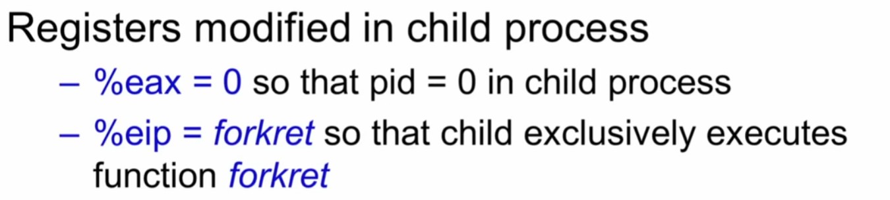
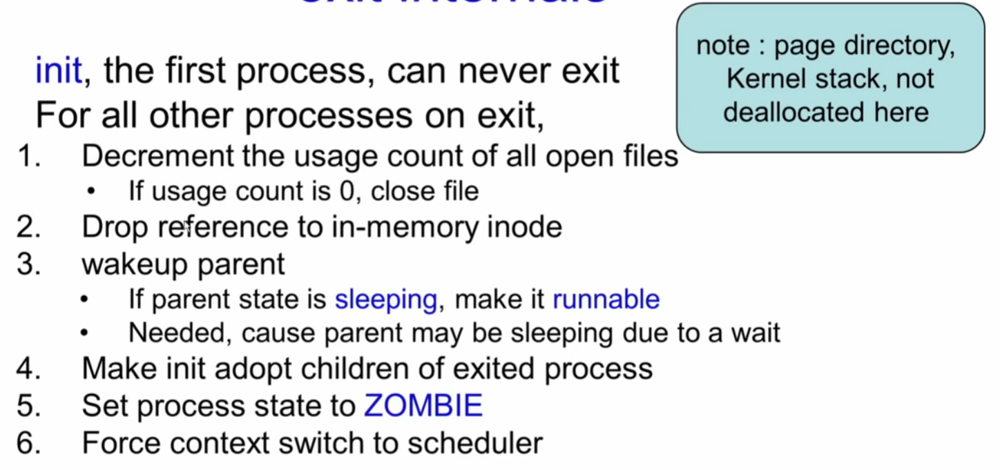
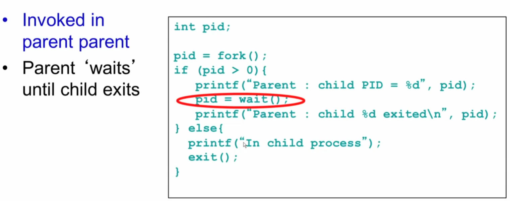
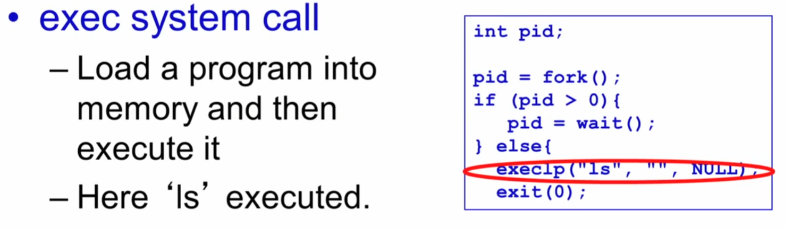
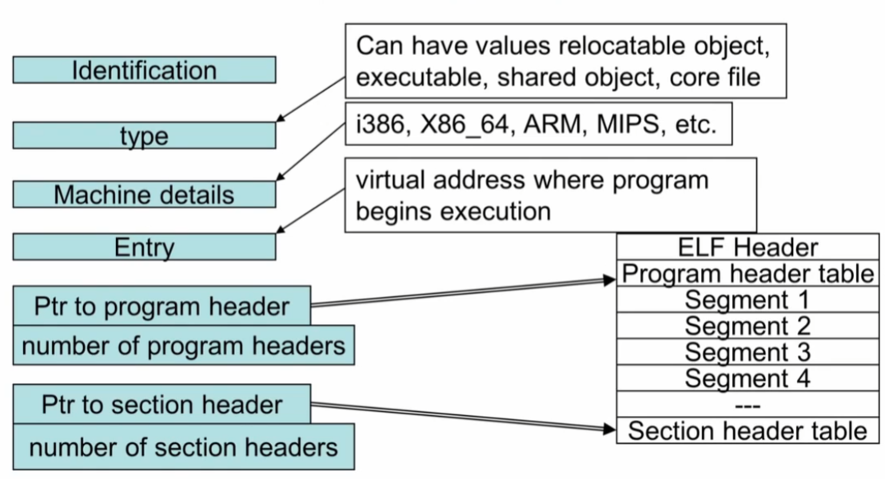
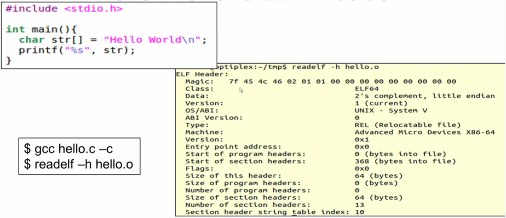
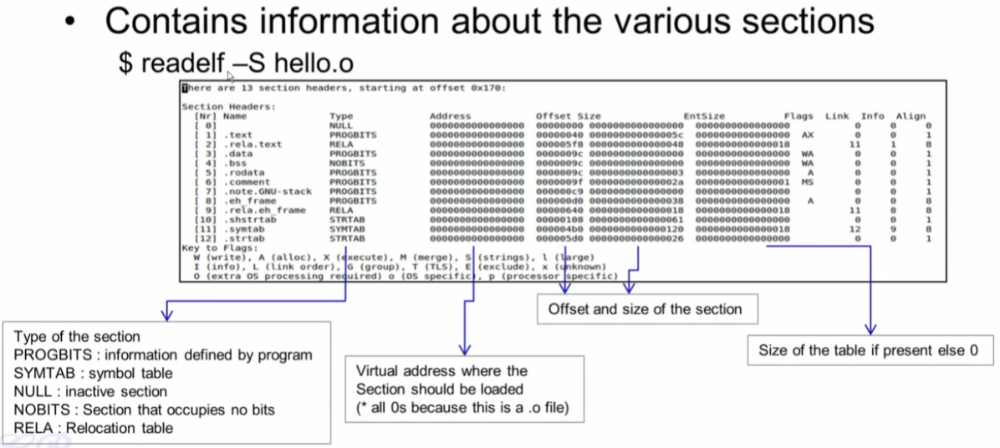
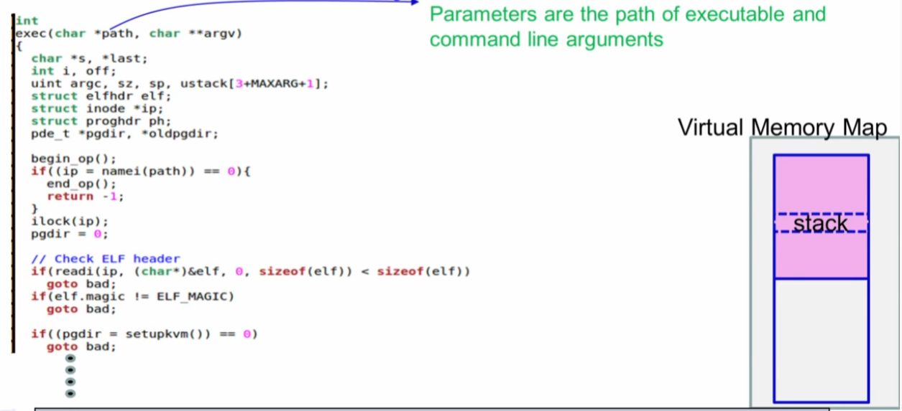
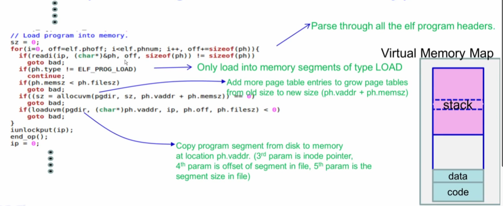
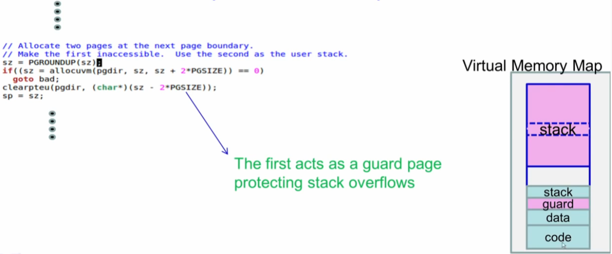

# Process Management in XV6

## Process

#### struct proc

```c
// Per-process state
struct proc {
  uint sz;                     // Size of process memory (bytes)
  pde_t* pgdir;                // Page table
  char *kstack;                // Bottom of kernel stack for this process
  enum procstate state;        // Process state
  int pid;                     // Process ID
  struct proc *parent;         // Parent process
  struct trapframe *tf;        // Trap frame for current syscall
  struct context *context;     // swtch() here to run process
  void *chan;                  // If non-zero, sleeping on chan
  int killed;                  // If non-zero, have been killed
  struct file *ofile[NOFILE];  // Open files
  struct inode *cwd;           // Current directory
  char name[16];               // Process name (debugging)
};
```

#### ptable 

```c
struct
{
  struct spinlock lock;
  struct proc proc[NPROC];
} ptable;
```

## fork

#### fork

```c
// Create a new process copying p as the parent.
// Sets up stack to return as if from system call.
// Caller must set state of returned proc to RUNNABLE.
int fork(void)
{
  int i, pid;
  struct proc *np;
  struct proc *curproc = myproc();

  // Allocate process.
  if ((np = allocproc()) == 0)
  {
    return -1;
  }

  // Copy process state from proc.
  if ((np->pgdir = copyuvm(curproc->pgdir, curproc->sz)) == 0)
  {
    kfree(np->kstack);
    np->kstack = 0;
    np->state = UNUSED;
    return -1;
  }
  np->sz = curproc->sz;
  np->parent = curproc;
  *np->tf = *curproc->tf;

  // Clear %eax so that fork returns 0 in the child.
  np->tf->eax = 0;

  for (i = 0; i < NOFILE; i++)
    if (curproc->ofile[i])
      np->ofile[i] = filedup(curproc->ofile[i]);
  np->cwd = idup(curproc->cwd);

  safestrcpy(np->name, curproc->name, sizeof(curproc->name));

  pid = np->pid;

  acquire(&ptable.lock);

  np->state = RUNNABLE;

  release(&ptable.lock);

  return pid;
}
```


#### child process에서 Register 설정 2가지

* %eax <= 0
* %eip <= forkret




## exit

#### exit() internal 





## Wait

#### Wait system call



#### wait

```c
// Wait for a child process to exit and return its pid.
// Return -1 if this process has no children.
int wait(void)
{
  struct proc *p;
  int havekids, pid;
  struct proc *curproc = myproc();

  acquire(&ptable.lock);
  for (;;)
  {
    // Scan through table looking for exited children.
    havekids = 0;
    for (p = ptable.proc; p < &ptable.proc[NPROC]; p++)
    {
      if (p->parent != curproc)
        continue;
      havekids = 1;
      if (p->state == ZOMBIE)
      {
        // Found one.
        pid = p->pid;
        kfree(p->kstack);
        p->kstack = 0;
        freevm(p->pgdir);
        p->pid = 0;
        p->parent = 0;
        p->name[0] = 0;
        p->killed = 0;
        p->state = UNUSED;
        release(&ptable.lock);
        return pid;
      }
    }

    // No point waiting if we don't have any children.
    if (!havekids || curproc->killed)
    {
      release(&ptable.lock);
      return -1;
    }

    // Wait for children to exit.  (See wakeup1 call in proc_exit.)
    sleep(curproc, &ptable.lock); //DOC: wait-sleep
  }
}
```


## exec

### system call 



### ELF

#### ELF header

.


#### ELF Header




#### hello world ELF header




#### section Headers




#### ELF section header 

```c
$ readelf -W -S hello.o
There are 14 section headers, starting at offset 0x318:

Section Headers:
  [Nr] Name              Type            Address          Off    Size   ES Flg Lk Inf Al
  [ 0]                   NULL            0000000000000000 000000 000000 00      0   0  0
  [ 1] .text             PROGBITS        0000000000000000 000040 00001b 00  AX  0   0  1
  [ 2] .rela.text        RELA            0000000000000000 000258 000030 18   I 11   1  8
  [ 3] .data             PROGBITS        0000000000000000 00005b 000000 00  WA  0   0  1
  [ 4] .bss              NOBITS          0000000000000000 00005b 000000 00  WA  0   0  1
  [ 5] .rodata           PROGBITS        0000000000000000 00005b 00000c 00   A  0   0  1
  [ 6] .comment          PROGBITS        0000000000000000 000067 00002b 01  MS  0   0  1
  [ 7] .note.GNU-stack   PROGBITS        0000000000000000 000092 000000 00      0   0  1
  [ 8] .note.gnu.property NOTE           0000000000000000 000098 000020 00   A  0   0  8
  [ 9] .eh_frame         PROGBITS        0000000000000000 0000b8 000038 00   A  0   0  8
  [10] .rela.eh_frame    RELA            0000000000000000 000288 000018 18   I 11   9  8
  [11] .symtab           SYMTAB          0000000000000000 0000f0 000138 18     12  10  8
  [12] .strtab           STRTAB          0000000000000000 000228 000029 00      0   0  1
  [13] .shstrtab         STRTAB          0000000000000000 0002a0 000074 00      0   0  1
Key to Flags:
  W (write), A (alloc), X (execute), M (merge), S (strings), I (info),
  L (link order), O (extra OS processing required), G (group), T (TLS),
  C (compressed), x (unknown), o (OS specific), E (exclude),
  l (large), p (processor specific)
```


#### ELF Program Header

```sh
$ readelf -W -l hello

Elf file type is DYN (Shared object file)
Entry point 0x1060
There are 13 program headers, starting at offset 64

Program Headers:
  Type        Offset   VirtAddr           PhysAddr           FileSiz  MemSiz   Flg Align
  PHDR        0x000040 0x0000000000000040 0x0000000000000040 0x0002d8 0x0002d8 R   0x8
  INTERP      0x000318 0x0000000000000318 0x0000000000000318 0x00001c 0x00001c R   0x1
      [Requesting program interpreter: /lib64/ld-linux-x86-64.so.2]
  LOAD        0x000000 0x0000000000000000 0x0000000000000000 0x0005f8 0x0005f8 R   0x1000
  LOAD        0x001000 0x0000000000001000 0x0000000000001000 0x0001f5 0x0001f5 R E 0x1000
  LOAD        0x002000 0x0000000000002000 0x0000000000002000 0x000160 0x000160 R   0x1000
  LOAD        0x002db8 0x0000000000003db8 0x0000000000003db8 0x000258 0x000260 RW  0x1000
  DYNAMIC      0x002dc8 0x0000000000003dc8 0x0000000000003dc8 0x0001f0 0x0001f0 RW  0x8
  NOTE         0x000338 0x0000000000000338 0x0000000000000338 0x000020 0x000020 R   0x8
  NOTE         0x000358 0x0000000000000358 0x0000000000000358 0x000044 0x000044 R   0x4
  GNU_PROPERTY 0x000338 0x0000000000000338 0x0000000000000338 0x000020 0x000020 R   0x8
  GNU_EH_FRAME 0x002010 0x0000000000002010 0x0000000000002010 0x000044 0x000044 R   0x4
  GNU_STACK    0x000000 0x0000000000000000 0x0000000000000000 0x000000 0x000000 RW  0x10
  GNU_RELRO    0x002db8 0x0000000000003db8 0x0000000000003db8 0x000248 0x000248 R   0x1

 Section to Segment mapping:
  Segment Sections...
   00     
   01     .interp 
   02     .interp .note.gnu.property .note.gnu.build-id .note.ABI-tag .gnu.hash .dynsym .dynstr .gnu.version .gnu.version_r .rela.dyn .rela.plt 
   03     .init .plt .plt.got .plt.sec .text .fini 
   04     .rodata .eh_frame_hdr .eh_frame 
   05     .init_array .fini_array .dynamic .got .data .bss 
   06     .dynamic 
   07     .note.gnu.property 
   08     .note.gnu.build-id .note.ABI-tag 
   09     .note.gnu.property 
   10     .eh_frame_hdr 
   11     
   12     .init_array .fini_array .dynamic .got
```


#### exec system call






#### guard page protecting stack overflows



#### fill user stack 


#### proc, trapframe


#### exec 

```c
int exec(char *path, char **argv)
{
  char *s, *last;
  int i, off;
  uint argc, sz, sp, ustack[3 + MAXARG + 1];
  struct elfhdr elf;
  struct inode *ip;
  struct proghdr ph;
  pde_t *pgdir, *oldpgdir;
  struct proc *curproc = myproc();

  begin_op();

  if ((ip = namei(path)) == 0)
  {
    end_op();
    cprintf("exec: fail\n");
    return -1;
  }
  ilock(ip);
  pgdir = 0;

  // Check ELF header
  if (readi(ip, (char *)&elf, 0, sizeof(elf)) != sizeof(elf))    goto bad;
  if (elf.magic != ELF_MAGIC)    goto bad;
  if ((pgdir = setupkvm()) == 0) goto bad;

  // Load program into memory.
  sz = 0;
  for (i = 0, off = elf.phoff; i < elf.phnum; i++, off += sizeof(ph))
  {
    if (readi(ip, (char *)&ph, off, sizeof(ph)) != sizeof(ph))      goto bad;
    if (ph.type != ELF_PROG_LOAD)       continue;
    if (ph.memsz < ph.filesz)           goto bad;
    if (ph.vaddr + ph.memsz < ph.vaddr) goto bad;
    if ((sz = allocuvm(pgdir, sz, ph.vaddr + ph.memsz)) == 0)    goto bad;
    if (ph.vaddr % PGSIZE != 0)    goto bad;
    if (loaduvm(pgdir, (char *)ph.vaddr, ip, ph.off, ph.filesz) < 0)  goto bad;
  }
  iunlockput(ip);
  end_op();
  ip = 0;

  // Allocate two pages at the next page boundary.
  // Make the first inaccessible.  Use the second as the user stack.
  sz = PGROUNDUP(sz);
  if ((sz = allocuvm(pgdir, sz, sz + 2 * PGSIZE)) == 0)     goto bad;
  clearpteu(pgdir, (char *)(sz - 2 * PGSIZE));
  sp = sz;

  // Push argument strings, prepare rest of stack in ustack.
  for (argc = 0; argv[argc]; argc++)
  {
    if (argc >= MAXARG)       goto bad;
    sp = (sp - (strlen(argv[argc]) + 1)) & ~3;
    if (copyout(pgdir, sp, argv[argc], strlen(argv[argc]) + 1) < 0)       goto bad;
    ustack[3 + argc] = sp;
  }
  ustack[3 + argc] = 0;

  ustack[0] = 0xffffffff; // fake return PC
  ustack[1] = argc;
  ustack[2] = sp - (argc + 1) * 4; // argv pointer

  sp -= (3 + argc + 1) * 4;
  if (copyout(pgdir, sp, ustack, (3 + argc + 1) * 4) < 0)   goto bad;

  // Save program name for debugging.
  for (last = s = path; *s; s++)
    if (*s == '/')
      last = s + 1;
  safestrcpy(curproc->name, last, sizeof(curproc->name));

  // Commit to the user image.
  oldpgdir = curproc->pgdir;
  curproc->pgdir = pgdir;
  curproc->sz = sz;
  curproc->tf->eip = elf.entry; // main
  curproc->tf->esp = sp;
  switchuvm(curproc);
  freevm(oldpgdir);
  return 0;

bad:
  if (pgdir)
    freevm(pgdir);
  if (ip)
  {
    iunlockput(ip);
    end_op();
  }
  return -1;
}

```

