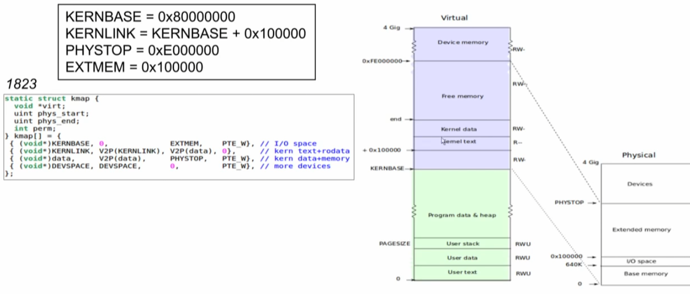

## Physical memory allocation

커널은 런타임에 물리적 메모리를 런타임에  할당하고 해제할 필요가 있다 : 

* Page Table(가상메모리 변경을 위한  pgdir, mappages, walkpgdir), 
* process user memory, 
* kernel stacks, 
* pipe buffers




#### runtime에 kernel 메모리 할당

* kernel이 부팅될때 필요한 주소 공간은 모두 할당되고 주소공간 page table도 할당완료
* 추가적으로 run time에  필요한 kernel 메모리를 어떻게 할당할 것인지에 대한 문제인다.


##### 어디서 할당 할 것인가?

```c
static struct kmap
{
  void *virt;
  uint phys_start;
  uint phys_end;
  int perm;
} kmap[] = {
    {(void *)KERNBASE, 0, EXTMEM, PTE_W},            // I/O space
    {(void *)KERNLINK, V2P(KERNLINK), V2P(data), 0}, // kern text+rodata
    {(void *)data, V2P(data), PHYSTOP, PTE_W},       // kern data+memory
    {(void *)DEVSPACE, DEVSPACE, 0, PTE_W},          // more devices
};
```

* end 주소 :  first address after kernel locaded from ELF file, defined by th kerne linker script in kernel.ld

```c
extern char end[]; // first address after kernel loaded from ELF file
                   // defined by the kernel linker script in kernel.ld
```


xv6는  kernel의 끝부분과 PHYSTOP 사이의 영의 물리 메모리를 run-time 메모리 할당에 사용한다.   4KB 단위로 할당하고 해제한다. 이것을 관리하는 방법은 페이지들을  linked list를 이용하여  관리한다. 

* Allocation은 linked list로 부터 페이지를 제거하는 방법으로 동작한다. 
* Freeing은 freed page list에 페이지를 추가하는 방법으로 동작한다.  

Bootstrap 에서 문제:  Allocator가 free list를 초기화 하려면 물리메모리 전체는 매핑되어야 한다.  이 매핑으로 가상 메모리 변환을 위한 page-table을 만들려면 page-table  페이지를 할당해야 한다.  (뭔말인가? 이것은 ... ==> 코드를 보면 kinit1()에서 4MB를 초기에 할당 받고, main 마무리 되는 시점에 kinit2()를 이용해서 나머지 부분을 kmem을 free list로 할당한다. )

xv6은 entry 단계에서  별도의 페이지 할당자를 사용하여 이 문제를 해결합니다. 이 할당자는 커널의 데이터 세그먼트가 끝난 직후에 메모리를 할당합니다.

이 할당자는 해제를 지원하지 않으며 entrypgdir의 4MB 매핑으로 제한되지만 첫 번째 커널 페이지 테이블을 할당하기에 충분합니다.

#### 부팅될때로 돌아가서 보면...

##### 1. boot page table (4MB)는 enryt.S와 entryother.S에서 사용

```c
#define PTXSHIFT        12      // offset of PTX in a linear address
#define PDXSHIFT        22      // offset of PDX in a linear address

// The boot page table used in entry.S and entryother.S.
// Page directories (and page tables) must start on page boundaries,
// hence the __aligned__ attribute.
// PTE_PS in a page directory entry enables 4Mbyte pages.

    // Map VA's [0, 4MB] to PA's [0, 4MB]
    // Map VA's [KERNBASE, KERNBASE+4MB) to PA's [0, 4MB)
__attribute__((__aligned__(PGSIZE)))
pde_t entrypgdir[NPDENTRIES] = {
    [0] = (0) | PTE_P | PTE_W | PTE_PS,
    [KERNBASE >> PDXSHIFT] = (0) | PTE_P | PTE_W | PTE_PS,
};
```

##### 2. turn on paging

```c
# Entering xv6 on boot processor, with paging off.
.globl entry
entry:
  # Turn on page size extension for 4Mbyte pages
  movl    %cr4, %eax
  orl     $(CR4_PSE), %eax
  movl    %eax, %cr4
  # Set page directory
  movl    $(V2P_WO(entrypgdir)), %eax
  movl    %eax, %cr3
  # Turn on paging.
  movl    %cr0, %eax
  orl     $(CR0_PG|CR0_WP), %eax
  movl    %eax, %cr0
```


#### kmem

* freelist로 구성

```c
struct run
{
  struct run *next;
};

struct
{
  struct spinlock lock;
  int use_lock;
  struct run *freelist;
} kmem;
```

#### kinit1 

* main==>  kinit1(end, P2V(4 * 1024 * 1024));          // phys page allocator
* extern char end[]; // first address after kernel loaded from ELF file

```c
// Initialization happens in two phases.
// 1. main() calls kinit1() while still using entrypgdir to place just
// the pages mapped by entrypgdir on free list.
// 2. main() calls kinit2() with the rest of the physical pages
// after installing a full page table that maps them on all cores.
void kinit1(void *vstart, void *vend)
{
  initlock(&kmem.lock, "kmem");
  kmem.use_lock = 0;
  freerange(vstart, vend);
}

void kinit2(void *vstart, void *vend)
{
  freerange(vstart, vend);
  kmem.use_lock = 1;
}
```

```c
void freerange(void *vstart, void *vend)
{
  char *p;
  p = (char *)PGROUNDUP((uint)vstart);
  for (; p + PGSIZE <= (char *)vend; p += PGSIZE)
    kfree(p);
}
```

#### kfree

```c
// Free the page of physical memory pointed at by v,
// which normally should have been returned by a
// call to kalloc().  (The exception is when
// initializing the allocator; see kinit above.)
void kfree(char *v)
{
  struct run *r;

  if ((uint)v % PGSIZE || v < end || V2P(v) >= PHYSTOP)
    panic("kfree");

  // Fill with junk to catch dangling refs.
  memset(v, 1, PGSIZE);

  if (kmem.use_lock)
    acquire(&kmem.lock);
  r = (struct run *)v;
  r->next = kmem.freelist;
  kmem.freelist = r;
  if (kmem.use_lock)
    release(&kmem.lock);
}
```


#### kalloc 

```c
// Allocate one 4096-byte page of physical memory.
// Returns a pointer that the kernel can use.
// Returns 0 if the memory cannot be allocated.
char *
kalloc(void)
{
  struct run *r;

  if (kmem.use_lock)
    acquire(&kmem.lock);
  r = kmem.freelist;
  if (r)
    kmem.freelist = r->next;
  if (kmem.use_lock)
    release(&kmem.lock);
  return (char *)r;
}
```

