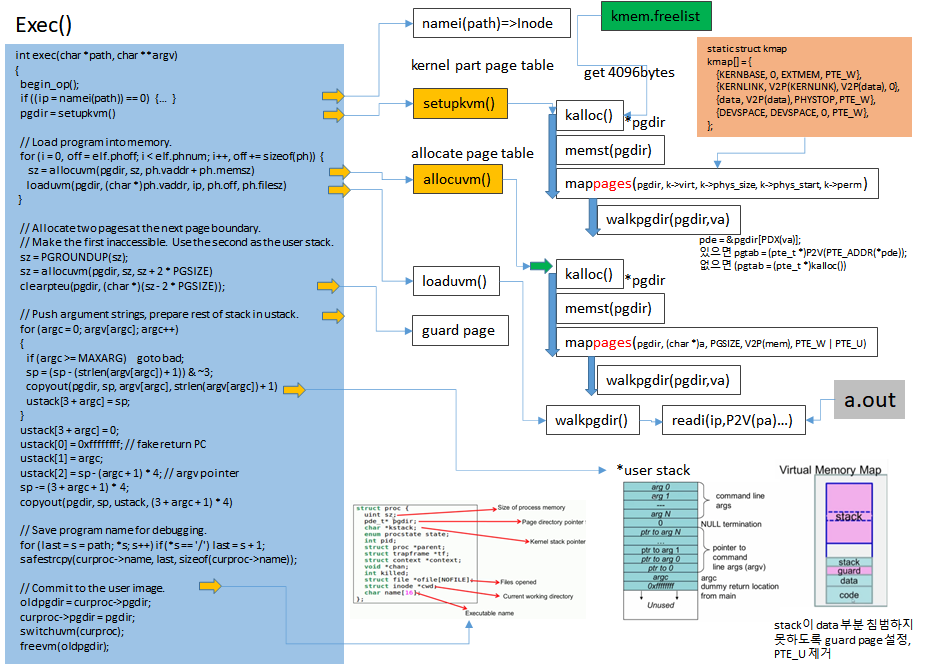

## Code: exec

Exec은 주소 공간의 사용자 부분을 생성하는 시스템 호출입니다. 파일 시스템에 저장된 파일에서 주소 공간의 사용자 부분을 초기화합니다. 

* Exec is the system call that creates the user part of an address space.  주소 공간은 kernel 부분과 user 부분이 있는데 아무튼 user 부분의 주소 공간을 생성하는 것이다.
*  It initializes the user part of an address space from a file stored in the file system.: 파일 시스템에 저정된 파일로 부터 user 파타의 주소 공간을 초기화 한다는 것...





##### namei

Exec(6310)은 6장에서 설명하는 namei(6321)를 사용하여 명명된 이진 경로를 엽니다.

그런 다음 ELF 헤더를 읽습니다. 

##### ELF

Xv6 응용 프로그램은 elf.h에 정의된 널리 사용되는 ELF 형식으로 설명됩니다. ELF 바이너리는 ELF 헤더인 struct elfhdr(0955)과 일련의 프로그램 섹션 헤더인 struct proghdr(0974)로 구성됩니다.

각 progh-dr은 메모리에 로드해야 하는 애플리케이션 섹션을 설명합니다. xv6 프로그램에는 프로그램 섹션 헤더가 하나만 있지만 다른 시스템에는 지침 및 데이터에 대해 별도의 섹션이 있을 수 있습니다.


* 첫 번째 단계는 파일에 ELF 바이너리가 포함되어 있는지 빠르게 확인하는 것입니다. 
* ELF 바이너리는 4바이트 '매직 넘버' 0x7F, 'E', 'L', 'F' 또는 ELF_MAGIC(0952)로 시작합니다. 
* ELF 헤더에 올바른 매직 번호가 있으면 exec는 바이너리 형식이 올바른 것으로 가정합니다. 

Exec은 

* setupkvm(6334)을 사용하여 사용자 매핑이 없는 새 페이지 테이블을 할당하고, 
* allocuvm(6346)을 사용하여 각 ELF 세그먼트에 메모리를 할당하고, 
* loaduvm(6348)을 사용하여 각 세그먼트를 메모리에 로드합니다. 
* allocuvm은 요청된 가상 주소가 KERNBASE보다 낮은지 확인합니다. 
* loaduvm(1918)은 Walkpgdir을 사용하여 ELF 세그먼트의 각 페이지를 쓰고 파일에서 읽기 위해 할당된 메모리의 물리적 주소를 찾습니다.


##### 프로그램 섹션 헤더

exec로 만든 첫 번째 사용자 프로그램인 /init의 프로그램 섹션 헤더는 다음과 같습니다.

```sh
# objdump -p _init
_init: file format elf32-i386
Program Header:
LOAD off 0x00000054 vaddr 0x00000000 paddr 0x00000000 align 2**2
filesz 0x000008c0 memsz 0x000008cc flags rwx
```

프로그램 섹션 헤더의 filesz는 memsz보다 작을 수 있으며, 이는 파일에서 읽기보다 파일 사이의 간격을 0(C 전역 변수의 경우)으로 채워야 함을 나타냅니다. /init의 경우 filesz는 2240바이트이고 memsz는 2252바이트이므로 allocuvm은 2252바이트를 보유하기에 충분한 물리적 메모리를 할당하지만 /init 파일에서 2240바이트만 읽습니다. 

##### 사용자 스택

이제 exec는 사용자 스택을 할당하고 초기화합니다. 하나의 스택 페이지만 할당합니다.
Exec은 인수 문자열을 한 번에 하나씩 스택의 맨 위에 복사하여 ustack에 포인터를 기록합니다. main에 전달된 argv 목록이 될 것의 끝에 널 포인터를 놓습니다. ustack의 처음 세 항목은 가짜 반환 PC, argc 및 argv 포인터입니다. 

Exec은 스택 페이지 바로 아래에 액세스할 수 없는 페이지를 배치하여 둘 이상의 페이지를 사용하려고 하는 프로그램에서 오류가 발생하도록 합니다.
이 액세스할 수 없는 페이지에서는 exec가 너무 큰 인수를 처리할 수도 있습니다. 이 상황에서 exec가 인수를 스택에 복사하는 데 사용하는 copyout 함수는 대상 페이지에 액세스할 수 없음을 확인하고 -1을 반환합니다.

##### bad 처리

새 메모리 이미지를 준비하는 동안 exec가 잘못된 프로그램 세그먼트와 같은 오류를 감지하면 bad 레이블로 점프하고 새 이미지를 해제하고 -1을 반환합니다. Exec은 시스템 호출이 성공할 것이라고 확신할 때까지 이전 이미지를 해제하기 위해 기다려야 합니다. 이전 이미지가 사라지면 시스템 호출은 -1을 반환할 수 없습니다. exec의 유일한 오류 사례는 이미지 생성 중에 발생합니다. 이미지가 완료되면 exec는 새 이미지(6394)를 설치하고 이전 이미지(6395)를 해제할 수 있습니다. 마지막으로 exec는 0을 반환합니다.


##### exec()

```c
int exec(char *path, char **argv)
{
  char *s, *last;
  int i, off;
  uint argc, sz, sp, ustack[3 + MAXARG + 1];
  struct elfhdr elf;
  struct inode *ip;
  struct proghdr ph;
  pde_t *pgdir, *oldpgdir;
  struct proc *curproc = myproc();

  begin_op();

  if ((ip = namei(path)) == 0)
  {
    end_op();
    cprintf("exec: fail\n");
    return -1;
  }
  ilock(ip);
  pgdir = 0;

  // Check ELF header
  if (readi(ip, (char *)&elf, 0, sizeof(elf)) != sizeof(elf))
    goto bad;
  if (elf.magic != ELF_MAGIC)
    goto bad;

  if ((pgdir = setupkvm()) == 0)
    goto bad;

  // Load program into memory.
  sz = 0;
  for (i = 0, off = elf.phoff; i < elf.phnum; i++, off += sizeof(ph))
  {
    if (readi(ip, (char *)&ph, off, sizeof(ph)) != sizeof(ph))
      goto bad;
    if (ph.type != ELF_PROG_LOAD)
      continue;
    if (ph.memsz < ph.filesz)
      goto bad;
    if (ph.vaddr + ph.memsz < ph.vaddr)
      goto bad;
    if ((sz = allocuvm(pgdir, sz, ph.vaddr + ph.memsz)) == 0)
      goto bad;
    if (ph.vaddr % PGSIZE != 0)
      goto bad;
    if (loaduvm(pgdir, (char *)ph.vaddr, ip, ph.off, ph.filesz) < 0)
      goto bad;
  }
  iunlockput(ip);
  end_op();
  ip = 0;

  // Allocate two pages at the next page boundary.
  // Make the first inaccessible.  Use the second as the user stack.
  sz = PGROUNDUP(sz);
  if ((sz = allocuvm(pgdir, sz, sz + 2 * PGSIZE)) == 0)
    goto bad;
  clearpteu(pgdir, (char *)(sz - 2 * PGSIZE));
  sp = sz;

  // Push argument strings, prepare rest of stack in ustack.
  for (argc = 0; argv[argc]; argc++)
  {
    if (argc >= MAXARG)
      goto bad;
    sp = (sp - (strlen(argv[argc]) + 1)) & ~3;
    if (copyout(pgdir, sp, argv[argc], strlen(argv[argc]) + 1) < 0)
      goto bad;
    ustack[3 + argc] = sp;
  }
  ustack[3 + argc] = 0;

  ustack[0] = 0xffffffff; // fake return PC
  ustack[1] = argc;
  ustack[2] = sp - (argc + 1) * 4; // argv pointer

  sp -= (3 + argc + 1) * 4;
  if (copyout(pgdir, sp, ustack, (3 + argc + 1) * 4) < 0)
    goto bad;

  // Save program name for debugging.
  for (last = s = path; *s; s++)
    if (*s == '/')
      last = s + 1;
  safestrcpy(curproc->name, last, sizeof(curproc->name));

  // Commit to the user image.
  oldpgdir = curproc->pgdir;
  curproc->pgdir = pgdir;
  curproc->sz = sz;
  curproc->tf->eip = elf.entry; // main
  curproc->tf->esp = sp;
  switchuvm(curproc);
  freevm(oldpgdir);
  return 0;

bad:
  if (pgdir)
    freevm(pgdir);
  if (ip)
  {
    iunlockput(ip);
    end_op();
  }
  return -1;
}

```


```sh
good@linux:~/code/xv6$ objdump  -p _init

_init:     file format elf32-i386

Program Header:
    LOAD off    0x00000074 vaddr 0x00000000 paddr 0x00000000 align 2**2
         filesz 0x00000b75 memsz 0x00000b84 flags rwx
   STACK off    0x00000000 vaddr 0x00000000 paddr 0x00000000 align 2**4
         filesz 0x00000000 memsz 0x00000000 flags rwx

good@linux:~/code/xv6$ readelf -l _init

Elf file type is EXEC (Executable file)
Entry point 0x0
There are 2 program headers, starting at offset 52

Program Headers:
  Type           Offset   VirtAddr   PhysAddr   FileSiz MemSiz  Flg Align
  LOAD           0x000074 0x00000000 0x00000000 0x00b75 0x00b84 RWE 0x4
  GNU_STACK      0x000000 0x00000000 0x00000000 0x00000 0x00000 RWE 0x10

 Section to Segment mapping:
  Segment Sections...
   00     .text .rodata .eh_frame .data .bss 
   01
​```

```


