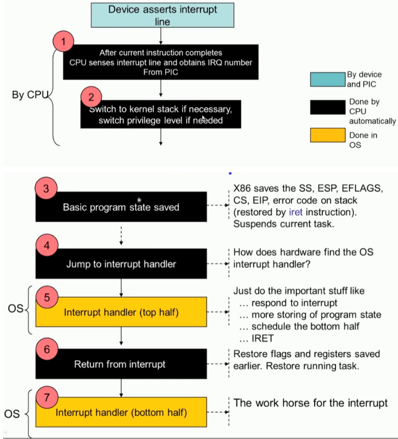
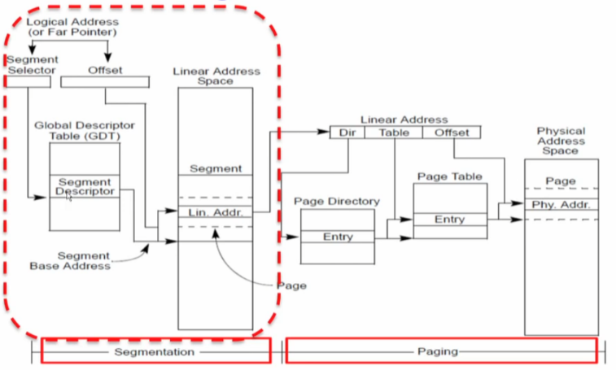
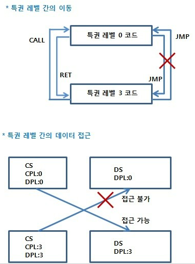
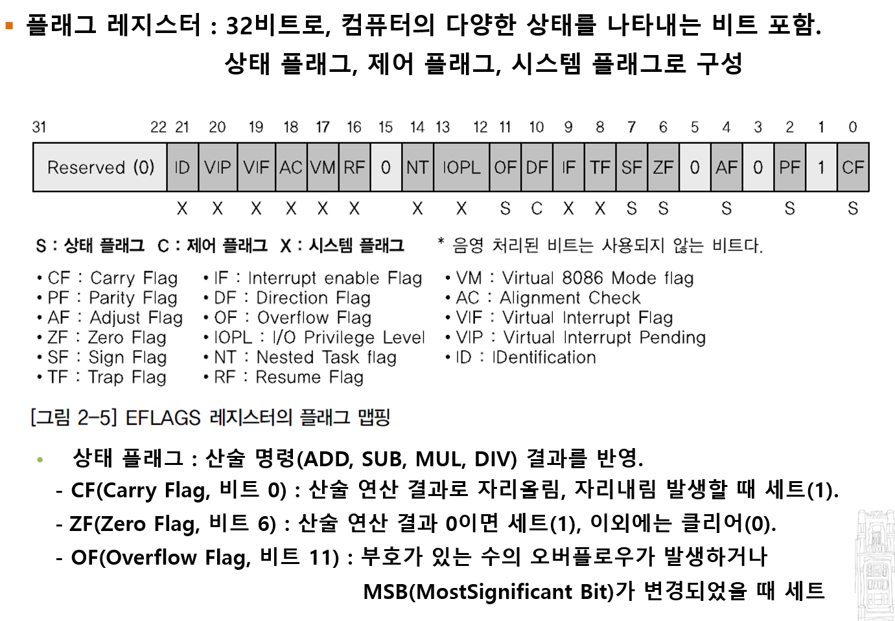

## x86 protection

#### IDT: trap gate

x86에는 0(최대 권한)에서 3(최소 권한)까지의 4가지 보호 수준이 있습니다.

* 실제로 대부분의 운영 체제는 0과 3의 두 가지 수준만 사용하며, 이를 각각 커널 모드와 사용자 모드라고 합니다. 
* x86이 명령어를 실행하는 현재 권한 수준은 CPL 필드의 %cs 레지스터에 저장됩니다.    

중요한 것은 CPL 보다 INT 발생시키는 것의 권한이 낮을 때 SS와 ESP의 설정이 변경된다는 것이다. 이렇게 해서 보호 할 수 있는 것이 무엇인지는 잘 모르겠지만. 

x86에서 인터럽트 핸들러는 IDT(인터럽트 디스크립터 테이블)에 정의됩니다  .x86에서 인터럽트 핸들러는 IDT(인터럽트 디스크립터 테이블)에 정의됩니다.  IDT에는 해당 인터럽트를 처리할 때 사용할 %cs 및 %eip를 각각 제공하는 256개의 항목이 있습니다.

##### Code: IDT 테이블을 등록 

```c
#define T_SYSCALL       64      // system call
void tvinit(void)
{
  int i;

  for (i = 0; i < 256; i++)
    SETGATE(idt[i], 0, SEG_KCODE << 3, vectors[i], 0);
  SETGATE(idt[T_SYSCALL], 1, SEG_KCODE << 3, vectors[T_SYSCALL], DPL_USER);
  initlock(&tickslock, "time");
}
```


x86에서 시스템 호출을 수행하기 위해 프로그램은 int n (int 64, T_SYSCALL)명령을 호출합니다. 여기서 n은 IDT에 대한 인덱스를 지정합니다. int 명령어는 다음 단계를 수행합니다.

* IDT에서 n번째 Descriptor 를 가져옵니다. 여기서 n은 인터럽트 번호 입니다.
* %cs의 CPL이 <= DPL인지 확인합니다. 여기서 DPL은 설명자의 권한 수준입니다. (current previlege Level 이 IDT에 정의된 Descriptor Previlege Level 보다 작은지 확인한다)
* %esp 및 %ss를 CPU 내부 레지스터에 저장하되 대상 세그먼트 선택기의 PL < CPL인 경우에만 저장합니다.
*  Load %ss and %esp from a task segment descriptor.
* Push %ss.
* Push %esp.
* Push %eflags.
* Push %cs.
* Push %eip.
* Clear some bits of %eflags.
* Set %cs and %eip to the values in the descriptor

##### int struction 이후 kernel stack


int 명령어는 복잡한 명령어이며 이 모든 작업이 필요한지 궁금할 수 있습니다. 

CPL <= DPL을 확인하면 커널이 일부 권한 수준에 대해 시스템을 금지할 수 있습니다. 예를 들어 사용자 프로그램이 int 명령어를 성공적으로 실행하려면 DPL이 3이어야 합니다.

사용자 프로그램에 적절한 권한이 없으면 int 명령어는 int 13을 생성하며 이는 일반적인 보호 오류입니다.

다른 예로, int 명령어는 user stack에  값을 저장할 수 없습니다. user stack에는 자동으로 함수 호출 할때 자동으로 저장되고 자동으로 값을 꺼내 오도록 되어 있다. (프로그램에서 사용자가 스택을 정의하고 push하고 pop 하는 것과는 다른 것이다.) 

왜냐하면 사용자가 적절한 스택을 설정하지 않아,  하드웨어가 커널 모드에서 설정된 task segment에서  지정된 스택을 사용하도록 할 수 있기 때문입니다. (여기서 task segment가 좀 헤깔린다.)

그림 3-1은 int instruction이 완료되었을 때 상태를 보여준다. 그리고 privilege-level의 변경 (현재의 CPL보다 DPL이 더 낮을 때) 상황도 보여 준다.  만약  privilege-level의 변경이 발생하지 않는다면 x86은 %ss와 %esp를 저장하지 않는다 (왜 ?....)

* previlege가 변경되는 것은 인터럽트 중에서 사용자 level에서 kernel level로 들어오는 system call 같은 경우는 user stack을 저장하고 복구할 필요가 있을때 일것 같다.
* 그런데 kernel level에서 돌고 있는데... 여거서 interrupt (timer 인터럽트)가 발생된다면 그냥 kernel 스택에 현재 상태를 저장해 놓으면 되니까 그러는 것일까?

%eip는  IDT(interrupt descriptor table)에 정의된 주소가 저장된다. 당연하겠지. 그쪽으로 점프를 해야 하니까....그리고 그 주소의 instruction은 실행되어야 할  next instruction 그 것은 int n에서 실행해야할 인터럽트 핸들러의 첫번째 instruction이 되겠지...

operating system 은 int instruction에서 되돌아 올 때 `iret`  instruction을 이용할 수 있다. `iret`은 당연하게 int instrution 수행하는 동안 저장되어 있던 값들을 stack에서 꺼내서 원복 시켜 준다.  그리고 저장된 $eip 부터 다시 수행하게 된다.  (어떤 경우는 %eip 다음 주소 부터 시작하는 경우도 있고, 어떠 경우는 %eip에서 재 시작 하는 경우도 있다.)

##### iret 

```asm
  # Return falls through to trapret...
.globl trapret
trapret:
  popal
  popl %gs
  popl %fs
  popl %es
  popl %ds
  addl $0x8, %esp  # trapno and errcode
  iret
```


#### interrup, system call 처리 절차




##### TSS

* TSS는 무엇인가?

**태스크 스테이트 세그먼트**(task state segment, TSS)는 태스크에 관한 정보를 보유하고 있는 x86 기반 컴퓨터의 특수 구조이다. 태스크 관리를 위해 운영 체제에 의해 사용된다. 특히, 다음 정보가 TSS에 저장된다:

- 프로세서 레지스터 상태
- 입출력 포트 권한
- 내부 레벨 스택 포인터
- 이전 TSS 링크

Intel 80286 이상의 CPU는 Protected Mode에서 CPU 레벨에서 태스크 스위칭을 지원합니다.

태스크 스위칭이 일어나는 동안 각 프로그램에서 사용하는 레지스터의 값을 저장하고, 복원 시키기 위해서 레지스터를 보관하는 장소가 필요합니다. 이러한 영역을 TSS(Task State Segment)라고 합니다. GDT 처럼 TSS를 지정하는 TSS 디스크립터가 GDT에 지정되어야 합니다. 

GDTR, IDTR, CR0, CR1레지스터와 같은 모든 태스크가 공유하는 레지스터를 제외하고 모든 레지스터가 포함되어 있습니다.


`switchuvm` 은 하드웨어 (cpu, MMU)가 target process의 page table (PPN+flag)을 사용하는 것을 시작하도록 알려 준다.

`switchuvm`은 SEG_TSS를 set up하는데.. 왜냐 하면 하드웨어(CPU, MMU)가 커널스텍에서 system call이나 interrupts를 처리할 수 있도록 하기 위해서 

```c
// various segment selectors.
#define SEG_KCODE 1  // kernel code
#define SEG_KDATA 2  // kernel data+stack
#define SEG_UCODE 3  // user code
#define SEG_UDATA 4  // user data+stack
#define SEG_TSS   5  // this process's task state

// Normal segment
#define SEG(type, base, lim, dpl) (struct segdesc)    \
{ ((lim) >> 12) & 0xffff, (uint)(base) & 0xffff,      \
  ((uint)(base) >> 16) & 0xff, type, 1, dpl, 1,       \
  (uint)(lim) >> 28, 0, 0, 1, 1, (uint)(base) >> 24 }
#define SEG16(type, base, lim, dpl) (struct segdesc)  \
{ (lim) & 0xffff, (uint)(base) & 0xffff,              \
  ((uint)(base) >> 16) & 0xff, type, 1, dpl, 1,       \
  (uint)(lim) >> 16, 0, 0, 1, 0, (uint)(base) >> 24 }
#endif

// Switch TSS and h/w page table to correspond to process p.
void switchuvm(struct proc *p)
{
  if (p == 0) panic("switchuvm: no process");
  if (p->kstack == 0) panic("switchuvm: no kstack");
  if (p->pgdir == 0)  panic("switchuvm: no pgdir");

  pushcli();
  mycpu()->gdt[SEG_TSS] = \
      SEG16(STS_T32A, &mycpu()->ts, sizeof(mycpu()->ts) - 1, 0);
  mycpu()->gdt[SEG_TSS].s = 0;
  mycpu()->ts.ss0 = SEG_KDATA << 3;
  mycpu()->ts.esp0 = (uint)p->kstack + KSTACKSIZE;
  // setting IOPL=0 in eflags *and* iomb beyond the tss segment limit forbids I/O instructions (e.g., inb and outb) from user space
  mycpu()->ts.iomb = (ushort)0xFFFF;
  ltr(SEG_TSS << 3);
  lcr3(V2P(p->pgdir)); // switch to process's address space
  popcli();
}
```




##### cpu state -> taskstate

```c
// Per-CPU state
struct cpu {
  uchar apicid;              // Local APIC ID
  struct context *scheduler; // swtch() here to enter scheduler
  struct taskstate ts;  // Used by x86 to find stack for interrupt
  struct segdesc gdt[NSEGS];   // x86 global descriptor table
  volatile uint started; // Has the CPU started?
  int ncli;              // Depth of pushcli nesting.
  int intena;            // Were interrupts enabled before pushcli?
  struct proc *proc;     // The process running on this cpu or null
};
```

##### task state segment

```c
// Task state segment format
struct taskstate {
  uint link;         // Old ts selector
  uint esp0;         // Stack pointers and segment selectors
  ushort ss0;        // after an increase in privilege level
  ushort padding1;
  uint *esp1;
  ushort ss1;
  ushort padding2;
  uint *esp2;
  ushort ss2;
  ushort padding3;
  void *cr3;         // Page directory base
  uint *eip;         // Saved state from last task switch
  uint eflags;
  uint eax;          // More saved state (registers)
  uint ecx;
  uint edx;
  uint ebx;
  uint *esp;
  uint *ebp;
  uint esi;
  uint edi;
  ushort es;         // Even more saved state (segment selectors)
  ushort padding4;
  ushort cs;
  ushort padding5;
  ushort ss;
  ushort padding6;
  ushort ds;
  ushort padding7;
  ushort fs;
  ushort padding8;
  ushort gs;
  ushort padding9;
  ushort ldt;
  ushort padding10;
  ushort t;          // Trap on task switch
  ushort iomb;       // I/O map base address
};

```


#####  CPU의 특권 레벨

* 0 ~ 3 으로 4가지로 구성되어 있습니다. 그중 0과 3의 2개의 레벨만을 사용합니다.
* x86에는 0(최대 권한)에서 3(최소 권한)까지의 4가지 보호 수준이 있다. (OK)

#####  CPL, DPL, RPL

1. CPL ( Current Privilege Level )   : CPL은 현재 실행되고 있는 태스크의 특권 레벨로, CS, SS 셀렉터 레지스터 0, 1번째 비트에 있는 수입니다. 

2. DPL ( Description Privilege Level )   : DPL은 디스크립터에 기재된 DPL 값이고 2비트로 표현됩니다. 디스크립터를 통한 세그먼트 영역으로의 모든 접근에서 항상 CPL 과 DPL의 관계가 체크됩니다.

3. RPL ( Requested Privilege Level )   : RPL은 단어가 암시하는 바와 같이 누가 요구했는가를 나타내는 값입니다. 특권 레벨 3에서 불려졌다는 표시를 해두면 특권 레벨 0의 데이터는 건드리지 못 합니다.





#### JMP 명령을 이용한 테스크 스위칭 흐름

 

##### 태스크 스위칭 흐름도 ( TSS1 -> TSS2 )


 

##### TSS Descriptor

 

 

##### TSS ( Task State Segment )

  

 CPU 의 거의 모든 레지스터 값들을 저장할 수 있게 되어 있습니다. ( GDTR, IDTR, CR 등의 공통사용 레지스터 제외 )

 

#####  이전 테스크로의 BACK LINCK ( Previous Task Link )

 JMP 명령은 해당되지 않는다. CALL 명령으로 테스크 스위칭을 하게 되면 다음 테스크는 자신의 TSS 영역에 이전 테스크의 TSS 디스크립터의 셀렉터 값을 저장해 두었다가 자신은 IRET 명령으로 프로그램을 마치고 CPU는 현재 태스크의 TSS 영역에서 이전 테스크로의 BACK LINK (Previous Task Link) 값을 사용하여 이전 태스크로의 스위칭을 합니다.

 

#####  ESP0, SS0

 유저모드와 커널모드에서 스택을 같이 사용하면 프로그램의 실행에 문제가 생길 수 있습니다. 그래서 TSS 영역에 ESP0, SS0, ESP1, SS1, ESP2, SS2 와 같이 CPU가 사용하는 시스템 레벨별로 스택이 따로 존재하게 됩니다. 유저 레벨의 스택은 TSS의 ESP 칸과 SS 칸에 저장합니다.

 

#####  CR3

 페이징 구현과 관련이 있습니다.


