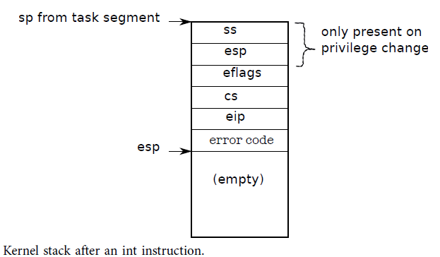
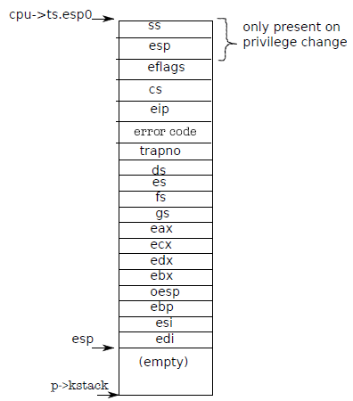
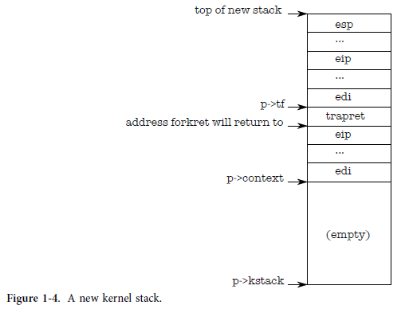
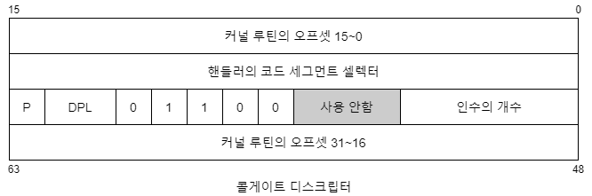

## Code: Assembly trap handlers

Xv6은 프로세서가 트랩을 생성하도록 하는 int 명령어를 만나면 적절한 조치를 취하도록 x86 하드웨어를 설정해야 합니다. 

* x86은 256개의 서로 다른 인터럽트를 허용합니다. 
* 인터럽트 0-31은 segment 오류 또는 잘못된 메모리 주소에 대한 액세스 시도와 같은 소프트웨어 예외에 대해 정의됩니다. 
* Xv6은 32개의 하드웨어 인터럽트를 32-63 범위에 매핑하고 인터럽트 64를 시스템 호출 인터럽트로 사용합니다.

### tvinit 

main에서 호출된 Tvinit(3317)은 idt 테이블에 256개의 항목을 설정합니다. 인터럽트 i는 벡터[i]의 주소에 있는 코드에 의해 처리됩니다. x86은 인터럽트 핸들러에 트랩 번호를 제공하지 않기 때문에 각 진입점은 다릅니다. 256개의 다른 핸들러를 사용하는 것이 256개의 케이스를 구별하는 유일한 방법입니다.

#### 트랩 게이트

Tvinit은 특히 사용자 시스템 호출 트랩인 T_SYSCALL을 처리합니다. 두 번째 인수로 값 1을 전달하여 게이트가 '트랩' 유형임을 지정합니다. 트랩 게이트는 FL 플래그를 지우지 않아 시스템 호출 처리기 동안 다른 인터럽트를 허용합니다.

```c
void tvinit(void)
{
  int i;
  for (i = 0; i < 256; i++)
    SETGATE(idt[i], 0, SEG_KCODE << 3, vectors[i], 0);
  SETGATE(idt[T_SYSCALL], 1, SEG_KCODE << 3, vectors[T_SYSCALL], DPL_USER);
  initlock(&tickslock, "time");
}
```

* 트랩을 발생 시킬 수 있는 권한 설정
* 트랩일 경우  `\#define STS_IG32   0xE   // 32-bit Interrupt Gate` 를  설정하여 interrupt를 추가적으로 받아 들일 수 있도록 설정한다. 

#### call gate

커널은 또한 시스템 call gate 권한을 DPL_USER로 설정하여 사용자 프로그램이 명시적 int 명령으로 트랩을 생성할 수 있도록 합니다. xv6은 프로세스가 int를 사용하여 다른 인터럽트(예: 장치 인터럽트)를 발생시키는 것을 허용하지 않습니다. 시도하면 벡터 13으로 이동하는 일반 보호 예외가 발생합니다.

사용자에서 커널 모드로 보호 수준을 변경할 때 커널은 유효하지 않을 수 있으므로 사용자 프로세스의 스택을 사용해서는 안 됩니다. 사용자 프로세스가 악의적이거나 사용자 %esp가 프로세스의 사용자 메모리의 일부가 아닌 주소를 포함하도록 하는 오류를 포함할 수 있습니다. 

Xv6은 하드웨어가 stack segment selector와 %esp에 대한 새 값을 로드하는 task segment descriptor를 설정하여 트랩에서 스택 전환을 수행하도록 x86 하드웨어를 프로그래밍합니다.  

```asm
  # Set up data segments.
  movw $(SEG_KDATA<<3), %ax
  movw %ax, %ds
  movw %ax, %es
```

함수 switchuvm(1873)은 사용자 프로세스의 커널 스택 맨 위 주소에 task segment descriptor 저장합니다.


### 트랩발생

* 트랩은 system call, user 호출에 의해서 발생되는 interrupt 이므로 이것에 대한 처리 절차 정의

#### 프로세서에 의한 자동 처리 

* 사용자 모드이면: task segment descrptor에서  %esp, %ss를 로드 해서 kernel  stack에서 push
* 커널 모드이면 : 사용자 정보를 저장할 것이 없으므로 아무것도 하지 않는다. 
* %eflags, %cs, %eip 를 저장
* trap error 저장

트랩이 발생하면 프로세서 하드웨어는 다음을 수행합니다. 프로세서가 사용자 모드에서 실행 중이면 task segment descriptor에서 %esp 및 %ss를 로드하고 이전 사용자 %ss 및 %esp를 새 스택으로 푸시합니다. 프로세서가 커널 모드에서 실행 중이면 위의 어떤 일도 발생하지 않습니다. 그런 다음 프로세서는 %eflags, %cs 및 %eip 레지스터를 푸시합니다. 일부 트랩의 경우 프로세서는 오류 단어도 푸시합니다.




xv6은 Perl 스크립트(3200)를 사용하여 IDT 항목이 가리키는 진입점을 생성합니다. 프로세서가 실행하지 않은 경우 각 항목은 오류 코드를 푸시하고 인터럽트 번호를 푸시한 다음 alltraps 함수로 이동합니다.


* 인터럽트 routine를 실행하기 위해서 %cs와 %eip를 로딩하는데 이것은 IDT와 GDT와 관련되어 있다. 

그런 다음 프로세서는 관련 IDT 항목에서 %eip 및 %cs를 로드합니다.


#### alltraps 함수 

Alltraps는 프로세서 레지스터를 계속 저장합니다. %ds, %es, %fs, %gs 및 범용 레지스터를 푸시합니다. 이러한 노력의 결과는 이제 커널 스택에 트랩 당시의 프로세서 레지스터를 포함하는 struct trapframe이 포함된다는 것입니다(그림 3-2 참조).  

하드웨어 적으로  프로세서는 %ss, %esp, %eflags, %cs 및 %eip를 푸시합니다. 프로세서 또는 트랩 벡터는 오류 번호를 푸시하고 alltraps는 나머지를 푸시합니다. 

트랩 프레임에는 커널이 현재 프로세스로 돌아갈 때 사용자 모드 프로세서 레지스터를 복원하는 데 필요한 모든 정보가 포함되어 있으므로 프로세서가 트랩이 시작될 때와 똑같이 계속될 수 있습니다.



* IVT에서 trap이 선택된 다음 alltraps 호출하게 된다. alltraps은 traps 발생할때 CPU 상태를 스택에 저장하게 된다. (당연히 system call 발생할때 이런 동작이 발생한다. )

```asm
#include "mmu.h"
  # vectors.S sends all traps here.
.globl alltraps
alltraps:
  # Build trap frame.
  pushl %ds
  pushl %es
  pushl %fs
  pushl %gs
  pushal  
  # Set up data segments.
  movw $(SEG_KDATA<<3), %ax
  movw %ax, %ds
  movw %ax, %es
  # Call trap(tf), where tf=%esp
  pushl %esp
  call trap
  addl $4, %esp
  # Return falls through to trapret...
.globl trapret
trapret:
  popal
  popl %gs
  popl %fs
  popl %es
  popl %ds
  addl $0x8, %esp  # trapno and errcode
  iret
```


#### userinit : first system call

* user application이 trap을 발생시키지 않았는데 마치 발생 시킨것 처럼 최초의 user porcess를 만들고 kernel stack를 구성했다. 

2장에서, userinit는 이 목표를 달성하기 위해 손으로 트랩프레임을 만듭니다(그림 1-4 참조).
첫 번째 시스템 호출의 경우 저장된 

* %eip는 int 명령어 바로 뒤에 있는 명령어의 주소입니다. 
* %cs는 user code segment selector입니다. 
* %eflags는 int 명령어를 실행하는 시점의 eflags 레지스터의 내용입니다. 

범용 레지스터 저장의 일부로 alltraps는 커널이 나중에 검사할 시스템 호출 번호를 포함하는 %eax도 저장합니다.

#####  인터럽트 핸들러 진입

이제 사용자 모드 프로세서 레지스터가 저장되었으므로 alltraps는 커널 C 코드를 실행하도록 프로세서 설정을 마칠 수 있습니다.  

* CPU는 인터럽트 핸들러에  들어가기 전에 선택기 %cs 및 %ss를 설정합니다. 
* alltraps는 %ds 및 %es를 설정합니다. 
* %fs 및 %gs가 SEG_KCPU CPU당 데이터 세그먼트를 가리키도록 설정합니다.

세그먼트가 제대로 설정되면 alltraps는 C 트랩 핸들러 트랩을 호출할 수 있습니다. 방금 구성한 트랩 프레임을 가리키는 %esp를 트랩에 대한 인수로 스택에 푸시합니다. 그런 다음 트랩을 호출합니다. 

트랩이 반환된 후, alltraps는 스택 포인터에 추가하여 스택에서 인수를 팝한 다음 레이블 trapret에서 코드 실행을 시작합니다. 2장에서 첫 번째 사용자 프로세스가 사용자 공간으로 나가기 위해 실행했을 때 이 코드를 추적했습니다. 여기에서도 동일한 시퀀스가 발생합니다. 트랩 프레임을 통해 팝핑하면 사용자 모드 레지스터가 복원되고 iret는 사용자 공간으로 다시 점프합니다.

#### kernel에서 trap 발생

지금까지 사용자 모드에서 발생하는 트랩에 대해 논의했지만 커널이 실행되는 동안에도 트랩이 발생할 수 있습니다. 이 경우 하드웨어는 스택을 전환하거나 스택 포인터 또는 스택 세그먼트 선택기를 저장하지 않습니다. 그렇지 않으면 사용자 모드의 트랩에서와 동일한 단계가 발생하고 동일한 xv6 트랩 처리 코드가 실행됩니다.
iret이 나중에 커널 모드 %cs를 복원하면 프로세서는 커널 모드에서 계속 실행됩니다.

##### asm

```asm
#include "mmu.h"

  # vectors.S sends all traps here.
.globl alltraps
alltraps:
  # Build trap frame.
  pushl %ds
  pushl %es
  pushl %fs
  pushl %gs
  pushal
  
  # Set up data segments.
  movw $(SEG_KDATA<<3), %ax
  movw %ax, %ds
  movw %ax, %es

  # Call trap(tf), where tf=%esp
  pushl %esp
  call trap
  addl $4, %esp

  # Return falls through to trapret...
.globl trapret
trapret:
  popal
  popl %gs
  popl %fs
  popl %es
  popl %ds
  addl $0x8, %esp  # trapno and errcode
  iret
```


##### userinit : create first user process

```c
//  Set up first user process.
void userinit(void)
{
  struct proc *p;
  extern char _binary_initcode_start[], _binary_initcode_size[];

  p = allocproc();

  initproc = p;
  if ((p->pgdir = setupkvm()) == 0) panic("userinit: out of memory?");
  inituvm(p->pgdir, _binary_initcode_start, (int)_binary_initcode_size);
  p->sz = PGSIZE;
  memset(p->tf, 0, sizeof(*p->tf));
  p->tf->cs = (SEG_UCODE << 3) | DPL_USER;
  p->tf->ds = (SEG_UDATA << 3) | DPL_USER;
  p->tf->es = p->tf->ds;
  p->tf->ss = p->tf->ds;
  p->tf->eflags = FL_IF;
  p->tf->esp = PGSIZE;
  p->tf->eip = 0; // beginning of initcode.S

  safestrcpy(p->name, "initcode", sizeof(p->name));
  p->cwd = namei("/");

  // this assignment to p->state lets other cores
  // run this process. the acquire forces the above
  // writes to be visible, and the lock is also needed
  // because the assignment might not be atomic.
  acquire(&ptable.lock);

  p->state = RUNNABLE;

  release(&ptable.lock);
}
```


##### kernel stack




### 콜게이트



- 낮은 특권 레벨의 프로그램이 실행 중 높은 특권 레벨로 변경되는 수단
- 인터럽트와 예외는 의지가 관계 없이 권한 레벨이 올라가지만 콜게이트는 의지에 의해 높은 권한 사용

#### 코드와 데이터의 특권 레벨 관계

특권 레벨 간의 JMP 명령은 불가능

CALL 명령은 낮은 레벨에서 높은 레벨에 대하여 이루어져야 함

RET 명령은 높은 레벨에서 낮은 레벨에 대하여 이루어져야 함

특권 레벨 간의 JMP를 굳이 사용해야 한다면 콜게이트 사용

#### CALL 명령이 내려졌을 때 스택

유저 태스크가 콜게이트 등으로 커널 모드 루틴을 불러내는 경우

- 이 태스크의 TSS 영역에 SS0, ESP0의 값을 참조하여 커널 모드 스택에 현재 유저 태스크가 사용하고 있는 SS, ESP, 현재 진행 중인 루틴의 주소인 CS, EIP를 차례로 push
- CPU의 SS, ESP 레지스터에 SS0, ESP0 값 넣음
- 콜게이트에 지정된 커널 모드의 루틴 주소로 점프하고 실행
- ret 명령이 내려지면 커널 모드 스택에 SS, ESP, CS, EIP를 pop하여 각 레지스터에 복원 후 유저 모드 태스크로 돌아감

#### 인터럽트 예외가 발생하였을 때 스택

특권 레벨 0에서 인터럽트가 걸렸을 때 스택 변경이 일어나지 않음

유저 레벨 태스크의 동작 중 인터럽트나 예외 발생

- 유저 레벨 태스크의 TSS 영역에서 SS0, ESP0을 CPU의 SS, ESP 레지스터에 복사
- 콜게이트와 같이 사용하던 SS, ESP, CS, EIP 등 레지스터 push
- iret을 사용하여 돌아오면 스택에 있는 값들을 pop하여 레지스터 복원