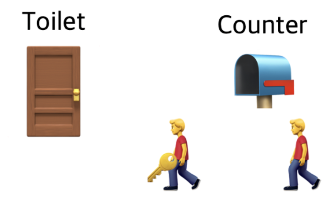
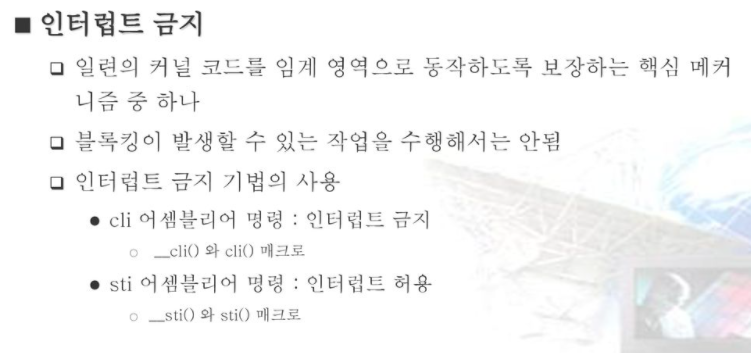

## Locking :  동시성  및 병렬 프로그래밍

####  the lock protects the data structure.

* lock을 이용해서 kernel 데이터 구조를 보호한다.

Xv6은 코드를 독립적으로 실행하는 여러 CPU가 있는 multi processor 환경에서 실행된다. 따라서 데이터 구조에 접근하는 과정에서 경쟁은 반드시 발생된다.  

* 다중 CPU는 단일 물리적 주소 공간에서 작동하고 데이터 구조를 공유합니다. xv6은 서로 간섭하지 않도록 조정 메커니즘을 도입해야 합니다.

* 단일 프로세서에서도 xv6은 인터럽트 처리기가 비 인터럽트 코드를 방해하지 않도록 하는 몇 가지 메커니즘을 사용해야 합니다.

Xv6은 잠금이라는 두 가지 모두에 대해 동일한 저수준 개념을 사용합니다.

* 잠금은 상호 배제를 제공하여 한 번에 하나의 CPU만 잠금을 보유할 수 있도록 합니다. 
* xv6이 특정 잠금을 유지하는 동안에만 데이터 구조에 액세스하는 경우 xv6은 한 번에 하나의 CPU만 데이터 구조에 액세스하고 있음을 확인할 수 있습니다. 
* 이 상황에서 우리는 잠금이 데이터 구조를 보호한다고 말합니다.

이 장의 나머지 부분에서는 xv6에 잠금이 필요한 이유, xv6이 잠금을 구현하는 방법, 잠금을 사용하는 방법에 대해 설명합니다.

##### 다른 프로세서가 데이터를 변경할 수 있다는 것

* 프로세서의 동작이 다른 프로세서에 의해서 변경될수 있다는 것을  의심해야 한다.
* 단일 C 언어 구문도 원자적으로 실행될 것을 보장할 수 없다.

##### Lock 관점에서 코드를 볼때 주의할 점

* 중요하게 생각해야 할것은  xv6의 코드 라인을 볼때   어떤 의도된 동작을 변경할 수 있는 다른 프로세서가 있는지 스스로에게 물어봐야 한다는 것입니다(예: 다른 프로세서도 해당 라인이나 다른 라인을 실행하고 있기 때문에). 공유 변수를 수정하는 코드) 및 인터럽트 핸들러가 실행되면 어떻게 될지.
* C 소스 문장 하나가   기계어 수준에서  여러개의 instruction이 될 수 있으므로 로 다른 프로세서나 인터럽트가 C 문 중간에서 호출될 경우 엉망이 될 수 있음을 명심해야 합니다.

페이지의 코드 행이 순차적으로 실행된다고 가정할 수 없으며 단일 C 문이 원자적으로 실행될 것이라고 가정할 수도 없습니다. 동시성은 정확성에 대한 추론을 훨씬 더 어렵게 만듭니다.

### Linux kernel lock

#### 1. semaphore

* N 이라는 자원 공유 가능한 Max Count 설정하여, 해당 Count만큼 자원이 이미 할당되어 있으면 Unlock 되기를 대기한다.  (N=1 이것은 mutex 이다.)
* Lock 을 획득하지 못하고 대기하는 경우, 쓰레드는 sleep 된다. 
* 장점 : Lock Waiting 시 sleep 을 통해 다른 쓰레드로 제어권을 넘길 수 있다.
* 단점 : sleep 을 이용해서 Waiting 을 하기 때문에,  sleep 되면 안되는 코드에서는 활용할 수 없다. 
* 동기화 영역이 작은 경우, Lock waiting 불필요한 오버헤드 줄 수 있다.

##### Mutex: 화장실 1개만 있는 식당 

뮤텍스는 **화장실이 하나 뿐이 없는 식당**과 비슷하다. 화장실을 가기 위해서는 카운터에서 열쇠를 받아 가야 한다.

자원 1개에 대해서  대기 또는 진입 (키 기반 )

##### 세마포어 : 화장실 여러개 

세마포어는 손님이 화장실을 좀 더 쉽게 이용할 수 있는 레스토랑이다. 세마포어를 이용하는 레스토랑의 화장실에는 여러 개의 칸이 있다. 그리고 화장실 입구에는 현재 화장실의 빈 칸 개수를 보여주는 전광판이 있다.

진입 불가

> **뮤텍스**:  한 쓰레드, 프로세스에 의해 소유될 수 있는 **Key**🔑를 기반으로 한 상호배제기법
>
> **세마포어**: Signaling mechanism. 현재 공유자원에 접근할 수 있는 쓰레드, 프로세스의 수를 나타내는 값을 두어 상호배제를 달성하는 기법
>
> 출처: https://worthpreading.tistory.com/90 [Worth spreading]

#### 2. spinlock

스핀락은 이름 그대로 임계구역(critical section)에 진입이 불가능할 때, 진입기 가능할 때까지 루프를 돌면서 재시도를 하는 방식으로 구현된 락을 가리킨다. 즉, 락을 획득할 때까지 해당 스레드가 계속 돌고 루핑하고 있다는 것을 의미하며, `Busy Waiting`의 한 종류이다.

`Busy Waiting`이란, `Spinning`이라고도 하며, 특정 공유 자원에 대해 두 개 이상의 프로세스나 스레드가 그 이용 권한을 획득하고자 하는 동기화 상황에서 권한 획득을 위한 과정에서 일어나는 현상이다. 대부분 스핀락과 동일한 개념으로 사용되지만 엄밀하게 말하자면, 스핀락이 `Busy Waiting` 개념을 이용하여 구현된 것이다.

다른 락과 비교되는 스핀락의 가장 특징적인 차이점은 **운영 체제의 스케쥴링 지원을 받지 않는다는 점이다.** 즉, 락을 사용하는 스레드에 대한 문맥 교환(Context Switching)이 일어나지 않는다. 따라서 스핀락은 임계 구역에 짧은 시간 안에 진입할 수 있는 경우, 문맥 교환을 제거할 수 있어 효율적이다. 하지만 스핀락이 오랜 시간을 소요한다면 다른 스레드를 실행하지 못하고 대기하게 되어 오히려 비효율적인 결과를 가져온다.

* semaphore 의 단점 극복을 위해, Lock 획득 못했을 때 Busy Waiting 을 한다. (sleep 하지 않고 계속 Lock 얻는 것을 시도)
* Busy wating 
* 스케쥴링을 사용하지 않는다. (sleep 되지 않기 때문에 당연한 말씀), Context swtching 일어나지 않음
* 단점 : 동기화 영역이 큰 경우, 즉 Lock Waiting 걸리는 시간이 긴 경우, 다른 쓰레드로 제어권을 넘기지 않고 계속 Lock 얻는 것 시도하므로 오버헤드 크다. write 가 발생하지 않고 여러 쓰레드에서 read 만 하는 경우에도,, reader 쓰레드끼리 Lock Waiting 을 해야 하므로, 불필요한 오버헤드 발생할 수 있다.

#### 3. RCU (Read-Copy-Update)

* Lock 구조체나 Counter 가 필요없는 방법.
* 오직 동적할당되고, 포인터에 의해 참조되는 자료 구조만이 RCU 로 보호 받을 수 있고, 동기화 영역에서 sleep 하면 안된다. 
* read Lock, Unlock 때는 중요한 작업이 없다. 그냥 포인터에서 데이터를 읽는다.
*  write Lock 을 하면,, 공유자원(동적할당된 메모리에 있음) 을 새로운 메모리(역시 동적할당)에 복사한다. 새로운 메모리에 write 작업을 한다. write 가 끝나면,, 원래 공유자원 포인터가 새로운 메모리를 가리키게 한다. (이 포인터 복사작업이 원자연산이라서 가능)
* 장점 : Lock 구조체 사용 안함.
* 단점 : 이전 공유자원 데이터는  모든 reader 들이 read 를 끝내기 전까지는 해제될 수 없다.

#### 4. rwlock

*  spinlock 과 유사하게 동작. spinlock 의 단점을 극복하기 위해 나옴.
* read/write Lock,Unlock 을 구분하여 동작한다.
* Write Lock 이 걸려있지 않은 상태라면,, read Lock 은 중복하여 얻을 수 있다. (즉, 공유 자원에 대해 read 작업은 동시에 여러 개가 가능)
* read Lock 이 걸려있는 상태라면,, write Lock 은 read Unlock 될 때까지 대기한다. (reader 가 잘못된 값을 read 하는 것을 방지하기 위해)
* 장점 : reader 쓰레드가 많거나 read 동기화 영역이 큰 경우 (writer 나 write 동기화 영역보다),  spinlock 에 비해 성능이 좋다.
* 단점 : reader 가 너무 많아서 read Lock 이 빠르게 계속 잡힌다면,,  write Lock 이 잡히지 않게 되는 기아 현상 발생할 수 있다.

#### 5. seqloc

* rwlock 과 유사하게 동작. rwlock 의 단점을 극복하기 위해 나옴. (rwlock 의 단점을 극복하면서 생기는 새로운 단점이 있음)
* reader 가 작업 중에도, writer 는 write 작업 가능하다.
* reader 는 seq 번호를 저장 -> 원하는 값을 읽어서 작업함. -> 작업 끝나면 seq 번호가 변경되었는지 확인 (writer 에 의해 변경되었는지) -> 변경되었다면, 다시 처음 과정으로 돌아가서 반복.    즉, reader 는 writer 에 의해 race 발생하지 않을 때까지 반복적으로 read 를 시도 하는 것이다.   -
* write 보다 read 가 더 많은 작업에 유용하다.
* dcache (dentry cache) path lookup 할 때 성능최적화를 위해, seqlock 사용된다.
* 장점 : write Lock 에 대한 기아 현상 발생 방지.  lock 없이 사용 가능.
* 단점 : read 작업이 굉장히 느려질 수 있다.

