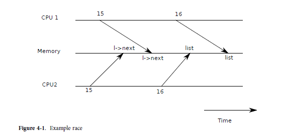

## Race Conditions

#### lock이 필요한 이유

* 단일 디스크를 공유하는 멀티 프로세서 환경

잠금이 필요한 이유에 대한 예로 xv6의 IDE 디스크와 같이 단일 디스크를 공유하는 여러 프로세서를 고려하십시오. 디스크 드라이버는 미해결 디스크 요청의 연결 목록을 유지 관리하고(4121) 프로세서는 동시에 새 요청을 목록에 추가할 수 있습니다(4254). 동시 요청이 없는 경우 다음과 같이 연결 목록을 구현할 수 있습니다.

```c
1  struct list {
2     int data;
3     struct list *next;
4  };
5
6  struct list *list = 0;
7
8  void
9  insert(int data)
10 {
11    struct list *l;
12
13    l = malloc(sizeof *l);
14    l->data = data;
15    l->next = list;
16    list = l;
17 }
```




* CPU1번과 CPU2번에서  15번 라인에서 에서  각각 header를 가르키고 
* CPU2에서 먼저 header를  cpu2가 수정한 것으로 수정하고, 다시 cpu 1이 header의 값을  cpu1이 수정한 것으로 변경하여 cpu2가 수정한 내용은 사라지게 된다.

이 구현이 정확하다는 것을 증명하는 것은 데이터 구조 및 알고리즘 클래스에서 일반적인 연습입니다. 이 구현이 올바른 것으로 증명될 수는 있지만 적어도 다중 프로세서에서는 그렇지 않습니다. 두 개의 다른 CPU가 동시에 삽입을 실행하면 둘 중 하나가 16을 실행하기 전에 둘 다 15행을 실행할 수 있습니다(그림 4-1 참조). 이런 일이 발생하면 이제 다음이 이전 목록 값으로 설정된 두 개의 목록 노드가 있습니다. 

두 개의 할당이 16행에서 발생하면 두 번째 할당이 첫 번째 할당을 덮어씁니다. 첫 번째 할당과 관련된 노드는 손실됩니다. 이러한 종류의 문제를 경쟁 조건이라고 합니다. 레이스의 문제는 관련된 두 CPU의 정확한 타이밍과 메모리 시스템에서 메모리 작업을 정렬하는 방법에 의존하므로 결과적으로 재현하기 어렵다는 것입니다. 예를 들어, 삽입을 디버깅하는 동안 인쇄 문을 추가하면 경주가 사라질 정도로 실행 타이밍이 변경될 수 있습니다. 

##### race condition을 피하기

경합을 피하는 일반적인 방법은 잠금을 사용하는 것입니다. 잠금은 상호 배제를 보장하므로 한 번에 하나의 CPU만 삽입을 실행할 수 있습니다. 이것은 위의 시나리오를 불가능하게 만듭니다.
위 코드의 올바르게 잠긴 버전은 몇 줄만 추가합니다(번호 없음).

```c
6 struct list *list = 0;
  struct lock listlock;
7
8 void
9 insert(int data)
10 {
11   struct list *l;
12   acquire(&listlock);
13   l = malloc(sizeof *l);
14   l->data = data;
15   l->next = list;
16   list = l;
     release(&listlock);
}
```


Lock이 데이터를 보호한다고 말할 때 실제로 lock이 데이터에 적용되는 일부 불변의 컬렉션을 보호한다는 의미입니다. 불변은 작업 전반에 걸쳐 유지되는 데이터 구조의 속성입니다. 일반적으로 작업의 올바른 동작은 작업이 시작될 때 불변량이 true인지에 따라 다릅니다. (? 뭔말이야?)

작업이 일시적으로 불변성을 위반할 수 있지만 완료하기 전에 다시 설정해야 합니다. 

예를 들어 linked list의 경우 불변은 list가 목록의 첫 번째 노드를 가리키고 각 노드의 다음 필드가 다음 노드를 가리킵니다.

삽입의 구현은 이 불변성을 일시적으로 위반합니다. 13번째 줄은 l이 목록의 첫 번째 노드가 되도록 하는 새로운 목록 요소 l을 생성하지만 l의 다음 포인터는 아직 목록의 다음 노드를 가리키지 않습니다(15번째 줄에서 다시 설정됨). ) 목록은 아직 l을 가리키지 않습니다(16행에서 다시 설정됨).

위에서 조사한 경쟁 조건은 (일시적으로) 위반되는 동안 두 번째 CPU가 목록 불변성에 의존하는 코드를 실행했기 때문에 발생했습니다.

잠금을 적절하게 사용하면 한 번에 하나의 CPU만 데이터 구조에서 작동할 수 있으므로 데이터 구조의 불변량이 유지되지 않을 때 CPU가 데이터 구조 작업을 실행하지 않습니다.