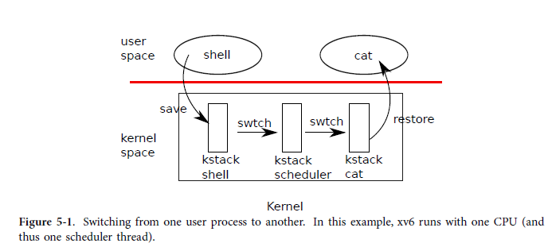

## Code: Context switching





그림 5-1에서 볼 수 있듯이 xv6은 프로세스 간 전환을 위해 낮은 수준에서 두 가지 종류의 컨텍스트 전환을 수행합니다. 프로세스의 커널 스레드에서 현재 CPU의 스케줄러 스레드로, 스케줄러 스레드에서 프로세스의 커널 스레드로. xv6은 한 사용자 공간 프로세스에서 다른 프로세스로 직접 전환하지 않습니다. 이것은 사용자 커널 전환(시스템 호출 또는 인터럽트), 스케줄러로의 컨텍스트 전환, 새 프로세스의 커널 스레드로의 컨텍스트 전환 및 트랩 반환을 통해 발생합니다. 이 섹션에서는 커널 스레드와 스케줄러 스레드 사이를 전환하는 메커니즘을 예를 들어 설명합니다.

##### scheduler thread 

모든 xv6 프로세스에는 2장에서 보았듯이 고유한 커널 스택과 레지스터 세트가 있습니다. 각 CPU에는 프로세스의 커널 스레드가 아닌 스케줄러를 실행할 때 사용할 별도의 스케줄러 스레드가 있습니다. 한 스레드에서 다른 스레드로 전환하려면 이전 스레드의 CPU 레지스터를 저장하고 새 스레드의 이전에 저장된 레지스터를 복원해야 합니다. %esp 및 %eip가 저장되고 복원된다는 사실은 CPU가 스택을 전환하고 실행 중인 코드를 전환한다는 것을 의미합니다.

##### swtch

swtch는 스레드에 대해 직접적으로 알지 못합니다. 컨텍스트라고 하는 레지스터 세트를 저장하고 복원합니다. 프로세스가 CPU를 포기할 시간이 되면 프로세스의 커널 스레드는 swtch를 호출하여 자체 컨텍스트를 저장하고 스케줄러 컨텍스트로 돌아갑니다. 

각 컨텍스트는 관련된 커널 스택에 저장된 구조에 대한 포인터인 구조체 컨텍스트*로 표시됩니다. Swtch는 구조체 컨텍스트 **old 및 구조체 컨텍스트 *new의 두 가지 인수를 사용합니다. 현재 CPU 레지스터를 스택으로 푸시하고 스택 포인터를 *old에 저장합니다. 그런 다음 swtch는 new를 %esp에 복사하고 이전에 저장한 레지스터를 팝한 다음 반환합니다.

#### sched

스케줄러를 swtch로 따라가는 대신 사용자 프로세스를 다시 따라가 보겠습니다. 3장에서 각 인터럽트가 끝날 때 한 가지 가능성은 트랩 호출이 양보하는 것을 보았습니다. Yield는 차례로 sched를 호출하고 swtch를 호출하여 현재 컨텍스트를 proc->context에 저장하고 이전에 cpu->scheduler(2766)에 저장된 스케줄러 컨텍스트로 전환합니다.

```c
// Enter scheduler.  Must hold only ptable.lock
// and have changed proc->state. Saves and restores
// intena because intena is a property of this
// kernel thread, not this CPU. It should
// be proc->intena and proc->ncli, but that would
// break in the few places where a lock is held but
// there's no process.
void sched(void)
{
  // cprintf("k:sched\n");
  int intena;
  struct proc *p = myproc();

  if (!holding(&ptable.lock))
    panic("sched ptable.lock");
  if (mycpu()->ncli != 1)
    panic("sched locks");
  if (p->state == RUNNING)
    panic("sched running");
  if (readeflags() & FL_IF)
    panic("sched interruptible");
  intena = mycpu()->intena;
  swtch(&p->context, mycpu()->scheduler);
  mycpu()->intena = intena;
}
```


##### swtch

Swtch(2952)는 스택에서 레지스터 %eax 및 %edx(2959-2960)로 인수를 로드하는 것으로 시작합니다. swtch는 스택 포인터를 변경하기 전에 이 작업을 수행해야 하며 더 이상 %esp를 통해 인수에 액세스할 수 없습니다. 그런 다음 swtch는 레지스터 상태를 푸시하여 현재 스택에 컨텍스트 구조를 생성합니다. 호출 수신자 저장 레지스터만 저장하면 됩니다. x86의 규칙은 %ebp, %ebx, %esi, %ebp 및 %esp입니다. (왜 이것만 저장하면 되는 것일까? 전체 register 를 저장하지 않는 이유는 무엇일까?)

Swtch는 처음 4개를 명시적으로 푸시합니다(2963-2966). 마지막을 암시적으로 *old(2969)에 작성된 구조체 컨텍스트*로 저장합니다. 중요한 레지스터가 하나 더 있습니다. 프로그램 카운터 %eip는 swtch를 호출한 호출 명령에 의해 저장되었으며 %ebp 바로 위의 스택에 있습니다. 이전 컨텍스트를 저장하면 swtch가 새 컨텍스트를 복원할 준비가 됩니다. 새 컨텍스트에 대한 포인터를 스택 포인터(2970)로 이동합니다.
새 스택은 swtch가 방금 남긴 이전 스택과 동일한 형식을 갖습니다. 새 스택은 swtch에 대한 이전 호출에서 이전 스택이었습니다. 따라서 swtch는 시퀀스를 반전하여 새 컨텍스트를 복원할 수 있습니다. %edi, %esi, %ebx 및 %ebp에 대한 값을 팝한 다음 반환합니다(2973-2977). swtch가 스택 포인터를 변경했기 때문에 복원된 값과 반환된 명령 주소는 새 컨텍스트의 값입니다.

이 예에서 sched는 swtch를 호출하여 CPU별 스케줄러 컨텍스트인 cpu->scheduler로 전환합니다. 그 컨텍스트는 swtch(2728)에 대한 스케줄러의 호출에 의해 저장되었습니다.
추적하던 swtch가 반환되면 sched가 아니라 sched-uler로 반환되고 스택 포인터는 initproc의 커널 스택이 아니라 현재 CPU의 스케줄러 스택을 가리킵니다.

```c
//  Per-CPU process scheduler.
//  Each CPU calls scheduler() after setting itself up.
//  Scheduler never returns.  It loops, doing:
//   - choose a process to run
//   - swtch to start running that process
//   - eventually that process transfers control
//       via swtch back to the scheduler.
void scheduler(void)
{
  struct proc *p;
  struct cpu *c = mycpu();
  c->proc = 0;

  for (;;)
  {
    // Enable interrupts on this processor.
    sti();

    // Loop over process table looking for process to run.
    acquire(&ptable.lock);
    for (p = ptable.proc; p < &ptable.proc[NPROC]; p++)
    {
      if (p->state != RUNNABLE)
        continue;

      // Switch to chosen process.  It is the process's job
      // to release ptable.lock and then reacquire it
      // before jumping back to us.
      c->proc = p;
      switchuvm(p);
      p->state = RUNNING;

      swtch(&(c->scheduler), p->context);
      switchkvm();

      // Process is done running for now.
      // It should have changed its p->state before coming back.
      c->proc = 0;
    }
    release(&ptable.lock);
  }
}
```

