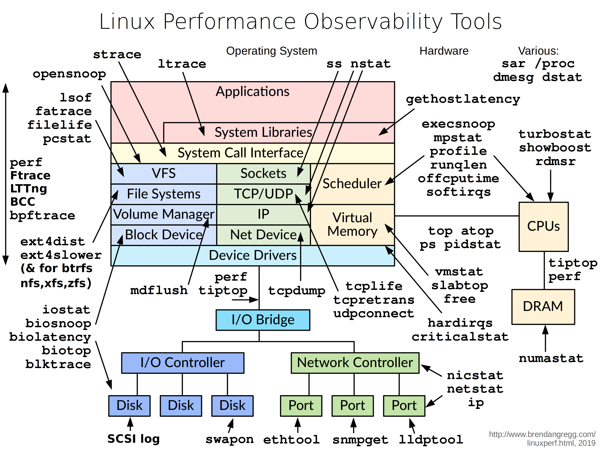

## 파일 시스템

파일 시스템의 목적은 데이터를 구성하고 저장하는 것입니다. 파일 시스템은 일반적으로 사용자와 응용 프로그램 간의 데이터 공유는 물론 재부팅 후에도 데이터를 계속 사용할 수 있도록 지속성을 지원합니다.
xv6 파일 시스템은 Unix와 유사한 파일, 디렉토리 및 경로 이름을 제공하고 지속성을 위해 해당 데이터를 IDE 디스크에 저장합니다. 파일 시스템은 다음과 같은 몇 가지 문제를 해결합니다.

• 파일 시스템은 명명된 디렉토리와 파일의 트리를 나타내고, 각 파일의 내용을 담고 있는 블록의 ID를 기록하고, 디스크의 어느 영역이 사용 가능한지를 기록하기 위해 DISK의 데이터 구조가 필요합니다. 

• 파일 시스템은 충돌 복구를 지원해야 합니다. 즉, 충돌(예: 정전)이 발생하는 경우 파일 시스템은 다시 시작한 후에도 여전히 올바르게 작동해야 합니다. 위험은 충돌로 인해 업데이트 시퀀스가 중단되고 디스크에 일관성 없는 데이터 구조가 남게 될 수 있다는 것입니다(예: 특정 파일이 사용가능한 free로 표시되고 또 한편으로는 사용되고 있는 블럭으로 표시된 블럭). 무결성의 손상

• 서로 다른 프로세스가 파일 시스템에서 동시에 작동할 수 있으며 불변성을 유지하기 위해 기능해야 합니다.
• 디스크에 액세스하는 것은 메모리에 액세스하는 것보다 몇배나 느리기 때문에  파일 시스템은 인기 있는 블록의 메모리 내 캐시를 유지 관리해야 합니다.

이 장의 나머지 부분에서는 xv6이 이러한 문제를 해결하는 방법을 설명합니다.

